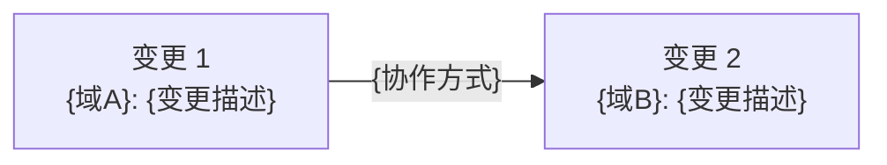
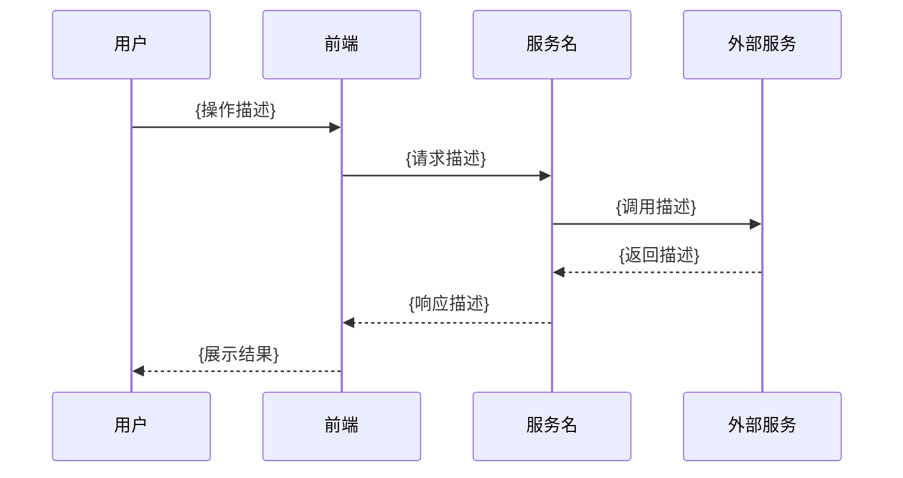
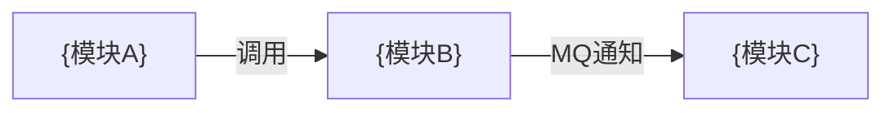
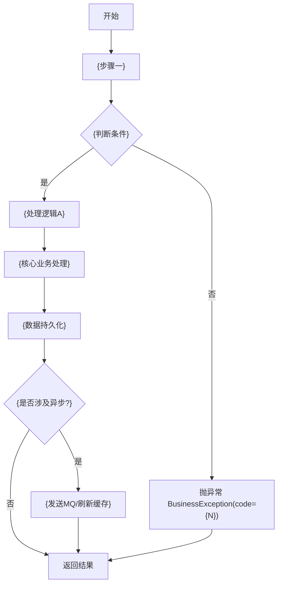
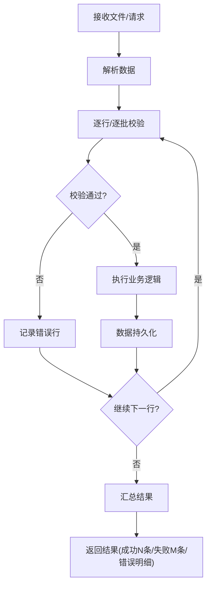
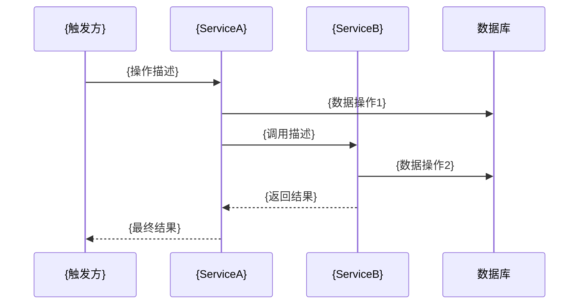
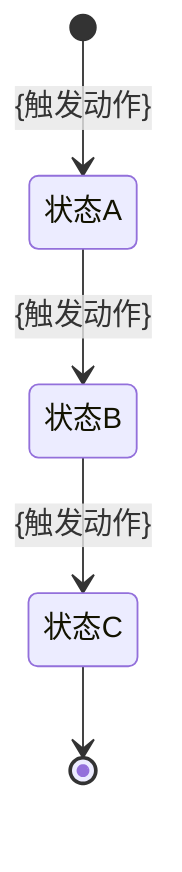
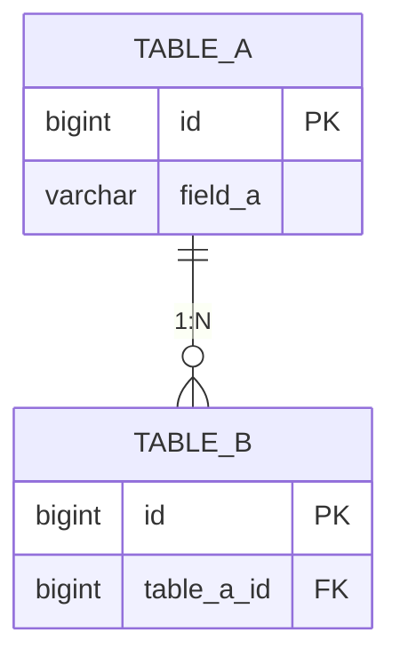

# MVC 后端 AI 实现文档 — 完整结构模版

> **受众**：本文档供 AI 代码生成消费，人类通过[设计摘要](./设计摘要模版.md)快速审阅。
>
> **文件组织**：AI 实现文档由以下几个文件共同构成，本模版展示完整结构：
> - **Part A**（1 份）：`{版本号}-{迭代名称}-迭代变更总纲.md` — 全局视图
> - **Part B**（N 份，每域一份）：`02-{域名}-详细设计.md` — 域级实现细节
> - **Part C**（M 份，每模块一份）：`{模块名}-API接口设计.md` — 接口契约
>
> 生成时按此模版的章节结构逐个填充，不允许省略必选章节，不允许自创章节。

---
---

# Part A：迭代变更总纲

> 文件路径：`.qoder/design/iteration/{版本号}-{迭代名称}-迭代变更总纲.md`
> 本文件是单次迭代的入口文档，提供变更全景视图。

---

## 一、迭代信息

### 1.1 迭代背景

{迭代背景描述：说明本次迭代的业务背景、目标和驱动因素}

### 1.2 需求来源

[《{需求文档名称}》]({需求文档链接})

### 1.3 文档信息

| 项目 | 内容 |
| --- | --- |
| **负责人** | @{负责人姓名} |
| **版本号** | V{x.y.z} |
| **创建日期** | {yyyy-MM-dd} |
| **最后更新** | {yyyy-MM-dd} |

### 1.4 名词定义 `可选`

| 名词 | 定义 |
| --- | --- |
| {名词A} | {定义说明} |

---

## 二、需求-设计映射表

> PRD 每个需求项均需映射，覆盖率目标 100%。

| 序号 | PRD 需求项 | 优先级 | 变更类型 | 对应业务域 | 对应文档章节 | 状态 |
| --- | --- | --- | --- | --- | --- | --- |
| 1 | {需求项名称} | P0 | `[新增]` | {业务域A} | `02-{域A}-详细设计.md` § 2.3.1 | 已设计 |
| 2 | {需求项名称} | P1 | `[修改]` | {业务域B} | `02-{域B}-详细设计.md` § 2.1.5 | 已设计 |

**覆盖率**：{N}/{M} = 100%

---

## 三、变更影响范围

### 3.1 影响的业务域

| 业务域 | 域文档 | 变更模块数 | 变更接口数 | 影响程度 |
| --- | --- | --- | --- | --- |
| {业务域A} | [02-{域A}-详细设计.md](./02-{域A}-详细设计.md) | {3} | {7} | {重大/中等/轻微} |

### 3.2 影响的基础设施

| 基础设施 | 文档位置 | 变更内容 |
| --- | --- | --- |
| {MQ/Redis/定时任务} | [03-基础设施.md](./03-基础设施与公共能力设计.md) § {X.Y} | {变更描述} |
| 无 | - | 本次迭代不涉及基础设施变更 |

### 3.3 影响的数据库

| 数据源 | 表名 | 变更类型 | 变更内容 | 文档位置 |
| --- | --- | --- | --- | --- |
| `{master}` | `{table_name}` | {新增表/加字段/加索引} | {简述} | `02-{域A}-详细设计.md` § 7.3 |

### 3.4 影响的非功能性

| 维度 | 影响内容 | 文档位置 |
| --- | --- | --- |
| {历史数据迁移/容量变化} | {描述} | [05-非功能性设计.md](./05-非功能性设计.md) § {X} |
| 无 | 本次迭代不涉及非功能性影响 | - |

---

## 四、跨域影响分析

> 只涉及单一业务域时，标注「本次迭代不涉及跨域变更」。

### 4.1 跨域变更关系图



### 4.2 跨域依赖顺序

| 顺序 | 域 | 变更内容 | 依赖前置 | 说明 |
| --- | --- | --- | --- | --- |
| 1 | {域A} | {变更内容} | 无 | {先完成的原因} |
| 2 | {域B} | {变更内容} | 域A 变更完成 | {依赖说明} |

---

## 五、变更 SQL 汇总

> 按执行顺序排列。各域详细 SQL 见对应 `02-{域}-详细设计.md` § 7.3。

| 序号 | 实例 & 库 | 表名 | 变更类型 | 变更 SQL | 回滚 SQL | 来源文档 |
| --- | --- | --- | --- | --- | --- | --- |
| 1 | `{库名}` | `{table}` | {新增表/加字段} | `{SQL}` | `{回滚SQL}` | `02-{域A}.md` § 7.3 |

---

## 六、系统交互图

> 如无外部交互变更，标注「本次迭代不涉及外部交互变更」。



---

## 七、服务依赖变更 `条件必选：存在新的外部依赖时`

| 服务名称 | 接口列表 | 变更类型 | 改动简述 |
| --- | --- | --- | --- |
| {依赖服务名} | {涉及的接口} | {新增/修改/删除} | {改动说明} |

---

## 八、非功能性设计 `条件必选：涉及非功能性影响时`

### 8.1 历史数据处理 `条件必选`

- **数据影响面**：{库表依赖、数据量、执行时长}
- **处理逻辑**：{迁移逻辑描述}
- **稳定性保障**：{校验、监控、应急处理}

### 8.2 大存储量处理 `条件必选`

- **容量评估**：{日增长量级}
- **优化方案**：{清理策略、分库分表等}

### 8.3 高访问量处理 `条件必选`

- **容量评估**：{接口访问量级}
- **优化方案**：{限流降级、缓存策略等}

### 8.4 异常失败补偿 `条件必选`

- **失败场景**：{哪些情况会失败}
- **补偿方案**：{重试/人工介入/其他}

### 8.5 灰度方案 `可选`

- **灰度场景**：{场景}
- **灰度方案**：{策略，如按比例、按用户分组}

---

## 九、代码变更总览

> 各接口详细实现检查清单见对应 `02-{域}-详细设计.md` 各接口节。

### 9.1 新增文件

| 序号 | 文件路径 | 文件类型 | 所属模块 | 说明 |
| --- | --- | --- | --- | --- |
| 1 | `controller/{NewController}.java` | Controller | {模块名} | {说明} |
| 2 | `service/{INewService}.java` | Service 接口 | {模块名} | {说明} |
| 3 | `service/impl/{NewServiceImpl}.java` | Service 实现 | {模块名} | {说明} |
| 4 | `mapper/{NewMapper}.java` | Mapper | {模块名} | {说明} |
| 5 | `domain/entity/{NewEntity}.java` | Entity | {模块名} | {说明} |
| 6 | `domain/dto/{NewDTO}.java` | DTO | {模块名} | {说明} |

### 9.2 修改文件

| 序号 | 文件路径 | 修改方法/字段 | 修改类型 | 说明 |
| --- | --- | --- | --- | --- |
| 1 | `service/impl/{ExistingServiceImpl}.java` | `{methodName}()` | 逻辑变更 | {说明} |
| 2 | `domain/entity/{ExistingEntity}.java` | `{fieldName}` | 新增字段 | {说明} |

### 9.3 删除文件/方法

| 序号 | 文件路径 | 删除内容 | 说明 |
| --- | --- | --- | --- |
| 1 | `controller/{Controller}.java` | `{methodName}()` 方法 | {说明} |

---

## 十、估分汇总

| 序号 | 模块 | 功能点 | 估分(人/天) | 备注 |
| --- | --- | --- | --- | --- |
| 1 | {模块A} | {功能描述} | {N} | {备注} |
| | | **合计** | **{N}** | |

---
---

# Part B：业务域详细设计（每受影响的域一份文件）

> 文件路径：`.qoder/design/iteration/02-{域名}-详细设计.md`
> 首次迭代时从 `.qoder/design/system/` 复制域文档到此，后续迭代在此基础上追加。
> 增量内容用 `[新增]`/`[修改]`/`[删除]` 标记，`[修改]` 需注明原方案出处（文件名 + 章节编号）。

---

## 文档信息

| 项目 | 内容 |
| --- | --- |
| **所属业务域** | {业务域名称} |
| **域编号** | D{01} |
| **域类型** | {核心域/支撑域/通用域} |
| **域负责人** | @{负责人姓名} |
| **关联架构总纲** | [01-系统架构总纲.md](./01-系统架构总纲.md) |

---

## 一、域概述

### 1.1 业务职责

{用 2-3 句话描述本业务域的核心职责和业务价值}

### 1.2 模块 - 控制器 - 服务 映射

| 模块名称 | Controller | Service | Mapper | 核心职责 |
| --- | --- | --- | --- | --- |
| {模块A} | `{ModuleAController}` | `{IModuleAService}` / `{ModuleAServiceImpl}` | `{ModuleAMapper}` | {一句话描述} |

### 1.3 域内交互关系 `可选`



### 1.4 迭代背景 `增量迭代时填写`

[《{需求文档名称}》]({需求文档链接})

| 序号 | 需求项 | 优先级 | 简述 |
| --- | --- | --- | --- |
| 1 | {需求项名称} | P0/P1/P2 | {一句话描述} |

### 1.5 迭代变更概览 `增量迭代时填写`

| 变更类型 | 影响模块 | 影响文件 | 简述 |
| --- | --- | --- | --- |
| `[新增]` | {模块A} | `{ControllerA}`, `{ServiceA}`, `{MapperA}`, `{DTO}` | {新增了什么功能} |
| `[修改]` | {模块B} | `{ServiceB}` | {修改了什么逻辑，原方案出处：`02-{域}.md` § {X.Y}} |

---

## 二、功能模块详细设计

> 增量迭代时只描述本次变更涉及的模块和接口。

### 2.{N} {功能模块名称}

> 模块简述：{1-2 句话描述该模块的业务职责}

#### 2.{N}.1 {接口中文名} `[新增]/[修改]/[删除]`

| **名称描述** | {接口中文名} | **估分** | {人/天} |
| --- | --- | --- | --- |
| **接口路径** | `{METHOD} {/api/v1/path}` | | |
| **Controller 方法** | `{ControllerName}.{methodName}()` | | |
| **Service 方法** | `{ServiceName}.{methodName}()` | | |

**入参**：

```json
{
  "{fieldA}": "{类型} // {说明}",
  "{fieldB}": "{类型} // {说明}"
}
```

**业务逻辑**：

> 事务型接口（涉及写入的 POST/PUT/DELETE）和复杂查询必须提供业务流程图。

1. {步骤一描述}
2. {步骤二：校验/判断}
   1. 判断 {条件}
      1. 是：{处理逻辑 / 抛出 `BusinessException(code={错误码}, msg="{错误提示}") → HTTP {400/403/404}`}
      2. 否：{处理逻辑}
3. {步骤三：核心业务处理}
   1. 调用 `{Mapper/Service/Manager}.{method}({参数来源说明})`
4. {步骤四：数据持久化}
5. {步骤五：异步操作} `可选` ← 此步骤在事务外执行
   1. 发送 MQ 消息：Topic=`{topic}`，Tag=`{tag}`
6. 返回结果

**返回**：

```json
{
  "{fieldA}": "{类型} // {说明}"
}
```

**业务流程图**：{无 / 如下}



**实现检查清单**：

- [ ] Controller: `{METHOD} {/api/v1/path}` → `{ControllerName}.{methodName}()`
- [ ] Service: `{ServiceName}.{methodName}({ParamType})` → 返回 `{ReturnType}`
- [ ] Mapper: `{MapperName}.{method}()` → {MyBatis Plus 自带 / 自定义 XML}
- [ ] DTO: `{DtoClassName}` → {新增类 / 复用已有 / 增加字段}
- [ ] VO: `{VoClassName}` → {新增类 / 复用已有 / 增加字段}
- [ ] Entity: `{EntityName}` → {新增字段 `{fieldName}` / 无变更}
- [ ] SQL: {无 / `ALTER TABLE {table} ADD COLUMN ...`}
- [ ] 事务: {`@Transactional` 标注在 `{ServiceMethod}()` / 无事务}；事务内：步骤 {1~4}，事务外：步骤 {5（发MQ）/ 无}
- [ ] 并发控制: {无 / 乐观锁: `version` 字段 CAS更新 / 分布式锁: key=`{锁key格式}` TTL={N}s}
- [ ] 幂等: {无 / 唯一索引: `uk_{...}` / Redis防重: key=`{key格式}` TTL={N}s / 幂等Token}
- [ ] MQ: {无 / 发送 Topic=`{topic}` Tag=`{tag}`}
- [ ] 缓存: {无 / 清除 `{key_pattern}` / 写入 `{key_pattern}`}

---

## 三、批量处理设计 `条件必选：存在 Excel 导入导出或批量操作时`

### 3.{N} {批量操作名称}

| 项目 | 内容 |
| --- | --- |
| **操作类型** | {导入/导出/批量审批/批量更新} |
| **处理框架** | {EasyExcel / POI / 自定义} |
| **单批大小** | 每批 {N} 条 |
| **预计最大数据量** | 单次最大 {N} 条 |

**数据模型**（字段映射）：

| Excel 列名 | 对应字段 | 类型 | 必填 | 校验规则 |
| --- | --- | --- | --- | --- |
| {列名A} | `{fieldA}` | {String} | Y/N | {规则} |

**处理流程**：



**错误处理策略**：

| 策略 | 说明 |
| --- | --- |
| **单行失败** | {跳过继续 / 中断整个导入} |
| **事务边界** | {整体一个事务 / 每批一个事务} |

**实现检查清单**：

- [ ] Controller: `{METHOD} {/api/v1/path}` → `{ControllerName}.{methodName}()`
- [ ] Service: `{ServiceName}.{methodName}()`
- [ ] Listener: `{ListenerClassName}` → EasyExcel ReadListener 实现
- [ ] Export/Import Model: `{ModelClassName}` → EasyExcel 注解映射
- [ ] 事务: {每批一个事务 / 整体一个事务}；事务内：{单批处理逻辑}，事务外：{文件解析/结果汇总}
- [ ] 并发控制: {无 / 分布式锁防重复提交: key=`{key格式}` TTL={N}s}
- [ ] 幂等: {无 / 任务ID唯一索引防重复导入}

---

## 四、跨服务编排设计 `条件必选：存在跨多个 Service 的复杂业务编排时`

### 4.{N} {编排场景名称}

| 项目 | 内容 |
| --- | --- |
| **触发方式** | {接口调用/MQ消费/定时任务} |
| **涉及 Service** | `{ServiceA}` `{ServiceB}` |
| **事务策略** | {本地事务/最终一致性/无事务} |

**编排流程图**：



**失败处理**：

| 失败节点 | 影响范围 | 补偿策略 |
| --- | --- | --- |
| {ServiceB 调用失败} | {ServiceA 已写入数据} | {事务回滚/异步补偿} |

---

## 五、状态设计 `条件必选：业务存在状态流转时`

### 5.{N} {状态中文名}

| 项目 | 内容 |
| --- | --- |
| **所属实体/表** | `{table_name}`.`{column_name}` |
| **枚举类** | `{EnumClassName}` |

**状态值定义**：

| 状态值 | 枚举常量 | 状态名称 | 描述 |
| --- | --- | --- | --- |
| `{value}` | `{ENUM_CONSTANT}` | {状态名} | {含义} |

**状态流转图**：



**流转规则说明**：

| 当前状态 | 目标状态 | 触发动作 | 前置条件 | 操作人/系统 |
| --- | --- | --- | --- | --- |
| {状态A} | {状态B} | {操作} | {条件} | {角色/系统} |

---

## 六、数据字典 `可选`

### 6.{N} {字典中文名}

| 表/字段 | 含义 | 枚举类 | 值 | 描述 |
| --- | --- | --- | --- | --- |
| `{table}.{column}` | {字段含义} | `{EnumClass}` | `{value}` | {含义} |

---

## 七、域内数据库设计

### 7.1 域 ER 图



### 7.2 表结构设计

#### 7.2.{N} {table_name}（{表中文名}）

| 项目 | 内容 |
| --- | --- |
| **所属数据源** | `{master/alias}` |
| **所属数据库** | `{database_name}` |
| **对应 Entity** | `{EntityClassName}` |
| **对应 Mapper** | `{MapperClassName}` |
| **表用途** | {一句话描述} |

```sql
CREATE TABLE `{table_name}` (
  `id` bigint unsigned NOT NULL AUTO_INCREMENT COMMENT '主键id',
  `{column_name}` {varchar(255)/bigint/decimal(10,2)} NOT NULL COMMENT '{注释}',
  `created_at` timestamp NULL DEFAULT CURRENT_TIMESTAMP COMMENT '创建时间',
  `created_user` varchar(255) DEFAULT NULL COMMENT '创建用户',
  `updated_at` timestamp NULL DEFAULT NULL ON UPDATE CURRENT_TIMESTAMP COMMENT '更新时间',
  `updated_user` varchar(255) DEFAULT NULL COMMENT '更新用户',
  `version` bigint NOT NULL DEFAULT '0' COMMENT '版本（乐观锁）',
  `deleted` tinyint NOT NULL DEFAULT '0' COMMENT '是否删除 0否1是',
  PRIMARY KEY (`id`),
  KEY `{idx_name}` (`{column_name}`) USING BTREE
) ENGINE=InnoDB DEFAULT CHARSET=utf8mb4 COLLATE=utf8mb4_0900_ai_ci COMMENT='{表注释}';
```

**索引设计**：

| 索引名 | 索引类型 | 索引列 | 用途 |
| --- | --- | --- | --- |
| `{idx_name}` | {主键/唯一/普通/联合} | `{column1}, {column2}` | {用途} |

### 7.3 变更 SQL `增量迭代时使用`

| 实例 & 库 | 变更类型 | 变更语句 | 回滚语句 |
| --- | --- | --- | --- |
| `{库名}` | {新增表/加字段/加索引} | `{SQL}` | `{回滚SQL}` |

---

## 八、数据模型定义

> 各接口的入参/返回 JSON 是简略视图，本章节是完整的类级定义。
> 增量迭代时仅列出本次新增或修改的数据模型。

### 8.{N} {ClassName} `[新增]/[修改]`

| 项目 | 内容 |
| --- | --- |
| **类名** | `{ClassName}` |
| **包路径** | `{domain.dto / domain.vo / domain.request / domain.query}` |
| **模型类型** | {DTO/VO/Request/Response/Query/Export} |
| **用途** | {一句话描述} |
| **引用接口** | {§ 2.1.3, § 2.1.5} |

| 字段名 | Java 类型 | 必填 | 校验注解 | 说明 |
| --- | --- | --- | --- | --- |
| `{fieldA}` | `{String}` | Y | `@NotBlank @Size(max=100)` | {说明} |
| `{fieldB}` | `{Long}` | N | - | {说明} |
| `{fieldC}` | `{BigDecimal}` | N | - | {金额字段，2位小数} |

> 若继承公共基类：`extends {BasePageQuery}`

---

## 九、防腐层设计 `条件必选：存在外部依赖调用时`

> Service 层禁止直接调用外部客户端，必须通过防腐层隔离。

### 9.{N} {Manager 方法中文名}

| **Manager 接口** | `{ManagerName}` | **外部依赖类型** | {Feign/Redis/ES/第三方HTTP} |
| --- | --- | --- | --- |
| **实现类** | `{ManagerNameImpl}` | **依赖客户端** | `{FeignClientName}` |
| **方法名** | `{methodName}` | | |

**入参**：

```json
{
  "{fieldA}": "{类型} // {说明}"
}
```

**执行逻辑**：

1. {参数校验}
2. {内部模型 → 外部请求模型转换}
3. 调用 `{FeignClient.method()}`
4. 判断调用结果
   1. 成功：外部响应 → 内部业务模型
   2. 失败：{重试/降级/抛出 `BusinessException(code={N}, msg="{提示}")`}
5. 返回结果

**返回**：

```json
{
  "{fieldA}": "{类型} // {说明}"
}
```

---

## 十、持久化 & 中间件 `条件必选：存在配置/中间件变更时`

### 10.1 新增配置（nacos 等）

| 项目名称 | key | value | 注释 | 变更类型 |
| --- | --- | --- | --- | --- |
| {项目名} | `{key}` | `{value}` | {注释} | 新增/修改/删除 |

### 10.2 Redis

| key | 数据类型 | 过期时间 | 单个 key 预计大小 | 用途 |
| --- | --- | --- | --- | --- |
| `{key 格式}` | {String/Hash/List/Set/ZSet} | {TTL} | {大小} | {用途} |

### 10.3 MQ

| 主题 | 发布 or 订阅 | Tag | 消息结构 | 消费方 |
| --- | --- | --- | --- | --- |
| `{topic}` | 发布/订阅 | `{tag}` | {消息体结构} | {消费服务} |

### 10.4 定时任务

| 任务名称 | handler / Job 类名 | 运行模式 | Cron 表达式 | 备注 |
| --- | --- | --- | --- | --- |
| {任务名} | `{类名}` | 单机/分布式 | `{cron}` | {备注} |

---
---

# Part C：API 接口设计文档（每模块一份文件）

> 文件路径：`.qoder/design/iteration/{模块名}-API接口设计.md`
> 仅包含本次迭代涉及的接口，接口设计与 Part B § 二 中的功能模块一一对应。

---

## 一、全局约定

### 1.1 基础信息

| 项目 | 值 |
| --- | --- |
| **Base URL** | `{/api/v1}` |
| **Content-Type** | `application/json` |
| **字符编码** | UTF-8 |

### 1.2 统一响应格式

**成功响应**：

```json
{ "code": 0, "message": "success", "data": { ... } }
```

**错误响应**：

```json
{ "code": "{错误码}", "message": "{错误信息}", "details": { ... } }
```

**分页响应**（data 部分）：

```json
{ "list": [...], "total": "{总数}", "pageNum": "{页码}", "pageSize": "{每页条数}" }
```

### 1.3 分页约定

| 参数名 | 类型 | 传参位置 | 默认值 |
| --- | --- | --- | --- |
| `pageNum` | `int` | Query | `1` |
| `pageSize` | `int` | Query | `20`（最大100） |

### 1.4 认证方式

| 项目 | 值 |
| --- | --- |
| **认证方式** | {Bearer Token/Session/无} |
| **Header** | `Authorization: Bearer {token}` |

### 1.5 错误码定义

| 错误码 | HTTP 状态码 | 说明 | 触发场景 |
| --- | --- | --- | --- |
| `0` | 200 | 成功 | - |
| `{10001}` | 400 | {参数校验失败} | {场景} |
| `{10002}` | 401 | {未认证/Token过期} | {场景} |
| `{10003}` | 403 | {无权限} | {场景} |
| `{10004}` | 404 | {资源不存在} | {场景} |
| `{50000}` | 500 | {系统内部错误} | {场景} |

---

## 二、接口详细设计

### 2.1 {Controller 中文名}

> 资源路径：`{/api/v1/resource}`
> Controller：`{ControllerName}`

**接口总览**：

| # | 接口方法 | HTTP 方法 | 路径 | 说明 | 认证 |
| --- | --- | --- | --- | --- | --- |
| 1 | `{methodName}` | `{METHOD}` | `{/fullPath}` | {说明} | 需认证/无需认证 |

---

#### 2.1.1 {接口中文名} `{需认证/无需认证}`

| 项目 | 内容 |
| --- | --- |
| **HTTP 方法** | `{POST/GET/PUT/DELETE}` |
| **完整路径** | `{/api/v1/resource/action}` |
| **Controller 方法** | `{ControllerName}.{methodName}()` |
| **认证要求** | {需认证/无需认证} |
| **权限标识** | {如 `order:create` / 无} |

**Path 参数** `可选`：

| 参数名 | 类型 | 必选 | 说明 |
| --- | --- | --- | --- |
| `{id}` | `Long` | Y | {说明} |

**Query 参数** `可选`：

| 参数名 | 类型 | 必选 | 默认值 | 说明 |
| --- | --- | --- | --- | --- |
| `{paramName}` | `{Type}` | Y/N | `{默认值}` | {说明} |

**Request Body** `可选`：

| 字段名 | 类型 | 必选 | 校验规则 | 说明 |
| --- | --- | --- | --- | --- |
| `{fieldName}` | `{Type}` | Y/N | {如"长度1-50"} | {说明} |

**请求示例**：

```http
{METHOD} {/api/v1/resource/action}
Content-Type: application/json
Authorization: Bearer {token}

{
  "fieldA": "value",
  "fieldB": 123
}
```

**成功响应**：

```json
{
  "code": 0,
  "message": "success",
  "data": {
    "{fieldName}": "{类型} // {说明}"
  }
}
```

**成功响应字段说明**：

| 字段路径 | 类型 | 说明 |
| --- | --- | --- |
| `data.{fieldName}` | `{Type}` | {说明} |

**错误响应**：

| 触发场景 | 错误码 | HTTP 状态码 | message |
| --- | --- | --- | --- |
| {参数为空} | `{code}` | `{status}` | "{提示信息}" |
| {记录不存在} | `{code}` | `{status}` | "{提示信息}" |

---

## 附录

### A. 接口清单汇总

| # | 模块 | HTTP 方法 | 路径 | 说明 | 认证 |
| --- | --- | --- | --- | --- | --- |
| 1 | {Controller 中文名} | `{METHOD}` | `{/fullPath}` | {说明} | Y/N |

### B. DTO 对象汇总

#### {DtoName}

> 用途：{如"创建订单请求体"}

| 字段名 | Java 类型 | 说明 |
| --- | --- | --- |
| `{fieldName}` | `{Type}` | {说明} |
