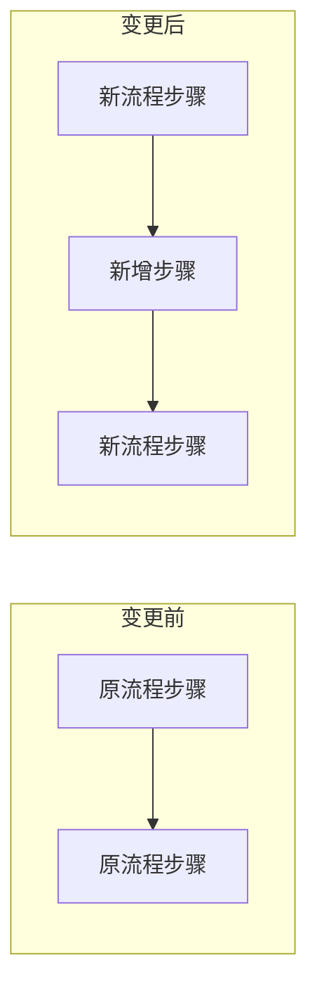
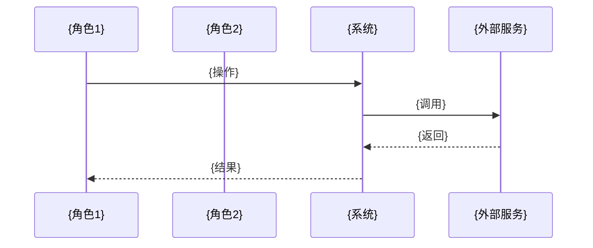

# {迭代名称} - 方案评审

## 评审信息

- **评审日期**：{日期}
- **主讲人**：{待填写}
- **参会人员**：产品经理、前端、测试、研发负责人
- **驱动类型**：{业务驱动 / 技术驱动 / 混合驱动}

---

## 一、业务背景与痛点

### 1.1 当前{业务/功能}现状

{一句话描述业务背景}

```mermaid
{当前业务流程图：多角色泳道图，使用 sequenceDiagram 或 flowchart+subgraph}
```

> 说明：{参与角色、关键步骤、数据流向}

### 1.2 当前问题与痛点

```mermaid
{痛点位置图：在现状流程上标注 :::problem 样式的痛点节点}
```

```mermaid
mindmap
  root((问题与痛点))
    {分类1}
      {痛点1}
      {痛点2}
    {分类2}
      {痛点3}
```

| 角色 | 痛点描述 | 影响程度 |
|------|----------|----------|
| {角色1} | {痛点} | 高/中/低 |

---

## 二、项目目标

### 2.1 目标概述

{核心目标一句话描述}

### 2.2 问题与解决方案对照

| 问题 | 解决方案 | 预期效果 |
|------|----------|----------|
| {问题1} | {方案1} | {效果1（可量化）} |
| {问题2} | {方案2} | {效果2（可量化）} |

### 2.3 目标验收标准

| 验收项 | 标准 | 验证方式 |
|--------|------|----------|
| {验收项1} | {可量化标准} | {验证方式} |

---

## 三、影响范围

### 3.1 变更类型

> **本次迭代类型**：{新增功能 / 功能修改 / 混合}
> **影响粒度**：{服务级 / 模块级 / 功能级 / 类级}

### 3.2 影响范围清单

| 模块/服务 | 变更类型 | 变更说明 |
|-----------|----------|----------|
| {模块1} | 新增/修改/删除 | {说明} |

### 3.3 变更对比（功能修改时）



| 对比维度 | 变更前 | 变更后 | 变更原因 |
|----------|--------|--------|----------|
| 数据模型 | {原设计} | {新设计} | {原因} |
| API 接口 | {原接口} | {新接口} | {原因} |
| 业务规则 | {原规则} | {新规则} | {原因} |

---

## 四、整体设计

### 4.1 架构设计

```mermaid
graph TB
    subgraph {服务/层名称}
        {组件1}:::changed --> {组件2}
        {新组件}:::new
    end
    classDef changed fill:#fff3e0,stroke:#f57c00
    classDef new fill:#e8f5e9,stroke:#388e3c
```

> 说明：{各层职责、本次变更涉及的组件（橙色=修改，绿色=新增）}

### 4.2 业务流程



> 说明：{参与角色、关键步骤、异步节点说明}

---

## 五、功能详解

### 5.1 {功能名称1}

**功能说明**：{一句话描述}

```mermaid
flowchart TD
    A[{开始}] --> B{判断条件}
    B -->|是| C[{处理}]
    B -->|否| D[{异常处理}]
    C -.->|异步| E[{异步处理}]:::async
    classDef async fill:#e3f2fd,stroke:#1976d2,stroke-dasharray: 5 5
```

> 说明：{判断条件、异常处理路径、最终结果；异步节点以虚线标注}

**变更对比（功能修改时）**：

| 对比项 | 变更前 | 变更后 |
|--------|--------|--------|
| {项目1} | {原来} | {现在} |

---

## 六、核心设计

### 6.1 领域模型

```mermaid
erDiagram
    {聚合根} ||--o{ {子实体} : "包含"
    {聚合根} {
        Long id
        {类型} {属性1}
        {类型} {属性2}
    }
```

> 说明：{聚合根职责、实体关联关系、新增部分说明}

### 6.2 新增聚合根/实体（如有）

**{聚合根名称}** 设计为独立聚合根的原因：
1. {原因1：独立的生命周期}
2. {原因2：独立的业务边界}
3. {原因3：独立的事务边界}

```mermaid
classDiagram
    class {聚合根} {
        +id Long
        +{属性1} {类型}
        +{行为方法}()
    }
    {聚合根} "1" --> "*" {子实体}
```

### 6.3 核心 API

| 接口 | 方法 | 路径 | 说明 |
|------|------|------|------|
| {接口名} | POST/GET | /api/v1/{path} | {说明} |

---

## 七、待确认点

| 序号 | 问题描述 | 涉及角色 | 建议方案 | 影响范围 |
|------|----------|----------|----------|----------|
| 1 | {问题1} | 产品/前端/测试 | {建议} | {影响} |

---

## 八、风险与依赖

### 8.1 技术风险

| 风险 | 概率 | 影响 | 应对措施 |
|------|------|------|----------|
| {风险1} | 高/中/低 | 高/中/低 | {措施} |

### 8.2 外部依赖

| 依赖方 | 依赖内容 | 确认状态 |
|--------|----------|----------|
| {依赖方} | {内容} | 已确认/待确认 |

---

## 附录

### A. 相关文档

- 迭代设计文档：{路径}
- API 文档：{路径}

---

## 演讲时间评估

| 章节 | 内容量 | 预估时间 |
|------|--------|----------|
| 一、业务背景 | {X} 个图表 | {X} 分钟 |
| 二、项目目标 | - | {X} 分钟 |
| 三、影响范围 | - | {X} 分钟 |
| 四、整体设计 | {X} 个图表 | {X} 分钟 |
| 五、功能详解 | {X} 个功能 | {X} 分钟 |
| 六、核心设计 | {X} 个实体 | {X} 分钟 |
| 七、待确认点 | {X} 个问题 | {X} 分钟 |
| 八、风险依赖 | - | {X} 分钟 |
| Q&A | - | 15 分钟 |
| **合计** | - | **{总时长} 分钟** |

**建议会议时长**：{X} 分钟
