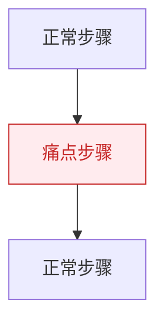
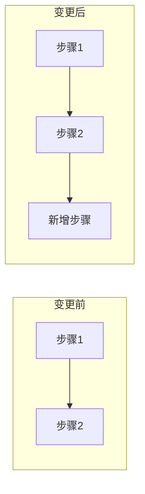

# 图表规范参考

## 核心原则

**图优先于文字**：能用图不用表格，能用表格不用文字。每个图表下方必须添加说明文字。

---

## 各章节必须包含的图表

| 章节 | 必须图表 |
|------|----------|
| 一、业务背景与痛点 | 当前业务流程图（多角色）+ 痛点位置图 + 痛点思维导图 |
| 二、项目目标 | 问题-方案-效果对照表 |
| 三、影响范围 | 根据粒度选择（见下方"粒度图表"） |
| 四、整体设计 | 架构图（subgraph 分层）+ 多角色泳道图 |
| 五、功能详解 | 每个功能一个流程图（含异常分支） |
| 六、核心设计 | ER 图 + 类图（如有新聚合根） |

---

## 图表类型速查

| 图表类型 | Mermaid 语法 | 适用场景 |
|----------|-------------|----------|
| 架构图 | `graph TB` + subgraph | 系统全貌，服务/模块分层 |
| 业务流程图 | `flowchart TD/LR` | 带判断条件的业务流程 |
| 多角色时序图 | `sequenceDiagram` | 角色间交互，体现调用顺序 |
| 泳道图 | `flowchart` + subgraph | 多角色并行流程 |
| 类图 | `classDiagram` | 领域模型、聚合根结构 |
| ER 图 | `erDiagram` | 数据模型变更 |
| 思维导图 | `mindmap` | 问题/痛点分类 |
| 用户旅程 | `journey` | 用户体验痛点 |
| 时间线 | `timeline` | 业务演进历程 |
| 甘特图 | `gantt` | 里程碑计划 |

---

## 变更标注规范

在架构图中用颜色区分变更类型：

---

## 异步处理标注规范

在流程图中识别并标注异步处理：

| 元素 | 语法 | 说明 |
|------|------|------|
| 异步箭头 | `-.->` | 虚线箭头表示异步调用 |
| 异步标签 | `-.->|异步|` | 箭头上标注"异步" |
| 异步节点 | `:::async` | 蓝色虚线框 |
| 样式定义 | `classDef async fill:#e3f2fd,stroke:#1976d2,stroke-dasharray: 5 5` | |

**需要标注异步的场景**：消息队列（MQ）、定时任务、异步线程池、事件发布/订阅、回调通知。

---

## 痛点标注规范

在现状流程图中标注痛点节点：

---

## 影响粒度对应图表

| 粒度 | 判断依据 | 图表模板 |
|------|----------|----------|
| 服务级 | 涉及多个微服务/系统 | graph TB，多个顶级 subgraph |
| 模块级 | 单服务内多个模块 | graph TB，单服务内 subgraph |
| 功能级 | 单模块内功能变更 | 功能列表 + 流程图 |
| 类级 | 实体/类的变更 | classDiagram |

---

## 图表说明规范

每个图表代码块结束后，空一行，添加说明：

| 图表类型 | 说明要点 |
|----------|----------|
| 架构图 | 各层职责、本次变更涉及的组件 |
| 业务流程图 | 参与角色、关键步骤、数据流向 |
| 功能流程图 | 判断条件、异常处理路径、最终结果 |
| 领域模型图 | 聚合根职责、实体关联关系、值对象含义 |

---

## 功能对比图规范（功能修改时）

对比表必须包含：数据模型 / API接口 / 业务规则 三个维度。
