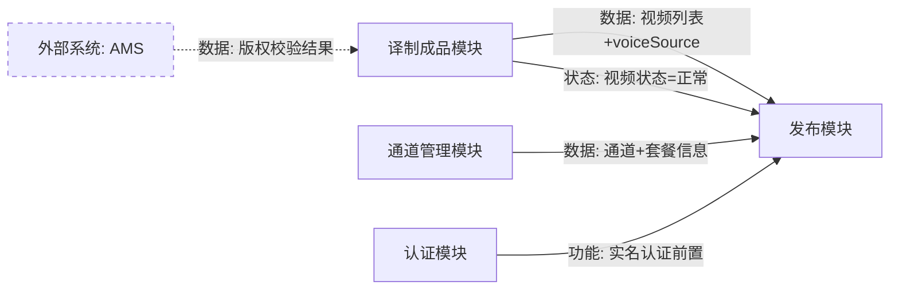

# 需求依赖关系与操作路径分析规范

> **目标**：为 PRD 审阅提供系统性的依赖关系分析和操作路径分析方法论，确保审阅者能够发现跨模块的需求缺陷和操作流程的完整性问题。
> **核心原则**：依赖关系必须可追溯（每条依赖有 PRD 来源引用），操作路径必须可验证（每条路径可在原型中走通）。

---

## 一、需求依赖关系分析

### 1.1 依赖类型定义

PRD 中的需求依赖关系分为 4 类，审阅时需逐类识别：

| 依赖类型 | 定义 | PRD 中的识别信号 | 示例 |
|---------|------|----------------|------|
| **数据依赖** | A 模块的输出数据是 B 模块的输入 | "读取 XX 数据"、"使用 XX 结果"、字段交叉引用、"获取 XX 列表" | 发布模块读取译制成品模块的视频列表和 voiceSource 字段 |
| **状态依赖** | A 模块的操作改变的状态影响 B 模块的行为 | 状态流转图跨模块、"当 XX 状态变为…"、"XX 完成后触发…" | 视频状态从"重做中"变为"正常"后，发布模块才允许选择该视频 |
| **功能依赖** | A 功能是 B 功能的前置条件 | "需先完成 XX"、"必须已 XX"、权限前置、审批流前后环节 | 用户必须先完成实名认证，才能使用发布功能 |
| **规则依赖** | A 模块的业务规则约束 B 模块的行为 | "参见 XX 规则"、共享枚举值、共享阈值、"沿用 XX 的判断逻辑" | 备片区上限 500 条的规则同时约束"加入备片区"和"批量操作"两个功能 |

**识别隐性依赖的方法**：

不是所有依赖都会在 PRD 中用"参见""依赖"等显式关键词标注。以下信号提示可能存在隐性依赖：

- 两个功能共享同一个数据实体（如"视频"同时出现在列表模块和发布模块）
- 一个功能的前置条件是另一个功能的输出结果
- 枚举值（如状态、类型）在多个模块中出现
- 同一个 API 接口被多个功能引用
- 业务规则中引用了其他模块才能产生的数据

---

### 1.2 依赖关系图构建规范

在 `test-prd-summary.md` 的「模块间依赖关系」章节中，使用以下结构化格式输出：

**A. 依赖关系清单（必填）**

| 上游模块 | 下游模块 | 依赖类型 | 依赖内容 | PRD 来源 |
|---------|---------|---------|---------|---------|
| {提供方} | {消费方} | 数据/状态/功能/规则 | {具体依赖的数据、状态、功能或规则} | {PRD 章节编号} |

填写要求：
- 每条依赖占一行，不合并
- "依赖内容"需具体到字段/状态/规则名称，不能只写"有关联"
- "PRD 来源"指该依赖关系在 PRD 中的描述位置；如果 PRD 未显式描述，标注"隐性依赖-推断自 {推断依据}"

**B. 依赖关系图（建议填写）**

使用 Mermaid 语法或 ASCII 表达模块间拓扑关系：



约定：
- 实线箭头 = PRD 范围内的模块间依赖
- 虚线箭头 = 外部系统依赖
- 箭头标签格式：`依赖类型: 具体内容`

**C. 变更影响分析（仅变更类 PRD 需填写）**

| 变更模块 | 变更内容 | 受影响的下游模块 | 影响说明 | PRD 是否覆盖 |
|---------|---------|---------------|---------|------------|
| {模块名} | {改了什么规则/字段/状态} | {哪些下游模块受影响} | {具体影响行为} | ✅ 已覆盖 / ❌ 未覆盖 |

---

### 1.3 依赖完整性检查清单

审阅时逐项检查，未通过的项转化为审阅问题：

| # | 检查项 | 检查方法 | 未通过时归入 |
|---|-------|---------|------------|
| DEP-1 | **上游完整性**：每条依赖的上游模块是否在本次 PRD 范围内有定义？ | 对照依赖清单，逐条检查上游模块是否有对应的 PRD 章节。如果上游不在本次 PRD 范围内，检查 PRD 是否声明了前置假设。 | B-系列（未声明前置假设导致测试无法判断上游状态） |
| DEP-2 | **下游覆盖**：本次 PRD 变更的模块，其所有下游消费者是否都说明了影响？ | 沿依赖图向下游追踪，检查变更影响分析是否覆盖所有下游模块。 | S-系列（遗漏的下游影响需补充） |
| DEP-3 | **循环依赖**：依赖图中是否存在 A→B→...→A 的环路？ | 检查依赖关系图的拓扑结构。如果存在环路，检查 PRD 是否说明了解环策略（如异步解耦、最终一致性、时序约束）。 | Q-系列（环路本身不一定是问题，但未说明解环方式是质量问题） |
| DEP-4 | **外部系统登记**：依赖的第三方/外部系统是否在 PRD 的技术确认项中登记？ | 检查依赖清单中的外部系统行，对照 PRD 的技术确认项区块。 | S-系列（需补充技术确认项） |
| DEP-5 | **数据契约明确性**：数据依赖的字段名、类型、格式是否在上下游两端都有说明？ | 对照上游的输出字段和下游的输入字段，检查是否匹配。 | A-系列（字段名不明确可能导致理解偏差）或 D-系列（上下游字段不一致） |
| DEP-6 | **状态依赖的触发时机**：状态依赖是否说明了"什么时候"触发状态变更？ | 检查状态依赖行，确认 PRD 中有明确的触发条件和时机说明。 | B-系列（无触发时机说明则测试无法设计状态变更场景） |
| DEP-7 | **依赖引用对称性**：如果 A 模块声明了"参见 B 模块"，B 模块是否也提及了与 A 的关联？ | 双向检查所有"参见""关联"引用，确认被引用方也有对应描述。 | Q-系列（单向引用容易导致维护遗漏） |

---

### 1.4 变更传播分析方法

针对 PRD 中的"变更类"需求（版本迭代、功能优化、规则调整），按以下步骤分析变更传播：

**Step 1：识别变更点**
- 从 PRD 中提取所有"新增/修改/删除"的功能、规则、字段、状态
- 每个变更点记录：变更模块、变更前状态、变更后状态

**Step 2：沿依赖图向下游追踪**
- 以每个变更点为起点，在依赖关系图中找到所有直接和间接下游模块
- 对每个受影响的下游模块，判断变更会如何影响其行为

**Step 3：检查 PRD 覆盖**
- 对每个受影响的下游模块，检查 PRD 是否说明了变更后的新预期行为
- 未覆盖的 → 归入 S-系列（需补充变更影响说明）
- 覆盖但与变更逻辑矛盾的 → 归入 B-系列（变更传播逻辑矛盾）

**Step 4：输出变更影响分析表**
- 填入 `test-prd-summary.md` 的「变更影响分析」表格

---

### 1.5 依赖问题归类规则

依赖分析中发现的问题，按以下规则归入审阅报告对应系列：

| 问题场景 | 归入系列 | 判断标准 | 示例 |
|---------|---------|---------|------|
| 关键跨模块依赖 PRD 完全未提及 | **B-系列** | 测试无法确定跨模块交互的预期行为 | "模块 A 的输出是模块 B 的输入，但 PRD 未说明 A 输出为空时 B 如何处理" |
| 状态依赖的触发条件或时机未说明 | **B-系列** | 测试无法设计状态变更场景 | "PRD 说'视频完成后可发布'，未说明什么条件下算'完成'" |
| 依赖关系存在但描述不精确 | **A-系列** | 可能有多种理解 | "PRD 说'获取用户信息'，未说明是实时查询还是缓存读取" |
| 变更传播范围未覆盖所有下游 | **S-系列** | 不阻塞测试启动但影响覆盖度 | "字段 X 新增枚举值，但下游报表筛选器未说明是否同步更新" |
| PRD 内部对依赖关系的描述不一致 | **D-系列** | 文档间存在矛盾 | "PRD 第 3 章说模块 A 依赖模块 B 的状态字段，但第 5 章描述模块 B 时未提及该状态字段" |
| 循环依赖未说明解环方式 | **Q-系列** | 文档质量问题 | "模块 A 和 B 存在双向依赖，PRD 未说明时序或解耦策略" |
| 依赖引用不对称（单向引用） | **Q-系列** | 文档维护性问题 | "A 功能写了'参见 B 功能'，但 B 功能完全未提及 A" |

---

## 二、功能操作路径分析

### 2.1 操作路径梳理方法

**操作路径的五段结构**

每条用户操作路径由以下五段组成：

```
入口 → 导航 → 操作 → 结果 → 跳转/终止
```

| 段落 | 定义 | 需要在 PRD 中确认的信息 |
|------|------|----------------------|
| **入口** | 用户从哪里开始这个功能 | 菜单位置、按钮名称、链接文字、通知跳转、URL 直达 |
| **导航** | 从入口到达目标页面的步骤 | 页面跳转、Tab 切换、弹窗展开、展开/折叠 |
| **操作** | 在目标页面上执行的核心动作 | 表单填写、按钮点击、选择、拖拽、上传 |
| **结果** | 操作后系统的响应 | 成功/失败提示、状态变更、数据变化、页面刷新 |
| **跳转/终止** | 操作完成后的去向 | 返回列表、进入下一步、停留当前页、关闭弹窗 |

**三类路径**

| 路径类型 | 定义 | PRD 覆盖要求 |
|---------|------|-------------|
| **主路径（Happy Path）** | 正常条件下的标准操作流程 | 必须完整覆盖全部五段 |
| **分支路径（Alternative Path）** | 同一功能因不同条件走向不同处理 | 至少覆盖入口+操作+结果三段 |
| **异常路径（Exception Path）** | 操作失败、权限不足、数据异常时的流程 | 至少覆盖操作+结果+跳转三段 |

**梳理步骤**

1. 从 PRD 的功能模块列表出发，为每个功能识别所有可能的**入口点**（菜单、按钮、链接、通知跳转、URL 直达、定时触发）
2. 追踪每个入口到达目标页面的**导航步骤**（页面跳转、Tab 切换、弹窗展开）
3. 记录目标页面上的所有**可操作元素**及其触发的后续流程
4. 记录操作后的**结果展示**（成功/失败提示、状态变更、页面刷新）
5. 记录操作完成后的**跳转去向**（返回列表、进入下一步、停留当前页）
6. 识别条件分支点，为每个分支记录独立的路径
7. 识别可能的异常场景（校验失败、权限不足、网络异常等），记录异常路径

---

### 2.2 路径表达规范

在 `test-prd-summary.md` 的「操作路径清单」章节中，使用以下结构化格式输出：

**A. 按模块组织的路径清单（必填）**

#### {功能模块名}

| 路径编号 | 路径类型 | 入口 | 导航步骤 | 核心操作 | 预期结果 | 跳转/终止 | PRD 覆盖状态 |
|---------|---------|------|---------|---------|---------|----------|------------|
| P-{模块缩写}-{序号} | 主/分支/异常 | {入口描述} | {导航步骤} | {操作描述} | {结果描述} | {去向描述} | ✅/⚠️/❌ |

**路径编号规则**：
- 格式：`P-{模块缩写}-{三位序号}`
- 示例：`P-PUB-001`（发布模块第 1 条路径）
- 同一功能的主路径编号在前，分支和异常路径编号在后

**PRD 覆盖状态标记**：
- ✅ **完整描述**：PRD 中对该路径的五段结构都有明确描述
- ⚠️ **部分描述**：PRD 中描述了部分段落，但有段落缺失或模糊
- ❌ **未描述**：PRD 中未提及该路径（由审阅者根据业务逻辑推断应存在）

**B. 跨模块端到端路径（如涉及多模块联动，需填写）**

对涉及多个模块协作的完整业务流程，需额外梳理端到端路径：

| 端到端路径 | 涉及模块 | 完整路径描述 | PRD 覆盖状态 |
|-----------|---------|------------|------------|
| {业务流程名称} | {模块 A → 模块 B → 模块 C} | {从起点到终点的完整路径描述} | ✅/⚠️/❌ |

---

### 2.3 路径完整性检查清单

审阅时逐项检查，未通过的项转化为审阅问题：

| # | 检查项 | 检查方法 | 未通过时归入 |
|---|-------|---------|------------|
| PATH-1a | **入口描述完整性**（无需原型）：PRD 中对每个功能入口的描述是否完整？即入口所在页面、菜单路径、按钮名称是否写清楚？ | 从 PRD 文本判断：用户能否通过 PRD 的描述找到功能入口？若 PRD 只说"在XX页面操作"但未说明该页面如何到达，归入 S-系列。 | S-系列（入口描述不完整）或 B-系列（入口完全未描述导致功能不可达） |
| PATH-1b | **入口可达性**（有原型时才执行）：PRD 描述的每个功能入口在原型中是否存在对应的 UI 元素？ | 对照路径清单的"入口"列，在原型中逐一验证入口元素的存在性。无原型时跳过本项。 | D-系列（PRD 与原型不一致）或 B-系列（入口在两处都缺失则功能不可达） |
| PATH-2 | **路径连通性**：从入口到最终结果，中间是否有断裂？ | 检查路径的五段结构是否完整连贯，是否存在"PRD 描述了步骤 1 和步骤 3 但缺少步骤 2"的情况。 | Q-系列（路径断裂属于文档质量问题）或 B-系列（关键步骤缺失导致无法设计用例） |
| PATH-3 | **退出路径**：每条路径是否定义了用户的退出方式（取消、返回、关闭）？ | 检查操作过程中的取消/返回按钮行为，以及退出后数据状态（是否保存草稿、是否回滚）。 | S-系列（退出路径缺失需补充） |
| PATH-4 | **主路径覆盖**：每个功能是否至少有一条完整的主路径描述？ | 检查路径清单中每个模块是否至少有一条"主路径"类型且 PRD 覆盖状态为 ✅ 的记录。 | B-系列（主路径缺失意味着该功能的核心流程不明确） |
| PATH-5 | **异常路径覆盖**：每个涉及用户输入的功能是否至少有一条异常路径描述？ | 检查有表单/输入/上传操作的功能，是否有对应的异常路径（校验失败、权限不足等）。 | S-系列（异常路径缺失需补充） |
| PATH-6 | **条件分支完备性**：路径中的条件分支是否穷尽了所有可能？ | 对照 PRD 中的业务规则枚举值，检查是否每个枚举值都有对应的分支路径。 | S-系列（分支不完备需补充）或 B-系列（关键分支缺失） |
| PATH-7 | **跨模块端到端覆盖**：涉及多模块的业务流程是否有完整的端到端路径描述？ | 检查跨模块端到端路径表，确认涉及模块联动的核心业务流程都有完整记录。 | S-系列（端到端路径缺失需补充） |
| PATH-8 | **深层页面直达**：用户是否可能通过 URL/深链接/通知直达内部页面？ | 判断系统是否支持 URL 直达、消息通知跳转等场景，如果支持，检查 PRD 是否说明了直达时的前置状态校验（如权限、数据是否存在）。 | S-系列（直达场景的前置校验需补充） |

---

### 2.4 路径可达性验证方法

结合产品原型对路径进行实际验证：

**Step 1：准备路径清单**
- 使用 2.2 章节的格式整理完路径清单后，按模块分组

**Step 2：在原型中逐条验证**
- 对每条路径，在原型中从入口开始，按导航步骤实际走一遍
- 记录以下发现：
  - 原型中存在但 PRD 未描述的入口和路径 → 可能是遗漏需求或废弃功能
  - PRD 描述了但原型中找不到对应 UI 的路径 → PRD 超前或原型滞后
  - 原型中的交互方式与 PRD 描述不同 → 不一致

**Step 3：更新路径清单**
- 将验证结果记入路径清单的"PRD 覆盖状态"列
- 新发现的路径追加到清单中，标注来源为"原型发现"

**Step 4：输出验证差异**
- 所有差异按 2.5 的归类规则归入审阅报告对应系列

---

### 2.5 路径问题归类规则

路径分析中发现的问题，按以下规则归入审阅报告对应系列：

| 问题场景 | 归入系列 | 判断标准 | 示例 |
|---------|---------|---------|------|
| 关键功能完全没有操作路径描述 | **B-系列** | 测试无法判断用户如何触发和完成该功能 | "审批功能只描述了审批规则，未说明审批入口在哪个页面、怎么触发" |
| 主路径的关键步骤缺失 | **B-系列** | 测试无法走通核心流程 | "PRD 描述了表单提交后的结果，但未说明表单从哪个页面打开" |
| 路径存在但缺少异常/退出分支 | **S-系列** | 不阻塞核心测试但影响覆盖度 | "提交表单的成功路径已描述，但未说明校验失败时的错误提示和页面行为" |
| 路径描述有多种理解方式 | **A-系列** | 可能导致测试理解偏差 | "PRD 说'返回列表'，不确定是返回当前筛选状态还是重置筛选条件" |
| 原型中的操作路径与 PRD 描述不一致 | **D-系列** | PRD 与原型存在矛盾 | "PRD 说点击编辑打开弹窗，原型中是跳转到新页面" |
| 路径断裂（步骤之间有逻辑跳跃） | **Q-系列** | 文档连贯性问题 | "PRD 描述了步骤 1 和步骤 3，缺少步骤 2 的过渡说明" |
| 原型中有路径但 PRD 完全未描述 | **S-系列** | 可能是遗漏需求 | "原型左侧菜单有'数据统计'入口，但 PRD 中未提及该功能" |

---

## 三、常见问题模式（反模式速查）

| # | PRD 中的问题写法 | 应该怎么写 | 归入系列 |
|---|-----------------|-----------|---------|
| 1 | "与 XX 模块联动" 但不说明联动细节 | 明确说明数据流向（A→B 传什么字段）、触发时机（什么条件下联动）、失败处理（联动失败怎么办） | B |
| 2 | 只描述了正常流程，没有异常分支 | 对每个操作步骤补充至少一条异常路径（校验失败、权限不足、数据不存在） | S |
| 3 | "用户进入 XX 页面" 但不说明入口 | 说明所有入口点（从哪个菜单/按钮/链接到达）和到达路径（经过几步导航） | S |
| 4 | 变更模块 A 的规则，不提下游 B/C 是否受影响 | 在变更说明中增加影响分析："本次变更影响以下下游模块：B（影响点：…）、C（影响点：…）" | B |
| 5 | "参见 XX 功能" 但被引用的 XX 章节不存在或编号错误 | 交叉引用必须指向确实存在的章节，且被引用方也应注明"被 XX 引用" | Q |
| 6 | 功能描述中只有"怎么做"没有"从哪里开始" | 补充用户场景的完整入口描述：在 [什么页面]，通过 [什么操作]，进入 [目标页面] | S |
| 7 | 端到端流程分散在多个 PRD 章节中，无汇总路径 | 在系统全景或专门章节给出端到端路径汇总，注明各段对应的 PRD 章节 | Q |
| 8 | 同一功能有多个入口但只描述了一个 | 逐一列出所有入口，标注是否所有入口的行为一致（如菜单入口和快捷入口的参数是否相同） | S |
| 9 | 弹窗/抽屉关闭后的行为未说明 | 明确说明关闭后：是否刷新列表、已填数据是否保留、是否需要二次确认 | S |
| 10 | 模块 A 和模块 B 共享枚举值但只在 A 中定义 | 在 B 中使用"→ 参见 A 模块 [枚举名]"显式引用，不能默认 B 的读者知道去看 A | Q |
