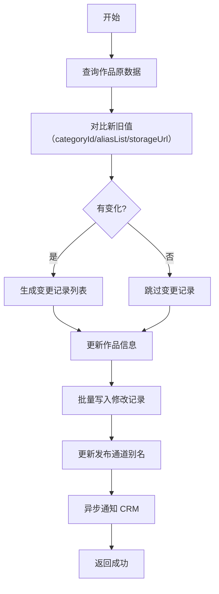
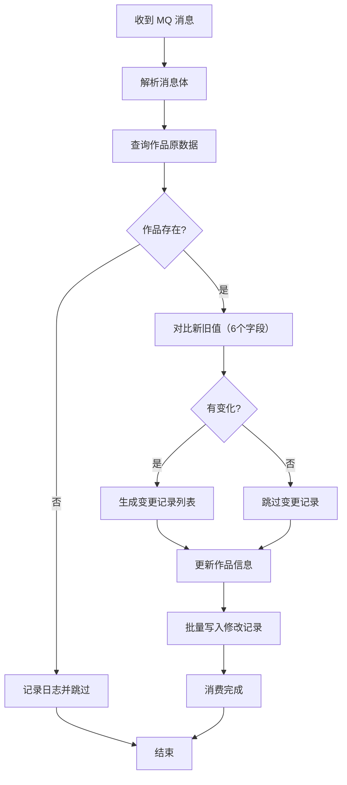
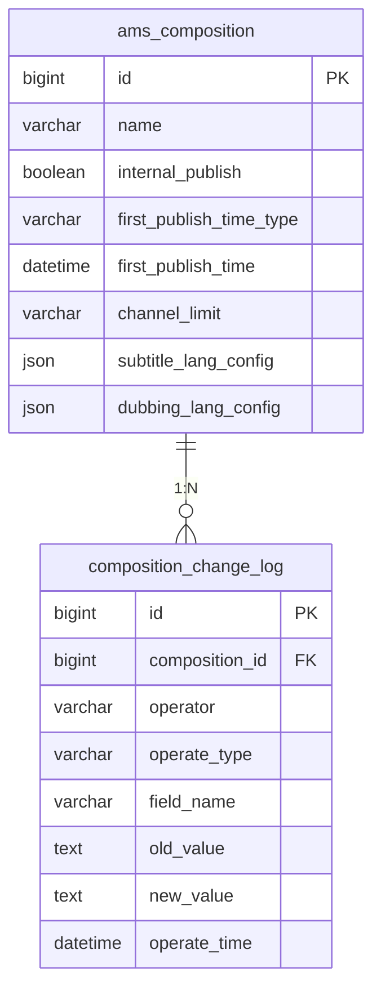

# AMS 作品管理--详细设计

> 本文档为 AMS 作品管理业务域的详细设计文档。
> **双受众设计原则**：本文档同时服务于人类阅读和 AI 代码生成。

## 文档信息

| 项目 | 内容 |
| --- | --- |
| **所属业务域** | AMS 作品管理 |
| **域编号** | D01 |
| **域类型** | 核心域 |
| **域负责人** | - |
| **关联总纲** | [V1.0-作品管理与交接单改造-迭代变更总纲.md](./V1.0-作品管理与交接单改造-迭代变更总纲.md) |

---

## 一、域概述

### 1.1 业务职责

AMS 作品管理域负责管理作品的基本信息、发布配置、语种配置，提供作品详情查看、设置修改、修改记录追溯等能力。支持 CRM 系统通过 MQ 推送作品配置信息。

### 1.2 模块 - 控制器 - 服务 映射

| 模块名称 | Controller | Service | Mapper | 核心职责 |
| --- | --- | --- | --- | --- |
| 作品管理 | `AmsCompositionController` | `IAmsCompositionService` / `AmsCompositionServiceImpl` | `AmsCompositionMapper` | 作品 CRUD、详情查询、设置保存 |
| 修改记录 | `AmsCompositionController` | `ICompositionChangeLogService` / `CompositionChangeLogServiceImpl` | `CompositionChangeLogMapper` | 修改记录查询 |

### 1.3 域内交互关系


### 1.4 迭代背景 `[新增]`

[《作品管理与交接单改造-PRD》](E:\0326需求\作品管理与交接单改造-PRD.md)

| 序号 | 需求项 | 优先级 | 简述 |
| --- | --- | --- | --- |
| 1 | F00 作品列表调整 | P0 | 新增「内部是否可发布」列、作品名称点击跳转 |
| 2 | F01 作品详情抽屉 | P0 | 1280px 抽屉展示基本信息、发布配置、语种配置 |
| 3 | F02 作品设置弹窗 | P0 | 配置发布规则和语种限制 |
| 4 | F01 修改记录 Tab | P0 | 字段变更历史追溯 |

### 1.5 迭代变更概览 `[新增]`

| 变更类型 | 影响模块 | 影响文件 | 简述 |
| --- | --- | --- | --- |
| `[新增]` | 作品管理 | `AmsComposition` 实体新增 6 字段 | 发布配置 + 语种配置字段 |
| `[新增]` | 作品管理 | `CompositionDetailVO` | 详情响应体 |
| `[新增]` | 修改记录 | `CompositionChangeLog` 实体、Mapper、Service | 修改记录全套 |
| `[修改]` | 作品管理 | `AmsCompositionServiceImpl.updateCategory()` | 新增变更记录写入逻辑 |
| `[新增]` | MQ 消费 | `DeliveryReceiptConsumer` | CRM 推送消费时写入变更记录 |

---

## 二、功能模块详细设计

---

### 2.1 作品列表模块

> 模块简述：作品分页列表查询，本次迭代新增「内部是否可发布」列展示

#### 2.1.1 作品分页列表 `[修改]`

| **名称描述** | 作品分页列表 | **估分** | 0.5 人/天 |
| --- | --- | --- | --- |
| **接口路径** | `GET /composition/page` | | |
| **Controller 方法** | `AmsCompositionController.page()` | | |
| **Service 方法** | `AmsCompositionServiceImpl.page()` | | |

**入参**：

```json
{
  "pageNum": "Integer // 页码，默认 1",
  "pageSize": "Integer // 每页条数，默认 20",
  "name": "String // 作品名称（模糊查询）",
  "internalPublish": "Boolean // 内部可发布筛选（可选）"
}
```

**业务逻辑**：

1. 构建查询条件
   1. 支持作品名称模糊查询
   2. 支持 `internalPublish` 精确筛选
2. 执行分页查询
   1. 调用 `AmsCompositionMapper.selectPage()`
3. 返回结果
   1. 返回值新增 `internalPublish` 字段

**返回**：

```json
{
  "list": [{
    "id": "Long // 作品ID",
    "name": "String // 作品名称",
    "internalPublish": "Boolean // 内部可发布",
    "cpName": "String // CP名称",
    "deliveryReceiptNum": "String // 交接单编号"
  }],
  "total": "Long // 总数"
}
```

**业务流程图**：无（简单查询）

**实现检查清单**：

- [ ] Controller: `GET /composition/page` → `AmsCompositionController.page()`
- [ ] Service: `AmsCompositionServiceImpl.page()` → 返回 `IPage<CompositionPageVO>`
- [ ] Mapper: `AmsCompositionMapper.selectPage()` → MyBatis Plus 自带
- [ ] VO: `CompositionPageVO` → 新增字段 `internalPublish`
- [ ] Entity: `AmsComposition` → 新增字段 `internalPublish`
- [ ] SQL: 无变更
- [ ] 事务: 无事务
- [ ] MQ: 无
- [ ] 缓存: 无

---

### 2.2 作品详情模块 `[新增]`

> 模块简述：作品详情抽屉数据查询，包含基本信息、合约信息、发布配置、语种配置

#### 2.2.1 获取作品详情 `[新增]`

| **名称描述** | 获取作品详情 | **估分** | 1 人/天 |
| --- | --- | --- | --- |
| **接口路径** | `GET /composition/detail/{id}` | | |
| **Controller 方法** | `AmsCompositionController.getDetail()` | | |
| **Service 方法** | `AmsCompositionServiceImpl.getDetail()` | | |

**入参**：

```json
{
  "id": "Long // 作品ID（Path参数）"
}
```

**业务逻辑**：

1. 参数校验
   1. 判断 `id` 是否为空
      1. 是：抛异常 BusinessException：「作品ID不能为空」
      2. 否：继续
2. 查询作品信息
   1. 调用 `AmsCompositionMapper.selectById(id)`
   2. 判断作品是否存在
      1. 否：抛异常 BusinessException：「作品不存在」
      2. 是：继续
3. 组装详情数据
   1. 基本信息：cpName、deliveryReceiptNum、storageUrl、categoryName、aliasList
   2. 发布配置：internalPublish、firstPublishTimeType、firstPublishTime、channelLimit
   3. 语种配置：subtitleLangConfig、dubbingLangConfig
   4. 解析 JSON 格式的语种配置字段
4. 返回结果

**返回**：

```json
{
  "id": "Long // 作品ID",
  "name": "String // 作品名称",
  "cpName": "String // CP名称",
  "cpType": "Integer // CP类型：1公司,2个人,3境外公司,4境外个人",
  "deliveryReceiptNum": "String // 交接单编号",
  "storageUrl": "String // 入库链接",
  "categoryName": "String // 垂类名称",
  "aliasList": "List<String> // 别名列表",
  "internalPublish": "Boolean // 内部可发布",
  "firstPublishTimeType": "String // 首发时间类型：ANYTIME/CUSTOM/WAITING",
  "firstPublishTime": "LocalDateTime // 首发时间",
  "channelLimit": "String // 频道发布限制：UNLIMITED/CP_ONLY",
  "subtitleLangConfig": {
    "allow": "List<String> // 字幕可发语种，ALL表示全部",
    "deny": "List<String> // 字幕禁发语种"
  },
  "dubbingLangConfig": {
    "allow": "List<String> // 配音可发语种，ALL表示全部",
    "deny": "List<String> // 配音禁发语种"
  }
}
```

**业务流程图**：无（简单查询）

**实现检查清单**：

- [ ] Controller: `GET /composition/detail/{id}` → `AmsCompositionController.getDetail()`
- [ ] Service: `AmsCompositionServiceImpl.getDetail(Long id)` → 返回 `CompositionDetailVO`
- [ ] Mapper: `AmsCompositionMapper.selectById()` → MyBatis Plus 自带
- [ ] VO: `CompositionDetailVO` → 新增类
- [ ] Entity: `AmsComposition` → 新增 6 个字段
- [ ] SQL: 无
- [ ] 事务: 无事务
- [ ] MQ: 无
- [ ] 缓存: 无

---

### 2.3 作品设置模块 `[修改]`

> 模块简述：复用现有 `/assets/setCompositionCategory` 接口，新增变更记录写入逻辑
>
> **重要约束**：AMS 设置弹窗仅能修改 3 个字段（垂类、别名、入库链接），发布配置和语种配置在 AMS 侧只读展示，仅能通过 CRM 交接单推送修改

#### 2.3.1 保存作品设置 `[修改]`

| **名称描述** | 保存作品设置 | **估分** | 0.5 人/天 |
| --- | --- | --- | --- |
| **接口路径** | `POST /assets/setCompositionCategory` | | |
| **Controller 方法** | `AssetsController.setCompositionCategory()` | | |
| **Service 方法** | `AmsCompositionServiceImpl.updateCategory()` | | |

**入参**（复用现有 DTO，无变更）：

```json
{
  "id": "Integer // 作品ID",
  "categoryId": "Integer // 垂类ID",
  "aliasList": "List<String> // 别名列表",
  "storageUrl": "String // 入库链接"
}
```

**业务逻辑**（原有逻辑 + 新增变更记录）：

1. 参数提取
   1. 提取 id、categoryId、aliasList、storageUrl
2. 查询作品原数据
   1. 调用 `getById(id)` 获取作品原信息
3. **对比新旧值，生成变更记录** `[新增]`
   1. 逐字段对比：categoryId、aliasList、storageUrl
   2. 有变化的字段生成 `CompositionChangeLog` 记录
   3. 字段名使用业务名称（参考 § 6.4 映射表）
   4. categoryId 转换为垂类名称显示
4. 更新作品信息（原有逻辑）
   1. 设置 categoryId、aliasList、storageUrl
   2. 调用 `updateById(composition)`
5. **批量写入修改记录** `[新增]`
   1. 调用 `CompositionChangeLogMapper.insertBatch(changeLogList)`
6. 更新发布通道别名（原有逻辑）
   1. 查询关联的 PublishChannel
   2. 批量更新 aliasList
7. 异步通知 CRM（原有逻辑）
   1. 发送垂类变更消息

**返回**：

```json
{
  "code": 0,
  "message": "success"
}
```

**业务流程图**：



**实现检查清单**：

- [ ] Controller: `POST /assets/setCompositionCategory` → `AssetsController.setCompositionCategory()`（无变更）
- [ ] Service: `AmsCompositionServiceImpl.updateCategory()` → 新增变更记录逻辑
- [ ] Mapper: `CompositionChangeLogMapper.insertBatch()` → 自定义批量插入
- [ ] VO: `ChannelCompositionVO` → 复用现有，无变更
- [ ] Entity: `CompositionChangeLog` → 新增类
- [ ] SQL: 新增 `composition_change_log` 表
- [ ] 事务: `@Transactional` 标注在 `updateCategory()` 方法
- [ ] MQ: 无
- [ ] 缓存: 无

---

### 2.4 修改记录模块 `[新增]`

> 模块简述：作品修改记录分页查询

#### 2.4.1 获取修改记录列表 `[新增]`

| **名称描述** | 获取修改记录列表 | **估分** | 0.5 人/天 |
| --- | --- | --- | --- |
| **接口路径** | `GET /composition/changeLog/{compositionId}` | | |
| **Controller 方法** | `AmsCompositionController.getChangeLogList()` | | |
| **Service 方法** | `CompositionChangeLogServiceImpl.getPageList()` | | |

**入参**：

```json
{
  "compositionId": "Long // 作品ID（Path参数）",
  "pageNum": "Integer // 页码，默认 1",
  "pageSize": "Integer // 每页条数，默认 20"
}
```

**业务逻辑**：

1. 参数校验
   1. 判断 `compositionId` 是否为空
      1. 是：抛异常 BusinessException：「作品ID不能为空」
2. 分页查询修改记录
   1. 调用 `CompositionChangeLogMapper.selectPage()`
   2. 按 `id` 倒序排列
3. 返回结果

**返回**：

```json
{
  "list": [{
    "id": "Long // 记录ID",
    "operator": "String // 操作人",
    "operateType": "String // 操作类型：CREATE/UPDATE",
    "fieldName": "String // 字段名（业务名称）",
    "oldValue": "String // 旧值",
    "newValue": "String // 新值",
    "operateTime": "LocalDateTime // 操作时间"
  }],
  "total": "Long // 总数"
}
```

**业务流程图**：无（简单查询）

**实现检查清单**：

- [ ] Controller: `GET /composition/changeLog/{compositionId}` → `AmsCompositionController.getChangeLogList()`
- [ ] Service: `CompositionChangeLogServiceImpl.getPageList(Long compositionId, Integer pageNum, Integer pageSize)` → 返回 `IPage<CompositionChangeLogVO>`
- [ ] Mapper: `CompositionChangeLogMapper.selectPage()` → MyBatis Plus 自带
- [ ] VO: `CompositionChangeLogVO` → 新增类
- [ ] Entity: `CompositionChangeLog` → 新增类
- [ ] SQL: 无
- [ ] 事务: 无事务
- [ ] MQ: 无
- [ ] 缓存: 无

---

### 2.5 MQ 消费变更记录模块 `[新增]`

> 模块简述：CRM 交接单推送消息消费时，对比新旧值并写入作品变更记录
>
> **变更记录字段范围**：发布配置（internalPublish、firstPublishTimeType、firstPublishTime、channelLimit）、语种配置（subtitleLangConfig、dubbingLangConfig）

#### 2.5.1 CRM 推送消费写入变更记录 `[新增]`

| **名称描述** | CRM 推送消费写入变更记录 | **估分** | 1 人/天 |
| --- | --- | --- | --- |
| **触发方式** | MQ 消费 | | |
| **Consumer 类** | `DeliveryReceiptConsumer` | | |
| **Service 方法** | `AmsCompositionServiceImpl.updateFromCrmPush()` | | |

**入参**（MQ 消息体）：

```json
{
  "compositionId": "Long // 作品ID",
  "compositionName": "String // 作品名称",
  "internalPublish": "Boolean // 内部可发布",
  "firstPublishTimeType": "String // 首发时间类型：ANYTIME/CUSTOM/WAITING",
  "firstPublishTime": "LocalDateTime // 首发时间",
  "channelLimit": "String // 频道发布限制：UNLIMITED/CP_ONLY",
  "subtitleLangConfig": {
    "allow": "List<String> // 字幕可发语种",
    "deny": "List<String> // 字幕禁发语种"
  },
  "dubbingLangConfig": {
    "allow": "List<String> // 配音可发语种",
    "deny": "List<String> // 配音禁发语种"
  },
  "operator": "String // 操作人（CRM 用户）"
}
```

**业务逻辑**：

1. 消息解析
   1. 提取 compositionId 及发布配置、语种配置字段
2. 查询作品原数据
   1. 调用 `AmsCompositionMapper.selectById(compositionId)`
   2. 判断作品是否存在
      1. 否：记录日志并跳过
      2. 是：继续
3. 对比新旧值，生成变更记录
   1. 逐字段对比：internalPublish、firstPublishTimeType、firstPublishTime、channelLimit、subtitleLangConfig、dubbingLangConfig
   2. 有变化的字段生成 `CompositionChangeLog` 记录
   3. 字段名使用业务名称（参考 § 6.4 映射表）
   4. code 值转换为中文名称
   5. 操作人为 CRM 推送消息中的 operator
4. 更新作品信息
   1. 设置发布配置和语种配置字段
   2. 调用 `AmsCompositionMapper.updateById(composition)`
5. 批量写入修改记录
   1. 调用 `CompositionChangeLogMapper.insertBatch(changeLogList)`

**业务流程图**：



**实现检查清单**：

- [ ] Consumer: `DeliveryReceiptConsumer.onMessage()` → 新增变更记录逻辑
- [ ] Service: `AmsCompositionServiceImpl.updateFromCrmPush()` → 新增方法
- [ ] Mapper: `AmsCompositionMapper.updateById()` → MyBatis Plus 自带
- [ ] Mapper: `CompositionChangeLogMapper.insertBatch()` → 自定义批量插入
- [ ] Entity: `AmsComposition` → 新增 6 个字段
- [ ] Entity: `CompositionChangeLog` → 新增类
- [ ] SQL: 无
- [ ] 事务: `@Transactional` 标注在 `updateFromCrmPush()` 方法
- [ ] MQ: 消费现有交接单推送队列
- [ ] 缓存: 无

---

## 三、批量处理设计

本域不涉及批量处理设计。

---

## 四、跨服务编排设计

本域不涉及跨服务编排设计。CRM 通过 MQ 异步推送，AMS 作为消费方处理。

---

## 五、状态设计

本域不涉及状态流转设计。`internalPublish` 字段为布尔值，非状态枚举。

---

## 六、数据字典

### 6.1 首发时间类型

| 表/字段 | 字段含义 | 枚举类 | 值 | 描述 |
| --- | --- | --- | --- | --- |
| `ams_composition.first_publish_time_type` | 首发时间类型 | `FirstPublishTimeTypeEnum` | `ANYTIME` | 随时可发布 |
| | | | `CUSTOM` | 自定义时间 |
| | | | `WAITING` | 暂不可发布，等待上线通知 |

### 6.2 频道发布限制

| 表/字段 | 字段含义 | 枚举类 | 值 | 描述 |
| --- | --- | --- | --- | --- |
| `ams_composition.channel_limit` | 频道发布限制 | `ChannelLimitEnum` | `UNLIMITED` | 无限制（原「合集」） |
| | | | `CP_ONLY` | 仅CP指定频道（原「单开」） |

### 6.3 操作类型

| 表/字段 | 字段含义 | 枚举类 | 值 | 描述 |
| --- | --- | --- | --- | --- |
| `composition_change_log.operate_type` | 操作类型 | `OperateTypeEnum` | `CREATE` | 创建作品 |
| | | | `UPDATE` | 修改作品 |

### 6.4 字段名称映射表

| 技术字段名 | 业务名称（展示用） |
| --- | --- |
| categoryId | 垂类 |
| aliasList | 别名 |
| storageUrl | 入库链接 |
| internalPublish | 内部是否可发布 |
| firstPublishTimeType | 首发时间类型 |
| firstPublishTime | 首发时间 |
| channelLimit | 频道发布限制 |
| subtitleLangConfig.allow | 字幕可发语种 |
| subtitleLangConfig.deny | 字幕禁发语种 |
| dubbingLangConfig.allow | 配音可发语种 |
| dubbingLangConfig.deny | 配音禁发语种 |

---

## 七、域内数据库设计

### 7.1 域 ER 图



### 7.2 表结构设计

#### 7.2.1 composition_change_log（作品修改记录表）`[新增]`

| 项目 | 内容 |
| --- | --- |
| **所属数据源** | master |
| **所属数据库** | silverdawn_ams |
| **对应 Entity** | `CompositionChangeLog` |
| **对应 Mapper** | `CompositionChangeLogMapper` |
| **表用途** | 记录作品设置功能内所有字段变动 |

```sql
CREATE TABLE `composition_change_log` (
  `id` bigint unsigned NOT NULL AUTO_INCREMENT COMMENT '主键id',
  `composition_id` bigint NOT NULL COMMENT '作品ID',
  `operator` varchar(64) NOT NULL COMMENT '操作人',
  `operate_type` varchar(16) NOT NULL COMMENT '操作类型：CREATE/UPDATE',
  `field_name` varchar(64) NOT NULL COMMENT '字段名（业务名称）',
  `old_value` text COMMENT '旧值',
  `new_value` text COMMENT '新值',
  `operate_time` datetime NOT NULL COMMENT '操作时间',
  PRIMARY KEY (`id`),
  KEY `idx_composition_id` (`composition_id`) USING BTREE
) ENGINE=InnoDB DEFAULT CHARSET=utf8mb4 COLLATE=utf8mb4_0900_ai_ci COMMENT='作品修改记录表';
```

**索引设计**：

| 索引名 | 索引类型 | 索引列 | 用途说明 |
| --- | --- | --- | --- |
| `idx_composition_id` | 普通 | `composition_id` | 按作品ID查询修改记录 |

### 7.3 变更 SQL `[新增]`

| 实例 & 库 | 变更类型 | 变更语句 |
| --- | --- | --- |
| silverdawn_ams | 加字段 | `ALTER TABLE ams_composition ADD COLUMN internal_publish TINYINT(1) DEFAULT NULL COMMENT '内部可发布：1-可发布，0-不可发布';` |
| silverdawn_ams | 加字段 | `ALTER TABLE ams_composition ADD COLUMN first_publish_time_type VARCHAR(16) DEFAULT NULL COMMENT '首发时间类型：ANYTIME/CUSTOM/WAITING';` |
| silverdawn_ams | 加字段 | `ALTER TABLE ams_composition ADD COLUMN first_publish_time DATETIME DEFAULT NULL COMMENT '首发时间';` |
| silverdawn_ams | 加字段 | `ALTER TABLE ams_composition ADD COLUMN channel_limit VARCHAR(16) DEFAULT NULL COMMENT '频道发布限制：UNLIMITED/CP_ONLY';` |
| silverdawn_ams | 加字段 | `ALTER TABLE ams_composition ADD COLUMN subtitle_lang_config JSON DEFAULT NULL COMMENT '字幕语种配置';` |
| silverdawn_ams | 加字段 | `ALTER TABLE ams_composition ADD COLUMN dubbing_lang_config JSON DEFAULT NULL COMMENT '配音语种配置';` |
| silverdawn_ams | 新增表 | 见 § 7.2.1 |

---

## 八、数据模型定义

### 8.1 LangConfigDTO `[新增]`

| 项目 | 内容 |
| --- | --- |
| **类名** | `LangConfigDTO` |
| **包路径** | `cn.oyss.ams.domain.dto` |
| **模型类型** | DTO |
| **用途** | 语种配置嵌套对象 |
| **引用接口** | § 2.2.1, § 2.5.1 |

| 字段名 | Java 类型 | 必填 | 校验注解 | 说明 |
| --- | --- | --- | --- | --- |
| `allow` | `List<String>` | N | - | 可发语种列表，`ALL` 表示全部 |
| `deny` | `List<String>` | N | - | 禁发语种列表 |

### 8.2 CompositionDetailVO `[新增]`

| 项目 | 内容 |
| --- | --- |
| **类名** | `CompositionDetailVO` |
| **包路径** | `cn.oyss.ams.domain.vo` |
| **模型类型** | VO |
| **用途** | 作品详情响应体 |
| **引用接口** | § 2.2.1 |

| 字段名 | Java 类型 | 必填 | 校验注解 | 说明 |
| --- | --- | --- | --- | --- |
| `id` | `Long` | Y | - | 作品ID |
| `name` | `String` | Y | - | 作品名称 |
| `cpName` | `String` | N | - | CP名称 |
| `cpType` | `Integer` | N | - | CP类型 |
| `deliveryReceiptNum` | `String` | N | - | 交接单编号 |
| `storageUrl` | `String` | N | - | 入库链接 |
| `categoryName` | `String` | N | - | 垂类名称 |
| `aliasList` | `List<String>` | N | - | 别名列表 |
| `internalPublish` | `Boolean` | N | - | 内部可发布 |
| `firstPublishTimeType` | `String` | N | - | 首发时间类型 |
| `firstPublishTime` | `LocalDateTime` | N | - | 首发时间 |
| `channelLimit` | `String` | N | - | 频道发布限制 |
| `subtitleLangConfig` | `LangConfigDTO` | N | - | 字幕语种配置 |
| `dubbingLangConfig` | `LangConfigDTO` | N | - | 配音语种配置 |

### 8.3 CompositionChangeLogVO `[新增]`

| 项目 | 内容 |
| --- | --- |
| **类名** | `CompositionChangeLogVO` |
| **包路径** | `cn.oyss.ams.domain.vo` |
| **模型类型** | VO |
| **用途** | 修改记录响应体 |
| **引用接口** | § 2.4.1 |

| 字段名 | Java 类型 | 必填 | 校验注解 | 说明 |
| --- | --- | --- | --- | --- |
| `id` | `Long` | Y | - | 记录ID |
| `operator` | `String` | Y | - | 操作人 |
| `operateType` | `String` | Y | - | 操作类型 |
| `fieldName` | `String` | Y | - | 字段名（业务名称） |
| `oldValue` | `String` | N | - | 旧值 |
| `newValue` | `String` | N | - | 新值 |
| `operateTime` | `LocalDateTime` | Y | - | 操作时间 |

---

## 九、防腐层设计

### 9.1 字典服务查询

| **Manager 接口** | `DictManager` | **外部依赖类型** | 数据库查询 |
| --- | --- | --- | --- |
| **实现类** | `DictManagerImpl` | **依赖客户端** | `SysDictDataMapper` |
| **方法名** | `getLanguageOptions()` | **估分** | - |

**入参**：

```json
{}
```

**执行逻辑**：

1. 查询字典数据
   1. 调用 `SysDictDataMapper.selectList()` 查询 `dict_type='language'` 的数据
2. 返回语种选项列表

**返回**：

```json
{
  "options": [{
    "value": "String // 语种code",
    "label": "String // 语种名称"
  }]
}
```

---

## 十、持久化 & 中间件

本域不涉及新增配置、Redis、MQ、定时任务变更。

MQ 消费逻辑属于 CRM 交接单域推送到 AMS，在 CRM 域文档中描述。
