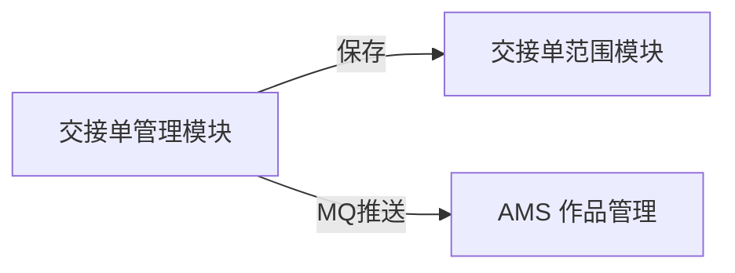
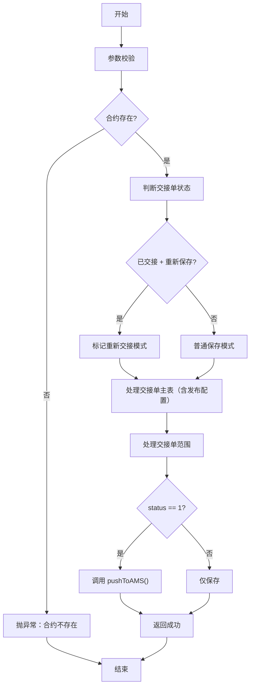
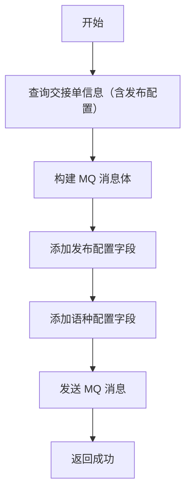
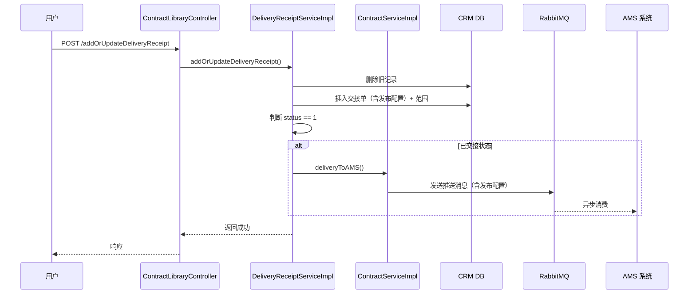
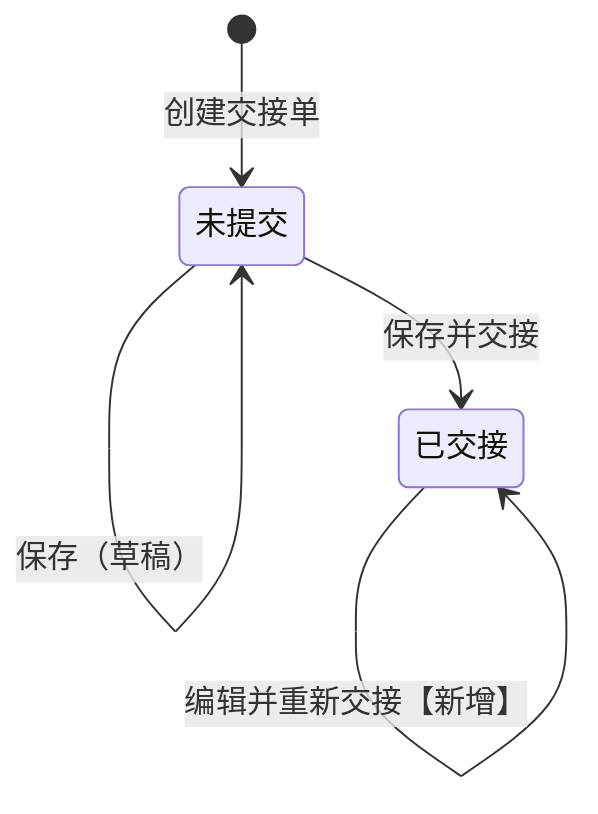
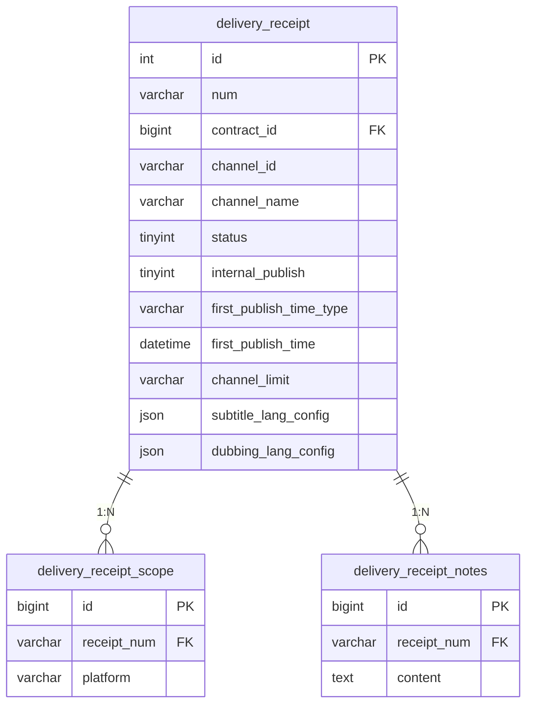

# CRM 交接单--详细设计

> 本文档为 CRM 交接单业务域的详细设计文档。
> **双受众设计原则**：本文档同时服务于人类阅读和 AI 代码生成。

## 文档信息

| 项目 | 内容 |
| --- | --- |
| **所属业务域** | CRM 交接单 |
| **域编号** | D02 |
| **域类型** | 核心域 |
| **域负责人** | - |
| **关联总纲** | [V1.0-作品管理与交接单改造-迭代变更总纲.md](./V1.0-作品管理与交接单改造-迭代变更总纲.md) |

---

## 一、域概述

### 1.1 业务职责

CRM 交接单域负责管理交接单的创建、编辑、删除，以及交接单与 AMS 系统的数据同步。支持配置作品发布信息（内部可发布、首发时间、频道限制、语种配置），并通过 MQ 异步推送至 AMS 系统。

### 1.2 模块 - 控制器 - 服务 映射

| 模块名称 | Controller | Service | Mapper | 核心职责 |
| --- | --- | --- | --- | --- |
| 交接单管理 | `ContractLibraryController` | `IDeliveryReceiptService` / `DeliveryReceiptServiceImpl` | `DeliveryReceiptMapper` | 交接单 CRUD、AMS 推送 |
| 交接单范围 | `ContractLibraryController` | `IDeliveryReceiptService` / `DeliveryReceiptServiceImpl` | `DeliveryReceiptScopeMapper` | 合作范围管理 |
| 交接单备注 | `ContractLibraryController` | `IDeliveryReceiptService` / `DeliveryReceiptServiceImpl` | `DeliveryReceiptNotesMapper` | 备注与钉钉通知 |

### 1.3 域内交互关系



### 1.4 迭代背景 `[新增]`

[《作品管理与交接单改造-PRD》](E:\0326需求\作品管理与交接单改造-PRD.md)

| 序号 | 需求项 | 优先级 | 简述 |
| --- | --- | --- | --- |
| 1 | F03 交接单创建发布配置联动 | P1 | 创建交接单时可配置作品发布信息 |
| 2 | F03-E 交接单编辑 | P0 | 已交接状态可编辑并重新推送 |
| 3 | F04 交接单详情页 UI 改造 | P1 | 展示发布配置信息 |
| 4 | F05 频道/作品信息表格列定义 | P1 | 新增列展示配置信息 |

### 1.5 迭代变更概览 `[新增]`

| 变更类型 | 影响模块 | 影响文件 | 简述 |
| --- | --- | --- | --- |
| `[修改]` | 交接单管理 | `DeliveryReceipt` 实体 | 新增 6 个发布配置和语种配置字段 |
| `[修改]` | 交接单管理 | `DeliveryReceiptDto` | 新增发布配置字段 |
| `[修改]` | 交接单管理 | `DeliveryReceiptServiceImpl.addOrUpdateDeliveryReceipt()` | 支持已交接状态编辑 |
| `[修改]` | 交接单管理 | `ContractServiceImpl.deliveryToAMS()` | MQ 消息体新增发布配置字段 |

---

## 二、功能模块详细设计

---

### 2.1 交接单管理模块

> 模块简述：交接单的创建、编辑、删除，以及与 AMS 系统的数据同步

#### 2.1.1 创建/编辑交接单 `[修改]`

| **名称描述** | 创建/编辑交接单 | **估分** | 1.5 人/天 |
| --- | --- | --- | --- |
| **接口路径** | `POST /contract/addOrUpdateDeliveryReceipt` | | |
| **Controller 方法** | `ContractLibraryController.addOrUpdateDeliveryReceipt()` | | |
| **Service 方法** | `DeliveryReceiptServiceImpl.addOrUpdateDeliveryReceipt()` | | |

**入参**：

```json
{
  "contractId": "Long // 合约ID",
  "channelList": [{
    "channelId": "String // 频道ID",
    "channelName": "String // 频道名称",
    "channelLabel": "Integer // 频道标签：0新开，1子频道，2合并，3重签/续签",
    "collectionType": "String // 合集类型：0单开，1合集",
    "firstReleaseTime": "LocalDateTime // 首发时间",
    "publishLanguage": "String // 首发语种",
    "disableLanguage": "String // 禁用语种",
    "internalPublish": "Boolean // [新增] 内部可发布",
    "firstPublishTimeType": "String // [新增] 首发时间类型：ANYTIME/CUSTOM/WAITING",
    "firstPublishTime": "LocalDateTime // [新增] 首发时间",
    "channelLimit": "String // [新增] 频道发布限制：UNLIMITED/CP_ONLY",
    "subtitleLangConfig": {
      "allow": "List<String> // [新增] 字幕可发语种",
      "deny": "List<String> // [新增] 字幕禁发语种"
    },
    "dubbingLangConfig": {
      "allow": "List<String> // [新增] 配音可发语种",
      "deny": "List<String> // [新增] 配音禁发语种"
    }
  }],
  "status": "Integer // 状态：0未提交，1已交接"
}
```

**业务逻辑**：

1. 参数校验
   1. 校验 `contractId` 是否存在
      1. 否：抛异常 BusinessException：「合约不存在」
   2. 校验频道列表是否为空
      1. 是：抛异常 BusinessException：「请选择频道」
2. 判断交接单状态
   1. 查询现有交接单状态
   2. 判断 `现有状态 == 已交接` 且 `新状态 == 已交接`
      1. 是：标记为「重新交接」模式
      2. 否：普通保存模式
3. 生成交接单编号
   1. 首次创建：调用 `generateReceiptNumber()` 生成编号（格式：ZYYYMMDDxxxx）
   2. 编辑：保留原编号
4. 处理交接单主表
   1. 删除原交接单记录（按编号）
   2. 插入新交接单记录（每个频道一条，含发布配置字段）
5. 处理交接单范围
   1. 删除原范围记录
   2. 插入新范围记录
6. 判断是否触发 AMS 推送
   1. 判断 `status == 1`（已交接）
      1. 是：调用 `pushToAMS()` 异步推送
      2. 否：仅保存，不推送
8. 返回结果

**返回**：

```json
{
  "success": "Boolean // 是否成功"
}
```

**业务流程图**：



**实现检查清单**：

- [ ] Controller: `POST /contract/addOrUpdateDeliveryReceipt` → `ContractLibraryController.addOrUpdateDeliveryReceipt()`
- [ ] Service: `DeliveryReceiptServiceImpl.addOrUpdateDeliveryReceipt(DeliveryReceiptDto dto)` → 返回 `Boolean`
- [ ] DTO: `DeliveryReceiptDto` → 新增发布配置字段
- [ ] Entity: `DeliveryReceipt` → 新增 6 个字段
- [ ] SQL: `delivery_receipt` 表 ALTER ADD COLUMN
- [ ] 事务: `@Transactional` 标注在 `addOrUpdateDeliveryReceipt()` 方法
- [ ] MQ: 调用现有 `deliveryToAMS()` 方法
- [ ] 缓存: 无

---

#### 2.1.2 获取交接单详情 `[修改]`

| **名称描述** | 获取交接单详情 | **估分** | 0.5 人/天 |
| --- | --- | --- | --- |
| **接口路径** | `GET /contract/deliveryReceiptGetDetail` | | |
| **Controller 方法** | `ContractLibraryController.deliveryReceiptGetDetail()` | | |
| **Service 方法** | `DeliveryReceiptServiceImpl.deliveryReceiptGetDetail()` | | |

**入参**：

```json
{
  "num": "String // 交接单编号（Query参数）"
}
```

**业务逻辑**：

1. 查询交接单基本信息
   1. 调用 `DeliveryReceiptMapper.selectByNum(num)`
2. 查询交接单范围
   1. 调用 `DeliveryReceiptScopeMapper.selectByNum(num)`
3. 查询备注列表
   1. 调用 `DeliveryReceiptNotesMapper.selectListByNum(num)`
4. 组装返回数据（交接单记录中已包含发布配置字段）

**返回**：

```json
{
  "num": "String // 交接单编号",
  "contractNum": "String // 合约编号",
  "memberName": "String // CP名称",
  "status": "Integer // 状态",
  "channelList": [{
    "channelId": "String",
    "channelName": "String",
    "collectionType": "String",
    "firstReleaseTime": "LocalDateTime",
    "internalPublish": "Boolean // [新增] 内部可发布",
    "firstPublishTimeType": "String // [新增] 首发时间类型",
    "firstPublishTime": "LocalDateTime // [新增] 首发时间",
    "channelLimit": "String // [新增] 频道发布限制",
    "subtitleLangConfig": "Object // [新增] 字幕语种配置",
    "dubbingLangConfig": "Object // [新增] 配音语种配置"
  }],
  "scopeList": [{...}],
  "notesList": [{...}]
}
```

**业务流程图**：无（简单查询）

**实现检查清单**：

- [ ] Controller: `GET /contract/deliveryReceiptGetDetail` → `ContractLibraryController.deliveryReceiptGetDetail()`
- [ ] Service: `DeliveryReceiptServiceImpl.deliveryReceiptGetDetail(String num)` → 返回详情 VO
- [ ] VO: 返回 VO 新增发布配置字段
- [ ] SQL: 无
- [ ] 事务: 无事务
- [ ] MQ: 无
- [ ] 缓存: 无

---

### 2.2 AMS 数据同步模块 `[修改]`

> 模块简述：交接单数据推送至 AMS 系统

#### 2.2.1 推送交接单至 AMS `[修改]`

| **名称描述** | 推送交接单至 AMS | **估分** | 1 人/天 |
| --- | --- | --- | --- |
| **接口路径** | 内部调用（非 HTTP 接口） | | |
| **Controller 方法** | - | | |
| **Service 方法** | `ContractServiceImpl.deliveryToAMS()` | | |

**入参**：

```json
{
  "contractId": "Long // 合约ID",
  "receiptNum": "String // 交接单编号"
}
```

**业务逻辑**：

1. 查询交接单信息
   1. 调用 `DeliveryReceiptMapper.selectByNum(receiptNum)`
2. 构建 AMS 推送消息体
   1. 基本信息：频道ID、频道名称、合集类型、首发时间等
   2. 发布配置 `[新增]`：internalPublish、firstPublishTimeType、firstPublishTime、channelLimit
   3. 语种配置 `[新增]`：subtitleLangConfig、dubbingLangConfig
3. 发送 MQ 消息
   1. 复用现有 MQ 通道
   2. 消息体新增发布配置字段
4. 返回结果

**返回**：

```json
{
  "success": "Boolean // 是否成功"
}
```

**业务流程图**：



**实现检查清单**：

- [ ] Service: `ContractServiceImpl.deliveryToAMS(Long contractId)` → 逻辑变更
- [ ] DTO: MQ 消息体 → 新增发布配置、语种配置字段
- [ ] Entity: 无
- [ ] SQL: 无
- [ ] 事务: 无（MQ 异步）
- [ ] MQ: 复用现有交接单推送队列，消息体新增字段
- [ ] 缓存: 无

---

## 三、批量处理设计

本域不涉及批量处理设计。

---

## 四、跨服务编排设计

### 4.1 交接单保存并推送 AMS

| 项目 | 内容 |
| --- | --- |
| **触发方式** | 接口调用（已交接状态保存时） |
| **涉及 Service** | `DeliveryReceiptServiceImpl` `ContractServiceImpl` |
| **涉及外部调用** | RabbitMQ |
| **事务策略** | 本地事务（先保存，后异步推送） |

**编排流程图**：



**失败处理**：

| 失败节点 | 影响范围 | 补偿策略 |
| --- | --- | --- |
| MQ 发送失败 | 本地数据已持久化 | 人工通过 `test/amsSignByContractId` 接口补偿 |
| AMS 消费失败 | CRM 数据已保存 | AMS 侧重试机制 + 人工补偿 |

---

## 五、状态设计

### 5.1 交接单状态

| 项目 | 内容 |
| --- | --- |
| **所属实体/表** | `delivery_receipt`.`status` |
| **枚举类** | 无（使用 Integer） |
| **字段类型** | `tinyint` |
| **说明** | 交接单提交状态 |

**状态值定义**：

| 状态值 | 枚举常量 | 状态名称 | 描述 |
| --- | --- | --- | --- |
| `0` | - | 未提交 | 草稿状态，可编辑 |
| `1` | - | 已交接 | 已推送至 AMS，`[修改]` 可编辑并重新推送 |

**状态流转图**：



**流转规则说明**：

| 当前状态 | 目标状态 | 触发动作 | 前置条件 | 操作人/系统 | 说明 |
| --- | --- | --- | --- | --- | --- |
| 未提交 | 未提交 | 保存 | 无 | 用户 | 仅保存，不触发推送 |
| 未提交 | 已交接 | 保存并交接 | 合约有效 | 用户 | 触发 MQ 推送至 AMS |
| 已交接 | 已交接 | 编辑并重新交接 | 合约有效 | 用户 | `[新增]` 重新触发 MQ 推送 |

---

## 六、数据字典

### 6.1 合集类型

| 表/字段 | 字段含义 | 枚举类 | 值 | 描述 |
| --- | --- | --- | --- | --- |
| `delivery_receipt.collection_type` | 合集类型 | - | `0` | 单开 |
| | | | `1` | 合集 |

### 6.2 频道标签

| 表/字段 | 字段含义 | 枚举类 | 值 | 描述 |
| --- | --- | --- | --- | --- |
| `delivery_receipt.channel_label` | 频道标签 | - | `0` | 新开 |
| | | | `1` | 子频道 |
| | | | `2` | 合并 |
| | | | `3` | 重签/续签 |

### 6.3 首发时间类型

| 表/字段 | 字段含义 | 枚举类 | 值 | 描述 |
| --- | --- | --- | --- | --- |
| `delivery_receipt.first_publish_time_type` | 首发时间类型 | `FirstPublishTimeTypeEnum` | `ANYTIME` | 随时可发布 |
| | | | `CUSTOM` | 自定义时间 |
| | | | `WAITING` | 暂不可发布 |

### 6.4 频道发布限制

| 表/字段 | 字段含义 | 枚举类 | 值 | 描述 |
| --- | --- | --- | --- | --- |
| `delivery_receipt.channel_limit` | 频道发布限制 | `ChannelLimitEnum` | `UNLIMITED` | 无限制 |
| | | | `CP_ONLY` | 仅CP指定频道 |

---

## 七、域内数据库设计

### 7.1 域 ER 图



### 7.2 表结构设计

#### 7.2.1 delivery_receipt 表变更 `[修改]`

| 项目 | 内容 |
| --- | --- |
| **所属数据源** | master |
| **所属数据库** | silverdawn_crm |
| **对应 Entity** | `DeliveryReceipt` |
| **对应 Mapper** | `DeliveryReceiptMapper` |
| **表用途** | 存储交接单信息（含发布配置） |

**新增字段**：

| 字段名 | 类型 | 默认值 | 说明 |
| --- | --- | --- | --- |
| `internal_publish` | `tinyint(1)` | `NULL` | 内部可发布：1-可发布，0-不可发布 |
| `first_publish_time_type` | `varchar(16)` | `NULL` | 首发时间类型：ANYTIME/CUSTOM/WAITING |
| `first_publish_time` | `datetime` | `NULL` | 首发时间 |
| `channel_limit` | `varchar(16)` | `NULL` | 频道发布限制：UNLIMITED/CP_ONLY |
| `subtitle_lang_config` | `json` | `NULL` | 字幕语种配置：{allow:[], deny:[]} |
| `dubbing_lang_config` | `json` | `NULL` | 配音语种配置：{allow:[], deny:[]} |

### 7.3 变更 SQL `[新增]`

| 实例 & 库 | 变更类型 | 变更语句 |
| --- | --- | --- |
| silverdawn_crm | 加字段 | 见下方 SQL |

```sql
ALTER TABLE `delivery_receipt` 
  ADD COLUMN `internal_publish` tinyint(1) DEFAULT NULL COMMENT '内部可发布：1-可发布，0-不可发布' AFTER `upload_file_url_list`,
  ADD COLUMN `first_publish_time_type` varchar(16) DEFAULT NULL COMMENT '首发时间类型：ANYTIME/CUSTOM/WAITING' AFTER `internal_publish`,
  ADD COLUMN `first_publish_time` datetime DEFAULT NULL COMMENT '首发时间' AFTER `first_publish_time_type`,
  ADD COLUMN `channel_limit` varchar(16) DEFAULT NULL COMMENT '频道发布限制：UNLIMITED/CP_ONLY' AFTER `first_publish_time`,
  ADD COLUMN `subtitle_lang_config` json DEFAULT NULL COMMENT '字幕语种配置：{allow:[], deny:[]}' AFTER `channel_limit`,
  ADD COLUMN `dubbing_lang_config` json DEFAULT NULL COMMENT '配音语种配置：{allow:[], deny:[]}' AFTER `subtitle_lang_config`;
```

---

## 八、数据模型定义

### 8.1 LangConfigDTO `[新增]`

| 项目 | 内容 |
| --- | --- |
| **类名** | `LangConfigDTO` |
| **包路径** | `cn.oyss.crm.application.domain.dto` |
| **模型类型** | DTO |
| **用途** | 语种配置嵌套对象 |
| **引用接口** | § 2.1.1 |

| 字段名 | Java 类型 | 必填 | 校验注解 | 说明 |
| --- | --- | --- | --- | --- |
| `allow` | `List<String>` | N | - | 可发语种列表，`ALL` 表示全部 |
| `deny` | `List<String>` | N | - | 禁发语种列表 |

### 8.2 DeliveryReceiptDto `[修改]`

| 项目 | 内容 |
| --- | --- |
| **类名** | `DeliveryReceiptDto` |
| **包路径** | `cn.oyss.crm.application.domain.dto` |
| **模型类型** | DTO |
| **用途** | 交接单创建/编辑请求体 |
| **引用接口** | § 2.1.1 |

**新增字段**（在 channelList 的子对象中）：

| 字段名 | Java 类型 | 必填 | 校验注解 | 说明 |
| --- | --- | --- | --- | --- |
| `internalPublish` | `Boolean` | N | - | 内部可发布 `[新增]` |
| `firstPublishTimeType` | `String` | N | - | 首发时间类型 `[新增]` |
| `firstPublishTime` | `LocalDateTime` | N | - | 首发时间 `[新增]` |
| `channelLimit` | `String` | N | - | 频道发布限制 `[新增]` |
| `subtitleLangConfig` | `LangConfigDTO` | N | - | 字幕语种配置 `[新增]` |
| `dubbingLangConfig` | `LangConfigDTO` | N | - | 配音语种配置 `[新增]` |

---

## 九、防腐层设计

本域不涉及新增外部依赖调用。MQ 推送复用现有 `deliveryToAMS()` 方法实现。

---

## 十、持久化 & 中间件

### 10.1 MQ

| 主题 | 发布 or 订阅 | Tag | 消息结构 | 消费方 |
| --- | --- | --- | --- | --- |
| 交接单推送队列（复用） | 发布 | - | 新增：internalPublish、firstPublishTimeType、firstPublishTime、channelLimit、subtitleLangConfig、dubbingLangConfig | AMS 作品管理 |

**MQ 消息体变更说明**：

```json
{
  "channelId": "String // 频道ID",
  "channelName": "String // 频道名称",
  "collectionType": "String // 合集类型",
  "firstReleaseTime": "LocalDateTime // 首发时间",
  "internalPublish": "Boolean // [新增] 内部可发布",
  "firstPublishTimeType": "String // [新增] 首发时间类型",
  "firstPublishTime": "LocalDateTime // [新增] 首发时间",
  "channelLimit": "String // [新增] 频道发布限制",
  "subtitleLangConfig": {
    "allow": "List<String> // [新增] 字幕可发语种",
    "deny": "List<String> // [新增] 字幕禁发语种"
  },
  "dubbingLangConfig": {
    "allow": "List<String> // [新增] 配音可发语种",
    "deny": "List<String> // [新增] 配音禁发语种"
  }
}
```
