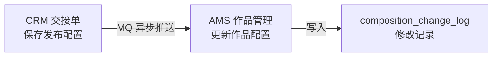
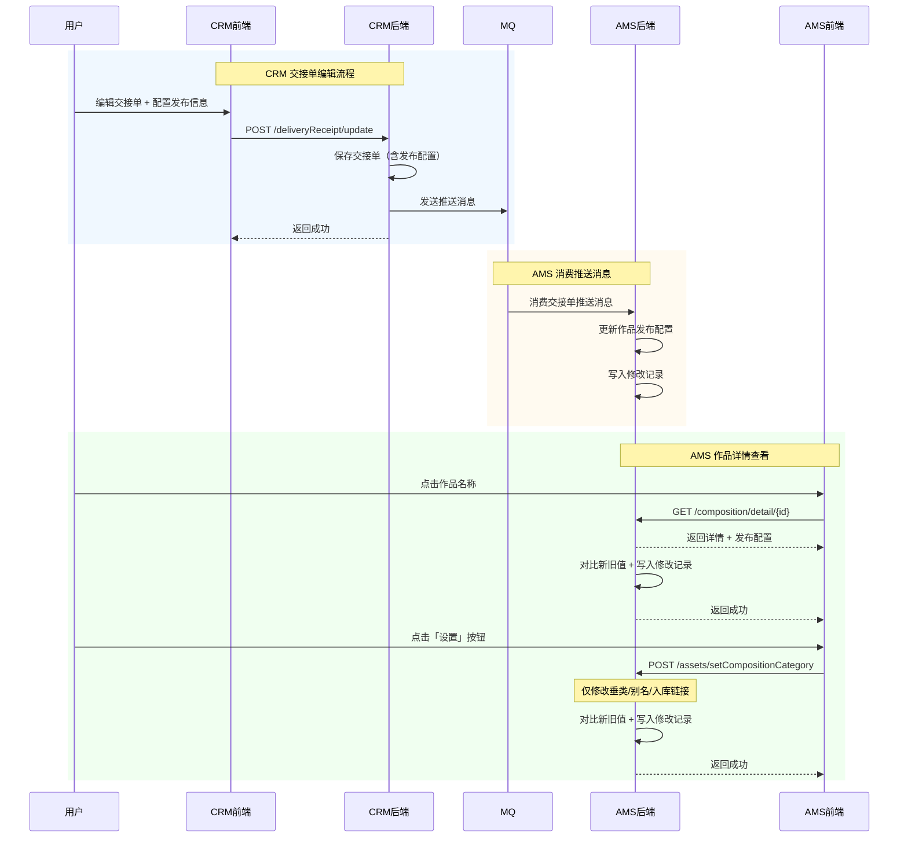

# V1.0-作品管理与交接单改造-迭代变更总纲

> 本文档是单次迭代的入口文档，提供变更全景视图。
> 详细的接口设计、业务逻辑在对应的 `02-{业务域}-详细设计.md` 中以增量方式追加。

---

## 一、迭代信息

### 1.1 迭代背景

为后续分发系统视频发布/制作环节的合规性校验，需从上至下增加发布配置相关信息在作品维度的留存。本次迭代对 CRM 交接单与 AMS 作品管理进行改造，核心能力包括：

- AMS 作品详情抽屉新增（1280px 宽度）
- AMS 作品设置弹窗（发布配置、语种配置）
- AMS 作品修改记录追溯
- CRM 交接单支持作品发布配置
- CRM 已交接状态交接单可编辑并重新推送

### 1.2 需求来源

[《作品管理与交接单改造-PRD》](E:\0326需求\作品管理与交接单改造-PRD.md)

### 1.3 文档信息

| 项目 | 内容 |
| --- | --- |
| **负责人** | - |
| **版本号** | V1.0 |
| **创建日期** | 2026-03-26 |
| **最后更新** | 2026-03-26 |

### 1.4 名词定义

| 名词 | 定义 |
| --- | --- |
| 内部可发布 | 控制作品是否允许在内部平台发布，值为「可发布 / 不可发布」 |
| 发布配置 | 包含首发时间、频道发布限制，统称「发布配置」 |
| 语种配置 | 包含字幕可发语种、字幕禁发语种、配音可发语种、配音禁发语种 |
| 交接单 | CRM 系统中用于将作品信息交接给 AMS 的业务单据 |

---

## 二、需求-设计映射表

| 序号 | PRD 需求项 | 优先级 | 变更类型 | 对应业务域 | 对应文档章节 | 状态 |
| --- | --- | --- | --- | --- | --- | --- |
| 1 | F00 作品列表新增「内部是否可发布」列 | P0 | `[修改]` | AMS 作品管理 | `02-AMS作品管理-详细设计.md` § 2.1.1 | 已设计 |
| 2 | F00 作品名称列增加点击跳转 | P0 | `[修改]` | AMS 作品管理 | `02-AMS作品管理-详细设计.md` § 2.1.1 | 已设计 |
| 3 | F01 作品详情页抽屉 | P0 | `[新增]` | AMS 作品管理 | `02-AMS作品管理-详细设计.md` § 2.2 | 已设计 |
| 4 | F02 作品设置弹窗 | P0 | `[修改]` | AMS 作品管理 | `02-AMS作品管理-详细设计.md` § 2.3 | 已设计 |
| 5 | F01 修改记录 Tab | P0 | `[新增]` | AMS 作品管理 | `02-AMS作品管理-详细设计.md` § 2.4 | 已设计 |
| 6 | F03 交接单创建发布配置联动 | P1 | `[修改]` | CRM 交接单 | `02-CRM交接单-详细设计.md` § 2.1 | 已设计 |
| 7 | F03-E 交接单编辑 | P0 | `[新增]` | CRM 交接单 | `02-CRM交接单-详细设计.md` § 2.2 | 已设计 |
| 8 | F04 交接单详情页 UI 改造 | P1 | `[修改]` | CRM 交接单 | `02-CRM交接单-详细设计.md` § 2.3 | 已设计 |
| 9 | F05 频道/作品信息表格列定义 | P1 | `[修改]` | CRM 交接单 | `02-CRM交接单-详细设计.md` § 2.3 | 已设计 |

**覆盖率**：9/9 = 100%

---

## 三、变更影响范围

### 3.1 影响的业务域

| 业务域 | 域文档 | 变更模块数 | 变更接口数 | 影响程度 |
| --- | --- | --- | --- | --- |
| AMS 作品管理 | [02-AMS作品管理-详细设计.md](./02-AMS作品管理-详细设计.md) | 4 | 3 | 重大 |
| CRM 交接单 | [02-CRM交接单-详细设计.md](./02-CRM交接单-详细设计.md) | 2 | 3 | 中等 |

### 3.2 影响的基础设施

| 基础设施 | 文档位置 | 变更内容 |
| --- | --- | --- |
| MQ | CRM → AMS | 复用现有交接单推送队列，消息体新增发布配置和语种配置字段，AMS 消费时写入变更记录 |

### 3.3 影响的数据库

| 数据源 | 表名 | 变更类型 | 变更内容 | 文档位置 |
| --- | --- | --- | --- | --- |
| silverdawn_ams | `ams_composition` | 加字段 | 新增 6 个发布配置和语种配置字段 | `02-AMS作品管理-详细设计.md` § 7.3 |
| silverdawn_ams | `composition_change_log` | 新增表 | 作品修改记录表 | `02-AMS作品管理-详细设计.md` § 7.2.1 |
| silverdawn_crm | `delivery_receipt` | 加字段 | 新增 6 个发布配置和语种配置字段 | `02-CRM交接单-详细设计.md` § 7.2.1 |

### 3.4 影响的非功能性

| 维度 | 影响内容 | 文档位置 |
| --- | --- | --- |
| 历史数据迁移 | 存量交接单 `internalPublish` 默认设为 true，`channelLimit` 根据原 `collection_type` 映射 | PRD § 六 |
| 接口性能 | 详情接口响应 < 1000ms | 技术设计 § 3.6 |

---

## 四、跨域影响分析

### 4.1 跨域变更关系图

### 4.2 跨域依赖顺序

| 顺序 | 域 | 变更内容 | 依赖前置 | 说明 |
| --- | --- | --- | --- | --- |
| 1 | AMS | 作品表新增字段、修改记录表、设置接口 | 无 | 需先完成，CRM 推送依赖此变更 |
| 2 | CRM | 交接单表新增字段、编辑接口 | AMS 变更完成 | CRM 保存后推送至 AMS |

---

## 五、变更 SQL 汇总

| 序号 | 实例 & 库 | 表名 | 变更类型 | 变更 SQL | 回滚 SQL | 来源文档 |
| --- | --- | --- | --- | --- | --- | --- |
| 1 | silverdawn_ams | `ams_composition` | 加字段 | 见 § 7.3 | DROP COLUMN | `02-AMS作品管理-详细设计.md` |
| 2 | silverdawn_ams | `composition_change_log` | 新增表 | 见 § 7.2.1 | DROP TABLE | `02-AMS作品管理-详细设计.md` |
| 3 | silverdawn_crm | `delivery_receipt` | 加字段 | 见 § 7.3 | DROP COLUMN | `02-CRM交接单-详细设计.md` |

---

## 六、系统交互图

---

## 七、服务依赖变更

| 服务名称 | 接口列表 | 变更类型 | 技术方案文档 | 改动简述 |
| --- | --- | --- | --- | --- |
| 字典服务 | sys_dict_data 查询 | 复用 | - | 语种选项来源 `dict_type='language'` |
| MQ | 交接单推送队列 | 复用 | - | 消息体新增发布配置字段 |

---

## 八、非功能性设计

### 8.1 历史数据处理

- **数据影响面**：存量交接单约 5000+ 条
- **处理详细逻辑**：
  1. `internalPublish` 统一设为 `true`（可发布）
  2. `channelLimit` 根据原 `collection_type` 映射：`合集` → `UNLIMITED`，`单开` → `CP_ONLY`
  3. `firstPublishTimeType` 根据原 `first_release_time` 映射：有值 → `CUSTOM`，无值 → `ANYTIME`
  4. 语种配置：原 `publish_language` 同时写入字幕可发和配音可发
- **稳定性保障**：分批执行，每批 500 条，执行前后对比记录数

### 8.2 异常失败补偿

- **失败场景**：CRM 推送至 AMS 的 MQ 消息消费失败
- **补偿方案**：沿用现有机制，人工通过 `test/amsSignByContractId` 接口补偿

---

## 九、代码变更总览

### 9.1 新增文件

| 序号 | 文件路径 | 文件类型 | 所属模块 | 说明 |
| --- | --- | --- | --- | --- |
| 1 | `domain/entity/CompositionChangeLog.java` | Entity | AMS 作品管理 | 作品修改记录实体 |
| 2 | `mapper/CompositionChangeLogMapper.java` | Mapper | AMS 作品管理 | 修改记录 Mapper |
| 3 | `domain/vo/CompositionDetailVO.java` | VO | AMS 作品管理 | 作品详情响应体 |
| 4 | `domain/vo/CompositionChangeLogVO.java` | VO | AMS 作品管理 | 修改记录响应体 |
| 5 | `domain/dto/LangConfigDTO.java` | DTO | AMS/CRM | 语种配置嵌套对象 |

### 9.2 修改文件

| 序号 | 文件路径 | 修改方法/字段 | 修改类型 | 说明 |
| --- | --- | --- | --- | --- |
| 1 | `domain/entity/AmsComposition.java` | 6 个新字段 | 新增字段 | 发布配置 + 语种配置 |
| 2 | `domain/entity/DeliveryReceipt.java` | 6 个新字段 | 新增字段 | 发布配置 + 语种配置 |
| 3 | `service/impl/AmsCompositionServiceImpl.java` | `getDetail()`, `updateCategory()`, `updateFromCrmPush()` | 新增/修改方法 | 详情查询、设置保存新增变更记录、MQ消费新增变更记录 |
| 4 | `controller/AmsCompositionController.java` | 2 个新接口 | 新增接口 | 详情、修改记录 |
| 5 | `service/impl/DeliveryReceiptServiceImpl.java` | `update()` | 逻辑变更 | 支持已交接状态编辑、保存发布配置 |
| 6 | `mq/consumer/DeliveryReceiptConsumer.java` | `onMessage()` | 逻辑变更 | 处理新增的发布配置字段，写入变更记录 |

### 9.3 删除文件/方法

| 序号 | 文件路径 | 删除内容 | 说明 |
| --- | --- | --- | --- |
| - | - | 无 | 本次迭代不涉及删除 |

---

## 十、估分汇总

| 序号 | 模块 | 功能点 | 估分(人/天) | 备注 |
| --- | --- | --- | --- | --- |
| 1 | AMS 作品管理 | 作品详情接口 | 1 | 含发布配置、语种配置查询 |
| 2 | AMS 作品管理 | 作品设置接口变更记录 | 0.5 | 复用现有接口，新增变更记录写入 |
| 3 | AMS 作品管理 | 修改记录接口 | 0.5 | 分页查询 |
| 4 | AMS 作品管理 | MQ消费变更记录 | 1 | CRM推送消费时写入变更记录 |
| 5 | AMS 作品管理 | 数据库变更 | 0.5 | DDL + 历史数据迁移脚本 |
| 6 | CRM 交接单 | 交接单编辑接口 | 1.5 | 支持已交接状态编辑 + 重新推送 |
| 7 | CRM 交接单 | MQ 消费逻辑 | 1 | 处理新字段 |
| | | **合计** | **6** | |
