# 视频下架合规管理系统 — 技术设计文档

> 基于文档：【授权到期后通知分销商并下架视频】调研报告、视频下架PRD V2.0、剧老板-视频下架列表  
> 更新日期：2026-03-19
> 
> **本次更新：** 修正视频ID获取方式，改为通过 pipeline_id 中转获取视频ID

---

## 零、概念说明与实体关系

### 0.1 核心概念解释

| 概念 | 英文/缩写 | 说明 | 对应表 |
|------|---------|------|--------|
| **CP（版权方）** | Content Provider | 内容的原始版权所有者，可以是公司或个人（境内/境外）。系统中通过 `copyright_holder` 字段标识 | `ams_composition.copyright_holder` |
| **作品** | Composition | 内容资产的最小管理单元，一部剧/一个综艺等。一个作品属于一个CP，可包含多个视频 | `ams_composition` |
| **签约频道** | Sign Channel | 国内侧的频道，代表与CP的签约关系，与作品互相独立。一个签约频道可绑定多个注册频道。例如：签约频道「小武视频-英文」是国内与CP签约的合约实体，它下面绑定了YouTube上的注册频道「UCxxxx」和「UCyyyy」 | `domestic_channel` |
| **注册频道** | Register Channel | 海外平台（如YouTube）上的实际频道，ID格式为 `UCxxxxxx`。视频实际发布在注册频道上 | `ams_publish_channel.register_channel_id` |
| **发布通道** | Publish Channel | 签约频道→注册频道的映射关系，记录绑定状态、平台、通道类型等 | `ams_publish_channel` |
| **通道ID** | pipeline_id | **跨系统核心关联键**。AMS生成，同步至分发系统。连接「作品/频道」与「视频」的桥梁：一个 pipeline_id = 一个作品/频道 + 一个注册频道的绑定关系。用于跨系统获取视频ID。 | `ams_publish_channel.pipeline_id`（AMS）<br>`pipeline.pipeline_id`（分发）<br>`video_order.pipeline_id`（分发） |
| **视频** | Video | 发布在注册频道上的具体视频。**海外视频ID**（如YouTube的11位视频ID `dQw4w9WgXcQ`）是下架操作的最小执行单元。视频ID存储在结算系统（`youtube_video_pipeline.video_id`、`facebook_video_pipeline.video_id`）和分发系统（`video_order.upload_video_id`），通过 `pipeline_id` 与AMS关联。需求中导入/显示的"视频ID"均指海外视频ID。 | 结算系统 / 分发系统 |
| **分销商** | Distributor / Team | 外部合作方，通过分配单获得作品运营权，负责海外频道的日常运营 | `composition_allocate.team_id` |
| **运营团队** | Operation Team | 内部运营团队，直接与注册频道绑定（1:N），与签约频道无直接关系 | `sign_channel_language.operation_team` |
| **套餐** | Service Package | 作品的服务套餐，如“全套餐”“精选套餐”等，决定作品的运营范围 | `composition_allocate_service_package` |
| **语种** | Language | 作品的运作语种，如英语、西班牙语等，与套餐关联 | `composition_allocate_lang` |
| **分配单** | Allocate | 将作品分配给分销商的业务单据，记录分配的作品+套餐+语种 | `composition_allocate` |
| **解约单** | Terminate | 分销商解约的业务单据，解除分配关系后需触发视频下架 | `composition_terminate` |
| **下架任务单** | Takedown Task | 视频下架的执行单据，包含待下架的视频明细、处理方式、截止日期等 | `video_takedown_task`（新增） |

### 0.2 实体关系图

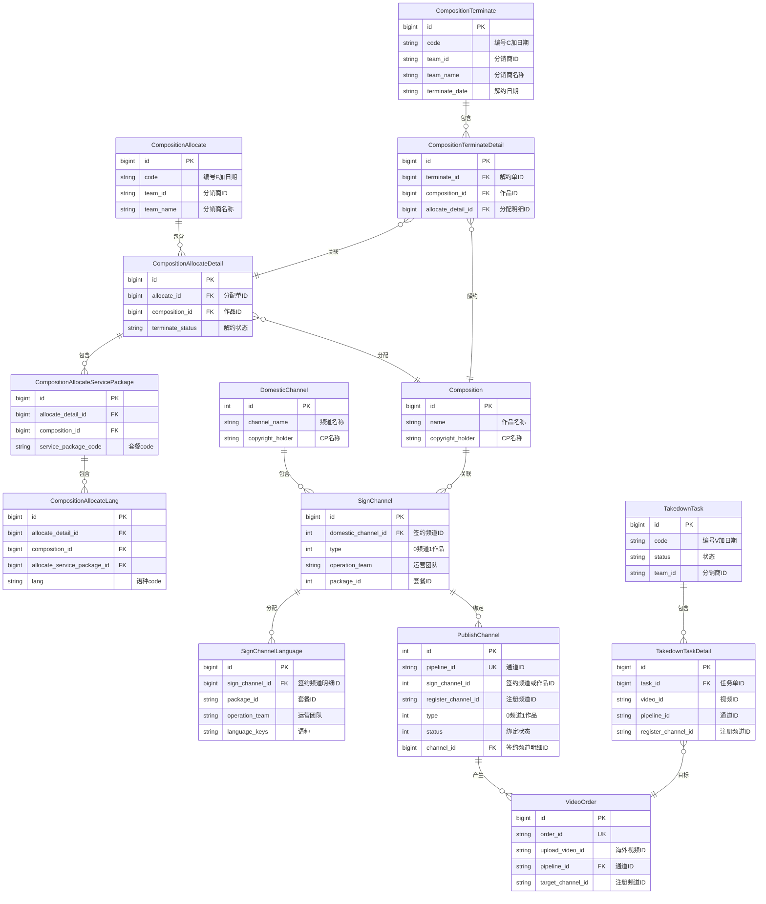

### 0.3 pipeline_id 跨系统关联说明

**pipeline_id 是连接AMS与结算系统/分发系统的核心桥梁：**

| 系统 | 表 | pipeline_id 作用 | 关联数据 |
|------|-----|------------------|----------|
| **AMS** | `ams_publish_channel` | 生成并存储 | 作品/频道ID + 注册频道ID |
| **分发系统** | `pipeline` | 同步存储 | 签约内容 + 目标频道 |
| **分发系统** | `video_order` | 关联视频订单 | 一个 pipeline_id 下可有多条视频订单 |
| **分发系统** | `video` | 关联视频源 | 视频归属于某个通道 |
| **结算系统** | `youtube_video_pipeline` | 关联YouTube视频 | 通过 pipeline_id 获取 video_id |
| **结算系统** | `facebook_video_pipeline` | 关联Facebook视频 | 通过 pipeline_id 获取 video_id |

**pipeline_id 的业务含义：**

```
pipeline_id = 作品/频道 + 注册频道 的唯一绑定关系

示例：
作品《统治全球》(id=100) + 注册频道 UCxxxx → pipeline_id = "abc123def456"
作品《统治全球》(id=100) + 注册频道 UCyyyy → pipeline_id = "ghi789jkl012"

一个作品绑定多个注册频道 → 产生多个 pipeline_id
每个 pipeline_id 下可发布多个视频
```

**视频ID获取链路：**

```
用户输入：作品名 + CP名称 + 注册频道ID
    ↓
AMS查询：SELECT pipeline_id FROM ams_publish_channel WHERE ...
    ↓
pipeline_id 获取成功
    ↓
┌─────────────────────────────────────────────┐
│  根据平台选择查询目标：                        │
│  ├─ 结算系统YT：youtube_video_pipeline        │
│  ├─ 结算系统FB：facebook_video_pipeline       │
│  └─ 分发系统：video_order                     │
└─────────────────────────────────────────────┘
    ↓
获取所有 video_id
```

### 0.4 关键关系说明

#### CP → 作品（1:N）

一个CP（版权方）可以拥有多部作品。作品通过 `copyright_holder` 字段关联到CP名称。不同CP可能有同名作品，因此系统中作品的唯一性通过「作品名称 + CP名称」组合确定。

```
CP: XX影视（公司型） ─┬─ 作品《统治全球》
                     ├─ 作品《晚安好梦》
                     └─ 作品《破晓之战》

CP: 张三（个人型） ───── 作品《独行侠》
```

#### 签约频道 → 注册频道（1:N）

签约频道是国内侧的合约实体，一个签约频道可以绑定多个海外注册频道。映射关系记录在 `ams_publish_channel` 表中，`status=1`表示绑定状态。

```
签约频道A（国内） ─┬─ 注册频道X（YouTube UCxxxx）
                  ├─ 注册频道Y（YouTube UCyyyy）
                  └─ 注册频道Z（YouTube UCzzzz）
```

#### 注册频道 → 视频（1:N）

每个注册频道下发布了多个视频。视频通过 `publish_channel`（即注册频道ID）关联到频道。**海外视频ID**（如YouTube的11位视频ID `dQw4w9WgXcQ`）是平台唯一标识，存储在 `source_video_id` 字段，是下架操作的最小执行单元。分发系统内部另有 `video_id` 字段（格式`V+数字`）作为主键。需求中导入/显示的"视频ID"均指海外视频ID。

#### 分销商 → 分配单 → 作品

AMS通过分配单将作品的运营权授予分销商。分配维度为：**分销商 + 作品 + 套餐 + 语种**。解约时通过解约单反向解除运营关系。

```
分销商A ─┬─ 分配单F2603180001
           │       ├─ 作品《统治全球》 + 全套餐 + 英语
           │       └─ 作品《晚安好梦》 + 精选套餐 + 西语
           │
           └─ 解约单C2603180001
                   └─ 作品《统治全球》（解约 → 触发下架）
```

#### 运营团队 → 注册频道（1:N）

运营团队是公司内部运营团队，直接与注册频道绑定，一个运营团队可运作多个注册频道。关联关系记录在 `sign_channel_language` 表中。

```
海外运营1组
│
├─ 注册频道X（UCxxxx）─ 英语视频
│     ├─ 视频 dQw4w9WgXcQ
│     └─ 视频 xVrJ8DxECkg
│
├─ 注册频道Y（UCyyyy）─ 西语视频
│     └─ 视频 def98765432
│
└─ 注册频道Z（UCzzzz）─ 英语视频
      └─ 视频 jkl55667788

海外运营2组
│
├─ 注册频道W（UCwwww）─ 日语视频
│     └─ 视频 mno99887766
│
└─ 注册频道V（UCvvvv）─ 韩语视频
      └─ 视频 pqr44556677

─────────────────────────────────────────
运营团队直接绑定注册频道（1:N），与签约频道无直接关系
运营团队信息用于下架任务明细的导出和数据分析，页面不展示
```

#### 完整链路示例：从CP到视频

以下示例展示一个CP的完整实体层级关系，即从版权方到最终可执行下架的视频ID的全链路：

```
CP: XX影视
│
├─ 作品《统治全球》
│     │
│     ├─ 签约频道A（国内合约实体）
│     │     │
│     │     ├─ 注册频道X（YouTube UCxxxx）
│     │     │     ├─ 视频 dQw4w9WgXcQ  ← 可下架
│     │     │     ├─ 视频 xVrJ8DxECkg  ← 可下架
│     │     │     └─ 视频 abc12345678  ← 可下架
│     │     │
│     │     └─ 注册频道Y（YouTube UCyyyy）
│     │           ├─ 视频 def98765432  ← 可下架
│     │           └─ 视频 ghi11223344  ← 可下架
│     │
│     └─ 签约频道B（国内合约实体）
│           │
│           └─ 注册频道Z（YouTube UCzzzz）
│                 └─ 视频 jkl55667788  ← 可下架
│
└─ 作品《晚安好梦》
      │
      └─ 签约频道C（国内合约实体）
            │
            └─ 注册频道W（YouTube UCwwww）
                  ├─ 视频 mno99887766  ← 可下架
                  └─ 视频 pqr44556677  ← 可下架

─────────────────────────────────────────
若对CP「XX影视」的作品《统治全球》发起下架：
→ 展开后命中 6 个视频ID（3+2+1）
→ 涉及 2 个签约频道、3 个注册频道
```

#### 完整链路示例：分销商与作品的分配关系

分销商维度是横向的分配关系，与CP→视频的纵向层级独立。同一部作品可以被分配给多个分销商，解约时只影响对应分销商的视频：

```
分销商A
│
├─ 分配单 F2603180001
│     ├─ 《统治全球》 + 全套餐 + 英语
│     │     └─ 运营团队: 海外运营1组
│     └─ 《晚安好梦》 + 精选套餐 + 西语
│           └─ 运营团队: 海外运营2组
│
└─ 解约单 C2603180001
      └─ 《统治全球》（解约 → 触发下架）

分销商B
│
└─ 分配单 F2603180002
      └─ 《统治全球》 + 全套餐 + 日语
            └─ 运营团队: 海外运营3组

─────────────────────────────────────────
同一部《统治全球》被分配给了分销商A和B：
→ 分销商A解约 → 只下架分销商A运营频道下的视频
→ 分销商B未解约 → 其频道下的视频不受影响
```

### 0.5 视频下架中的实体链路

视频下架的核心链路是：从作品层级向下展开，最终定位到每一个具体的视频ID。

**按作品创建下架任务的展开路径：**

```
作品《统治全球》（ams_composition）
  └─ 签约频道A（domestic_channel）
       └─ 发布通道（ams_publish_channel, status=1）
            ├─ 注册频道X（UCxxxx）
            │     ├─ 视频 dQw4w9WgXcQ → 加入下架明细
            │     ├─ 视频 xVrJ8DxECkg → 加入下架明细
            │     └─ 视频 abc12345678 → 已有执行中任务，跳过
            └─ 注册频道Y（UCyyyy）
                  └─ 视频 def98765432 → 加入下架明细
```

**按视频ID创建下架任务的校验路径：**

```
导入记录：视频ID=dQw4w9WgXcQ + 注册频道=UCxxxx + 作品=统治全球 + CP=XX影视
  └─ 校验作品存在性（ams_composition）
  └─ 校验CP下作品存在性（ams_composition）
  └─ 校验注册频道分配权限（sign_channel_language）
  └─ 校验视频在频道内存在性（ams_publish_video）
  └─ 校验是否已有执行中任务（video_takedown_task_detail）
```

---

## 一、背景

### 1.1 业务背景

当前业务SOP中，当版权方授权到期解约后，内外部运营需终止相关片单的发布并对历史发布视频进行下架处理。现有流程高度依赖人工协同：客服通过钉钉OA通知运营部门下架视频，总编室整理片单与分销商的对应关系后由客服通知分销商完成下架。

涉及三类业务场景：
- **场景1：上游版权解约** — 版权方合约到期或解约，需下架内外部全渠道视频
- **场景2：分销商解约** — 分销商合作终止，需下架该分销商渠道下的授权视频
- **场景3：临时调整** — 突发版权纠纷、上线时间变更等，需紧急下架或调整视频私享状态

### 1.2 现有处理流程

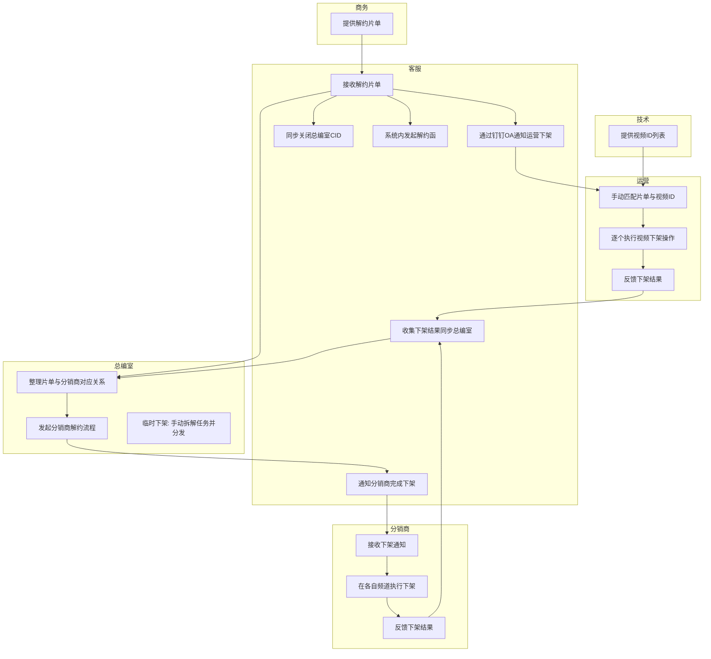

**各角色痛点：**

| 角色 | 职责 | 痛点 |
|------|------|------|
| 商务 | 提供解约片单 | 片单格式非标准化，信息不完整 |
| 客服 | 发起流程、通知各方、收集结果 | 信息传递链路最长，需同时对接运营+总编室+分销商，存在漏传/延迟风险 |
| 总编室 | 整理片单与分销商映射、处理临时下架 | 手动拆解任务，无系统支撑；临时下架需求来自非结构化通知（钉钉/企微），响应慢 |
| 技术 | 提供视频ID | 人工导出视频ID，无自动关联机制 |
| 运营 | 匹配视频ID并执行下架 | OA流程未与视频ID绑定，需手动匹配片单→通道→视频ID，操作繁琐易错 |
| 分销商 | 在自有频道执行下架 | 内外部处理动作不一致，存在“内部已下架、外部仍播放”的合规漏洞 |

### 1.3 目标处理流程

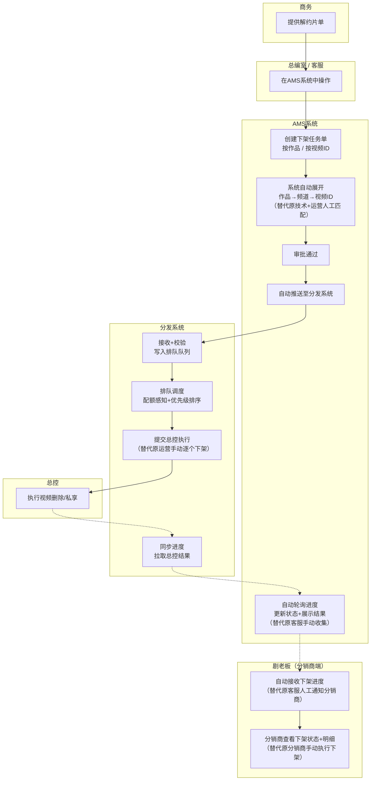

**原有角色去向：**

| 原角色 | 现有流程职责 | 目标流程去向 |
|-------|------------|------------|
| 商务 | 提供解约片单 | **保留**，仍由商务提供片单触发流程 |
| 客服 | 发起OA流程、通知各方、收集结果 | **转为AMS操作员**，在系统内创建任务单+审批，进度由系统自动轮询，不再手动收集 |
| 总编室 | 整理片单与分销商映射、拆解临时下架 | **转为AMS操作员**，片单→视频ID映射由系统自动展开，不再手动拆解 |
| 技术 | 人工导出视频ID列表 | **消除**，系统自动按 作品→签约频道→注册频道→视频 链路展开，无需人工介入 |
| 运营 | 手动匹配视频ID并逐个执行下架 | **消除**，Dispatcher自动排队调度 + 总控批量执行，无需人工操作 |
| 分销商 | 接收通知后在各自频道手动下架 | **转为剧老板查看者**，通过MQ自动接收下架结果，在剧老板系统查看状态明细 |

**现有流程 vs 目标流程对比：**

| 对比维度 | 现有流程 | 目标流程 |
|---------|---------|--------|
| 任务创建 | 客服通过钉钉OA手动通知 | 总编室/客服在AMS系统创建任务单 |
| 视频ID匹配 | 技术导出+运营手动匹配 | 系统自动展开：作品→签约频道→注册频道→视频ID |
| 审批流程 | 无系统化审批 | AMS内置审批，状态机驱动 |
| 执行方式 | 运营手动逐个执行下架 | Dispatcher自动排队调度，总控批量执行 |
| 配额管理 | 无感知，超配额就失败 | Dispatcher配额感知，智能排队+部分执行 |
| 进度反馈 | 客服手动收集各方结果 | AMS定时轮询，实时展示下架状态 |
| 分销商通知 | 客服人工通知+分销商手动下架 | MQ自动同步剧老板，分销商仅查看 |
| 参与人数 | 6个角色协同，信息链路长 | 2个人工角色（商务+总编室/客服）+ 3个系统自动化 |
| 处理时效 | 天级（人工流转） | 分钟级（系统自动执行） |

### 1.4 技术现状

- **AMS（silverdawn-ams-server）**：资产管理系统，Spring Boot + MyBatis Plus + RocketMQ，已有作品管理、频道管理、内容分配、内容解约等模块
- **分发系统（dispatcher-server）**：排队调度系统，DDD + PowerJob + Feign，已有视频订单调度、总控交互能力
- **总控（Control Server）**：外部服务，通过 Feign 客户端 `ControlRest` 调用（地址 `${external.url.control}`，Bearer Token 认证），已具备视频删除（videoDelete）、视频私享（changeYtRange）、API配额查询、排队查询、任务详情查询能力
- AMS 和 Dispatcher 不是同一个 DB，跨系统通信需通过 MQ/HTTP
- YouTube API 配额限制 5000 次/天，单视频下架消耗 50 配额

### 1.5 总控已有能力（无需改造）

| 接口 | 入参 | 返回值 |
|------|------|--------|
| `controlRest.videoDeleted` | sourceDataId, clientId, taskType, executeMode, weight, orderId, bizParam(channelId, videoId) | VideoDeleteFlagDTO |
| `controlRest.changePrivacy` | sourceDataId, clientId, taskType, executeMode, weight, bizParam(uploadType, channelId, videoId, privacy="PRIVATE") | 同步结果 |
| `controlRest.queryYoutubeApiQuota` | 无 | YoutubeApiQuotaDto(usedCount, total) |
| `controlRest.queryQueueSituation` | bizIdList | ControlQueueSituationDto(bizId, currentQueueIndex, totalQueueSize, executeStatus) |
| `controlRest.queryTaskDetail` | bizId | ControlTaskDetailsDto(bizId, sourceDataId, executeStatus, executeProgress, executeResult) |

---

## 二、问题

| 编号 | 问题 | 说明 |
|------|------|------|
| P1 | **依赖人工协同，效率低且易出错** | 多个关键动作依赖钉钉OA、钉钉通知传递信息，信息传递链路过长，存在漏传、误读、延迟执行风险。OA流程未与视频ID自动绑定，运营需手动匹配片单与通道视频ID，操作繁琐且易错。 |
| P2 | **系统能力割裂，缺乏统一触发与执行入口** | 解约流程分散在多个系统（OA、CRM、AMS），各系统间无自动触发接口。"发起解约"与"下架视频"动作孤立，未形成以片单为核心的数据联动链路。 |
| P3 | **缺少集中管理的视频处理看板** | 无法统一查看哪些片单需下架、下架进度如何、涉及哪些海外频道、版权方/分销商处理状态。 |
| P4 | **下架动作无标准化流程，内外部协同混乱** | 临时下架需求来自非结构化通知（钉钉消息、企微），总编室需手动拆解并分发任务。内部运营与外部分销商处理动作不一致，存在"内部已下架、外部仍可播放"的合规漏洞。 |
| P5 | **缺乏优先级排队和配额预警机制** | 单日视频处理上限5000（YouTube API配额），无系统级的排队策略和配额感知，高优先级任务可能被低优先级阻塞，临近配额时无告警。 |
| P6 | **下架结果无自动校验和追溯** | 全链路操作无系统留痕，缺乏实时合规监测与异常预警机制，下架完成后无法自动验证结果。 |

---

## 三、方案

### 3.1 整体架构

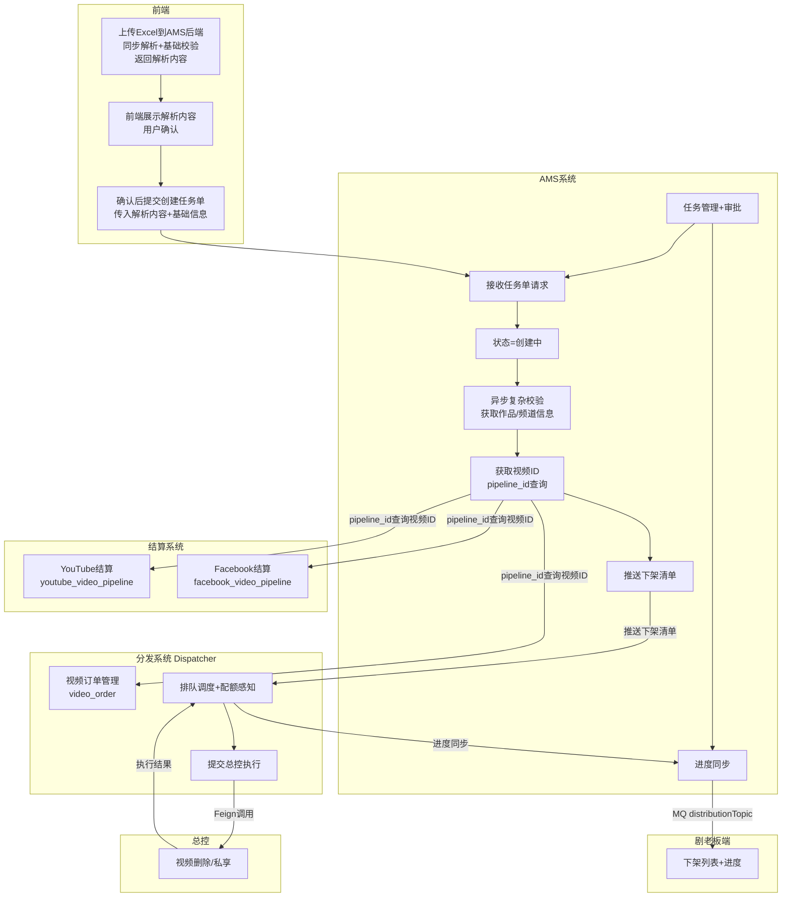

**架构说明：**

| 组件 | 职责 | 关键接口/数据 |
|------|------|--------------|
| **前端** | Excel文件上传、预览解析内容、任务单创建入口 | AMS上传接口（同步解析返回内容）、创建任务单接口 |
| **AMS** | Excel解析+基础校验、任务单管理、审批、视频ID获取、进度同步 | 上传接口同步返回解析内容，创建时接收前端提交的解析数据；通过 pipeline_id 调用分发系统/结算系统获取视频ID |
| **分发系统 Dispatcher** | 视频订单管理、排队调度、配额感知、提交执行 | `video_order.upload_video_id` 通过 `pipeline_id` 关联；HTTP接口 `/api/takedown/push` |
| **结算系统YT** | YouTube视频结算数据 | `youtube_video_pipeline.video_id` 通过 `pipeline_id` 关联 |
| **结算系统FB** | Facebook视频结算数据 | `facebook_video_pipeline.video_id` 通过 `pipeline_id` 关联 |
| **总控** | 视频删除、视频私享执行 | Feign接口 `videoDeleted/changePrivacy` |
| **剧老板端** | 下架列表展示、进度展示 | MQ消费 `distributionTopic` |

**完整流程说明：**

| 阶段 | 步骤 | 说明 |
|------|------|------|
| **① Excel上传** | 前端上传至AMS后端 | 调用AMS上传接口，后端同步解析Excel+基础校验，直接返回解析内容（validRecords+invalidRecords） |
| **①-a 前端展示** | 前端展示解析内容 | 前端将解析内容展示到页面，用户确认后点击提交 |
| **② 创建任务单** | 前端提交创建 | 前端将解析内容+基础信息提交至create-by-composition/create-by-video-id接口，创建任务单，状态=创建中 |
| **③ 异步校验** | AMS异步处理 | 异步执行复杂校验（作品存在性、CP匹配、频道绑定状态等）、解析作品/频道信息 |
| **④ 获取视频ID** | pipeline_id查询 | 根据作品+注册频道获取pipeline_id，再查询视频ID |
| **⑤ 推送下架** | AMS→Dispatcher | 审批通过后，推送下架清单到Dispatcher |
| **⑥ 执行下架** | Dispatcher→总控 | 排队调度后提交总控执行 |
| **⑦ 进度同步** | Dispatcher→AMS | 执行结果同步回AMS |
| **⑧ 剧老板通知** | AMS→剧老板 | MQ消息通知进度更新 |

**视频ID获取链路：**

```
AMS任务单创建/展开
    ↓
1. 根据作品名+CP+注册频道ID 获取 pipeline_id
   SELECT pipeline_id FROM ams_publish_channel WHERE ...
    ↓
2. 根据 pipeline_id 获取视频ID
   ├─ 分发系统: SELECT upload_video_id FROM video_order WHERE pipeline_id = ?
   ├─ 结算系统YT: SELECT video_id FROM youtube_video_pipeline WHERE pipeline_id = ?
   └─ 结算系统FB: SELECT video_id FROM facebook_video_pipeline WHERE pipeline_id = ?
    ↓
3. 汇总所有视频ID，写入任务明细
```

### 3.2 AMS→Dispatcher 通信方案（待确认）

| 方案 | 模式 | 优点 | 缺点 |
|------|------|------|------|
| A | MQ 双向通信 | 解耦彻底、异步削峰 | 双方各需 Producer+Consumer |
| B | HTTP 推送+Dispatcher 回调 AMS | 实时性好、链路清晰 | AMS 需暴露回调接口 |
| C | HTTP 推送+AMS 主动轮询 | AMS 侧最简单、无需暴露接口 | 轮询有延迟、增加 Dispatcher 查询压力 |

#### 方案A：MQ双向通信

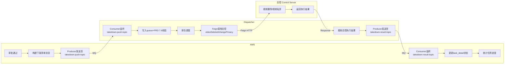

- AMS新增：Producer（推送清单）+ Consumer（接收结果）
- Dispatcher新增：Consumer（接收清单）+ Producer（回传结果）
- 新增2个Topic：`takedown-push-topic`、`takedown-result-topic`

#### 方案B：HTTP推送+Dispatcher回调AMS

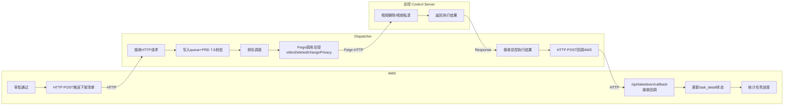

- AMS新增：HTTP客户端（推送清单）+ 回调接口`/api/takedown/callback`（接收结果）
- Dispatcher新增：接收接口 + HTTP客户端（回调AMS）
- 无需新增Topic

#### 方案C：HTTP推送+AMS主动轮询(最终方案)

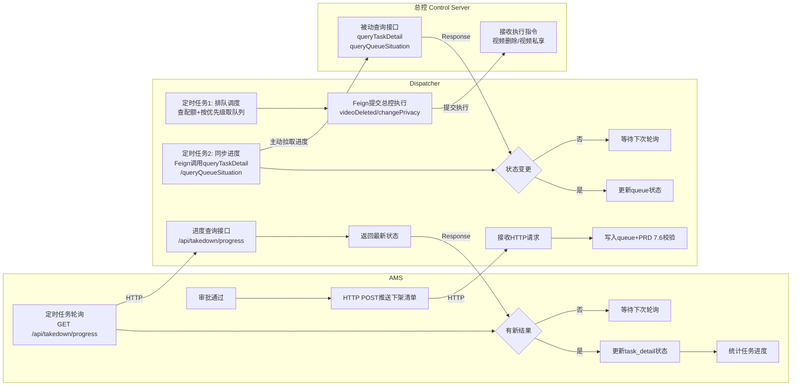

- AMS新增：HTTP客户端（推送清单）+ 定时轮询任务
- Dispatcher新增：接收接口 + 定时轮询总控任务 + 进度查询接口`/api/takedown/progress`
- 无需新增Topic，AMS无需暴露接口，全链路基于HTTP轮询

### 3.3 排队调度与执行设计方案

> 基于方案C（HTTP推送+AMS主动轮询），描述从 AMS 审批通过到总控执行完成的全链路设计。

#### 3.3.1 全链路流程图

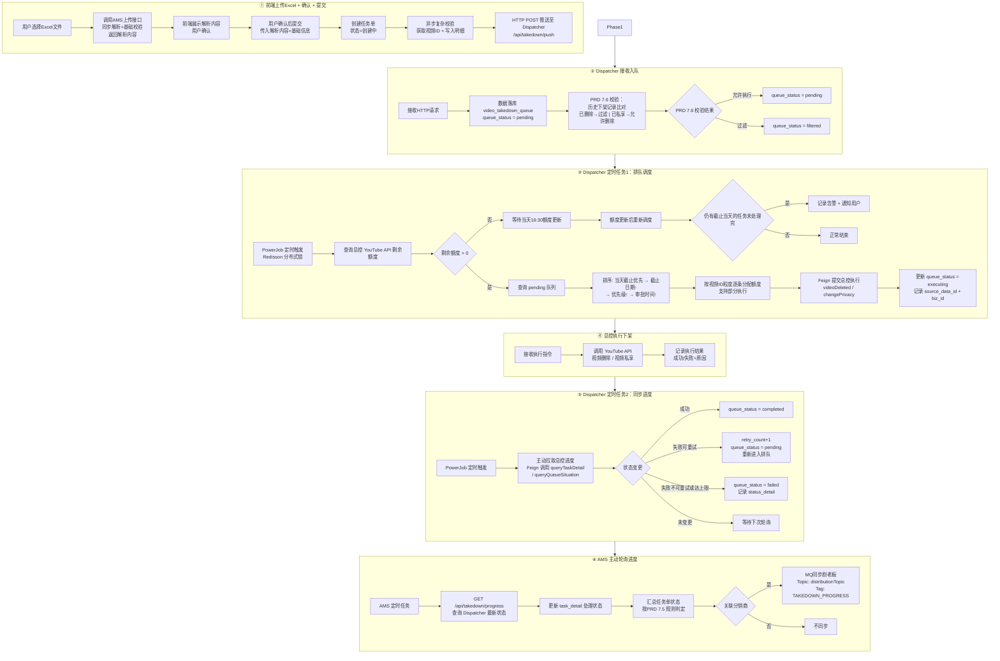

#### 3.3.2 AMS → Dispatcher：推送下架清单

| 项目 | 说明 |
|------|------|
| 触发时机 | 任务单审批通过，状态变为“待处理”后立即推送 |
| 通信方式 | HTTP POST，AMS 作为客户端调用 Dispatcher 接口 |
| 接口地址 | `POST /api/takedown/push` |
| 推送内容 | 任务单ID、任务明细列表（视频ID + 注册频道ID + 处理方式 + 截止日期 + 优先级） |
| 推送粒度 | 按任务单推送，一次推送包含该任务单下所有视频明细 |
| 失败处理 | HTTP 调用失败时重试（Guava Retryer，最多3次，间隔2秒），全部失败后记录异常日志+告警 |

**推送报文示例：**

```json
{
  "taskId": 1234567890,
  "items": [
    {
      "taskDetailId": 111,
      "videoId": "dQw4w9WgXcQ",
      "channelId": "UCxxxxxx",
      "processMethod": "VIDEO_DELETE",
      "deadlineDate": "2026-03-20",
      "takedownReason": "LICENSE_EXPIRE",
      "priority": 1,
      "approveTime": "2026-03-18T10:30:00"
    }
  ]
}
```

#### 3.3.3 Dispatcher 接收入队 + PRD 7.6 校验

| 项目 | 说明 |
|------|------|
| 接收方式 | HTTP 接口接收，数据落库至 `video_takedown_queue` 表 |
| 初始状态 | `queue_status = pending` |
| PRD 7.6 校验 | 检查历史下架记录，避免无效执行： |

| 历史处理方式 | 本次处理方式 | 结果 |
|------------|----------|------|
| 已删除 | 私享 | ✖ 过滤（已删除无法私享） |
| 已私享 | 删除 | ✔ 允许（私享→删除支持） |
| 已删除 | 删除 | ✖ 过滤（已处理） |
| 已私享 | 私享 | ✖ 过滤（已处理） |
| 无记录 | 任意 | ✔ 新记录，允许执行 |

#### 3.3.4 Dispatcher 排队调度机制（定时任务1）

Dispatcher 通过 PowerJob 定时任务触发排队调度，核心逻辑分三步：**查额度 → 取队列 → 提交总控**。

**第一步：查询额度**

| 项目 | 说明 |
|------|------|
| 额度来源 | 总控系统 YouTube API 额度查询接口 `controlRest.queryYoutubeApiQuota()` |
| 每日上限 | 5000条视频/天 |
| 额度更新时间 | 每天当天16:30（YouTube API 配额重置时间） |
| 额度为0 | 记录日志+告警，跳过本次调度，等待当天16:30额度更新；优先保证截止当天的任务单，当天未处理完截止当天的任务则通知用户 |

**第二步：取队列排序**

从 `video_takedown_queue` 中查询 `queue_status = pending` 的记录，按以下规则排序：

| 优先级 | 排序维度 | 规则 | SQL表达 |
|:---:|---------|------|------|
| 1 | 是否当天截止 | 当天截止优先 | `(deadline_date = CURDATE()) DESC` |
| 2 | 截止执行日期 | 升序（近→远） | `deadline_date ASC` |
| 3 | 下架原因优先级 | 1 > 2 > 3 > 4 > 5 > 6 | `priority ASC` |
| 4 | 审批通过时间 | 升序（先→后） | `approve_time ASC` |

**第三步：额度分配 + 提交总控执行**

按视频ID粒度逐条分配额度，支持**部分执行**：

```
排队序列：[A-800条] [B-1200条] [C-3500条] [D-2000条]
今日额度：5000条

分配过程：
  A: 800条 → 全部执行（剩余4200）
  B: 1200条 → 全部执行（剩余3000）
  C: 3500条 → 执行3000条，剩余500条保持pending（额度耗尽）
  D: 2000条 → 全部暂停，等待当天16:30额度更新
```

每条视频提交总控时：

| 处理方式 | Feign接口 | 说明 |
|---------|---------|------|
| 视频删除 | `controlRest.videoDeleted(videoId)` | 调用YouTube API删除视频 |
| 视频私享 | `controlRest.changePrivacy(videoId, "private")` | 调用YouTube API设置视频私享 |

提交后更新 queue 记录：`queue_status = executing`，记录 `source_data_id`、`biz_id`、`execute_time`。

#### 3.3.5 Dispatcher 进度同步机制（定时任务2）

> 总控是被动方，仅提供查询接口；Dispatcher 主动拉取进度。

| 项目 | 说明 |
|------|------|
| 触发方式 | PowerJob 定时任务，与排队调度任务**独立运行** |
| 查询对象 | `video_takedown_queue` 中 `queue_status = executing` 的记录 |
| 总控接口 | `controlRest.queryTaskDetail(bizId)` —— 查询单个任务执行状态 |
|  | `controlRest.queryQueueSituation()` —— 查询总控队列整体情况 |
| 状态更新 | 根据总控返回结果更新 queue 状态： |

| 总控返回 | queue状态变更 | 说明 |
|---------|------------|------|
| 执行成功 | `executing → completed` | 记录complete_time |
| 执行失败（可重试） | `executing → pending` | retry_count+1，重新进入排队 |
| 执行失败（不可重试/达上限） | `executing → failed` | 记录fail_reason |
| 未完成 | 保持 `executing` | 等待下次轮询 |

#### 3.3.6 AMS 主动轮询进度

| 项目 | 说明 |
|------|------|
| 触发方式 | AMS 定时任务（建议每30秒一次） |
| 查询接口 | `GET /api/takedown/progress?taskId={taskId}` |
| 查询范围 | AMS 查询状态为“处理中”的任务单，逐个轮询 Dispatcher 进度 |
| 返回内容 | Dispatcher 返回该任务下所有 queue 记录的最新状态 |
| AMS处理 | 更新 `video_takedown_task_detail` 处理状态，汇总任务单状态（按PRD 7.5 规则） |
| 停止条件 | 任务单所有明细均已终态（成功/失败），状态变为“已完成”后停止轮询 |

#### 3.3.7 AMS → 剧老板：同步下架进度

> 剧老板（distribution-server）是分销商端系统，通过 MQ 接收 AMS 推送的下架进度，供分销商查看状态明细。

**通信架构：**

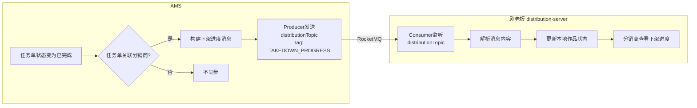

**消息配置：**

| 项目 | 说明 |
|------|------|
| Topic | `distributionTopic`（剧老板现有Topic，复用） |
| Tag | `TAKEDOWN_PROGRESS`（新增） |
| 消费者组 | 剧老板现有消费者组 |
| 消费者类 | `TargetChannelBindConsumer`（扩展支持新Tag） |

**消息内容：**

```json
{
  "taskId": 1234567890,
  "taskCode": "V2603180001",
  "teamId": "team_001",
  "items": [
    {
      "videoId": "dQw4w9WgXcQ",
      "channelId": "UCxxxxxx",
      "amsCompositionId": 1001,
      "processMethod": "VIDEO_DELETE",
      "status": "completed",
      "processTime": "2026-03-18T14:30:00"
    }
  ],
  "summary": {
    "total": 10,
    "completed": 8,
    "failed": 1,
    "processing": 1
  }
}
```

**剧老板处理逻辑：**

> **推送触发时机：** 仅在任务单状态变为“已完成”时推送，而非每次进度更新都推送。推送维度为作品+海外频道，推送目标为对应剧老板账号。

| 步骤 | 说明 |
|------|------|
| 1. 消息解析 | 解析 `TAKEDOWN_PROGRESS` Tag 的消息内容 |
| 2. 匹配作品 | 根据 `amsCompositionId` 匹配本地 `Composition` 表 |
| 3. 更新状态 | 更新 `Composition.terminateDate`、`Composition.operated` 字段 |
| 4. 记录明细 | 可选：写入下架进度明细表供前端展示 |

**剧老板相关表结构：**

| 表名 | 用途 | 关键字段 |
|------|------|---------|
| `composition` | 作品表 | `ams_composition_id`（AMS作品ID）、`team_id`（分销商ID）、`terminate_date`（解约日期）、`operated`（运营状态） |
| `video_composition` | 视频作品关联表 | `video_id`、`channel_id`、`composition_id`、`ams_composition_id` |
| `target_channel` | 目标频道表 | `channel_id`、`team_id`、`bind_status`（绑定状态）、`terminate_date` |

**剧老板现有MQ消费扩展：**

剧老板现有 `TargetChannelBindConsumer` 已支持以下Tag：

| Tag | 说明 |
|------|------|
| `CHANNEL_BIND` | 频道绑定 |
| `CHANNEL_BIND_BATCH` | 批量频道绑定 |
| `CHANNEL_TERMINATE` | 频道解约 |
| `COMPOSITION_BIND_BATCH` | 批量作品绑定 |
| `COMPOSITION_TERMINATE_BATCH` | 批量作品解约 |
| `TAKEDOWN_PROGRESS` | **新增**：下架进度同步 |

#### 3.3.8 额度管理机制

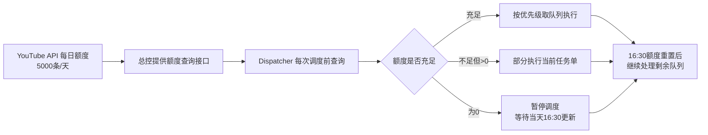

| 配置项 | 值 | 说明 |
|--------|------|------|
| 每日最高阈值 | 5000条视频 | YouTube API每日配额上限 |
| 额度更新时间 | 每天当天16:30 | YouTube API配额重置时间 |
| 分配粒度 | 视频ID级别 | 按单条视频消耗额度，支持任务单级别部分执行 |
| 额度查询时机 | 每次调度前 + 每天当天16:30 | 双重查询确保额度准确 |
| 截止当天保障 | 额度不足时优先处理截止当天的任务 | 当天未处理完截止当天的任务则通知用户 |

**预警机制：**

| 项目 | 说明 |
|-----|------|
| 触发条件 | 额度重试后仍未恢复，且存在截止时间为当天的未处理任务 |
| 告警方式 | 钉钉通知 |
| 告警组成员 | 文健、常亚菲、尚利帆、AMS项目沟通群 |
| 告警文案 | 【任务单编号】【处理方式】【下架原因】原定【YYYY-MM-DD】完成视频下架任务，受配额用量不足影响，无法完成该任务，请前往（URL地址）查看 |
| 任务处理 | 额度恢复后依然执行，不因告警而终止任务 |

### 3.4 功能清单（操作类）

| 编号 | 功能 | 所属系统 |
|------|------|---------|
| F1 | 按作品创建任务单 | AMS |
| F2 | 按视频ID创建任务单 | AMS |
| F3 | 任务单审批 | AMS |
| F4 | 任务单编辑与删除 | AMS |
| F5 | 导出文件 | AMS |
| F6 | 创建解约单（含视频下架联动） | AMS |
| F7 | Dispatcher 接收+PRD 7.6 校验 | Dispatcher |
| F8 | 排队调度+提交总控执行 | Dispatcher |
| F9 | 总控回调处理+进度同步 AMS | Dispatcher |
| F10 | 剧老板端数据同步 | AMS→剧老板 |

### 3.5 详细业务流程图

<!-- F1-F10 详细流程图见下方 -->

#### 视频ID与注册频道ID — 参数传递全链路

> 分发系统中下架和转私享都依赖**海外视频ID**和**注册频道ID**，以下为这两个关键参数在F1-F10中的传递和转换过程。
>
> **核心链路：** 视频ID的获取需要通过 `pipeline_id` 中转：
> 1. 先在AMS用作品名+CP+注册频道ID获取 `pipeline_id`
> 2. 再用 `pipeline_id` 去结算系统（YT/FB）或分发系统获取视频ID

| 阶段 | 系统 | 海外视频ID（video_id） | 注册频道ID（register_channel_id） | pipeline_id | 来源/转换说明 |
|------|------|-----------|-----------|-------------|-------------|
| F1 导入 | AMS | — | Excel导入 `注册频道ID`（UCxxxxxx） | — | 用户上传Excel，仅含注册频道ID |
| F1 展开 | AMS | 由pipeline_id展开：查结算系统/分发系统 | 作为获取pipeline_id的查询条件 | 先在AMS获取：作品名+CP+注册频道ID | 注册频道ID → pipeline_id → 海外视频ID（1:N） |
| F1/F2 写入明细 | AMS | → `task_detail.video_id` | → `task_detail.register_channel_id` | → `task_detail.pipeline_id` | 写入AMS明细表 |
| F2 导入 | AMS | Excel直接导入（11位海外视频ID） | Excel直接导入 `注册频道ID`（UCxxxxxx） | 通过作品名+CP+注册频道ID获取 | 用户上传Excel，同时包含两个参数 |
| F3 推送 | AMS→Dispatcher | `task_detail.video_id` → 推送字段`videoId` | `task_detail.register_channel_id` → 推送字段`channelId` | `task_detail.pipeline_id` → 推送字段`pipelineId` | HTTP POST推送，字段名转换 |
| F7 入队 | Dispatcher | 推送`videoId` → `queue.video_id` | 推送`channelId` → `queue.channel_id` | 推送`pipelineId` → `queue.pipeline_id` | 写入Dispatcher队列表 |
| F7 校验① | Dispatcher | `queue.video_id` → 查`video.source_video_id` | — | — | 分发系统存在性校验 |
| F7 校验② | Dispatcher | → `videoPublicCheck`入参`videoId` | `queue.channel_id` → `videoPublicCheck`入参`channelId` | — | 注册频道归属校验 |
| F8 提交总控 | Dispatcher→总控 | `queue.video_id` → `bizParam.videoId` | `queue.channel_id` → `bizParam.channelId` | — | Feign调用总控删除/私享 |
| F9 结果回传 | Dispatcher→AMS | 通过`biz_id`→`queue`→`task_detail_id`定位 | — | — | 按task_detail_id回写AMS明细状态 |
| F10 同步剧老板 | AMS→剧老板 | `task_detail.video_id` → MQ字段`videoId` | `task_detail.register_channel_id` → MQ字段`channelId` | `task_detail.pipeline_id` → MQ字段`pipelineId` | RocketMQ消息 |

> **字段映射说明：** 
> - `pipeline_id` 是连接AMS与结算系统/分发系统的关键桥梁
> - 结算系统中 `youtube_video_pipeline.video_id` 和 `facebook_video_pipeline.video_id` 存储海外视频ID
> - 分发系统中 `video_order.upload_video_id` 存储上传视频ID
> - 这些视频ID通过 `pipeline_id` 与AMS的发布通道关联

---

#### F1：按作品创建任务单（AMS）

> PRD更新：提交后进入“创建中”状态，异步获取视频ID，成功→待审核，失败→创建失败（最多3次重试，间隔5分钟）

**第一阶段（同步）：Excel上传 + 基础校验 + 提交创建**

> **变更说明：** 原流程为“上传→存Redis返回uploadId→轮询预览→提交uploadId创建”，现改为“上传→同步解析+基础校验→直接返回解析内容→前端重新提交内容创建”。去掉uploadId和Redis暂存，复杂校验（作品存在性、CP匹配、注册频道绑定状态）移至第二阶段异步执行。

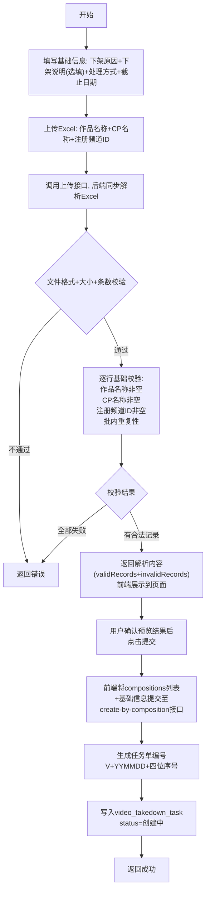

**第二阶段（异步）：获取视频ID + 写入明细**

> **核心逻辑：** 视频ID的获取需要通过 pipeline_id 中转。先用作品名+CP+注册频道ID在AMS获取pipeline_id，再用pipeline_id分别去结算系统（YT和FB）和分发系统获取视频ID。

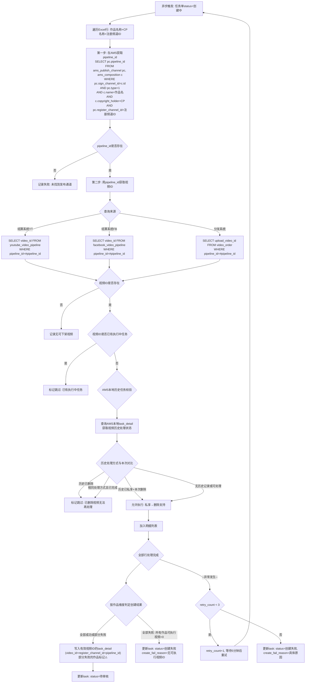

| 节点 | 依赖表 | SQL |
|------|--------|-----|
| 作品名称是否存在 | `ams_composition`（AMS DB） | `SELECT id, name, copyright_holder FROM ams_composition WHERE name = #{name}` |
| CP下作品是否存在 | `ams_composition`（AMS DB） | `SELECT id FROM ams_composition WHERE name = #{name} AND copyright_holder = #{cpName}` |
| 注册频道ID存在性+绑定状态 | `ams_publish_channel`（AMS DB） | `SELECT id FROM ams_publish_channel WHERE register_channel_id = #{channelId} AND status = 1` |
| **获取pipeline_id** | `ams_publish_channel` + `ams_composition`（AMS DB） | `SELECT pc.pipeline_id FROM ams_publish_channel pc, ams_composition c WHERE pc.sign_channel_id = c.id AND pc.type = 1 AND c.name = #{compositionName} AND c.copyright_holder = #{copyrightHolder} AND pc.register_channel_id = #{registerChannelId}` |
| **获取视频ID（结算系统YT）** | `youtube_video_pipeline`（结算系统DB） | `SELECT video_id FROM youtube_video_pipeline WHERE pipeline_id = #{pipelineId}` |
| **获取视频ID（结算系统FB）** | `facebook_video_pipeline`（结算系统DB） | `SELECT video_id FROM facebook_video_pipeline WHERE pipeline_id = #{pipelineId}` |
| **获取视频ID（分发系统）** | `video_order`（分发系统DB） | `SELECT upload_video_id FROM video_order WHERE pipeline_id = #{pipelineId}` |
| 执行中任务检查 | `video_takedown_task_detail`（AMS DB） | `SELECT id FROM video_takedown_task_detail d JOIN video_takedown_task t ON d.task_id = t.id WHERE d.video_id = #{videoId} AND t.status IN ('待处理','处理中')` |
| 二次下架判断 | `video_takedown_task_detail`（AMS DB） | `SELECT process_method, status_detail FROM video_takedown_task_detail WHERE video_id = #{videoId} AND video_status = 'COMPLETED' ORDER BY complete_time DESC LIMIT 1` |
| 写入任务单 | `video_takedown_task`（AMS DB） | `INSERT INTO video_takedown_task (..., status, retry_count) VALUES (..., '创建中', 0)` |
| 写入明细 | `video_takedown_task_detail`（AMS DB） | INSERT |
| 更新状态 | `video_takedown_task`（AMS DB） | `UPDATE video_takedown_task SET status = #{status} WHERE id = #{taskId}` |

> **说明：** 
> - F1按作品创建时，用户输入作品名+CP+注册频道ID，需要先在AMS获取pipeline_id，再跨系统查询视频ID
> - 结算系统存储YouTube和Facebook的视频ID，分发系统存储上传视频ID
> - 跨系统查询通过HTTP接口或数据库只读连接实现

**创建结果判定逻辑（PRD 3.1.6）：**

| 结果类型 | 判定条件 | 任务单状态 | 说明 |
|---------|---------|-----------|------|
| **创建成功** | 所有作品的可执行视频ID > 0 | 待审核 | 正常流转至审核环节 |
| **部分失败** | 部分作品的可执行视频ID = 0，但至少1个作品 > 0 | 待审核 | 详情页-作品处理进度中展示失败作品标记 |
| **创建失败** | 所有作品的可执行视频ID = 0 | 创建失败 | 无可执行视频，支持编辑、删除 |

**部分失败详情展示：** 可执行视频ID=0的作品旁展示：⚠️ 缺少通道关系，无法获取视频ID

**海外频道=0的处理（仅按作品创建/解约单创建）：**

| 场景 | 提交时校验 | 创建时处理 |
|-----|----------|----------|
| **按作品创建** | 批量合并提示：以下作品无绑定海外频道：【作品A】、【作品B】...，是否继续提交？ | 海外频道=0时，无对应通道关系，该作品可执行视频ID=0 |
| **按解约单创建** | 不做校验 | 海外频道=0时，无对应通道关系，该作品可执行视频ID=0 |

**创建失败原因分类：**

| 类型 | 失败原因 | 说明 |
|:---:|---------|------|
| 自动重试 | 网络超时 | 临时网络异常，自动重试 |
| | 接口限流 | 请求频率过高，自动重试 |
| | 服务暂不可用 | 下游服务临时故障，自动重试 |
| 不自动重试 | 无可执行视频ID | 所有作品无绑定海外频道或通道关系不匹配 |
| | 作品不存在 | 数据错误 |
| | 频道权限不足 | 权限配置问题 |

---

#### F2：按视频ID创建任务单（AMS）

> PRD更新：同 F1，提交后进入“创建中”状态，异步校验视频ID有效性

**第一阶段（同步）：Excel上传 + 基础校验 + 提交创建**

> **变更说明：** 同F1，原流程“上传→存Redis返回uploadId→轮询预览→提交uploadId创建”，现改为“上传→同步解析+基础校验→直接返回解析内容→前端重新提交内容创建”。去掉uploadId和Redis暂存。

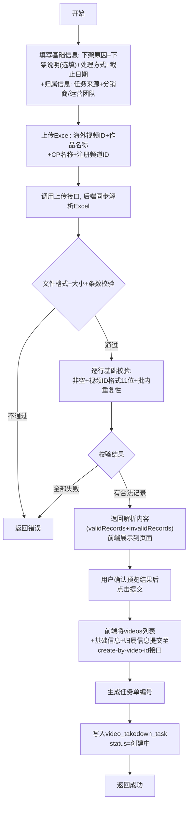

**第二阶段（异步）：校验视频ID有效性 + 写入明细**

> **核心逻辑：** 视频ID的有效性校验需要通过 pipeline_id 中转。先用作品名+CP+注册频道ID在AMS获取pipeline_id，再用pipeline_id去结算系统或分发系统验证视频ID是否存在。

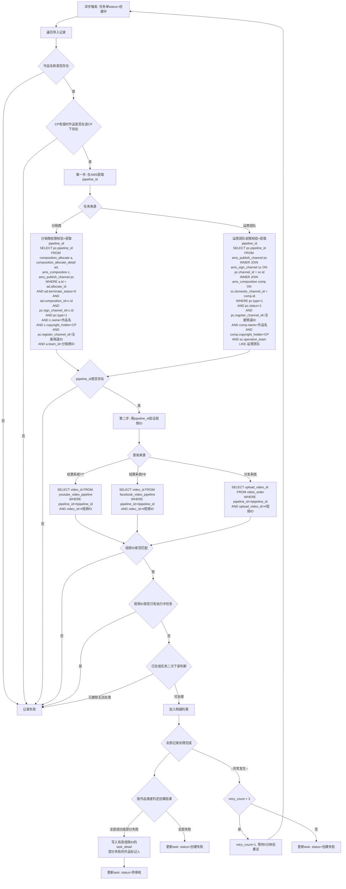

| 节点 | 依赖表 | SQL |
|------|--------|-----|
| **分销商权限校验+获取pipeline_id** | `composition_allocate` + `composition_allocate_detail` + `ams_composition` + `ams_publish_channel`（AMS DB） | `SELECT pc.pipeline_id FROM composition_allocate a, composition_allocate_detail ad, ams_composition c, ams_publish_channel pc WHERE a.id = ad.allocate_id AND ad.terminate_status = 0 AND ad.composition_id = c.id AND pc.sign_channel_id = c.id AND pc.type = 1 AND c.name = #{compositionName} AND c.copyright_holder = #{copyrightHolder} AND pc.register_channel_id = #{registerChannelId} AND a.team_id = #{teamId}` |
| **运营团队权限校验+获取pipeline_id** | `ams_publish_channel` + `ams_sign_channel` + `ams_composition`（AMS DB） | `SELECT pc.pipeline_id FROM ams_publish_channel pc INNER JOIN ams_sign_channel sc ON pc.channel_id = sc.id INNER JOIN ams_composition comp ON sc.domestic_channel_id = comp.id WHERE pc.type = 1 AND pc.status = 1 AND pc.register_channel_id = #{registerChannelId} AND comp.name = #{compositionName} AND comp.copyright_holder = #{copyrightHolder} AND sc.operation_team LIKE CONCAT('%', #{operationTeam}, '%')` |
| **验证视频ID（结算系统YT）** | `youtube_video_pipeline`（结算系统DB） | `SELECT video_id FROM youtube_video_pipeline WHERE pipeline_id = #{pipelineId} AND video_id = #{videoId}` |
| **验证视频ID（结算系统FB）** | `facebook_video_pipeline`（结算系统DB） | `SELECT video_id FROM facebook_video_pipeline WHERE pipeline_id = #{pipelineId} AND video_id = #{videoId}` |
| **验证视频ID（分发系统）** | `video_order`（分发系统DB） | `SELECT upload_video_id FROM video_order WHERE pipeline_id = #{pipelineId} AND upload_video_id = #{videoId}` |
| 其余校验 | 同F1 | 同F1 |

> **说明：** 
> - **分销商权限校验**：分销商与注册频道无直接关系，需通过作品分配关系判断。通过分销商ID+作品名+CP+注册频道ID联合查询获取pipeline_id，若能查到则说明分销商有权限。
> - **运营团队权限校验**：运营团队通过签约频道与注册频道绑定，通过运营团队+作品名+CP+注册频道ID联合查询获取pipeline_id，若能查到则说明运营团队有权限。
> - **视频ID验证**：用户输入的视频ID需要与pipeline_id关联的视频ID匹配，才能确认视频ID有效。
> - 跨系统查询通过HTTP接口或数据库只读连接实现。
> - **创建结果判定**、**部分失败展示**、**创建失败原因分类**：同F1说明。

---

#### F3：任务单审批（AMS）

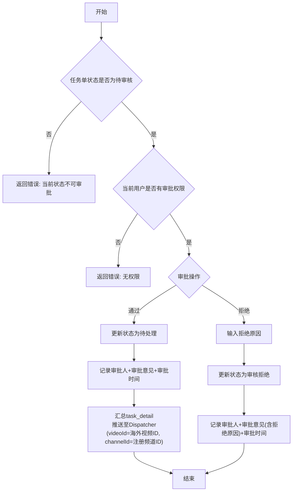

| 节点 | 依赖表 | SQL |
|------|--------|-----|
| 状态校验 | `video_takedown_task`（AMS DB） | `SELECT id, status FROM video_takedown_task WHERE id = #{taskId} AND status = 'PENDING_REVIEW'` |
| 更新状态 | `video_takedown_task`（AMS DB） | `UPDATE video_takedown_task SET status = #{newStatus}, auditor_id = #{auditorId}, audit_opinion = #{opinion}, audit_time = NOW() WHERE id = #{taskId} AND status = 'PENDING_REVIEW'` |

---

#### F4：任务单编辑与删除（AMS）

> PRD更新：编辑/删除现同时支持“审核拒绝”和“创建失败”两种状态；创建失败状态编辑后重新触发创建流程，状态变为“创建中”

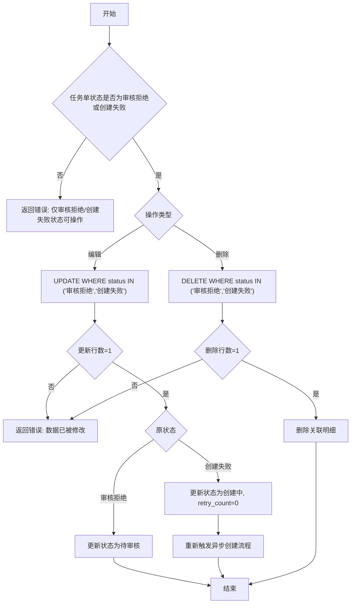

| 节点 | 依赖表 | SQL |
|------|--------|-----|
| 状态校验 | `video_takedown_task`（AMS DB） | `SELECT id, status FROM video_takedown_task WHERE id = #{taskId}` |
| 并发保护编辑 | `video_takedown_task`（AMS DB） | `UPDATE video_takedown_task SET ... WHERE id = #{taskId} AND status IN ('审核拒绝','创建失败')` |
| 并发保护删除 | `video_takedown_task`（AMS DB） | `DELETE FROM video_takedown_task WHERE id = #{taskId} AND status IN ('审核拒绝','创建失败')` |
| 删除明细 | `video_takedown_task_detail`（AMS DB） | `DELETE FROM video_takedown_task_detail WHERE task_id = #{taskId}` |

---

#### F5：导出文件（AMS）

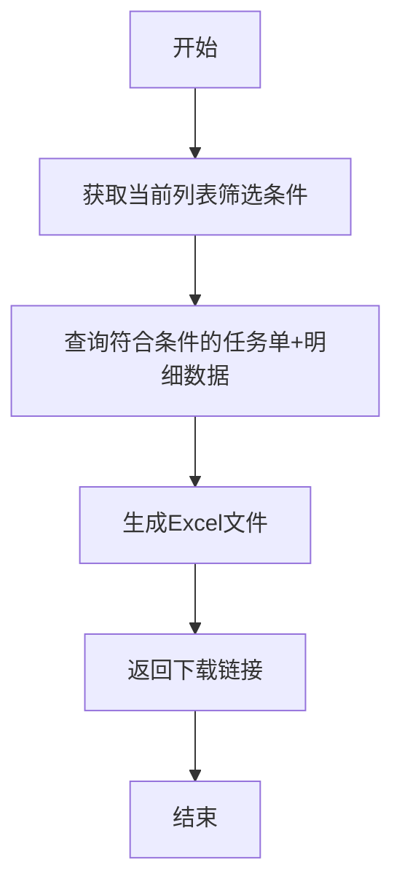

| 节点 | 依赖表 | SQL |
|------|--------|-----|
| 查询任务数据 | `video_takedown_task` + `video_takedown_task_detail`（AMS DB） | `SELECT t.*, d.* FROM video_takedown_task t LEFT JOIN video_takedown_task_detail d ON t.id = d.task_id WHERE <筛选条件>` |

**导出按钮说明：**

| 按钮名称 | 按钮类型 | 显示条件 | 导出内容 |
|---------|---------|---------|--------|
| 导出全部文件 | 次按钮 | 始终显示 | 所有视频明细 |
| 导出失败文件 | 主按钮 | 存在失败视频时显示 | 仅处理失败的视频 |

**导出规范：**

| 项目 | 说明 |
|-----|------|
| 导出格式 | Excel文件（.xlsx） |
| 文件名规则 | 视频下架全部文件-YYYY-MM-DD HH_mm_ss.xlsx（导出全部）；视频下架失败文件-YYYY-MM-DD HH_mm_ss.xlsx（导出失败） |
| 导出字段 | 序号、作品名、CP名、视频ID、视频标题、海外频道名/ID、分销商名称、运营团队、下架状态、完成时间、失败原因 |
| 示例文件名 | 视频下架全部文件-2026-03-09 14_30_25.xlsx |

**导出数据说明：**
- 待审核/审核拒绝状态下，视频ID可能尚未生成，导出时该字段为空
- 待处理/处理中/已完成状态下，视频ID已生成，导出时显示实际值

---

#### F6：创建解约单（含视频下架联动）（AMS）

> **图例说明：** 🟦 现有逻辑（已实现） | 🟩 新增逻辑（本期实现）

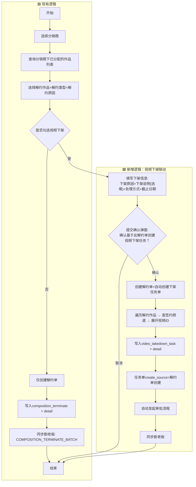

**现有逻辑 vs 新增逻辑对比：**

| 对比项 | 🟦 现有逻辑 | 🟩 新增逻辑 |
|--------|------------|------------|
| **触发条件** | 创建解约单 | 创建解约单 + 勾选"视频是否下架=是" |
| **新增字段** | - | 下架原因、下架说明、处理方式、截止执行日期 |
| **新增表** | - | `video_takedown_task` + `video_takedown_task_detail` |
| **审批流程** | 无 | 自动发起视频下架任务审批 |
| **视频ID展开** | 无 | 遍历解约作品 → 查签约频道 → 展开视频ID |
| **同步剧老板** | `COMPOSITION_TERMINATE_BATCH` | `COMPOSITION_TERMINATE_BATCH` + `TAKEDOWN_PROGRESS` |

| 节点 | 依赖表 | SQL |
|------|--------|-----|
| 分销商下已分配作品 | `composition_allocate_detail`（AMS DB） | `SELECT * FROM composition_allocate_detail WHERE team_id = #{teamId} AND terminate_status = '0'` |
| 创建解约单 | `composition_terminate` + `composition_terminate_detail`（AMS DB） | INSERT |
| 展开视频ID | 同F1 | 同F1 |
| 创建下架任务 | `video_takedown_task` + `video_takedown_task_detail`（AMS DB） | INSERT |

**“视频是否下架”联动规则：**

| 解约类型 | 默认值 | 可编辑性 |
|---------|-------|--------|
| **版权方解约** | 是 | ❌ 不可编辑 |
| **分销商解约** | 是 | ❌ 不可编辑 |
| **双方协商一致** | 是 | ✅ 可编辑 |

**下架原因联动规则（视频是否下架=是时）：**

| 解约类型 | 下架原因默认值 | 可编辑性 |
|---------|-------------|--------|
| **版权方解约** | 上游版权方解约 | ❌ 不可编辑 |
| **分销商解约** | 分销商解约 | ❌ 不可编辑 |
| **双方协商一致** | 无默认值 | ✅ 可编辑 |

**提交确认弹窗（视频是否下架=是时）：**

| 项目 | 说明 |
|-----|------|
| 触发时机 | 点击提交解约单 |
| 弹窗内容 | 请确认，基于此解约单创建「视频下架任务」吗？确认后将会自动发起「视频下架任务」审批 |
| 确认 | 提交解约单 + 自动创建视频下架任务单（status=待审核） |
| 取消 | 返回编辑 |

**解约单与视频下架任务单关系原则：**

| 原则 | 说明 |
|-----|------|
| **流程独立** | 解约单流程与视频下架任务单流程完全独立，互不影响 |
| **单向触发** | 解约单提交时触发创建视频下架任务单，无反向依赖 |
| **结果无关** | 视频下架任务单的创建结果、审核结果、执行结果均不影响解约单流程 |
| **快捷创建** | 解约单提供视频下架字段，减少用户重复操作 |

**数据流向（解约单 → 视频下架任务单）：**

| 解约单字段 | 视频下架任务单字段 |
|-----------|------------------|
| 下架原因 | takedown_reason |
| 下架说明 | takedown_description |
| 处理方式 | process_method |
| 截止执行日期 | deadline |
| 解约作品列表 | 待下架作品（展开视频ID） |

**解约单详情页-关联展示：**

| 场景 | 展示内容 |
|-----|--------|
| 视频是否下架=是 | 展示关联的视频下架任务单编号，点击可跳转任务单详情 |
| 视频是否下架=否 | 不展示该模块 |

---

#### F7：Dispatcher接收+PRD 7.6校验（Dispatcher）

**下架清单数据结构：**

AMS审批通过后，通过HTTP POST推送至Dispatcher的下架清单包含以下字段：

| 字段 | 类型 | 说明 | 用途 |
|------|------|------|------|
| `taskId` | Long | 任务单ID | 关联AMS任务单 |
| `taskDetailId` | Long | 任务明细ID | 回传进度时定位明细 |
| `videoId` | String | 海外视频ID | 执行下架的目标视频，如YouTube的11位视频ID（`dQw4w9WgXcQ`） |
| `channelId` | String | 注册频道ID | 视频所属的注册频道 |
| `pipelineId` | String | 发布通道ID | 连接AMS与结算系统/分发系统的桥梁 |
| `processMethod` | String | 处理方式 | `VIDEO_DELETE`删除 / `VIDEO_PRIVATE`私享 |
| `deadlineDate` | String | 截止日期 | 排序优先级依据 |
| `takedownReason` | String | 下架原因 | 记录用途 |
| `priority` | Integer | 优先级 | 排序依据 |
| `approveTime` | String | 审批通过时间 | 排序依据 |

**推送报文示例：**

```json
{
  "taskId": 1234567890,
  "items": [
    {
      "taskDetailId": 111,
      "videoId": "dQw4w9WgXcQ",
      "channelId": "UCxxxxxx",
      "pipelineId": "PL123456789",
      "processMethod": "VIDEO_DELETE",
      "deadlineDate": "2026-03-20",
      "takedownReason": "LICENSE_EXPIRE",
      "priority": 1,
      "approveTime": "2026-03-18T10:30:00"
    }
  ]
}
```

**流程图：**

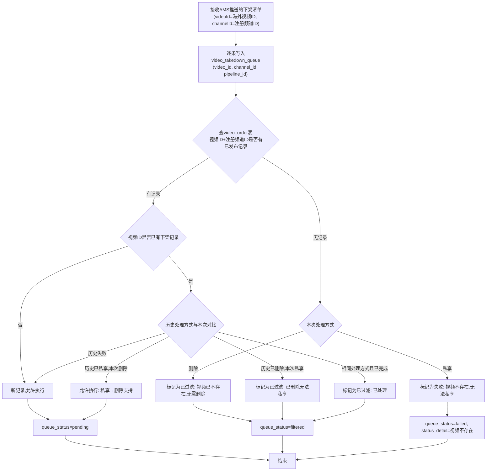

> **说明：** 直接查询`video_order`表检查视频ID+注册频道ID是否有已发布记录，有记录则继续检查历史下架记录。

| 节点 | 依赖表/API | SQL/接口 |
|------|--------|-----|
| 写入下架队列 | `video_takedown_queue`（Dispatcher DB） | INSERT |
| 视频ID+注册频道存在性 | `video_order`（Dispatcher DB） | `SELECT * FROM video_order WHERE upload_video_id = #{videoId} AND target_channel_id = #{channelId} AND publish_status = 'finished'`；返回空→无记录 |
| 历史下架记录 | `video_takedown_queue`（Dispatcher DB） | `SELECT id, process_method, queue_status FROM video_takedown_queue WHERE video_id = #{videoId} AND queue_status IN ('completed','failed','filtered')` — 仅在有已发布记录时查询 |

---

#### F8：排队调度+提交总控执行（Dispatcher）

> PRD更新：去掉紧急度P0/P1/P3，改为"当天截止优先"；新增额度管理与部分执行（PRD 3.5）

**排序规则（新）：**

| 优先级 | 排序维度 | 规则 | 说明 |
|:---:|---------|------|------|
| 1 | 是否当天截止 | 当天截止优先 | deadline_date = 今天的任务优先处理 |
| 2 | 截止执行日期 | 升序（近→远） | 非当天截止的按日期排序 |
| 3 | 下架原因优先级 | 1 > 2 > 3 > 4 > 5 > 6 | 同日期按优先级排序 |
| 4 | 审批通过时间 | 升序（先→后） | 以上都相同，按审批时间排序 |

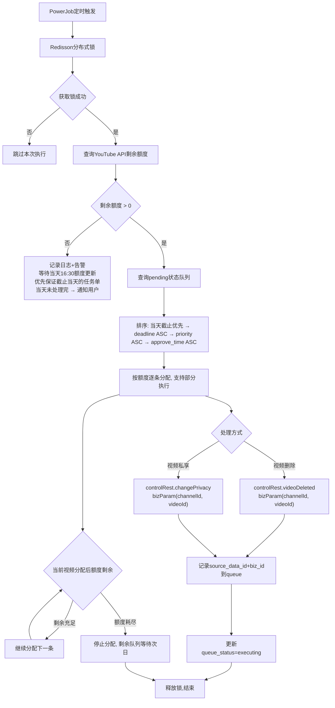

**部分执行逻辑说明：**

> 当额度不足以执行某个任务单的全部视频时，按视频ID粒度分配额度，执行能执行的部分，剩余视频保持pending状态等待次日额度更新。
>
> 示例：额度剩余3000，任务C有3500条视频 → 执行3000条，剩余500条暂停，后续任务D全部暂停。

| 节点 | 依赖表 | SQL |
|------|--------|-----|
| 查询额度 | 总控API | `controlRest.queryYoutubeApiQuota()` |
| 查询待执行队列 | `video_takedown_queue`（Dispatcher DB） | `SELECT * FROM video_takedown_queue WHERE queue_status = 'pending' AND deleted = 0 ORDER BY (deadline_date = CURDATE()) DESC, deadline_date ASC, priority ASC, approve_time ASC` |
| 更新执行状态 | `video_takedown_queue`（Dispatcher DB） | `UPDATE video_takedown_queue SET queue_status = 'executing', source_data_id = #{sourceDataId}, biz_id = #{bizId}, execute_time = NOW() WHERE id = #{id}` |

---

##### 额度检查和任务控制

> YouTube API额度每天约太平洋时间16:30重置，需要额度感知的任务控制机制，避免无效轮询。

**方案对比：**

| 对比项 | 方案1：单定时器 | 方案2：双定时器 |
|--------|:---:|:---:|
| **描述** | 每次执行都检查额度，有则执行，无则跳过 | 执行任务+额度检查任务分离，通过Redis标识协调 |
| **实现复杂度** | 简单 | 中等 |
| **额度接口调用频率** | 高（每5分钟） | 低（每30分钟） |
| **额度恢复响应速度** | 快（最多5分钟） | 稍慢（最多30分钟） |
| **容错性** | 依赖单一定时器 | 双重保障 |

**方案1：单定时器(最终方案)**

每次执行都查询额度，额度充足则执行任务，不足则跳过等待下次轮询。

```mermaid
flowchart TB
    A["每5分钟"] --> B[查询额度]
    B --> C{"额度>0?"}
    C -->|是| D[执行任务]
    C -->|否| E[跳过本次]
    E -->|"等待5分钟"| A
```

**方案2：双定时器（推荐）**

执行任务专注执行，发现额度不足时设置标识；额度检查任务独立监控额度恢复，恢复后清除标识。

```mermaid
flowchart TB
    subgraph Timer1["执行任务 每5分钟"]
        E1[获取分布式锁]
        E2{"存在额度不足标识?"}
        E3[跳过执行]
        E4[查询待处理队列]
        E5[排序分配]
        E6[查询剩余额度]
        E7{"额度>0?"}
        E8[执行下架操作]
        E9[停止分配]
        E10[设置额度不足标识]
    end

    subgraph Timer2["额度检查任务 每30分钟"]
        Q1[查询YouTube API额度]
        Q2{"额度已恢复?"}
        Q3[清除额度不足标识]
        Q4[记录恢复日志]
    end

    subgraph State["状态管理"]
        F1[("Redis\nquota_insufficient_flag")]
    end

    %% 执行任务流程
    E1 --> E2
    E2 -->|是| E3
    E2 -->|否| E4
    E4 --> E5 --> E6 --> E7
    E7 -->|是| E8
    E7 -->|否| E9 --> E10 --> F1
    
    %% 额度检查流程
    Q1 --> Q2
    Q2 -->|是| Q3 --> Q4
    Q2 -->|否| F1
    Q3 --> F1
```

**方案2核心设计要点：**

1. **执行任务**：专注执行逻辑，发现额度不足时仅设置Redis标识
2. **额度检查任务**：独立监控额度恢复，恢复后清除标识
3. **状态标识**：`quota_insufficient_flag`，TTL设置为今日结束时间，自动过期
4. **双重保险**：执行任务每次启动检查标识，额度检查定期清理

---

#### F9：总控回调处理+进度同步AMS（Dispatcher）

```mermaid
flowchart TD
    A[总控执行完成/失败] --> B[Dispatcher接收结果]
    B --> C["根据biz_id查找queue记录\n获取video_id, task_detail_id"]
    C --> D{执行结果}
    D -->|成功| E[更新queue_status=completed]
    D -->|失败| F{重试次数<上限}
    F -->|是| G[retry_count+1, queue_status=pending]
    F -->|否| H[更新queue_status=failed, 记录status_detail]
    E --> I[同步结果至AMS]
    H --> I
    I --> J["AMS通过task_detail_id\n更新task_detail.video_status"]
    J --> K[AMS统计task状态]
    K --> L{全部明细处理完成}
    L -->|是| M[状态汇总判定]
    M --> O[结束]
    L -->|否| N[task保持处理中]
    N --> O
```

**视频处理状态定义（PRD 7.5）：**

| 状态 | 含义 |
|-----|------|
| 待处理 | 视频未开始处理 |
| 处理中 | 视频正在处理（已开始执行且有处理结果返回） |
| 已完成 | 视频下架处理已完成 |
| 处理失败 | 不可重试或重试上限后仍失败 |
| 重试中 | 下架失败正在自动重试（对外展示为“处理中”） |

**任务单状态汇总规则（PRD 7.5）：**

| 视频ID状态组合 | 汇总状态 | 说明 |
|--------------|---------|------|
| 全部已完成 | 已完成 | 所有视频下架完成 |
| 全部失败（不可重试或重试上限） | **已完成** | 所有视频均无法完成，任务单视为已完成 |
| 全部待处理 | 待处理 | 所有视频等待执行 |
| 包含处理中/重试中 | 处理中 | 只要有处理中的视频，即为处理中 |
| 包含待处理（无处理中，有已完成/失败） | 处理中 | 待处理视为处理中的前置状态 |
| 包含可重试失败（未达上限） | 处理中 | 仍在自动重试中 |
| 其他混合状态 | 处理中 | 兖底规则 |

| 节点 | 依赖表 | SQL |
|------|--------|-----|
| 根据biz_id查找 | `video_takedown_queue`（Dispatcher DB） | `SELECT * FROM video_takedown_queue WHERE biz_id = #{bizId}` |
| 更新队列状态 | `video_takedown_queue`（Dispatcher DB） | `UPDATE video_takedown_queue SET queue_status = #{status}, complete_time = NOW(), status_detail = #{detail} WHERE id = #{id}` |
| AMS更新明细 | `video_takedown_task_detail`（AMS DB） | `UPDATE video_takedown_task_detail SET video_status = #{status}, status_detail = #{detail}, complete_time = NOW() WHERE task_id = #{taskId} AND video_id = #{videoId}` |
| AMS统计任务 | `video_takedown_task_detail`（AMS DB） | `SELECT task_id, SUM(CASE WHEN video_status='COMPLETED' THEN 1 ELSE 0 END) as success_count, SUM(CASE WHEN video_status IN ('FAILED','RETRYING') THEN 1 ELSE 0 END) as fail_count FROM video_takedown_task_detail WHERE task_id = #{taskId} GROUP BY task_id` |

---

#### F10：剧老板端数据同步（剧老板）

```mermaid
flowchart TD
    A[开始] --> B{触发场景}
    B -->|任务审批通过| C[状态变为待处理]
    B -->|执行进度变更| D[Dispatcher回传进度]
    B -->|下架完成或失败| E[任务最终状态确定]
    C --> F[查询任务明细关联的分销商]
    D --> F
    E --> F
    F --> G{任务是否关联分销商}
    G -->|否: 来源为运营团队| H[不同步, 结束]
    G -->|是: 来源为分销商| I["按作品+频道维度聚合明细\n取video_id+register_channel_id"]
    I --> J["构建MQ消息体\n(videoId=海外视频ID, channelId=注册频道ID)"]
    J --> K[发送至distributionTopic]
    K --> L{发送成功}
    L -->|失败| M[Guava Retryer重试, 最多5次]
    M --> K
    L -->|成功| N[结束]
```

| 消息标签（TAG） | 触发时机 | 消息内容 |
|-----------------|---------|---------|
| `TAKEDOWN_PROGRESS` | 视频执行进度变更/完成 | 任务单ID、作品ID、频道ID、视频ID列表、处理状态汇总、处理方式、截止日期 |

| 节点 | 依赖表 | SQL |
|------|--------|-----|
| 按作品+频道聚合 | `video_takedown_task_detail`（AMS DB） | `SELECT composition_name, register_channel_id, COUNT(*) as video_count FROM video_takedown_task_detail WHERE task_id = #{taskId} GROUP BY composition_name, register_channel_id` |
| 查询关联分销商 | `video_takedown_task`（AMS DB） | `SELECT create_source, team_id FROM video_takedown_task WHERE id = #{taskId}` |
| 发送MQ | `MQConfig.distributionTopic` | MQ发送，复用 `sendMessage()` |

---

### 3.6 新增表结构设计

#### 3.6.1 `video_takedown_task`（AMS DB）

> 对齐 CompositionTerminate 规范：Long 雪花主键、Date 时间、String 日期

**状态码对照表：**

| 英文Code | 中文含义 | 说明 |
|----------|---------|------|
| CREATING | 创建中 | 任务单已创建，正在进行异步校验 |
| CREATE_FAILED | 创建失败 | 异步校验失败，可重试 |
| PENDING_REVIEW | 待审核 | 校验通过，等待人工审核 |
| REVIEW_REJECTED | 审核拒绝 | 审核不通过，可编辑重新提交 |
| PENDING_PROCESS | 待处理 | 审核通过，等待执行 |
| PROCESSING | 处理中 | 正在执行下架操作 |
| COMPLETED | 已完成 | 所有视频处理完毕 |

**枚举字段对照表：**

| 字段名 | 英文Code | 中文含义 | 说明 |
|-------|----------|---------|------|
| create_source | PAGE_CREATE | 页面创建 | 用户通过页面手动创建 |
| create_source | TERMINATE_CREATE | 解约单创建 | 由解约单自动创建 |
| create_type | BY_COMPOSITION | 按作品 | 通过作品+CP+注册频道创建 |
| create_type | BY_VIDEO_ID | 按视频ID | 通过Excel导入视频ID创建 |
| task_source | DISTRIBUTOR | 分销商 | 任务来源于分销商 |
| task_source | OPERATION_TEAM | 运营团队 | 任务来源于运营团队 |
| process_method | VIDEO_DELETE | 视频删除 | 调用YouTube API删除视频 |
| process_method | VIDEO_PRIVACY | 视频私享 | 调用YouTube API设置视频私享 |
| takedown_reason | TEMP_COPYRIGHT_DISPUTE | 临时版权纠纷 | 优先级1 |
| takedown_reason | ADJUST_LAUNCH_TIME | 调整上线时间 | 优先级2 |
| takedown_reason | SINGLE_TERMINATION | 单作品解约 | 优先级3 |
| takedown_reason | COPYRIGHT_TERMINATION | 版权方解约 | 优先级4 |
| takedown_reason | DISTRIBUTOR_TERMINATION | 分销商解约 | 优先级5 |
| takedown_reason | OTHER | 其他原因 | 优先级6 |

**视频状态枚举值：**

| 英文Code | 中文含义 | 说明 |
|----------|---------|------|
| PENDING | 待处理 | 视频未开始处理 |
| PROCESSING | 处理中 | 视频正在处理（已开始执行且有处理结果返回） |
| COMPLETED | 已完成 | 视频下架处理已完成 |
| FAILED | 处理失败 | 不可重试或重试上限后仍失败 |
| RETRYING | 重试中 | 下架失败正在自动重试（对外展示为"PROCESSING"） |

```sql
CREATE TABLE `video_takedown_task` (
  `id` bigint NOT NULL COMMENT '主键(雪花ID)',
  `code` varchar(20) NOT NULL COMMENT '任务单编号(V+年月日+四位数字)',
  `takedown_reason` varchar(32) NOT NULL COMMENT '下架原因',
  `takedown_description` varchar(100) DEFAULT NULL COMMENT '下架说明(选填, 上限100字符)',
  `process_method` varchar(20) NOT NULL COMMENT '处理方式(VIDEO_DELETE/VIDEO_PRIVACY)',
  `deadline_date` varchar(10) NOT NULL COMMENT '截止执行日期(yyyy-MM-dd)',
  `status` varchar(20) NOT NULL DEFAULT 'CREATING' COMMENT '状态(CREATING/CREATE_FAILED/PENDING_REVIEW/REVIEW_REJECTED/PENDING_PROCESS/PROCESSING/COMPLETED)',
  `retry_count` tinyint unsigned NOT NULL DEFAULT 0 COMMENT '异步创建重试次数(最多3次)',
  `create_fail_reason` varchar(512) DEFAULT NULL COMMENT '创建失败原因',
  `create_source` varchar(20) NOT NULL COMMENT '创建来源(PAGE_CREATE/TERMINATE_CREATE)',
  `create_type` varchar(20) NOT NULL COMMENT '创建方式(BY_COMPOSITION/BY_VIDEO_ID)',
  `task_source` varchar(20) DEFAULT NULL COMMENT '任务来源(DISTRIBUTOR/OPERATION_TEAM)',
  `team_id` varchar(64) DEFAULT NULL COMMENT '分销商ID',
  `team_name` varchar(128) DEFAULT NULL COMMENT '分销商名称',
  `operation_team_id` varchar(64) DEFAULT NULL COMMENT '运营团队ID',
  `terminate_id` bigint DEFAULT NULL COMMENT '关联解约单ID',
  `auditor_id` varchar(64) DEFAULT NULL COMMENT '审批人ID',
  `audit_opinion` varchar(512) DEFAULT NULL COMMENT '审批意见',
  `audit_time` datetime DEFAULT NULL COMMENT '审批时间(通过或拒绝)',
  `created_user_id` varchar(64) NOT NULL COMMENT '创建人ID',
  `created_at` datetime DEFAULT NULL COMMENT '创建时间',
  `updated_at` datetime DEFAULT NULL COMMENT '更新时间',
  PRIMARY KEY (`id`),
  INDEX `idx_code` (`code`),
  INDEX `idx_status` (`status`),
  INDEX `idx_terminate_id` (`terminate_id`)
) ENGINE=InnoDB DEFAULT CHARSET=utf8mb4 COLLATE=utf8mb4_0900_ai_ci COMMENT='视频下架任务单';
```

#### 3.6.2 `video_takedown_task_detail`（AMS DB）

**视频处理状态码对照表：**

| 英文Code | 中文含义 | 说明 |
|----------|---------|------|
| PENDING | 待处理 | 视频未开始处理 |
| PROCESSING | 处理中 | 视频正在处理（已开始执行且有处理结果返回） |
| COMPLETED | 已完成 | 视频下架处理已完成 |
| FAILED | 处理失败 | 不可重试或重试上限后仍失败 |
| RETRYING | 重试中 | 下架失败正在自动重试（对外展示为"PROCESSING"） |

```sql
CREATE TABLE `video_takedown_task_detail` (
  `id` bigint NOT NULL COMMENT '主键(雪花ID)',
  `task_id` bigint NOT NULL COMMENT '任务单ID',
  `video_id` varchar(16) NOT NULL COMMENT '视频ID(11位)',
  `video_title` varchar(512) DEFAULT NULL COMMENT '视频标题',
  `pipeline_id` varchar(64) DEFAULT NULL COMMENT '发布通道ID(pipeline_id)',
  `composition_id` bigint DEFAULT NULL COMMENT '作品ID',
  `composition_name` varchar(256) DEFAULT NULL COMMENT '作品名称',
  `cp_id` bigint DEFAULT NULL COMMENT 'CP ID',
  `cp_name` varchar(256) DEFAULT NULL COMMENT 'CP名称',
  `register_channel_id` varchar(64) NOT NULL COMMENT '注册频道ID(UCxxxx)',
  `operation_type` varchar(32) DEFAULT NULL COMMENT '运营类型(自运营/代运营/分销商运营等, 来源AMS-YT频道表)',
  `operation_team` varchar(128) DEFAULT NULL COMMENT '运营团队(仅用于导出和数据分析, 页面不展示)',
  `process_method` varchar(20) NOT NULL COMMENT '处理方式(VIDEO_DELETE/VIDEO_PRIVACY)',
  `video_status` varchar(20) NOT NULL DEFAULT 'PENDING' COMMENT '视频状态(PENDING/PROCESSING/COMPLETED/FAILED/RETRYING)',
  `status_detail` varchar(512) DEFAULT NULL COMMENT '执行详情(成功/失败的具体信息)',
  `execute_time` datetime DEFAULT NULL COMMENT '开始执行时间',
  `complete_time` datetime DEFAULT NULL COMMENT '完成时间',
  `created_at` datetime DEFAULT NULL COMMENT '创建时间',
  `updated_at` datetime DEFAULT NULL COMMENT '更新时间',
  PRIMARY KEY (`id`),
  INDEX `idx_task_id` (`task_id`),
  INDEX `idx_video_id` (`video_id`),
  INDEX `idx_register_channel_id` (`register_channel_id`),
  INDEX `idx_pipeline_id` (`pipeline_id`)
) ENGINE=InnoDB DEFAULT CHARSET=utf8mb4 COLLATE=utf8mb4_0900_ai_ci COMMENT='视频下架任务视频明细';
```

#### 3.6.3 `video_takedown_queue`（Dispatcher DB）

> 对齐 video_order 规范：AUTO_INCREMENT、varchar(20)英文枚举码、timestamp、deleted+version

**队列状态码对照表：**

| 英文Code | 中文含义 | 说明 |
|----------|---------|------|
| pending | 待处理 | 等待调度执行 |
| executing | 执行中 | 已提交总控执行 |
| completed | 已完成 | 执行成功 |
| failed | 执行失败 | 执行失败 |
| filtered | 已过滤 | 不符合条件被过滤 |

```sql
CREATE TABLE `video_takedown_queue` (
  `id` bigint NOT NULL AUTO_INCREMENT,
  `task_id` bigint NOT NULL COMMENT 'AMS任务单ID',
  `task_detail_id` bigint NOT NULL COMMENT 'AMS任务明细ID',
  `video_id` varchar(50) NOT NULL COMMENT '视频ID',
  `register_channel_id` varchar(50) NOT NULL COMMENT '注册频道ID(UC开头)',
  `pipeline_id` varchar(64) DEFAULT NULL COMMENT '发布通道ID',
  `process_method` varchar(20) NOT NULL COMMENT '处理方式(VIDEO_DELETE/VIDEO_PRIVACY)',
  `deadline_date` varchar(10) NOT NULL COMMENT '截止执行日期',
  `priority` int NOT NULL COMMENT '优先级(1-6)',
  `approve_time` timestamp NOT NULL COMMENT '审批通过时间',
  `queue_status` varchar(20) NOT NULL DEFAULT 'pending' COMMENT '队列状态 pending/executing/completed/failed/filtered',
  `source_data_id` varchar(50) NULL DEFAULT NULL COMMENT '分发系统生成的源数据ID(用于总控回调)',
  `biz_id` varchar(50) NULL DEFAULT NULL COMMENT '总控返回的业务ID(用于查询执行状态)',
  `status_detail` varchar(512) NULL DEFAULT NULL COMMENT '执行详情(成功/失败的具体信息)',
  `retry_count` tinyint unsigned NOT NULL DEFAULT 0 COMMENT '重试次数',
  `execute_time` timestamp NULL DEFAULT NULL COMMENT '提交总控时间',
  `complete_time` timestamp NULL DEFAULT NULL COMMENT '完成时间',
  `version` int NOT NULL DEFAULT 1 COMMENT '版本',
  `deleted` tinyint NOT NULL DEFAULT 0 COMMENT '是否删除 0否1是',
  `created_at` timestamp NULL DEFAULT CURRENT_TIMESTAMP COMMENT '创建时间',
  `updated_at` timestamp NULL DEFAULT CURRENT_TIMESTAMP ON UPDATE CURRENT_TIMESTAMP COMMENT '更新时间',
  PRIMARY KEY (`id`) USING BTREE,
  INDEX `idx_task_id` (`task_id` ASC) USING BTREE,
  INDEX `idx_register_channel_id` (`register_channel_id` ASC) USING BTREE,
  INDEX `idx_queue_status` (`queue_status` ASC) USING BTREE,
  INDEX `idx_pipeline_id` (`pipeline_id` ASC) USING BTREE,
  INDEX `idx_priority_sort` (`deadline_date` ASC, `priority` ASC, `approve_time` ASC) USING BTREE
) ENGINE = InnoDB AUTO_INCREMENT = 1 CHARACTER SET = utf8mb4 COLLATE = utf8mb4_0900_ai_ci COMMENT = '视频下架排队调度表' ROW_FORMAT = Dynamic;
```

---

## 四、依赖项

### 4.1 系统依赖

| 依赖系统 | 依赖内容 | 改造类型 |
|----------|---------|---------|
| AMS（silverdawn-ams-server） | 视频下架任务管理模块（F1-F6、F10） | 需新增开发 |
| Dispatcher（dispatcher-server） | 视频下架调度模块（F7-F9） | 需新增开发 |
| 结算系统（YT/FB） | 视频ID查询（youtube_video_pipeline、facebook_video_pipeline） | 只读查询，无需改造 |
| 总控 Control Server | 视频删除/私享/配额查询/排队查询/任务详情 | 已有能力，无需改造 |
| 剧老板端 | MQ消费、数据存储、查询API、前端页面 | 待确认（待确认点3） |

### 4.2 中间件依赖

| 中间件 | 用途 | 改造类型 |
|--------|------|---------|
| RocketMQ | AMS→Dispatcher（方案A）；AMS→剧老板端（distributionTopic新增TAG） | 方案A需新增Topic；剧老板端复用已有Topic |
| Redisson | Dispatcher 定时任务分布式锁 | 复用现有模式 |
| PowerJob | Dispatcher 定时调度（排队消费、进度轮询） | 复用现有模式，新增Handler |

### 4.3 已有表依赖（只读）

| 表名 | 所属DB | 用途 |
|------|--------|------|
| `ams_composition` | AMS DB | 作品信息、CP名称、签约频道 |
| `ams_publish_channel` | AMS DB | 签约频道→注册频道映射、pipeline_id |
| `ams_sign_channel` | AMS DB | 签约频道信息、运营团队 |
| `composition_allocate` | AMS DB | 分销商分配关系 |
| `composition_allocate_detail` | AMS DB | 作品分配关系、解约状态 |
| `composition_terminate` / `_detail` | AMS DB | 解约单关联 |
| `sign_channel_language` | AMS DB | 注册频道→运营团队映射 |
| `youtube_video_pipeline` | 结算系统DB | YouTube视频ID与pipeline_id映射 |
| `facebook_video_pipeline` | 结算系统DB | Facebook视频ID与pipeline_id映射 |
| `video_order` | 分发系统DB | 分发系统视频ID与pipeline_id映射 |
| `task_record` | Dispatcher DB | 总控交互biz_id映射 |

### 4.4 AMS→Dispatcher 通信依赖

| 方案 | 通信方式 | 依赖 |
|------|---------|------|
| 方案A | RocketMQ 双向 | 新增Topic + AMS/Dispatcher各增Producer和Consumer |
| 方案B | HTTP推送 + Dispatcher回调AMS | Dispatcher新增回调HTTP客户端，AMS新增回调接收接口 |
| 方案C | HTTP推送 + AMS主动轮询 | Dispatcher新增进度查询接口，AMS新增定时轮询任务 |

---

## 五、待确认点

| 编号 | 待确认点 | 背景说明 | 影响范围 |
|------|---------|---------|---------|
| 1 | 按视频ID创建时，是否需要校验「视频ID在系统中是否存在」 | PRD 3.2.4 仅有「视频ID在指定注册频道内是否存在」的校验规则，未提及系统级存在性校验 | F2 校验节点 |
| 2 | AMS→Dispatcher 通信方案选择（A/B/C） | 三个候选方案各有优劣，需根据团队技术偏好和运维能力确定 | F7接收方式、F9同步方式、中间件依赖 |
| 3 | 剧老板端新增Tag消费逻辑 | 剧老板现有 `TargetChannelBindConsumer` 需扩展支持 `TAKEDOWN_PROGRESS` Tag，新增处理逻辑更新 `Composition` 表状态 | F10 消息消费逻辑 |
| 4 | AMS任务单并发保护方式 | AMS现有实体无version字段。a) SQL WHERE status条件（轻量，符合AMS风格）b) 新增version乐观锁（更严谨，无先例） | 表结构、F4逻辑 |
| 5 | Dispatcher queue_status 中文/英文枚举码 | Dispatcher现有为英文枚举码（planing/preparing），当前设计沿用英文（pending/executing/completed/failed/filtered） | 表结构、枚举定义 |
| 6 | F1第二阶段是否需要"历史处理方式比对"预校验 | F1查AMS本地历史，F7查Dispatcher本地历史，数据源不一致可能导致判断结果不同。建议统一由F7执行最终校验，F1仅做基础校验 | F1流程、F7流程、数据一致性 |
| 7 | **CP下同名作品多条记录处理** | 当通过「作品名+CP名称」查询作品时，如果返回多条记录（同一CP下存在同名作品），应如何处理？方案：a) 取第一条记录继续执行；b) 记录失败，要求用户补充注册频道ID区分；c) 结合注册频道ID进一步筛选。 | F1/F2 第二阶段、pipeline_id获取 |

---

## 六、附件

- 视频下架PRD V2.0：`docs/视频下架/视频下架PRD.md`
- 调研报告：`docs/【授权到期后通知分销商并下架视频】调研报告.md`
- 剧老板端PRD：`docs/视频下架/剧老板-视频下架列表.md`
