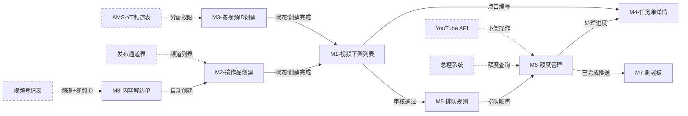

# 需求理解总结 — 视频下架合规管理系统（V2.0-updated2 审阅）

> **PRD 版本**：V2.0-updated2（2026-03-27，已合并第一轮+第二轮全部产品回复）  
> **审阅人**：QA  
> **编写日期**：2026-03-27  
> **涉及 PRD**：视频下架PRD-2026032701.md（V2.0-updated2）、剧老板-视频下架列表.md  
> **涉及原型**：视频下架原型_v2.html

---

## 一、系统概述

视频下架合规管理系统是 AMS（资产管理系统）新增的视频管理子模块，用于管理视频内容在海外分发平台（YouTube 等）的下架全生命周期。系统覆盖从任务创建、审批、排队执行到完成的完整业务流程，打通 AMS 与剧老板系统实现多端协同和进度跟踪。

**核心业务场景**：
- 因版权解约、上线调整等原因，需要将已发布到海外频道的视频进行下架（删除或私享）
- 支持按作品维度和按视频ID维度两种创建任务单方式
- 支持通过内容解约单自动联动创建视频下架任务
- 剧老板端（分销商侧）可查看已完成的下架结果

**系统边界**：本期范围包含 AMS 视频下架列表/创建/详情、内容解约单创建/详情、剧老板视频下架列表/进度查看。不包含内容分配单管理（已有功能，仅被解约单引用）。

---

## 二、用户角色与权限

| 角色 | 系统 | 核心操作 | 权限说明 |
|------|------|---------|---------|
| AMS 运营人员 | 资产管理系统 | 创建/编辑/删除任务单、创建解约单、查看详情、导出数据 | 拥有菜单权限即可见所有数据（本期不做数据权限隔离，§7 SC-1） |
| AMS 审核人员 | 资产管理系统 | 审核任务单（通过/拒绝） | 需在权限中心配置【审核】按钮权限（§3.1.5），每行数据独立审核 |
| 剧老板分销商 | 剧老板系统 | 查看已完成的下架任务列表和视频明细 | 仅可见分配给该分销商运营的作品数据（剧老板PRD §1.1） |

---

## 三、功能模块清单

| 模块编号 | 模块名称 | PRD 位置 | 核心功能 |
|:-------:|---------|---------|---------|
| M1 | AMS 视频下架列表页 | §3.1 | 8 个 Tab 筛选、多维度搜索、列表展示、操作入口（编辑/删除/审核） |
| M2 | 按作品创建任务单 | §3.2.1-§3.2.2 | 基础信息填写、添加作品弹窗、选择海外频道、批量导入作品、重复校验 |
| M3 | 按视频ID创建任务单 | §3.2.3-§3.2.4 | 归属信息（分销商/运营团队）、批量导入视频ID、16项导入校验 |
| M4 | 任务单详情页 | §3.3 | 基础信息展示、整体完成进度、作品处理进度（二级展开）、搜索、导出 |
| M5 | 执行排队规则 | §3.4 | 四维排序（当天截止→日期→优先级→审批时间）、下架原因6级优先级 |
| M6 | 额度管理与执行控制 | §3.5 | 每日5000条阈值、16:00额度更新、部分执行、视频私享免配额、钉钉预警 |
| M7 | 剧老板视频下架 | §4 + 剧老板PRD | 按作品+频道维度展示已完成数据、单作品进度查看页 |
| M8 | 内容解约单 | §5 | 创建解约单（按分销商拆分）、联动自动创建视频下架任务单 |
| M9 | 通用规范与执行校验 | §6 | 状态标签颜色、日期/分页规范、浏览器兼容性、两层状态体系、执行校验流程、二次下架、数据过滤 |

---

## 四、各模块详细理解

### M1 — AMS 视频下架列表页

**核心功能**：展示所有任务单，支持按状态 Tab 切换和多条件搜索。

**Tab 与排序**（§3.1.2）：
- 全部/创建中/创建失败/待审核/审核拒绝：按创建时间倒序
- 待处理/处理中：按排队优先级排序（当天截止优先→截止日期近→远→优先级高→低→审批时间先→后）
- 已完成：按完成时间倒序

**搜索条件**（§3.1.3）：10个搜索字段，其中"处理状态"仅在全部Tab展示，"视频ID"支持精确搜索，搜索结果为后端过滤，只展示包含该视频ID的任务单。

**操作按钮**（§3.1.5）：
- 创建失败 / 审核拒绝：【编辑】【删除】
- 待审核：【审核】（需权限，每行独立审核，**无批量审核**）
- 其他状态：无操作

**编辑操作**：
- 创建失败编辑：状态流转 创建失败→创建中→待审核
- 审核拒绝编辑：状态流转 审核拒绝→创建中→待审核（需重新获取视频ID，与创建失败编辑流程一致）

**删除操作**：物理删除，编号不回收，二次确认弹窗（红色"确定删除"主按钮）。

**审核操作**：弹窗形式，单选通过/不通过。通过时审核意见选填（200字符），不通过时必填（200字符）。**字符计数规则**：中文字符按1个计算，支持特殊字符。审核拒绝时列表处理状态列悬停显示审核意见Tooltip。审核意见编辑重提交后覆盖更新。

**任务单编号**（§3.1.1）：V + YYMMDD + 四位序号，Redis INCR原子自增，每日0点重置，允许不连续。

**刷新机制**（§3.1.2）：不自动刷新，手动刷新保持Tab和搜索条件，返回列表保持之前状态。**切换Tab时保留搜索条件**。

### M2 — 按作品创建任务单

**基础信息**（§3.2.1）：
- 下架原因：必填下拉，6种枚举（上游版权解约/分销商解约/单作品解约/临时版权纠纷/调整上线时间/其他原因）
- 下架说明：选填，100字符（中文字符按1个计算，支持特殊字符）
- 处理方式：必填单选（视频删除/视频私享）
- 截止执行日期：必填，当天~+6天

**添加作品**（§3.2.2）：
- 路径A【批量导入】：模板字段=作品名称+CP名称+海外频道ID，xls/xlsx ≤5M ≤500条，14项校验，第二次导入覆盖第一次
- 路径B【+ 新增作品】：搜索后展示，可选范围=签约内容（视听/影视/图文/音乐作品，类型为枚举值可能增减），已导入作品禁用取消勾选，支持多选+全选（跨分页）
- 海外频道选择弹窗：数据来源=发布通道表，匹配维度=作品ID

**提交校验**（§3.2.2）：
1. 同步：基础信息完整性→作品数量>0→每个作品海外频道ID>0→自身重复校验（作品+频道组合）
2. 异步（提交后）：跨任务单重复校验→视频ID获取→通道关系匹配

**重复校验**（§3.1.6）：
- 自身重复：同一任务单内作品+频道组合唯一，重复阻止提交
- 跨任务单：状态≠已完成/创建失败/审核拒绝，重复时弹窗可跳过

**创建结果判定**（§3.1.6）：
- 全部可执行视频ID=0 → 创建失败
- 部分=0 → 创建成功（详情页展示失败作品 + ⚠️提示）
- 全部>0 → 创建成功

### M3 — 按视频ID创建任务单

**归属信息**（§3.2.3）：任务来源（分销商/运营团队）→联动显示对应字段。导入数据有值时归属信息锁定。

**批量导入**（§3.2.4）：模板字段=视频ID+作品名称+CP名称+海外频道ID，≤1000条 ≤5M。

**16项导入校验**（§3.2.4）：含视频ID格式固定11字符、重复性、作品/CP存在性、频道分配权限（分销商查分配关系，运营团队查AMS-YT频道表运营团队字段）、频道内视频存在性、执行中任务检测、已完成二次处理规则。

**"执行中"定义**：创建中/待审核/待处理/处理中。

**特殊规则**：已删除视频不支持再处理，处理失败视频允许重新导入。

### M4 — 任务单详情页

**页面结构**（§3.3.2）：基础信息 + 整体完成进度 + 作品处理进度。三个模块均在所有状态下显示。

**整体完成进度**（§3.3.4）：
- 提交视频数：总视频数
- 已处理/成功：已下架成功的视频数
- 处理失败：下架失败的视频数（含数据过滤标记为失败的视频）
- 排队中：待处理状态的展示别名
- 完成百分比：进度条展示；计算公式 = (已处理成功数 + 处理失败数) / 提交视频数 x 100%（即处理失败也计入完成进度，排队中/处理中不计入）

**作品处理进度**（§3.3.5）：一级=作品列表（默认收起），二级=视频明细（展开）。支持6项搜索（作品名称/CP名称/视频ID/海外频道ID/分销商名称/运营团队）。

**视频明细字段**：序号/视频ID/视频标题/海外频道名/海外频道ID/分销商名称/运营团队/下架状态/完成时间/失败原因。冗余存储，历史不跟随变更。

**搜索重置行为**（§3.3.5）：搜索视频ID后需**手动点击"重置"按钮或刷新页面**才能恢复显示全部作品，不支持清空搜索框自动恢复。

**导出**（§3.3.6）：
- 导出全部文件（次按钮）：已完成状态显示
- 导出失败文件（主按钮）：已完成+有失败数据显示
- 12字段xlsx格式，文件名含时间戳
- **本期仅支持同步导出**，千条以内直接导出；超过千条限制导出范围或提示数据量过大

### M5 — 执行排队规则

**四维排序**（§3.4）：
1. 是否当天截止（当天优先）
2. 截止执行日期（升序）
3. 下架原因优先级（临时版权纠纷1 > 调整上线时间2 > 单作品解约3 > 上游版权解约4 > 分销商解约5 > 其他原因6）
4. 审批通过时间（升序）

### M6 — 额度管理与执行控制

**配额机制**（§3.5）：
- 每日最高阈值5000条，每天16:00从总控系统更新
- 视频删除消耗配额，视频私享**不消耗配额且不排队，跳过待处理状态直接进入处理中**
- 额度不足时暂停执行，支持部分执行
- 额度查询失败时任务暂停执行，不强制降级

**额度重试**：16:05起每15分钟查询一次，无上限循环检查。

**预警机制**：17:00额度仍未恢复且有当天截止任务 → 钉钉通知（告警组：文健/常亚菲/尚利帆/AMS项目沟通群）。预警后额度恢复仍继续执行。

**跨天规则**：保留队列第二天重新排序，截止日期已过仍继续执行+触发告警。

### M7 — 剧老板视频下架

**数据展示维度**（剧老板PRD §1.1）：按作品+频道维度，仅已完成数据。同一作品多频道展示多条。

**推送规则**：任务单已完成时触发（含"全部失败"场景），仅推送一次（最终结果同步）。按创建方式匹配分销商（按作品/解约：通道关系中的分销商；按视频ID：频道分配的分销商）。仅同步有处理结果（成功/失败）的视频ID，处理中/待处理的视频不推送。

**推送数据协议**：RocketMQ消息体含 taskNo/workName/channelId/channelName/videoId/videoTitle/takedownStatus/completeTime/failReason。同步失败处理为技术确认项。

**状态映射**（§4）：AMS端"成功"→剧老板"成功"，AMS端"失败"→剧老板"失败"，处理中/待处理→不展示。

**空列表状态**（§4）：无已完成下架任务时展示"暂无数据"；无搜索结果时展示"未找到相关数据"。

**进度查看页**（剧老板PRD §2）：单作品维度视频明细，下架状态仅成功/失败。不展示整体完成进度模块。

### M8 — 内容解约单

**解约单状态**（§5.1）：创建后即生效，无审批流程，不支持取消/作废，创建成功即终态。

**创建流程**（§5.2）：
- 基本信息：分销商名称、解约类型（上游版权方/分销商/双方协商一致）、解约原因、解约日期、视频是否下架
- 联动规则：上游版权方/分销商解约 → "视频是否下架"默认"是"且锁定；双方协商一致 → 默认"是"可编辑
- 视频下架信息：下架原因联动解约类型自动填充（上游→"上游版权解约"锁定，分销商→"分销商解约"锁定），处理方式默认"视频删除"不可编辑
- 下架说明：选填，100字符（中文字符按1个计算，支持特殊字符）

**解约单与任务单关系**（§5.2.1）：
- 一次创建 → N张解约单（按分销商拆分）→ 仅1个任务单（按作品聚合）
- 流程独立、单向触发、结果无关
- 任务单存储 terminateId 关联

**数据映射**：解约单字段直接映射任务单，海外频道ID和视频ID从剧老板-视频登记表获取（匹配维度：作品名称+分销商名称）。

**解约信息作品表格**（§5.2.3）：作品名称、作品链接、作品规格、运作套餐、运作语种、操作。**CP名称字段为下期迭代内容，本期不包含**。

**解约单详情页**（§5.3）：视频下架信息含下架原因、下架说明、处理方式、截止执行日期共4个字段。

### M9 — 通用规范与执行校验

**两层状态体系**（§6.5）：
- 第一层-任务单生命周期：创建中/创建失败/待审核/审核拒绝/待处理/处理中/已完成
- 第二层-视频处理状态：成功/处理中/待处理/失败/重试中（重试中对外展示"处理中"）

**视频处理状态汇总**（§6.5）：全部已完成→已完成；全部失败→**已完成**（+ℹ️图标）；包含处理中→处理中；其他混合→处理中（兜底）。

**全部失败完成时间**（§6.5）：取最后一个视频失败确认的时间点。

**执行校验流程**（§6.6）：视频ID存在性→下架方式一致性→处理结果→二次下架支持。

**二次下架**（§6.6.4）：已私享→删除（✅支持），已删除→任何（❌不支持）。

**数据过滤**（§6.6.5）：跳过的视频标记"处理失败"，计入"提交视频数"和"处理失败"数，**不计入**"已处理/成功"数。

**重试规则**：最多3次，间隔5分钟，重试中展示"处理中"。

**状态标签颜色**（§6.1）：橙色(#FFA80F)=待审核/创建中/待处理/处理中，红色(#F24545)=审核拒绝/创建失败，绿色(#00B09B)=已完成。

**分页规范**（§6.3）：默认30条，可选50/100条。

**浏览器兼容性**（§6.3.1）：Chrome 90+、Edge 90+、Firefox 88+，不支持IE。

---

## 五、模块间依赖关系

### 5.1 依赖关系清单

| 上游模块 | 下游模块 | 依赖类型 | 依赖内容 | PRD 来源 |
|---------|---------|---------|---------|---------|
| M2/M3-创建任务单 | M1-列表页 | 状态 | 创建完成后任务单出现在列表 | §3.1.6 |
| M1-列表页（审核通过） | M5-排队规则 | 状态 | 审核通过→待处理，进入排队队列 | §3.1.6 + §3.4 |
| M5-排队规则 | M6-额度管理 | 功能 | 排队顺序决定额度分配顺序 | §3.5 额度分配规则 |
| M6-额度管理 | M4-详情页 | 数据 | 执行结果写入详情页视频处理进度 | §3.3.4 |
| M8-解约单 | M2-创建任务单 | 功能 | 解约单提交时自动创建视频下架任务单 | §5.2.1 |
| M8-解约单 | 剧老板-视频登记表（外部） | 数据 | 获取海外频道ID和视频ID | §5.2.1 数据流向 |
| M2-创建任务单 | 发布通道表（外部） | 数据 | 获取作品关联的海外频道ID列表 | §3.2.2 选择海外频道弹窗 |
| M2-创建任务单 | 通道关系（外部） | 数据 | 按作品+海外频道+分销商查找通道关系获取视频ID | §3.1.6 |
| M3-按视频ID创建 | AMS-YT频道表（外部） | 数据 | 校验海外频道ID分配权限（分销商/运营团队） | §3.2.4 规则13 |
| M6-额度管理 | 总控系统（外部） | 数据 | 查询每日剩余配额 | §3.5 |
| M6-额度管理 | YouTube API（外部） | 功能 | 调用视频删除/私享接口执行下架 | §6.5 |
| M6-任务完成 | M7-剧老板 | 数据 | 已完成任务数据通过RocketMQ同步到剧老板端（30分钟内） | §7 B-7 + 剧老板PRD §1.1 |
| M9-通用规范 | M1/M4/M7 | 规则 | 状态标签颜色、日期格式、分页规范、浏览器兼容性 | §6.1-§6.4 |
| M9-执行校验 | M6-额度管理 | 规则 | 执行前校验视频ID有效性和下架方式一致性 | §6.6 |
| AMS 作品库（外部） | M2-按作品创建 | 数据 | 提供作品列表（签约内容） | §3.2.2 |
| 权限中心（外部） | M1-列表页 | 功能 | 控制审核按钮显示/隐藏 | §3.1.5 |
| M3-视频明细 | AMS-YT频道表（外部） | 数据 | 冗余存储分销商名称/运营团队 | §3.3.5 |

### 5.2 依赖关系图

---

## 六、核心操作路径清单

### M1 — AMS 视频下架列表页

| 路径编号 | 路径类型 | 入口 | 核心操作 | 预期结果 | PRD 覆盖 |
|---------|---------|------|---------|---------|---------|
| P-M1-001 | 主 | AMS菜单→视频管理→视频下架 | 浏览列表 | 默认全部Tab，创建时间倒序 | ✅ |
| P-M1-002 | 分支 | 列表Tab栏 | Tab切换 | 对应状态数据+排序规则，保留搜索条件 | ✅ |
| P-M1-003 | 主 | 搜索区域 | 条件搜索 | 当前Tab内过滤结果 | ✅ |
| P-M1-004 | 主 | 任务单编号链接 | 查看详情 | 打开详情抽屉页 | ✅ |
| P-M1-005 | 主 | 创建失败/审核拒绝行→【编辑】 | 编辑任务单 | 打开创建抽屉，回显全部信息 | ✅ |
| P-M1-006 | 主 | 创建失败/审核拒绝行→【删除】 | 删除任务单 | 二次确认→物理删除→列表刷新 | ✅ |
| P-M1-007 | 主 | 待审核行→【审核】 | 审核通过 | 状态→待处理，列表刷新 | ✅ |
| P-M1-008 | 分支 | 待审核行→【审核】 | 审核拒绝 | 填意见→状态→审核拒绝 | ✅ |
| P-M1-009 | 异常 | 【删除】→确认 | 删除失败 | "删除失败，请稍后重试" | ✅ |

### M2 — 按作品创建任务单

| 路径编号 | 路径类型 | 入口 | 核心操作 | 预期结果 | PRD 覆盖 |
|---------|---------|------|---------|---------|---------|
| P-M2-001 | 主 | 创建任务单→按作品创建 | 填写+添加作品+提交 | 提交成功，状态"创建中" | ✅ |
| P-M2-002 | 分支 | 【+ 新增作品】 | 搜索+勾选+确认 | 作品追加到列表 | ✅ |
| P-M2-003 | 分支 | 【批量导入】 | 下载模板+上传 | 校验通过回显/失败下载 | ✅ |
| P-M2-004 | 分支 | 海外频道ID字段 | 选择频道 | 频道ID更新 | ✅ |
| P-M2-005 | 分支 | 提交时检测重复 | 弹窗→跳过继续 | 移除重复，提交非重复 | ✅ |
| P-M2-006 | 异常 | 提交→基础信息不完整 | 阻止提交 | 红框定位提示 | ✅ |
| P-M2-007 | 异常 | 提交→作品=0 | 阻止提交 | "请至少添加一个作品" | ✅ |
| P-M2-008 | 异常 | 提交→频道ID=0 | 阻止提交 | "请至少选择一个海外频道" | ✅ |
| P-M2-009 | 退出 | 【取消】→二次确认 | 确认取消 | 关闭抽屉不保留数据 | ✅ |

### M3 — 按视频ID创建任务单

| 路径编号 | 路径类型 | 入口 | 核心操作 | 预期结果 | PRD 覆盖 |
|---------|---------|------|---------|---------|---------|
| P-M3-001 | 主 | 创建任务单→按视频ID创建 | 填归属+导入+提交 | 提交成功 | ✅ |
| P-M3-002 | 异常 | 【批量导入】→归属未填 | 点击导入 | "请先填写归属信息" | ✅ |
| P-M3-003 | 异常 | 导入→视频ID执行中 | 上传文件 | 拦截+失败文件下载 | ✅ |

### M4 — 任务单详情页

| 路径编号 | 路径类型 | 入口 | 核心操作 | 预期结果 | PRD 覆盖 |
|---------|---------|------|---------|---------|---------|
| P-M4-001 | 主 | 列表编号链接 | 查看详情 | 展示三个模块 | ✅ |
| P-M4-002 | 分支 | 作品行折叠箭头 | 展开视频明细 | 二级列表 | ✅ |
| P-M4-003 | 分支 | 搜索区→视频ID | 精确搜索 | 后端过滤匹配任务单，需手动重置恢复 | ✅ |
| P-M4-004 | 分支 | 【导出全部文件】 | 同步导出 | 下载12字段xlsx | ✅ |
| P-M4-005 | 分支 | 【导出失败文件】 | 同步导出失败数据 | 下载仅失败xlsx | ✅ |
| P-M4-006 | 异常 | 导出失败 | 系统错误 | Toast"导出失败，请稍后重试" | ✅ |

### M8 — 内容解约单

| 路径编号 | 路径类型 | 入口 | 核心操作 | 预期结果 | PRD 覆盖 |
|---------|---------|------|---------|---------|---------|
| P-M8-001 | 主 | 【创建解约单】 | 填写+添加作品+解约 | 二次确认→创建+自动创建任务单 | ✅ |
| P-M8-002 | 分支 | 解约类型选择 | 联动 | 下架原因自动填充+锁定 | ✅ |
| P-M8-003 | 退出 | 二次确认→【取消】 | 取消 | 关闭弹窗回到填写页 | ✅ |
| P-M8-004 | 主 | 解约单列表→编号 | 查看详情 | 展示基本信息+下架信息（含下架说明）+解约信息 | ✅ |

### 跨模块端到端路径

| 端到端路径 | 涉及模块 | 完整路径描述 | PRD 覆盖 |
|-----------|---------|------------|---------|
| E2E-1：手动创建→执行→完成 | M2/M3→M1→M5→M6→M4→M7 | 创建任务单→创建中→待审核→审核通过→排队→额度执行→已完成→剧老板同步 | ✅ |
| E2E-2：解约联动→完成 | M8→M2→M1→M5→M6→M4→M7 | 创建解约单→自动创建任务单→创建中→待审核→…→已完成→剧老板同步 | ✅ |
| E2E-3：创建失败→编辑恢复 | M2/M3→M1→M2/M3 | 提交→创建中→获取失败→创建失败→编辑→重新提交→创建中→待审核 | ✅ |
| E2E-4：审核拒绝→编辑恢复 | M1→M2→M1 | 审核拒绝→编辑→重新提交→创建中（重新获取视频ID）→待审核 | ✅ |
| E2E-5：额度不足→跨天执行 | M6→M4 | 处理中→额度不足暂停→16:00更新→继续执行→完成/预警 | ✅ |
| E2E-6：视频私享直接执行 | M2/M3→M1→M6→M4 | 创建任务单（处理方式=视频私享）→审核通过→跳过待处理→直接处理中→已完成 | ✅ |

---

## 七、关键业务规则总结

| 编号 | 规则 | PRD 位置 | 测试关注点 |
|:---:|------|---------|----------|
| R1 | 任务单编号每日0点重置序号 | §3.1.1 | 跨天创建、单日超9999 |
| R2 | 视频私享不消耗配额，跳过待处理状态直接进入处理中 | §3.5 | 状态流转验证：审核通过后直接进入处理中 |
| R3 | 全部视频失败→任务"已完成"+ℹ️图标，完成时间=最后一个视频失败确认时间 | §6.5 | 完成时间、图标展示 |
| R4 | 二次下架仅支持"已私享→删除" | §6.6.4 | 已删除不可逆 |
| R5 | 数据过滤视频标记"处理失败"，计入"处理失败"数，不计入"已处理/成功"数 | §6.6.5 | 进度百分比计算 |
| R6 | 重试最多3次，间隔5分钟 | §6.5 | 重试中展示"处理中" |
| R7 | 跨天任务重新排序，过期继续执行+告警 | §3.5 | 截止日期过期排队行为 |
| R8 | 解约单N张→任务单1个（按作品聚合） | §5.2.1 | 多分销商合并展示 |
| R9 | 审核拒绝编辑后重走创建中→待审核（重新获取视频ID） | §3.1.5 + §3.1.6 | 编辑流程一致性 |
| R10 | Tab切换时保留搜索条件 | §3.1.2 | Tab交互+搜索条件联动 |
| R11 | 字符计数：中文按1个计算，支持特殊字符 | §3.1.5 + §3.2.1 | 输入边界值测试 |

---

## 八、技术确认项摘要

PRD §7 已列出18项技术确认项，产品侧已给出方案。测试重点关注：

| 编号 | 内容 | 测试影响 |
|:---:|------|---------|
| DM-1 | 编号溢出处理（Redis INCR） | 单日超9999边界测试 |
| PF-1 | 视频ID获取性能 | 大批量作品创建性能 |
| PF-2 | 导出策略（本期仅同步导出，千条以内） | 超千条导出行为 |
| NF-1 | 性能指标 | 创建<3秒、查询<2秒、导出<30秒 |
| NF-4 | 数据一致性 | 可接受30秒延迟 |
| B-7 | 剧老板同步（RocketMQ） | 30分钟内同步 |
| SC-2 | 审计日志 | 保留3年 |
| N-2 | YouTube API并发调用策略 | 技术待确认：逐条/批量、并发上限 |
| N-3 | 导出数据安全 | 技术待确认：水印/加密/审计范围 |
