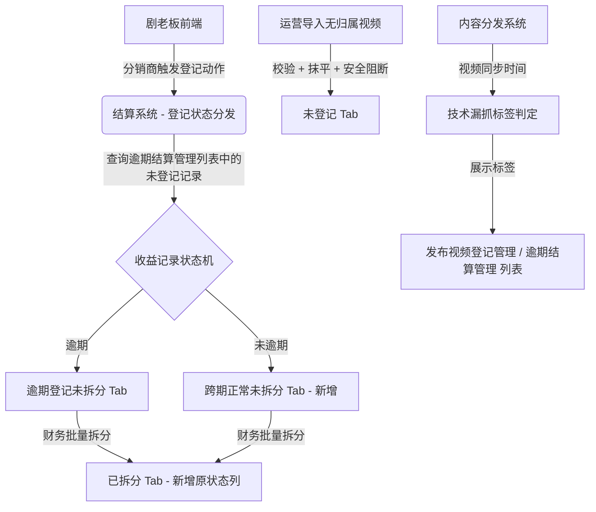
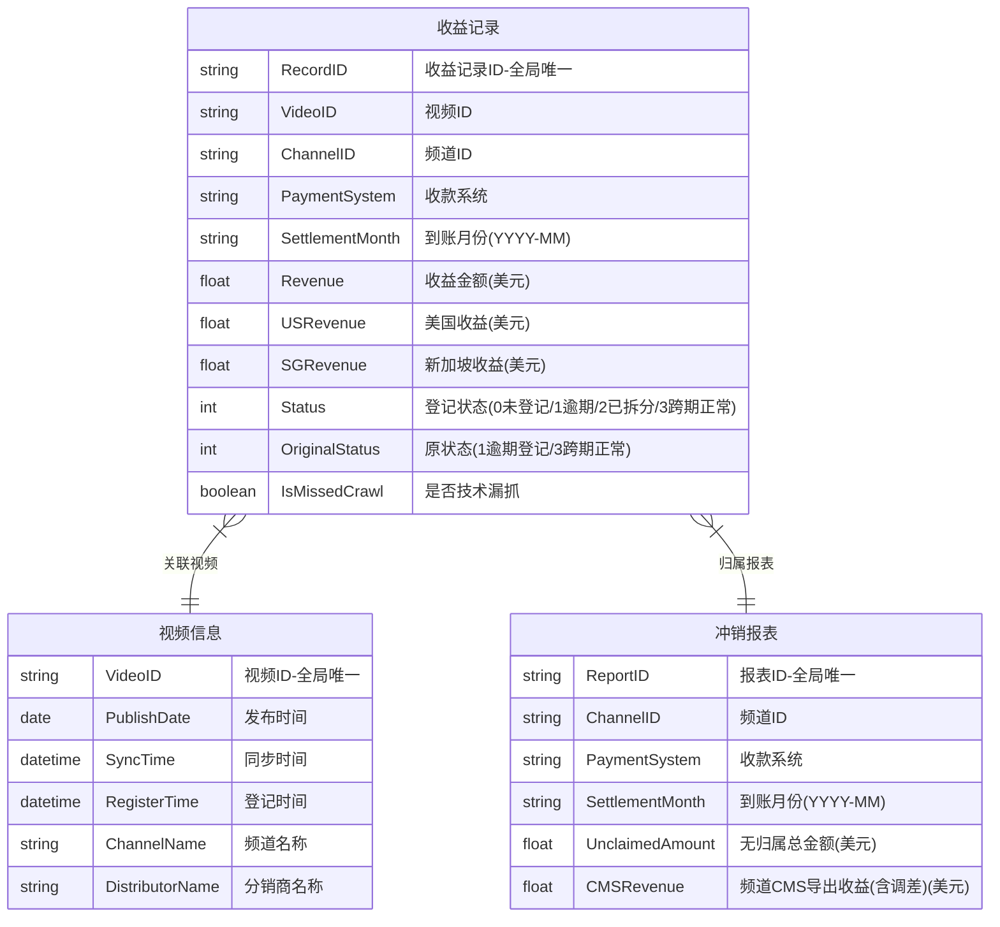
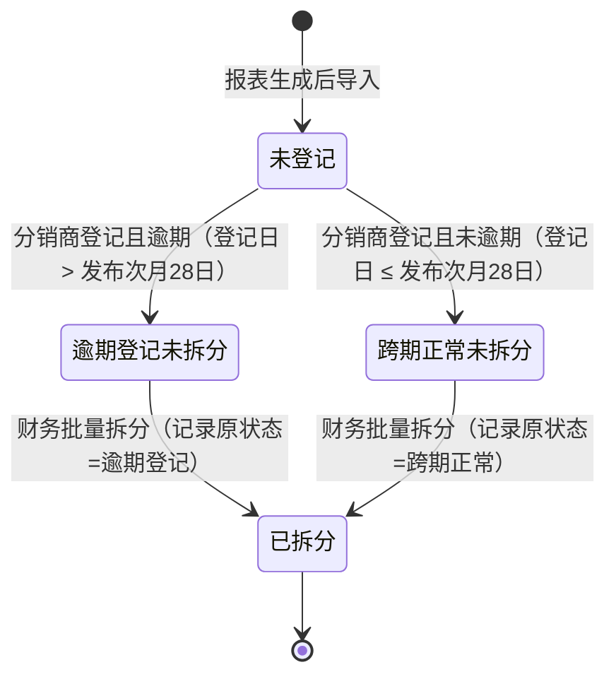
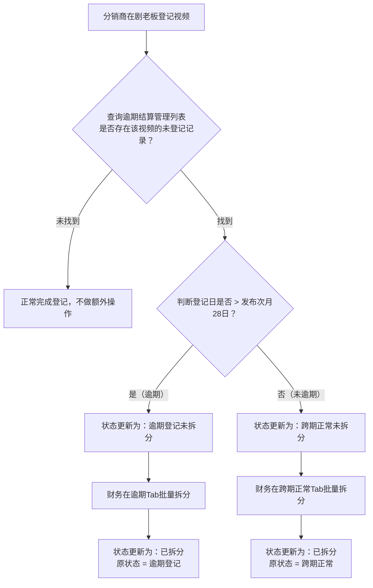
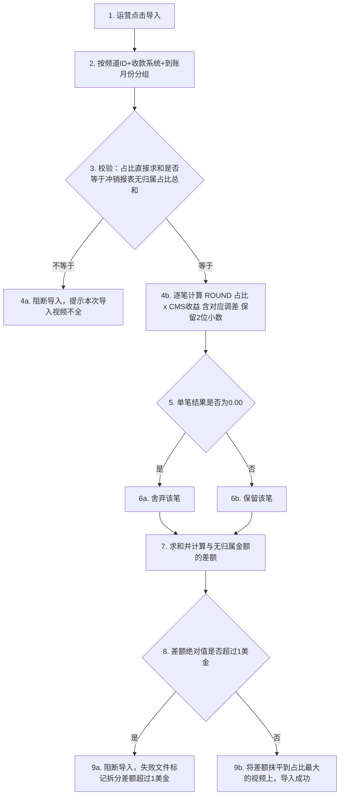

# PRD-内容结算系统迭代-V4.5

> **产出人**：产品经理
> **接收人**：前端开发、后端开发、测试工程师、UI/UX设计师
> **用途**：定义产品功能需求的完整规格，作为设计、开发和测试的唯一需求基准文档。

---

## 文档信息

| 项目 | 内容 |
|------|------|
| 文档名称 | PRD-内容结算系统迭代-V4.5 |
| 所属产品 | 小五出海通 - 内容结算系统 |
| 需求来源 | 业务目标（修复未公开先获利死锁、技术漏抓标识、导入精度误差） |
| 文档作者 | Manus AI |
| 创建日期 | 2026-03-30 |
| 最后更新 | 2026-04-02 |
| 文档状态 | 评审中 |
| 评审参与人 | 前端: 待定 / 后端: Qoder / 测试: 待定 / 设计: N/A |
| 关联文档 | 财务确认方案_未公开先获利及漏抓问题.md |

### 变更记录

| 版本 | 日期 | 修改人 | 修改内容 |
|------|------|--------|---------|
| V4.0 | 2026-03-30 | Manus AI | 按照pm-prd-generation技能规范重写，补充5区块结构、矩阵和状态机图 |
| V4.1 | 2026-04-02 | Manus AI | 按照V3.1技能规范修正：数据实体关系和数据字典改为纯业务层描述，去除技术字段名和物理类型；执行117项自检清单 |
| V4.2 | 2026-04-02 | Manus AI | 根据后端代码分析结果，修正状态枚举值（从0开始），补充【已拆分】Tab列表变更、排序规则、同维度扩展逻辑及相关技术确认项 |
| V4.3 | 2026-04-02 | Manus AI | 根据测试、后端、前端三方Review报告，澄清并更新20项核心业务逻辑与交互细节（含自动扩展边界、导入误差计算粒度、历史数据修复判定等） |
| V4.5 | 2026-04-10 | Manus AI | 需求评审反馈修正：1) 删除不存在的“变更登记1→3流转”场景；2) R1校验改为占比完整性校验；3) 美国收益对应调差2、新加坡收益对应调差3；4) 技术漏抓判定时间从次月20号调整为次月15号 |

---

## 一、需求概述

### 1.1 背景与目标

**业务背景**：

在内容结算系统的日常运营中，出现了一类特殊的"未公开先获利"视频，导致财务无法进行结算拆分。典型时间线为：视频在未公开状态下产生收益（例如2月25日产生收益），公开后（例如3月2日公开）分销商在"公开次月28日"前登记（例如4月2日登记，未逾期）。由于报表在29号及之后生成，此时视频尚未被分销商登记，该笔2月份的收益被归入【未登记】。分销商后来登记时，系统判定为"未逾期"，但缺乏对应的状态流转分支，导致数据从【未登记】列表消失，又进不去【逾期登记未拆分】列表，财务在界面上彻底找不到这笔款项，陷入死锁。

此外，系统存在抓取视频遗漏的情况，后经人工补抓再推送给分销商。如果推送时间较晚，分销商登记时可能已超过"发布次月28日"的红线，被系统误判为逾期，给财务线下核算违约金带来困扰。同时，在【未登记】Tab导入无归属视频时，系统根据"视频在频道下当月的收益占比 × CMS导出收益（25号+调差）"计算拆分金额。由于保留两位小数的进位问题，导致导入视频的求和金额与冲销表上的无归属总金额存在误差，缺乏自动抹平与安全阻断机制。

如果不解决这些问题，财务将无法完成这部分款项的正常拆分出账，且线下核算违约金缺乏系统数据支撑，导入误差也会导致账目不平。

**核心目标**：

| 目标编号 | 目标描述 | 衡量指标 | 目标值 |
|---------|---------|---------|--------|
| G1 | 修复状态机死锁，使"跨期正常"视频能被财务正常拆分出账 | 财务后台【跨期正常未拆分】Tab数据展示及批量拆分成功率 | 100% |
| G2 | 提供技术漏抓标识，辅助财务线下免除违约金决策 | 列表页【技术漏抓】标签展示准确率 | 100% |
| G3 | 实现导入金额自动抹平，确保导入总额与冲销表绝对一致 | 导入后求和金额与冲销表无归属金额的差值 | 0 |

**范围边界**：

| 维度 | 本期包含 | 本期不包含（后续迭代） |
|------|---------|---------------------|
| 功能范围 | 登记状态分发逻辑、财务后台UI平级扩展、导入误差抹平逻辑、技术漏抓标签 | 系统自动计算或扣除违约金（保持线下主观判断） |
| 用户范围 | 财务人员、运营人员、分销商 | 其他角色 |
| 平台范围 | 结算系统Web端、剧老板前端 | 移动端App |

### 1.2 用户角色与权限

| 角色 | 角色描述 | 可访问模块 | 核心权限 | 数据可见范围 |
|------|---------|----------|---------|------------|
| 财务人员 | 负责结算拆分与违约金核算 | 逾期结算处理（全部Tab） | 查看列表、批量拆分、导出 | 全部数据 |
| 运营人员 | 负责导入无归属视频 | 逾期结算处理（【未登记】Tab） | 导入 | 全部数据 |
| 分销商 | 负责在剧老板登记视频 | 剧老板前端 | 登记视频 | 本人名下视频 |

### 1.3 功能模块总览

| 模块编号 | 模块名称 | 功能点数 | 核心功能 | 优先级 | 依赖模块 |
|---------|---------|---------|---------|--------|---------|
| SET-01 | 登记状态分发 | 1 | 分销商登记时，根据逾期判定结果将【未登记】记录流转至对应状态 | P0 | 无 |
| SET-02 | 财务结算处理 | 2 | 新增【跨期正常未拆分】Tab及批量拆分；【已拆分】列表透传原状态 | P0 | SET-01 |
| SET-03 | 导入误差处理 | 1 | 导入无归属视频时的金额校验、最大占比抹平与安全阻断 | P1 | 无 |
| SET-04 | 漏抓责任界定 | 1 | 根据同步时间自动打【技术漏抓】标签并在列表展示 | P1 | 无 |

### 1.4 需求依赖与变更分析

#### 1.4.1 模块间依赖清单

| 上游模块 | 下游模块 | 依赖类型 | 依赖内容 | PRD 来源 |
|---------|---------|---------|---------|---------|
| 剧老板前端 | SET-01 登记状态分发 | 数据依赖 | 视频登记动作及视频ID | 隐性依赖-推断自业务流程 |
| 现有逾期判定逻辑 | SET-01 登记状态分发 | 规则依赖 | "登记日 > 发布次月28日"的判定规则 | 隐性依赖-推断自业务流程 |
| SET-01 登记状态分发 | SET-02 财务结算处理 | 状态依赖 | 记录状态必须流转为【跨期正常未拆分】才能在对应Tab展示 | 本文档 SET-02-01 |
| YouTube Reporting 数据 | SET-03 导入误差处理 | 数据依赖 | 频道CMS导出收益（25号+调差）和视频收益占比数据 | 隐性依赖-推断自业务流程 |
| 内容分发系统（视频同步） | SET-04 漏抓责任界定 | 数据依赖 | 视频同步时间 | 隐性依赖-推断自业务流程 |

#### 1.4.2 变更传播影响表

| 变更模块 | 变更内容 | 受影响的下游模块 | 影响说明 | PRD 是否覆盖 |
|---------|---------|---------------|---------|------------|
| 收益记录状态机 | 新增【跨期正常未拆分】状态 | 财务结算处理页面 | 需新增Tab承接新状态数据展示 | ✅ 已覆盖 |
| 批量拆分逻辑 | 拆分后记录原状态 | 【已拆分】列表 | 需新增一列展示原状态 | ✅ 已覆盖 |
| 导入逻辑 | 新增校验、抹平和安全阻断 | 导入失败文件 | 需在失败文件中标记具体失败原因 | ✅ 已覆盖 |
| 列表查询 | 新增漏抓标签字段 | 【发布视频登记管理】和【逾期结算管理】列表 | 需在列表中展示【技术漏抓】标签 | ✅ 已覆盖 |

### 1.5 业务模块关系概览

### 1.6 数据实体关系

> **边界说明**：本章节仅描述**业务实体**及其**业务关系**，用于帮助所有读者理解业务全貌。ER图中实体名使用英文标识符+中文显示名，字段使用英文标识符+中文注释，不代表技术实现的字段命名。技术侧的字段命名和数据库设计由后端团队在技术方案中决定，PRD中用🟡标记留给技术确认。

**数据实体说明**：

| 业务实体 | 业务含义 | 核心业务字段 | 与其他实体的业务关系 |
|---------|---------|------------|-------------------|
| 收益记录 | 每条视频在某个到账月份内的收益明细，是结算拆分的最小单位 | 视频ID、频道ID、收款系统、到账月份、收益金额、登记状态、原状态、是否技术漏抓 | N:1 关联视频信息；N:1 归属冲销报表 |
| 视频信息 | 视频的基础信息，包含发布、同步和登记的时间节点 | 视频ID、发布时间、同步时间、登记时间、频道名称、分销商名称 | 1:N 关联收益记录 |
| 冲销报表 | 按【频道 + 收款系统 + 到账月份】维度汇总的月度报表 | 报表ID、频道ID、收款系统、到账月份、无归属总金额、频道CMS导出收益(含调差) | 1:N 包含收益记录 |

---

## 二、功能详述

---

### 【SET-01-01】登记状态分发逻辑

**所属模块**：SET-01 登记状态分发
**需求来源**：业务目标（修复状态机死锁）
**关联功能**：→ 参见 【SET-02-01】财务结算处理页面Tab扩展
**优先级**：P0

---

#### ① 功能描述

**用户操作路径**：

| 段落 | 描述 |
|------|------|
| **入口** | 分销商在剧老板前端的视频登记页面 |
| **导航** | 填写视频登记信息 |
| **操作** | 点击【提交登记】按钮 |
| **结果** | 结算系统后端接收到登记请求，执行历史探查（查询【逾期结算管理】列表中是否存在该视频且状态为【未登记】的收益记录）和状态分发，更新收益记录状态 |
| **跳转/终止** | 剧老板前端提示登记成功，流程终止 |

**触发方式**：
- [x] 用户主动操作（分销商在剧老板前端点击【提交登记】按钮）
- [ ] 系统自动触发
- [ ] 第三方回调

**页面/交互说明**：

本功能为纯后端逻辑，无前端页面交互变更。分销商在剧老板前端的登记操作保持不变。后端在接收到登记请求后，异步执行以下逻辑：
1. 根据本次登记的视频ID，直接查询【逾期结算管理】列表，检索是否存在该视频且状态为【未登记】的收益记录（无需回溯原始冲销报表）。
2. 如果找到匹配记录，根据逾期判定规则执行状态分发。

---

#### ② 业务规则

**规则清单**：

| 规则编号 | 条件 | 结果 | 备注 |
|---------|------|------|------|
| R1 | 如果 在【逾期结算管理】列表中找到该视频的【未登记】记录，且 登记日 > 视频发布日期所在月份的次月28日 | 则 判定为逾期，将该记录状态从【未登记】更新为【逾期登记未拆分】 | 复用现有逾期判定逻辑 |
| R2 | 如果 在【逾期结算管理】列表中找到该视频的【未登记】记录，且 登记日 ≤ 视频发布日期所在月份的次月28日 | 则 判定为未逾期，将该记录状态从【未登记】更新为【跨期正常未拆分】 | **本次新增逻辑** |
| R3 | 如果 在【逾期结算管理】列表中未找到该视频的【未登记】记录 | 则 正常完成登记流程，不做额外状态分发操作 | 异常兜底 |

**枚举值定义**：

| 枚举字段 | 可选值 | 中文显示 | 说明 |
|---------|--------|---------|------|
| 登记状态 | 0 | 未登记 | 初始状态，报表生成导入时赋值 |
| | 1 | 逾期登记未拆分 | 分销商登记且逾期 |
| | 2 | 已拆分 | 财务完成批量拆分 |
| | 3 | 跨期正常未拆分 | 分销商登记且未逾期（**本次新增**） |

**边界值定义**：

| 边界场景 | 阈值 | 超过后行为 |
|---------|------|----------|
| 逾期判定红线 | 视频发布日期所在月份的次月28日 | 登记日超过此日期则判定为逾期 |
| 登记日基准 | 分销商在剧老板提交登记操作的时间 | 以剧老板系统时间为准 |

**状态流转**：

| 当前状态 | 触发条件 | 业务操作所需信息 | 业务结果与系统响应 | 目标状态 |
|---------|---------|----------------|-----------------|---------|
| 未登记 | 分销商在剧老板登记视频，且登记日 > 发布次月28日 | 视频ID、登记日期、视频发布日期 | 收益记录状态更新为【逾期登记未拆分】 | 逾期登记未拆分 |
| 未登记 | 分销商在剧老板登记视频，且登记日 ≤ 发布次月28日 | 视频ID、登记日期、视频发布日期 | 收益记录状态更新为【跨期正常未拆分】 | 跨期正常未拆分 |

| 逾期登记未拆分 | 财务在后台点击【批量拆分】 | 勾选的记录列表 | 按通道ID汇总拆分到对应月份冲销表，记录原状态为"逾期登记" | 已拆分 |
| 跨期正常未拆分 | 财务在后台点击【批量拆分】 | 勾选的记录列表 | 按通道ID汇总拆分到对应月份冲销表，记录原状态为"跨期正常" | 已拆分 |

---

#### ③ 验收标准

- [ ] AC1：当分销商登记视频且登记日大于发布次月28日时，系统**应**将该视频在【逾期结算管理】列表中的【未登记】记录状态更新为【逾期登记未拆分】。
- [ ] AC2：当分销商登记视频且登记日小于等于发布次月28日时，系统**应**将该视频在【逾期结算管理】列表中的【未登记】记录状态更新为【跨期正常未拆分】。
- [ ] AC3：当分销商登记视频但在【逾期结算管理】列表中未找到对应的【未登记】记录时，系统**应**正常完成登记流程，不抛出异常，不影响登记成功。
- [ ] AC4：当同一视频在多个到账月份存在【未登记】记录时，系统**应**对所有匹配的记录逐条执行状态分发。

---

#### ④ 技术确认项

**4.1 接口信息** 🟡

| 确认项 | 产品的问题 | 技术回答 | 状态 |
|-------|-----------|---------|------|
| 接口路径 | 本功能是否复用现有的视频登记接口，在其后置逻辑中新增状态分发？ | 🟡 待确认 | |
| 判定依据 | 现有代码使用 `video_composition.relatedType` 判定逾期，新增逻辑是否继续沿用此字段？ | 🟡 待确认 | |
| 异步方式 | 状态分发逻辑是同步执行还是异步执行？如果异步，采用什么机制？ | 🟡 待确认 | |

**4.2 字段映射** 🟡

| 产品术语 | 技术确认的字段名 | 字段类型 | 状态 |
|---------|----------------|---------|------|
| "登记状态"中的"跨期正常未拆分" | 🟡 待确认（建议枚举值=3） | 🟡 | |
| "原状态" | 🟡 待确认 | 🟡 | |

**4.3 关联系统** 🟡

| 确认项 | 产品的问题 | 技术回答 | 状态 |
|-------|-----------|---------|------|
| 外部系统依赖 | 本功能是否依赖剧老板前端的登记接口调用？ | 🟡 待确认 | |
| 数据来源 | 历史探查查询的是哪个数据表？ | 🟡 待确认 | |

**4.4 已有接口变更** 🟡

| 原接口路径 | 变更内容 | 技术回答 | 状态 |
|-----------|---------|---------|------|
| 视频登记接口 | 新增后置状态分发逻辑 | 🟡 待确认 | |

---

#### ⑤ 异常与降级

| 异常场景 | 用户看到什么（产品填写） | 系统如何处理（技术填写） |
|---------|----------------------|----------------------|
| 状态分发时数据库更新失败 | 🟢 分销商端提示"登记成功"（登记本身不受影响），后台记录异常日志 | 接受静默失败，依赖现有的异常日志监控，不增加额外的财务端告警机制 |
| 并发登记同一视频 | 🟢 分销商端提示"该视频已被登记" | 🟡 待确认（防重机制） |
| 查询【逾期结算管理】列表超时 | 🟢 分销商端提示"登记成功"（登记本身不受影响），后台记录异常日志 | 🟡 待确认（超时时间和降级策略） |

---

### 【SET-02-01】财务结算处理页面Tab扩展

**所属模块**：SET-02 财务结算处理
**需求来源**：业务目标（UI平级扩展，承接新状态数据）
**关联功能**：→ 参见 【SET-01-01】登记状态分发逻辑
**优先级**：P0

---

#### ① 功能描述

**用户操作路径**：

| 段落 | 描述 |
|------|------|
| **入口** | 财务人员进入"逾期结算处理"页面 |
| **导航** | 点击【跨期正常未拆分】Tab（新增，位于【逾期登记未拆分】和【已拆分】之间） |
| **操作** | 使用查询条件筛选数据，勾选列表中的记录，点击【批量拆分】按钮 |
| **结果** | 系统执行与【逾期登记未拆分】完全相同的自动汇总拆分逻辑（按通道ID汇总，拆分到对应月份冲销表），记录流转至【已拆分】Tab，并保存原状态为"跨期正常" |
| **跳转/终止** | 页面刷新，提示"操作成功"，停留在当前Tab |

**触发方式**：
- [x] 用户主动操作（点击Tab切换、使用查询条件筛选、勾选记录、点击【批量拆分】按钮）
- [ ] 系统自动触发
- [ ] 第三方回调

**页面/交互说明**：

在现有的"逾期结算处理"页面，Tab栏新增【跨期正常未拆分】，位于【逾期登记未拆分】和【已拆分】之间。改造后Tab顺序为：

> 未登记 | 逾期登记未拆分 | **跨期正常未拆分（新增）** | 已拆分

该Tab下的查询条件（到账月份、频道名称、频道ID、视频ID、分销商名称、子集名称、CP名称，共7个）、列表表头字段（到账月份、频道名称、收款系统、视频ID、收益($)、美国收益($)、新加坡收益($)、子集名称、CP名称、套餐、语种、视频发布时间、分销商名称、登记时间）、分页规则（默认每页20条）、【批量拆分】和【导出】按钮**完全复用**【逾期登记未拆分】Tab的组件，前端仅需在请求接口时传入不同的状态参数。

右上角注词修改为："*注：此类视频登记时间未超过发布次月28日，属于正常跨期认领，拆分时不扣除违约金。*"

**批量拆分确认弹窗**：
点击【批量拆分】后，弹出确认弹窗，文案为："将对勾选视频所在「频道 + 到账月份」，自动根据【子集+CP+套餐】汇总已登记视频收益，在到账月份的冲销表中自动拆分，是否确认执行？（系统将自动处理同频道+同月份的全部记录）"

**【已拆分】Tab列表变更**：
在【已拆分】Tab的列表中，新增一列【原状态】，插入在"登记时间"列之后。颜色使用系统现有的成功色（如 `#22c55e` 或 `success` 变量）表示跨期正常，默认色表示逾期登记。用于展示该记录在拆分前是"逾期登记"还是"跨期正常"。同时，该列表也需支持展示【技术漏抓】标签。

**导出功能适配**：
所有Tab下点击【导出】按钮时，导出的Excel文件均需适配新增字段：
- **【已拆分】Tab导出**：**必须**包含新增的"原状态"列和"技术漏抓"标识，以便财务人员在线下核算违约金时有明确的数据依据。
- **【逾期登记未拆分】和【跨期正常未拆分】Tab导出**：**必须**包含"技术漏抓"标识。

**列表默认排序规则**：
- 【跨期正常未拆分】Tab：默认按"登记时间"倒序排列（与现有的逾期Tab保持一致）。

---

#### ② 业务规则

**规则清单**：

| 规则编号 | 条件 | 结果 | 备注 |
|---------|------|------|------|
| R1 | 如果 用户点击【跨期正常未拆分】Tab | 则 展示登记状态为【跨期正常未拆分】的收益记录列表 | 接口传参 status=3 |
| R2 | 如果 用户在该Tab下勾选记录并点击【批量拆分】 | 则 执行与【逾期登记未拆分】完全相同的自动汇总拆分逻辑（按通道ID汇总，拆分到对应月份冲销表），且需包含"自动扩展到同维度记录"的逻辑 | 自动扩展仅限同状态记录，跨期Tab只扩展跨期，逾期Tab只扩展逾期，两者隔离 |
| R3 | 如果 记录被成功拆分 | 则 登记状态更新为【已拆分】，同时将拆分前的状态（"逾期登记"或"跨期正常"）保存至"原状态"字段 | 用于【已拆分】列表展示 |
| R4 | 如果 用户未勾选任何记录即点击【批量拆分】 | 则 按钮置灰不可点击，或弹出提示"请先选择需要拆分的记录" | |

**数据格式化展示规则**：

| 数据类型 | 检查项 | 示例 |
|---------|--------|------|
| 金额/货币 | 保留两位小数，无千分位，美元符号在列表表头标注 | 1234.56 |
| 日期/时间 | 格式为 YYYY-MM-DD HH:mm:ss | 2026-03-11 19:11:08 |
| 到账月份 | 格式为 YYYY-MM | 2026-02 |
| 空值 | 数值型空值展示为 0，文本型空值展示为空 | |
| 枚举/状态 | 【原状态】列：逾期登记 = 默认文字色；跨期正常 = 绿色文字 | 历史记录原状态列展示为"-"，导出时为空 |

---

#### ③ 验收标准

- [ ] AC1：财务人员**应**能在"逾期结算处理"页面看到新增的【跨期正常未拆分】Tab，位于【逾期登记未拆分】和【已拆分】之间。
- [ ] AC2：点击【跨期正常未拆分】Tab时，系统**应**展示登记状态为【跨期正常未拆分】的收益记录列表，且7个查询条件和表头字段与【逾期登记未拆分】Tab完全一致。
- [ ] AC3：【跨期正常未拆分】Tab下的右上角注词**应**显示为"注：此类视频登记时间未超过发布次月28日，属于正常跨期认领，拆分时不扣除违约金。"
- [ ] AC4：在【跨期正常未拆分】Tab下勾选记录并点击【批量拆分】时，系统**应**弹出详版确认弹窗，确认后成功执行拆分（按通道ID汇总，拆分到对应月份冲销表），并将记录流转至【已拆分】Tab。
- [ ] AC5：拆分成功后，页面**应**提示"操作成功"，并刷新当前Tab列表。
- [ ] AC6：在【已拆分】Tab的列表中，**应**在"登记时间"列之后新增一列【原状态】，正确展示该记录拆分前是"逾期登记"还是"跨期正常"（历史记录展示为"-"）。
- [ ] AC7：未勾选任何记录时，【批量拆分】按钮**应**置灰不可点击，或点击后弹出提示"请先选择需要拆分的记录"。

---

#### ④ 技术确认项

**4.1 接口信息** 🟡

| 确认项 | 产品的问题 | 技术回答 | 状态 |
|-------|-----------|---------|------|
| 列表查询接口 | 是否复用现有列表查询接口，仅通过状态参数（status=3）区分？ | 🟡 待确认 | |
| 批量拆分接口 | 是否复用现有批量拆分接口？拆分时如何传递原状态信息？ | 🟡 待确认 | |

**4.2 字段映射** 🟡

| 产品术语 | 技术确认的字段名 | 字段类型 | 状态 |
|---------|----------------|---------|------|
| "原状态"列 | 🟡 待确认 | 🟡 | |

**4.3 关联系统** 🟡

| 确认项 | 产品的问题 | 技术回答 | 状态 |
|-------|-----------|---------|------|
| 外部系统依赖 | 无 | — | — |

**4.4 已有接口变更** 🟡

| 原接口路径 | 变更内容 | 技术回答 | 状态 |
|-----------|---------|---------|------|
| 批量拆分接口 | 拆分时需保存原状态信息 | 🟡 待确认 | |
| 已拆分列表查询接口 | 返回数据需新增"原状态"字段 | 🟡 待确认 | |

---

#### ⑤ 异常与降级

| 异常场景 | 用户看到什么（产品填写） | 系统如何处理（技术填写） |
|---------|----------------------|----------------------|
| 批量拆分部分失败 | 🟢 提示"拆分部分完成，X条成功，Y条失败，请重试失败记录" | 🟡 待确认（部分成功时的事务策略） |
| 列表数据为空 | 🟢 展示空状态页，文案"暂无跨期正常未拆分的记录" | 🟡 待确认（返回空数组） |
| 网络超时 | 🟢 提示"网络异常，请稍后重试" | 🟡 待确认（超时时间） |
| 重复点击批量拆分 | 🟢 点击后按钮立即置灰，防止重复提交 | 🟡 待确认（后端防重机制） |

---

#### ⑥ 页面全状态定义

| 状态 | 定义 | 前端需要知道的 |
|------|------|-------------|
| 初始状态 | 首次进入【跨期正常未拆分】Tab | 自动触发数据加载，使用默认查询条件 |
| 加载状态 | 数据请求中 | 展示加载动画（复用现有Tab的加载样式） |
| 正常状态 | 数据加载成功，正常展示 | 按数据格式化展示规则展示，支持勾选和批量拆分 |
| 空状态 | 查询无结果/列表为空 | 展示"暂无跨期正常未拆分的记录"，不展示【批量拆分】按钮 |
| 错误状态 | 接口失败/网络异常 | 提示"加载失败，请重试"，提供重试按钮 |
| 禁用状态 | 非财务角色访问 | 整个Tab不可见（权限控制在菜单级） |

---

### 【SET-03-01】导入误差处理逻辑

**所属模块**：SET-03 导入误差处理
**需求来源**：业务目标（解决导入金额精度误差）
**关联功能**：无
**优先级**：P1

---

#### ① 功能描述

**用户操作路径**：

| 段落 | 描述 |
|------|------|
| **入口** | 运营人员在"逾期结算处理"页面的【未登记】Tab |
| **导航** | 点击【导入】按钮，选择导入文件 |
| **操作** | 点击【确认导入】 |
| **结果** | 系统按【频道ID + 收款系统 + 到账月份】维度执行前置校验、逐笔计算、误差抹平和安全阻断逻辑 |
| **跳转/终止** | 导入成功则刷新列表，提示"导入成功，共导入X条记录"；导入失败则在ImportDialog弹窗内展示下载按钮，提示"部分频道导入失败，请下载失败文件查看原因" |

**触发方式**：
- [x] 用户主动操作（点击【确认导入】按钮）
- [ ] 系统自动触发
- [ ] 第三方回调

**页面/交互说明**：

前端交互保持不变，主要为后端导入逻辑的升级。导入失败时，失败文件中需按频道维度标记具体的失败原因。在ImportDialog弹窗内展示下载按钮。

---

#### ② 业务规则

**规则清单**：

| 规则编号 | 条件 | 结果 | 备注 |
|---------|------|------|------|
| R1 | 如果 按【频道ID + 收款系统 + 到账月份】维度，将导入视频的收益占比直接求和（不取整），结果 ≠ 冲销报表上该维度下无归属视频的占比总和 | 则 阻断该频道的导入，提示"本次导入视频不全，占比校验不通过" | 前置完整性校验（仅校验占比完整性，不乘以金额） |
| R2 | 如果 R1校验通过，逐笔计算 `ROUND(单个视频收益占比 × 频道CMS导出收益(25号+调差1), 2)` 的结果约等于0（即四舍五入后为0.00） | 则 舍弃该笔金额，不参与后续求和 | 零值清理（总收益） |
| R3 | 如果 R1校验通过，所有视频按频道内收益占比降序排列，逐笔四舍五入后求和金额与冲销报表无归属金额存在差额 | 则 将差额累加到收益占比最大的那一笔视频上 | 误差抹平逻辑（总收益） |
| R4 | 如果 R3中的抹平差额绝对值 > 1美金 | 则 阻断该频道的导入，在失败文件中标记：`【异常：拆分差额超过1美金，请检查】` | 安全阈值阻断（总收益） |
| R5 | 如果 全部视频取整后均为0.00，导致求和为0 | 则 触发R4阻断逻辑，禁止该频道导入，失败文件标记"异常：单笔金额过小导致精度丢失，请检查" | 极端情况阻断（总收益） |
| R6 | 如果 针对美国收益和新加坡收益，也需要执行与总收益相同的误差处理逻辑 | 则 逐笔计算 `ROUND(单个视频收益占比 × 频道CMS导出美国收益(25号+调差2), 2)` 和 `ROUND(单个视频收益占比 × 频道CMS导出新加坡收益(25号+调差3), 2)`，零值舍弃，差额抹平到占比最大的视频上，若差额绝对值 > 1美金则阻断导入 | 美国/新加坡收益的误差处理 |

**边界值定义**：

| 边界场景 | 阈值 | 超过后行为 |
|---------|------|----------|
| 抹平差额过大 | 绝对值 > 1美金 | 阻断该频道导入，失败文件标记`【异常：拆分差额超过1美金，请检查】` |
| 单笔四舍五入后为零 | 0.00美金 | 舍弃该笔金额 |
| CMS导出收益口径 | 包含调差金额（总收益含调差1，美国收益含调差2，新加坡收益含调差3） | 总收益=revenue+adjustedAmount1 |

**数据格式化展示规则**：

| 数据类型 | 检查项 | 示例 |
|---------|--------|------|
| 金额/货币 | 保留两位小数，四舍五入 | 0.28 |
| 百分比/占比 | 保留原始精度，不做截断 | 0.0000583 |

---

#### ③ 验收标准

- [ ] AC1：当按【频道ID + 收款系统 + 到账月份】维度计算的收益占比总和与冲销报表上该维度下无归属视频的占比总和不一致时，系统**应**阻断该频道的导入并提示"本次导入视频不全，占比校验不通过"。
- [ ] AC2：当校验通过且单笔视频四舍五入后金额为0.00时，系统**应**舍弃该笔金额，不参与求和（总收益、美国收益、新加坡收益均适用）。
- [ ] AC3：当校验通过且存在抹平差额（绝对值 ≤ 1美金）时，系统**应**将差额累加到收益占比最大的视频上，并成功导入（总收益、美国收益、新加坡收益均适用）。
- [ ] AC4：当抹平差额绝对值大于1美金时，系统**应**阻断该频道导入，并在失败文件中标记`【异常：拆分差额超过1美金，请检查】`（总收益、美国收益、新加坡收益任一超限均阻断）。
- [ ] AC5：导入成功后，系统**应**提示"导入成功，共导入X条记录"，并刷新【未登记】Tab列表。
- [ ] AC6：导入部分失败时，系统**应**在ImportDialog弹窗内展示下载按钮，提示"部分频道导入失败，请下载失败文件查看原因"。

---

#### ④ 技术确认项

**4.1 接口信息** 🟡

| 确认项 | 产品的问题 | 技术回答 | 状态 |
|-------|-----------|---------|------|
| 接口路径 | 是否复用现有导入接口，在其逻辑中新增校验和抹平步骤？ | 🟡 待确认 | |
| 导入文件格式 | 导入文件的格式和字段规范是否有变化？ | 🟡 待确认 | |

**4.2 字段映射** 🟡

| 产品术语 | 技术确认的字段名 | 字段类型 | 状态 |
|---------|----------------|---------|------|
| "收益占比" | 🟡 待确认 | 🟡 | |
| "频道CMS导出收益(25号+调差)" | 🟡 待确认 | 🟡 | |

**4.3 关联系统** 🟡

| 确认项 | 产品的问题 | 技术回答 | 状态 |
|-------|-----------|---------|------|
| 数据来源 | 冲销报表的无归属金额从哪里读取？ | 🟡 待确认 | |
| 数据来源 | 频道CMS导出收益(25号+调差)从哪里读取？ | 🟡 待确认 | |

**4.4 已有接口变更** 🟡

| 原接口路径 | 变更内容 | 技术回答 | 状态 |
|-----------|---------|---------|------|
| 导入接口 | 新增前置校验、零值清理、误差抹平和安全阻断逻辑 | 🟡 待确认 | |

---

#### ⑤ 异常与降级

| 异常场景 | 用户看到什么（产品填写） | 系统如何处理（技术填写） |
|---------|----------------------|----------------------|
| 导入文件格式错误 | 🟢 提示"文件格式错误，请使用标准模板" | 🟡 待确认 |
| 冲销报表数据不存在 | 🟢 提示"未找到对应的冲销报表数据，请确认到账月份是否正确" | 🟡 待确认 |
| 导入文件过大 | 🟢 提示"文件过大，请分批导入（最大5MB）" | 维持现有的5MB限制不变 |

---

### 【SET-04-01】技术漏抓标签展示

**所属模块**：SET-04 漏抓责任界定
**需求来源**：业务目标（辅助财务线下违约金决策）
**关联功能**：无
**优先级**：P1

---

#### ① 功能描述

**用户操作路径**：

| 段落 | 描述 |
|------|------|
| **入口** | 财务人员进入【发布视频登记管理】或【逾期结算管理】列表页 |
| **导航** | 浏览列表数据 |
| **操作** | 查看视频记录（无需额外操作） |
| **结果** | 若视频符合漏抓条件，系统在对应记录旁展示【技术漏抓】标签 |
| **跳转/终止** | 无跳转，流程终止 |

**触发方式**：
- [ ] 用户主动操作
- [x] 系统自动触发（数据入库时打标）
- [ ] 第三方回调

**页面/交互说明**：

在【发布视频登记管理】（已登记Tab）和【逾期结算管理】（全部4个Tab）列表中，针对符合条件的视频，在视频ID正下方（换行）增加醒目的【技术漏抓】标签（建议使用橙色背景、白色文字、圆角矩形样式）。标签为只读展示，不可点击。增加 hover tooltip 提示："同步时间 > 发布次月15号，系统判定为技术漏抓"。

---

#### ② 业务规则

**规则清单**：

| 规则编号 | 条件 | 结果 | 备注 |
|---------|------|------|------|
| R1 | 如果 视频同步时间 > 视频发布日期所在月份的次月15号 23:59:59 | 则 在列表中展示【技术漏抓】标签 | |
| R2 | 如果 视频同步时间 ≤ 视频发布日期所在月份的次月15号 23:59:59 | 则 不展示标签 | |
| R3 | 如果 视频同步时间为空 | 则 不展示标签，按非漏抓处理 | 空值兜底 |

**边界值定义**：

| 边界场景 | 阈值 | 超过后行为 |
|---------|------|----------|
| 漏抓判定红线 | 视频发布日期所在月份的次月15号 23:59:59 | 同步时间超过此日期则标记为技术漏抓 |

**数据格式化展示规则**：

| 数据类型 | 检查项 | 示例 |
|---------|--------|------|
| 枚举/状态 | 【技术漏抓】标签样式 | 橙色背景、白色文字、圆角矩形 |

---

#### ③ 验收标准

- [ ] AC1：当视频的同步时间大于发布日期所在月份的次月15号 23:59:59时，系统**应**在【发布视频登记管理】列表中展示【技术漏抓】标签。
- [ ] AC2：当视频的同步时间大于发布日期所在月份的次月15号 23:59:59时，系统**应**在【逾期结算管理】列表中展示【技术漏抓】标签。
- [ ] AC3：当视频的同步时间小于等于发布日期所在月份的次月15号 23:59:59时，系统**不应**展示【技术漏抓】标签。
- [ ] AC4：当视频的同步时间为空时，系统**不应**展示【技术漏抓】标签。

---

#### ④ 技术确认项

**4.1 接口信息** 🟡

| 确认项 | 产品的问题 | 技术回答 | 状态 |
|-------|-----------|---------|------|
| 接口变更 | 列表查询接口是否需要新增返回漏抓标识字段？ | 🟡 待确认 | |

**4.2 字段映射** 🟡

| 产品术语 | 技术确认的字段名 | 字段类型 | 状态 |
|---------|----------------|---------|------|
| "技术漏抓"标识 | 🟡 待确认 | 🟡 | |

**4.3 关联系统** 🟡

| 确认项 | 产品的问题 | 技术回答 | 状态 |
|-------|-----------|---------|------|
| 数据来源 | 视频同步时间从哪个系统/数据表获取？ | 🟡 待确认 | |

**4.4 已有接口变更** 🟡

| 原接口路径 | 变更内容 | 技术回答 | 状态 |
|-----------|---------|---------|------|
| 发布视频登记管理列表查询接口 | 返回数据新增漏抓标识字段 | 🟡 待确认 | |
| 逾期结算管理列表查询接口 | 返回数据新增漏抓标识字段 | 🟡 待确认 | |

---

#### ⑤ 异常与降级

| 异常场景 | 用户看到什么（产品填写） | 系统如何处理（技术填写） |
|---------|----------------------|----------------------|
| 同步时间字段为空 | 🟢 不展示标签，按非漏抓处理 | 🟡 待确认（默认值处理） |
| 发布时间字段为空 | 🟢 不展示标签，按非漏抓处理 | 🟡 待确认（默认值处理） |

---

## 三、非功能需求

### 3.1 性能要求

| 场景 | 指标 | 目标值 | 备注 |
|------|------|--------|------|
| 登记接口响应时间（含状态分发） | P99延迟 | < 500ms | 状态分发如采用异步则不影响登记响应时间 |
| 批量拆分接口响应时间 | P99延迟 | < 3s | 暂不做前端拦截，由后端保证性能 |
| 列表页加载 | 首屏加载时间 | < 2s | |
| 导入接口处理时间 | 单次导入 | < 30s | 导入数据量级：每月每频道数百至数千条 |
| 数据量级 | 收益记录总量 | 当前百万级，1年后预计千万级 | |

### 3.2 安全要求

| 维度 | 要求 | 说明 |
|------|------|------|
| 权限控制 | 角色级 | 仅财务人员可执行批量拆分操作；仅运营人员可执行导入操作 |
| 审计日志 | 记录关键操作 | 记录批量拆分操作日志（操作人、操作时间、处理记录数），保留至少1年 |
| 操作确认 | 批量拆分需二次确认 | 点击【批量拆分】后弹出确认弹窗 |

### 3.3 兼容性要求

| 维度 | 要求 | 说明 |
|------|------|------|
| 浏览器兼容 | Chrome/Edge 最近3个版本 | |
| 数据迁移 | 历史死锁数据修复 | 需编写数据修复脚本，将历史上已登记但未逾期且未参与结算的记录状态刷为【跨期正常未拆分】。以登记时间与发布次月28日比较，无登记时间则跳过。 |
| 接口兼容 | 新增状态值不影响现有接口 | 现有接口按状态值筛选，新增status=3不影响status=0/1/2的查询 |

### 3.4 国际化/多语言

| 维度 | 要求 | 说明 |
|------|------|------|
| 货币/单位 | 金额统一以美元($)为单位 | 保留两位小数 |

---

## 四、附录

### 附录A：术语表

| 产品术语 | 含义说明 |
|---------|---------|
| 跨期正常未拆分 | 视频在公开次月28日前登记（未逾期），但跨越了报表生成周期，导致收益记录需要补充拆分的状态 |
| 技术漏抓 | 视频同步到系统的时间晚于发布日期所在月份的次月15号，表明系统抓取存在延迟，分销商的逾期责任不在其自身 |
| 冲销报表 | 按【频道 + 收款系统 + 到账月份】维度汇总的月度收益报表 |
| 无归属金额 | 冲销报表中，未被任何分销商认领的收益总额 |
| CMS导出收益(25号+调差) | YouTube CMS系统在每月25号导出的频道收益数据，包含调差金额，作为拆分计算的基准。总收益包含调差1，美国收益包含调差2，新加坡收益包含调差3。 |
| 收益占比 | 单个视频在频道内当月收益的占比，用于按比例拆分无归属金额 |
| 批量拆分 | 财务人员在后台勾选记录后，系统自动按通道ID汇总并拆分到对应月份冲销表的操作 |
| 原状态 | 收益记录在被拆分前的登记状态（逾期登记 或 跨期正常），用于财务线下核算违约金的参考依据 |

### 附录B：待确认事项汇总

| 编号 | 所属功能 | 待确认内容 | 确认方 | 状态 | 确认结果 |
|------|---------|-----------|--------|------|---------|
| TBD-1 | SET-01-01 | 登记接口后置逻辑是同步还是异步执行？ | 后端 | 🟡待确认 | |
| TBD-2 | SET-01-01 | 历史探查查询的具体数据表和字段 | 后端 | 🟡待确认 | |
| TBD-3 | SET-02-01 | 列表查询接口是否复用现有接口，仅通过状态参数区分？ | 前端/后端 | 🟡待确认 | |
| TBD-4 | SET-02-01 | 批量拆分接口如何传递和保存原状态信息？ | 后端 | 🟡待确认 | |
| TBD-5 | SET-03-01 | 导入文件格式和字段规范是否有变化？ | 后端 | 🟡待确认 | |
| TBD-6 | SET-03-01 | 冲销报表无归属金额和频道CMS导出收益的数据来源 | 后端 | 🟡待确认 | |
| TBD-7 | SET-04-01 | 漏抓标识是入库时打标还是查询时动态计算？ | 后端 | 🟡待确认 | |
| TBD-8 | SET-04-01 | 视频同步时间的数据来源系统和字段 | 后端 | 🟡待确认 | |
| TBD-9 | 非功能需求 | 批量拆分单次处理记录数上限 | 后端 | 🟡待确认 | 暂不做拦截 |
| TBD-10 | 兼容性 | 历史死锁数据修复脚本的影响范围和执行时机 | 后端 | 🟡待确认 | |

### 附录C：核心业务流程图

**流程一：分销商登记触发状态分发**

**流程二：导入误差处理**

### 附录D：数据字典

> **边界说明**：本章节仅定义字段的**业务约束**，不涉及技术实现。产品经理只需定义业务规则，技术侧字段命名和类型由后端团队在技术方案中决定。

| 业务实体 | 业务字段名（中文） | 业务规则限制 | 必填 | 默认值 | 说明 |
|---------|-----------------|-------------|------|--------|------|
| 收益记录 | 收益记录ID | 全局唯一 | 是 | 系统自动生成 | |
| 收益记录 | 视频ID | 关联视频信息实体 | 是 | 无 | |
| 收益记录 | 频道ID | 文本 | 是 | 无 | |
| 收益记录 | 收款系统 | 文本 | 是 | 无 | |
| 收益记录 | 到账月份 | 格式为YYYY-MM | 是 | 无 | |
| 收益记录 | 收益金额 | 保留2位小数，不允许为负数，单位美元 | 是 | 0.00 | |
| 收益记录 | 美国收益 | 保留2位小数，不允许为负数，单位美元 | 是 | 0.00 | |
| 收益记录 | 新加坡收益 | 保留2位小数，不允许为负数，单位美元 | 是 | 0.00 | |
| 收益记录 | 登记状态 | 枚举值：0=未登记，1=逾期登记未拆分，2=已拆分，3=跨期正常未拆分 | 是 | 0（未登记） | 3为本次新增 |
| 收益记录 | 原状态 | 枚举值：1=逾期登记，3=跨期正常 | 否 | 空 | 仅在登记状态变为"已拆分"时赋值 |
| 收益记录 | 是否技术漏抓 | 是/否 | 是 | 否 | 根据同步时间与发布次月15号比较判定 |
| 视频信息 | 视频ID | 全局唯一 | 是 | 无 | |
| 视频信息 | 发布时间 | 格式为YYYY-MM-DD | 是 | 无 | 视频在YouTube上的公开日期 |
| 视频信息 | 同步时间 | 格式为YYYY-MM-DD HH:mm:ss | 否 | 空 | 视频同步到剧老板系统的时间 |
| 视频信息 | 登记时间 | 格式为YYYY-MM-DD HH:mm:ss | 否 | 空 | 分销商在剧老板登记的时间 |
| 视频信息 | 频道名称 | 最多100个字符 | 是 | 无 | |
| 视频信息 | 分销商名称 | 最多100个字符 | 否 | 空 | 登记后赋值 |
| 冲销报表 | 报表ID | 全局唯一 | 是 | 系统自动生成 | |
| 冲销报表 | 频道ID | 文本 | 是 | 无 | |
| 冲销报表 | 收款系统 | 文本 | 是 | 无 | |
| 冲销报表 | 到账月份 | 格式为YYYY-MM | 是 | 无 | |
| 冲销报表 | 无归属总金额 | 保留2位小数，不允许为负数，单位美元 | 是 | 0.00 | |
| 冲销报表 | 频道CMS导出收益(含调差) | 保留2位小数，单位美元 | 是 | 无 | 每月25号从YouTube CMS导出，包含调差金额 |
