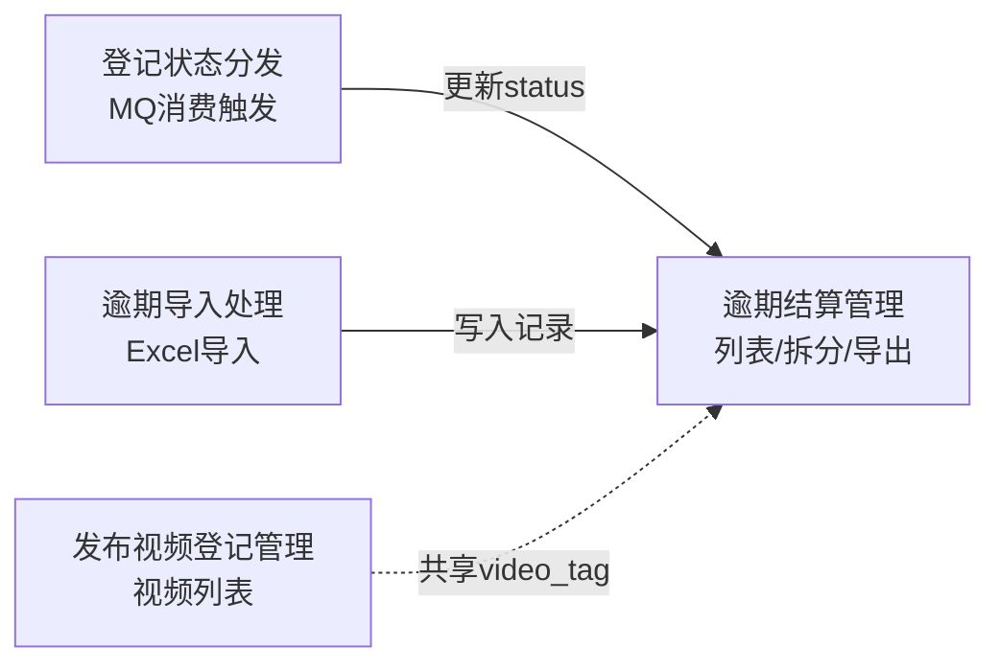
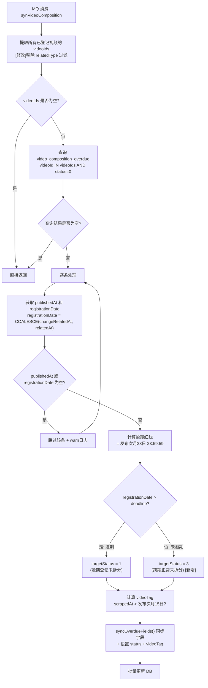
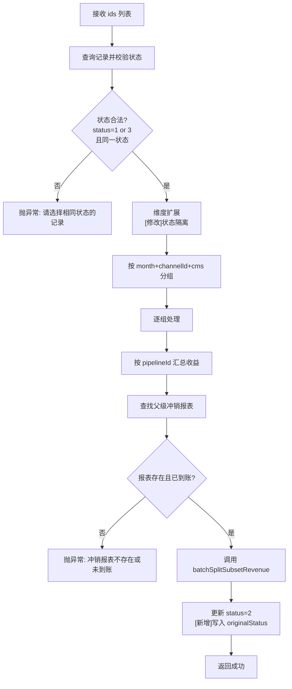
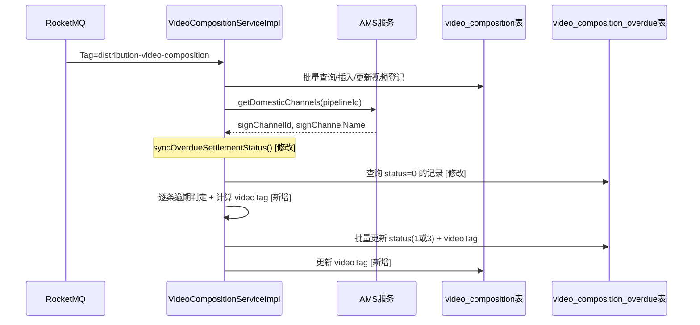
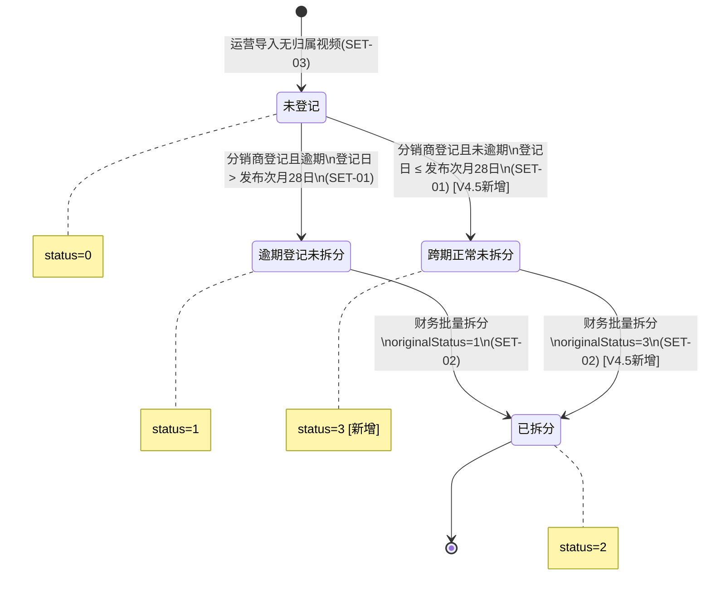
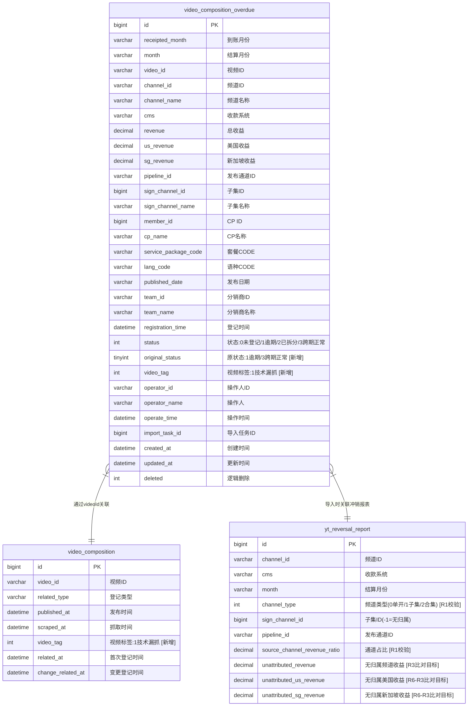

# 逾期结算处理--详细设计

> 本文档为逾期结算处理域的详细设计文档。
>
> **双受众设计原则**：本文档同时服务于人类阅读和 AI 代码生成。
> - 概述、架构图、流程图 → 侧重人类理解
> - 代码变更规格、数据模型定义、实现检查清单 → 侧重 AI 消费
> - 业务逻辑、状态设计、数据字典 → 双方共用

## 文档信息

| 项目 | 内容 |
| --- | --- |
| **所属业务域** | 逾期结算处理 |
| **域编号** | D01 |
| **域类型** | 核心域 |
| **域负责人** | @Qoder |
| **关联总纲** | [V4.5-内容结算系统迭代-迭代变更总纲.md](./V4.5-内容结算系统迭代-迭代变更总纲.md) |

---

## 一、域概述

### 1.1 业务职责

逾期结算处理域负责管理 YouTube 平台视频收益从「未登记 → 登记 → 拆分结算」的全链路。核心功能包括：分销商登记视频后的逾期状态判定、财务人员的批量拆分操作、运营人员的无归属视频导入，以及技术漏抓标签的自动判定与展示。

### 1.2 模块 - 控制器 - 服务 映射

| 模块名称 | Controller | Service | Mapper | 核心职责 |
| --- | --- | --- | --- | --- |
| 逾期结算管理 | `VideoCompositionOverdueController` | `IVideoCompositionOverdueService` / `VideoCompositionOverdueServiceImpl` | `VideoCompositionOverdueMapper` | 逾期结算列表查询、批量拆分、导出 |
| 逾期导入处理 | `VideoCompositionOverdueController` | `OverdueSettlementImportHandler` | `VideoCompositionOverdueMapper` + `YtMonthChannelRevenueSourceMapper` + `YtReversalReportMapper` | 无归属视频Excel导入与校验 |
| 登记状态分发 | 无（MQ消费触发） | `VideoCompositionServiceImpl` | `VideoCompositionOverdueMapper` + `VideoCompositionMapper` | 分销商登记后逾期状态分发 |
| 发布视频登记管理 | `VideoCompositionController` | `IVideoCompositionService` / `VideoCompositionServiceImpl` | `VideoCompositionMapper` | 视频登记列表查询（含技术漏抓标签） |

### 1.3 域内交互关系



### 1.4 迭代背景 `V4.5`

[《PRD-内容结算系统迭代-V4.5》](../../feature/PRD-内容结算系统迭代-V4.5.md)

| 序号 | 需求项 | 优先级 | 简述 |
| --- | --- | --- | --- |
| 1 | SET-01 登记状态分发 | P0 | 新增0→3（跨期正常）分支，修复状态机死锁 |
| 2 | SET-02 财务结算处理 | P0 | 新增跨期正常Tab、原状态列、导出适配 |
| 3 | SET-03 导入误差处理 | P1 | 新增R1~R6校验、误差抹平、安全阻断 |
| 4 | SET-04 漏抓责任界定 | P1 | 入库时计算videoTag，列表/导出展示漏抓标签 |

### 1.5 迭代变更概览 `V4.5`

| 变更类型 | 影响模块 | 影响文件 | 简述 |
| --- | --- | --- | --- |
| `[修改]` | 登记状态分发 | `VideoCompositionServiceImpl.syncOverdueSettlementStatus()` | 移除relatedType过滤，新增0→3分支，计算videoTag |
| `[修改]` | 逾期结算管理 | `VideoCompositionOverdueServiceImpl.batchSplit()` | status=3扩展隔离、写originalStatus |
| `[修改]` | 逾期结算管理 | `VideoCompositionOverdueServiceImpl.pageList()` | VO填充originalStatusName、videoTagName |
| `[修改]` | 逾期结算管理 | `VideoCompositionOverdueServiceImpl` 导出逻辑 | Export新增原状态列、技术漏抓列 |
| `[修改]` | 逾期导入处理 | `OverdueSettlementImportHandler.handle()` | 新增R1~R6校验、数据源切换、计算videoTag |
| `[修改]` | 发布视频登记管理 | `VideoCompositionServiceImpl` 列表相关 | VO新增videoTag字段 |
| `[新增]` | 公共枚举 | `VideoTagEnum.java` | 视频标签枚举 |
| `[修改]` | 公共枚举 | `OverdueSettlementStatusEnum.java` | 新增CROSS_PERIOD_UNSPLIT(3) |

---

## 二、功能模块详细设计

---

### 2.1 登记状态分发模块

> 模块简述：分销商在剧老板登记视频后，通过 MQ 消息触发，查询逾期结算管理列表中该视频的未登记记录，按逾期判定规则分发到对应状态。

#### 2.1.1 登记状态分发逻辑 `[修改]`

> 原设计出处：`VideoCompositionServiceImpl.syncOverdueSettlementStatus()` 方法（lines 396-427），原逻辑仅过滤 relatedType='overdue' 的记录并执行 0→1 状态更新。

| **名称描述** | 登记状态分发（MQ消费后置逻辑） | **估分** | 1 人/天 |
| --- | --- | --- | --- |
| **接口路径** | MQ 消费：Tag=`distribution-video-composition` | | |
| **Controller 方法** | 无（`MQMessageListener.consume()` 触发） | | |
| **Service 方法** | `VideoCompositionServiceImpl.syncOverdueSettlementStatus()` | | |

**入参**：

```json
{
  "videoCompositions": "List<VideoComposition> // synVideoComposition 方法中已解析的视频登记列表"
}
```

**业务逻辑**：

> `[修改]` 原逻辑在 syncOverdueSettlementStatus() 中仅过滤 relatedType='overdue'，本次需改造为对所有已登记视频进行逾期判定。

1. `[修改]` 从 videoCompositions 中提取所有 videoId 列表（**移除** relatedType='overdue' 的过滤条件）
   1. 原逻辑：仅取 `relatedType='overdue'` 的视频
   2. 新逻辑：取所有已登记视频（不再区分 relatedType）
2. 如果 videoIds 为空，直接返回
3. 调用 `VideoCompositionOverdueMapper.selectList()` 查询 video_composition_overdue 表中 `videoId IN (videoIds) AND status = 0 AND deleted = 0` 的记录
   1. `[修改]` 原逻辑查 status IN (0, 1)，新逻辑仅查 status=0（未登记）。原逻辑包含 status=1 是为了对已分发记录重新同步字段（不改状态）；新逻辑在判定分支中已统一处理字段同步，无需对已流转记录重复操作
4. `[新增]` 对查询到的每条 overdueRecord，逐条执行逾期判定：
   1. 从 videoCompositions 中找到对应 videoId 的 videoComposition 记录
   2. 获取登记日期：`registrationDate = COALESCE(videoComposition.changeRelatedAt, videoComposition.relatedAt)`
   3. 获取视频发布日期：`publishedAt = videoComposition.publishedAt`
   4. 如果 publishedAt 为空：跳过该条记录，记录警告日志：`log.warn("视频发布日期为空，跳过逾期判定, videoId={}, overdueRecordId={}", videoId, overdueRecord.getId())`
   5. 如果 registrationDate 为空：跳过该条记录，记录警告日志：`log.warn("视频登记日期为空，跳过逾期判定, videoId={}, overdueRecordId={}", videoId, overdueRecord.getId())`
   6. 计算逾期红线：`deadline = publishedAt 所在月份的次月28日 23:59:59`
   7. 判断是否逾期：
      1. 如果 `registrationDate > deadline`：判定为逾期 → `targetStatus = 1`
      2. 如果 `registrationDate <= deadline`：判定为跨期正常 → `targetStatus = 3` `[新增]`
5. `[新增]` 计算视频标签（videoTag）：
   1. 获取 `scrapedAt = videoComposition.scrapedAt`（视频数据抓取日期）
   2. 如果 scrapedAt 为空 或 publishedAt 为空：`videoTag = null`
   3. 计算漏抓判定红线：`crawlDeadline = publishedAt 所在月份的次月15日 23:59:59`
   4. 如果 `scrapedAt > crawlDeadline`：`videoTag = VideoTagEnum.MISSED_CRAWL.getCode()` (=1)
   5. 否则：`videoTag = null`
6. 调用 syncOverdueFields() 同步字段到 overdueRecord：
   1. 同步字段（保持不变）：`pipelineId, signChannelId, signChannelName, memberId, cpName, servicePackageCode, langCode, publishedDate, teamId, teamName, registrationTime`
   2. `[修改]` 更新 status：`overdueRecord.setStatus(targetStatus)` （原逻辑固定设为1，新逻辑按判定结果设为1或3）
   3. `[新增]` 设置 videoTag：`overdueRecord.setVideoTag(videoTag)`
7. 批量更新 video_composition_overdue 表
8. `[新增]` 同步更新 video_composition 表的 videoTag 字段（如果计算出了 videoTag 且 video_composition 记录存在）

**返回**：

```json
{
  "无返回值（void 方法）": ""
}
```

**业务流程图**：



**实现检查清单**：

- [ ] Controller: 无（MQ 消费触发）
- [ ] Service: `VideoCompositionServiceImpl.syncOverdueSettlementStatus()` → 修改逻辑：移除 relatedType 过滤，新增逾期判定和 0→3 分支
- [ ] Service: `VideoCompositionServiceImpl.syncOverdueFields()` → 修改：新增设置 status（按判定结果）和 videoTag
- [ ] 日志: 步骤4.4-4.5 跳过逻辑的 warn 日志需包含 `overdueRecordId` 和 `videoId`，确保可定位问题记录
- [ ] Mapper: `VideoCompositionOverdueMapper.selectList()` → 修改查询条件：status IN (0,1) → status = 0
- [ ] Mapper: `VideoCompositionMapper.updateById()` → 用于同步 videoTag 到 video_composition 表
- [ ] DTO: 无新增
- [ ] VO: 无（内部逻辑，不涉及API返回）
- [ ] Entity: `VideoCompositionOverdue` → 新增字段 `videoTag(Integer)`
- [ ] Entity: `VideoComposition` → 新增字段 `videoTag(Integer)`
- [ ] Enum: `OverdueSettlementStatusEnum` → 新增 `CROSS_PERIOD_UNSPLIT(3, "跨期正常未拆分")`
- [ ] Enum: `VideoTagEnum` → 新增枚举类 `MISSED_CRAWL(1, "技术漏抓")`
- [ ] SQL: `ALTER TABLE video_composition_overdue ADD COLUMN video_tag int DEFAULT NULL;`
- [ ] SQL: `ALTER TABLE video_composition ADD COLUMN video_tag int DEFAULT NULL;`
- [ ] 事务: 保持现有 `@Transactional` 不变（在 `synVideoComposition()` 方法上）
- [ ] MQ: 无变更（消费 Tag=`distribution-video-composition` 保持不变）
- [ ] 缓存: 无

---

### 2.2 逾期结算管理模块

> 模块简述：为财务人员提供逾期结算的列表查询、批量拆分和导出功能，本次迭代新增跨期正常Tab支持、原状态列和技术漏抓标签展示。

#### 2.2.1 逾期结算分页列表查询 `[修改]`

> 原设计出处：`VideoCompositionOverdueServiceImpl.pageList()` + `VideoCompositionOverdueMapper.selectPageList()`，原逻辑支持 status=0/1/2 三个Tab的列表查询。

| **名称描述** | 逾期结算分页列表查询 | **估分** | 0.5 人/天 |
| --- | --- | --- | --- |
| **接口路径** | `POST /videoCompositionOverdue/page` | | |
| **Controller 方法** | `VideoCompositionOverdueController.page()` | | |
| **Service 方法** | `VideoCompositionOverdueServiceImpl.pageList()` | | |

**入参**：

```json
{
  "receiptedMonthStart": "String // 到账月份开始 yyyy-MM",
  "receiptedMonthEnd": "String // 到账月份结束 yyyy-MM",
  "month": "String // 结算月份 yyyy-MM",
  "videoId": "String // 视频ID",
  "channelId": "String // 频道ID",
  "channelName": "String // 频道名称",
  "cpName": "String // CP名称",
  "signChannelName": "String // 子集名称",
  "teamName": "String // 分销商名称",
  "status": "Integer // 状态: 0-未登记, 1-逾期登记未拆分, 2-已拆分, 3-跨期正常未拆分[新增]",
  "cms": "String // 收款系统",
  "pageNum": "Integer // 页码",
  "pageSize": "Integer // 每页条数，默认20"
}
```

**业务逻辑**：

1. 接收 VideoCompositionOverdueQuery 入参
2. 调用 `VideoCompositionOverdueMapper.selectPageList(query)` 执行分页查询
   1. `[修改]` SQL 动态排序规则需新增 status=3 的处理：按 `registration_time DESC`（与 status=1 一致）
3. 对查询结果逐条填充展示字段：
   1. `statusName`：调用 `OverdueSettlementStatusEnum.toLabel(status)` 转换
   2. `videoLink`：拼接 YouTube 视频链接
   3. `servicePackageName`：字典翻译
   4. `langName`：字典翻译
   5. `[新增]` `originalStatusName`：
      1. 如果 status=2 且 originalStatus != null：调用 `OverdueSettlementStatusEnum.toLabel(originalStatus)` 转换
      2. 如果 status=2 且 originalStatus == null：返回 `"-"`（历史数据）
      3. 其他 status：返回 null
   6. `[新增]` `videoTagName`：
      1. 如果 videoTag != null：调用 `VideoTagEnum.toLabel(videoTag)` 转换
      2. 如果 videoTag == null：返回 null（不展示标签）
4. 返回分页结果

**返回**：

```json
{
  "list": [
    {
      "id": "Long // 主键ID",
      "receiptedMonth": "String // 到账月份",
      "month": "String // 结算月份",
      "videoId": "String // 视频ID",
      "videoLink": "String // 视频链接",
      "channelId": "String // 频道ID",
      "channelName": "String // 频道名称",
      "cms": "String // 收款系统",
      "revenue": "BigDecimal // 频道总收益",
      "usRevenue": "BigDecimal // 美国收益",
      "sgRevenue": "BigDecimal // 新加坡收益",
      "signChannelName": "String // 子集名称",
      "cpName": "String // CP名称",
      "servicePackageName": "String // 运作套餐",
      "langName": "String // 运作语种",
      "publishedDate": "String // 视频发布日期",
      "teamName": "String // 分销商名称",
      "registrationTime": "Date // 登记时间",
      "status": "Integer // 状态",
      "statusName": "String // 状态名称",
      "originalStatus": "Integer // 原状态 [新增] 仅status=2时有值",
      "originalStatusName": "String // 原状态名称 [新增] 仅status=2时有值",
      "videoTag": "Integer // 视频标签 [新增]",
      "videoTagName": "String // 视频标签名称 [新增]",
      "operatorName": "String // 处理人",
      "operateTime": "Date // 处理时间"
    }
  ],
  "total": "Long // 总记录数",
  "pageNum": "Integer // 当前页码",
  "pageSize": "Integer // 每页条数"
}
```

**业务流程图**：无（简单查询接口）

**实现检查清单**：

- [ ] Controller: `POST /videoCompositionOverdue/page` → `VideoCompositionOverdueController.page()` → 无变更
- [ ] Service: `VideoCompositionOverdueServiceImpl.pageList()` → 新增 originalStatusName 和 videoTagName 填充逻辑
- [ ] Mapper: `VideoCompositionOverdueMapper.selectPageList()` → 修改 XML：新增 status=3 排序规则（ORDER BY registration_time DESC）
- [ ] DTO: `VideoCompositionOverdueQuery` → 无变更（status 字段已支持任意整数值）
- [ ] VO: `VideoCompositionOverdueVO` → 新增 `originalStatus(Integer)`, `originalStatusName(String)`, `videoTag(Integer)`, `videoTagName(String)`
- [ ] Entity: `VideoCompositionOverdue` → 已在 2.1.1 中新增 `originalStatus`, `videoTag`
- [ ] SQL: Mapper XML 新增 status=3 的 ORDER BY 分支
- [ ] 事务: 无（只读查询）
- [ ] MQ: 无
- [ ] 缓存: 无

---

#### 2.2.2 批量拆分 `[修改]`

> 原设计出处：`VideoCompositionOverdueServiceImpl.batchSplit()` 方法（lines 139-175），原逻辑仅支持 status=1 记录的拆分。

| **名称描述** | 批量拆分（支持跨期正常+原状态记录） | **估分** | 1 人/天 |
| --- | --- | --- | --- |
| **接口路径** | `POST /videoCompositionOverdue/batchSplit` | | |
| **Controller 方法** | `VideoCompositionOverdueController.batchSplit()` | | |
| **Service 方法** | `VideoCompositionOverdueServiceImpl.batchSplit()` | | |

**入参**：

```json
{
  "ids": "List<Long> // 勾选记录的主键ID列表"
}
```

**业务逻辑**：

1. 校验入参 ids 非空
2. 根据 ids 查询 video_composition_overdue 记录
3. 校验记录存在且状态合法：
   1. `[修改]` 原逻辑：仅允许 status=1
   2. 新逻辑：允许 status=1（逾期）或 status=3（跨期正常）
   3. 所有记录必须为同一状态（不允许跨状态混合拆分）
   4. 如果不合法：抛出 BusinessException："请选择相同状态的记录进行拆分"
4. `[修改]` 维度扩展（expandToSameDimensionRecords）：
   1. 提取勾选记录的维度：`receiptedMonth + channelId`
   2. `[修改]` 查询同维度的所有记录，**状态隔离**：
      1. 原逻辑：`WHERE status = 1 AND receiptedMonth IN (...) AND channelId IN (...)`
      2. 新逻辑：`WHERE status = {当前拆分的状态值} AND receiptedMonth IN (...) AND channelId IN (...)`
      3. 即：跨期Tab(status=3)拆分时只扩展status=3的记录，逾期Tab(status=1)拆分时只扩展status=1的记录
   3. 去重后得到扩展后的完整记录列表
5. 按 `month + channelId + cms` 分组
6. 每组执行拆分：
   1. 按 pipelineId 汇总收益（revenue, usRevenue, sgRevenue）
   2. 查找并校验父级冲销报表（yt_reversal_report）
   3. 校验 pipelineId 唯一性
   4. 构建 SplitSubsetBasicQuery 参数
   5. 调用 `ytReversalReportService.batchSplitSubsetRevenue()` 执行冲销表拆分
7. `[修改]` 更新记录状态：
   1. 原逻辑：`status = 2, operatorId, operatorName, operateTime`
   2. 新逻辑：增加 `originalStatus = {拆分前的 status 值}` `[新增]`
      1. 如果从 status=1 拆分：`originalStatus = 1`
      2. 如果从 status=3 拆分：`originalStatus = 3`
8. 事务策略：**全部回滚**（BL-3 确认：整体事务，任一失败全部回滚）

**返回**：

```json
{
  "无返回值（void 方法）": ""
}
```

**业务流程图**：



**实现检查清单**：

- [ ] Controller: `POST /videoCompositionOverdue/batchSplit` → `VideoCompositionOverdueController.batchSplit()` → 无变更
- [ ] Service: `VideoCompositionOverdueServiceImpl.batchSplit()` → 修改：校验支持 status=3；记录 originalStatus
- [ ] Service: `VideoCompositionOverdueServiceImpl.expandToSameDimensionRecords()` → 修改：状态隔离查询
- [ ] Service: `VideoCompositionOverdueServiceImpl.updateSplitStatus()` → 修改：新增 originalStatus 赋值
- [ ] Mapper: `VideoCompositionOverdueMapper.selectList()` → 修改：维度扩展查询条件支持动态 status
- [ ] Mapper: `VideoCompositionOverdueMapper.updateById()` / 批量更新 → 更新 originalStatus 字段
- [ ] DTO: 无新增
- [ ] VO: 无（操作接口无返回VO）
- [ ] Entity: `VideoCompositionOverdue` → 新增字段 `originalStatus(Integer)`
- [ ] SQL: `ALTER TABLE video_composition_overdue ADD COLUMN original_status tinyint DEFAULT NULL;`
- [ ] 事务: `@Transactional` 标注在 `batchSplit()` → 保持不变（全部回滚策略）
- [ ] MQ: 无
- [ ] 缓存: 无

---

#### 2.2.3 异步导出 `[修改]`

> 原设计出处：`VideoCompositionOverdueServiceImpl` 导出逻辑 + `VideoCompositionOverdueExport` 导出模型。原导出不含原状态列和技术漏抓列。

| **名称描述** | 逾期结算异步导出（新增原状态+技术漏抓列） | **估分** | 0.5 人/天 |
| --- | --- | --- | --- |
| **接口路径** | `POST /videoCompositionOverdue/export/async` | | |
| **Controller 方法** | `VideoCompositionOverdueController.asyncExport()` | | |
| **Service 方法** | `VideoCompositionOverdueServiceImpl.asyncExport()` | | |

**入参**：

```json
{
  "receiptedMonthStart": "String // 到账月份开始",
  "receiptedMonthEnd": "String // 到账月份结束",
  "status": "Integer // 状态: 0/1/2/3",
  "其他筛选条件": "同 VideoCompositionOverdueQuery"
}
```

**业务逻辑**：

1. 接收 VideoCompositionOverdueAsyncQuery 入参
2. 执行异步导出（复用现有异步导出框架）
3. `[修改]` 导出字段适配：
   1. **所有Tab（status=0/1/2/3）** 均新增「技术漏抓」列 `[新增]`
      1. videoTag=1 时导出 "是"，videoTag=null 时导出 "否"
   2. **已拆分Tab（status=2）** 新增「原状态」列 `[新增]`
      1. originalStatus=1 时导出 "逾期登记"
      2. originalStatus=3 时导出 "跨期正常"
      3. originalStatus=null 时导出 ""（历史数据）
   3. **跨期正常Tab（status=3）** 导出字段与逾期Tab（status=1）一致
4. `[修改]` VideoCompositionOverdueExport 模型需动态包含/排除列（基于 status 值）

**返回**：

```json
{
  "taskId": "Long // 导出任务ID"
}
```

**业务流程图**：无（简单导出接口）

**实现检查清单**：

- [ ] Controller: `POST /videoCompositionOverdue/export/async` → 无变更
- [ ] Service: 导出逻辑 → 修改字段映射，新增 originalStatusName 和 videoTagName 的转换
- [ ] Mapper: `selectPageListForAsyncExport()` → 修改 XML：确保返回 original_status 和 video_tag 字段
- [ ] DTO: `VideoCompositionOverdueAsyncQuery` → 无变更
- [ ] VO: 无
- [ ] Export: `VideoCompositionOverdueExport` → 新增字段 `originalStatusName(String)` @ExcelProperty("原状态") + `videoTagName(String)` @ExcelProperty("技术漏抓")
- [ ] Entity: 已在前述步骤新增
- [ ] SQL: 无
- [ ] 事务: 无
- [ ] MQ: 无
- [ ] 缓存: 无

---

### 2.3 发布视频登记管理模块

> 模块简述：为财务人员提供视频登记的列表查询，本次迭代新增技术漏抓标签展示。

#### 2.3.1 发布视频登记管理列表查询 `[修改]`

> 原设计出处：`VideoCompositionController` 中的分页列表查询接口，原逻辑不涉及 videoTag 字段。

| **名称描述** | 发布视频登记管理列表（新增技术漏抓标签） | **估分** | 0.5 人/天 |
| --- | --- | --- | --- |
| **接口路径** | 复用现有发布视频登记管理列表接口 | | |
| **Controller 方法** | `VideoCompositionController` 中对应的分页查询方法 | | |
| **Service 方法** | `VideoCompositionServiceImpl` 中对应的列表查询方法 | | |

**入参**：

```json
{
  "复用现有查询参数": "无变更"
}
```

**业务逻辑**：

1. 复用现有列表查询逻辑
2. `[新增]` 在 VO 填充阶段新增 videoTag 和 videoTagName 字段：
   1. 从 video_composition 表读取 videoTag 字段（已在 § 2.1.1 中入库时计算存储）
   2. 如果 videoTag != null：转换为展示名称（调用 `VideoTagEnum.toLabel(videoTag)`）
   3. 如果 videoTag == null：不展示标签
3. `[新增]` 展示范围（CP-4 确认）：
   1. **已登记Tab**：展示技术漏抓标签
   2. **未登记Tab**：也展示技术漏抓标签

**返回**：

```json
{
  "在现有返回字段基础上新增": "",
  "videoTag": "Integer // 视频标签 [新增]",
  "videoTagName": "String // 视频标签名称 [新增]"
}
```

**业务流程图**：无（简单查询接口）

**实现检查清单**：

- [ ] Controller: 现有发布视频登记管理列表接口 → 无变更
- [ ] Service: 列表查询方法 → 新增 videoTagName 填充
- [ ] Mapper: 查询 SQL → 确保返回 video_tag 字段
- [ ] DTO: 无变更
- [ ] VO: 对应的 VideoComposition VO → 新增 `videoTag(Integer)`, `videoTagName(String)`
- [ ] Entity: `VideoComposition` → 已在 2.1.1 中新增 `videoTag`
- [ ] SQL: 无（字段已在 2.1.1 中通过 DDL 新增）
- [ ] 事务: 无
- [ ] MQ: 无
- [ ] 缓存: 无

---

## 三、批量处理设计

### 3.1 逾期结算导入（误差处理改造） `[修改]`

> 原设计出处：`OverdueSettlementImportHandler.handle()`（lines 60-174），原逻辑直接从 yt_month_channel_revenue_source 查收益占比并计算金额，无 R1~R6 校验逻辑。

| 项目 | 内容 |
| --- | --- |
| **操作类型** | 导入 |
| **触发方式** | 前端上传文件（OSS key + receiptedMonth） |
| **处理框架** | EasyExcel |
| **单批大小** | 500 条 |
| **预计最大数据量** | 20000 条（配置项 `finance.import-max-rows.overdue`） |

**数据模型**（导入字段映射）：

| Excel 列名 | 对应字段 | 类型 | 必填 | 校验规则 |
| --- | --- | --- | --- | --- |
| *视频ID | `videoId` | String | Y | 非空、不重复、存在于冲销报表中 |

**处理流程**：

> `[修改]` 在原有导入逻辑中插入 R1~R6 校验步骤。数据源变更：R1 校验从 yt_reversal_report 按 channelType 动态计算无归属占比基准值（BL-4 确认）。

```mermaid
flowchart TD
    A["1. 接收 Excel 文件<br/>解析视频ID列表"] --> B["2. 基础校验<br/>去重、非空、行数限制"]
    B --> C["3. 查询 yt_month_channel_revenue_source<br/>获取每个视频的收益占比"]
    C --> D["4. 查询 yt_reversal_report<br/>[修改]按channelType动态计算无归属占比基准"]
    D --> E["5. 按 频道ID+cms+receiptedMonth 分组"]
    E --> F["逐频道处理"]

    subgraph 每个频道的处理流程
        F --> R1{"R1: 占比完整性校验<br/>导入视频占比和 = 冲销报表无归属占比和?<br/>[新增]"}
        R1 -->|不等| R1F["阻断该频道<br/>本次导入视频不全"]
        R1 -->|相等| CALC["6. 查询 yt_month_cms_end<br/>获取频道CMS收益+调差"]

        CALC --> R2["R2: 逐笔计算<br/>ROUND(占比 × (CMS收益+调差1), 2)<br/>[新增]"]
        R2 --> R2C{单笔 = 0.00?}
        R2C -->|是| R2D["舍弃该笔"]
        R2C -->|否| R2K["保留该笔"]
        R2D --> R5
        R2K --> R5

        R5{R5: 全部视频取整后均为0.00?<br/>[新增]}
        R5 -->|是| R5F["阻断该频道<br/>单笔金额过小"]
        R5 -->|否| R3["R3: 求和并计算差额<br/>差额 = unattributedRevenue - 逐笔求和<br/>[新增]"]

        R3 --> R4{R4: |差额| > $1?<br/>[新增]}
        R4 -->|是| R4F["阻断该频道<br/>拆分差额超过1美金"]
        R4 -->|否| R3S["R3: 差额累加到<br/>占比最大的视频<br/>排序:占比降序,id升序<br/>[新增]"]

        R3S --> R6["R6: 美国收益独立执行R2-R5<br/>ROUND(占比 × (US收益+调差2), 2)<br/>[新增]"]
        R6 --> R6B["R6: 新加坡收益独立执行R2-R5<br/>ROUND(占比 × (SG收益+调差3), 2)<br/>[新增]"]
    end

    R6B --> VT["7. 计算 videoTag<br/>scrapedAt > 发布次月15日?<br/>[新增]"]
    VT --> SAVE["8. 构建 VideoCompositionOverdue 实体<br/>批量写入"]
    R1F --> FAIL["记入失败文件"]
    R4F --> FAIL
    R5F --> FAIL
    SAVE --> DONE["返回导入结果"]
    FAIL --> DONE
```

**R1~R6 校验规则详细逻辑**：

> `[新增]` 以下为本次迭代新增的核心校验逻辑，按频道维度逐一执行。

**R1 占比完整性校验**：
1. 从 `yt_reversal_report` 按当前维度（`channel_id = {channelId} AND cms = {cms} AND month = {settlementMonth}`）动态计算无归属占比基准：
   1. 查询合集记录（`channel_type = 2`）的 `source_channel_revenue_ratio` 总和（业务上应为 1）
   2. 查询子集记录（`channel_type = 1`）的 `source_channel_revenue_ratio` 总和
   3. 系统侧无归属占比总和 = 合集占比总和 - 子集占比总和（不取整）
2. 汇总导入视频的 `v_revenue_ratio`（来自 yt_month_channel_revenue_source），得到导入侧占比总和（不取整）
3. 比对：导入侧占比总和 **等于** 系统侧无归属占比总和（BL-4 确认：比对语义为"等于"）
4. 如不等：阻断该频道，失败原因="本次导入视频不全，占比校验不通过"

**R2 零值清理**（总收益）：
1. 对每个视频：`amount = ROUND(v_revenue_ratio × (cmsEnd.revenue + adjustedAmount1), 2)`
2. 如果 amount = 0.00：舍弃该笔，不参与后续求和

**R3 误差抹平**（总收益）：
1. 对保留的视频按 `v_revenue_ratio DESC, video_id ASC` 排序（BL-5 确认）
2. 逐笔四舍五入后求和 = `sumAmount`
3. 差额 = 冲销报表无归属金额（`yt_reversal_report.unattributedRevenue`，取合集记录 channelType=2 上的存储值） - sumAmount
4. 将差额累加到排序后的第一个视频（占比最大、id最小）

**R4 安全阈值**（总收益）：
1. 如果 `|差额| > 1.00`：阻断该频道，失败原因="拆分差额超过1美金，请检查"

**R5 极端情况**（总收益）：
1. 如果所有视频取整后均为 0.00（sumAmount = 0）：阻断该频道，失败原因="单笔金额过小导致精度丢失，请检查"

**R6 美国/新加坡收益独立处理**：
1. 美国收益：`usAmount = ROUND(v_us_revenue_ratio × (cmsEnd.usRevenue + adjustedAmount2), 2)`，独立执行 R2~R5
2. 新加坡收益：`sgAmount = ROUND(v_sg_revenue_ratio × (cmsEnd.sgRevenue + adjustedAmount3), 2)`，独立执行 R2~R5
3. R3 比对目标分别为：总收益用 `unattributedRevenue`，美国收益用 `unattributedUsRevenue`，新加坡收益用 `unattributedSgRevenue`（均取合集记录 channelType=2 上的存储值）
4. 三种收益类型独立判断 $1 阈值（CP-5 确认）
5. 任一收益类型阻断即整体阻断该频道（AM-2 确认：倾向B）

**videoTag 计算**（同 § 2.1.1 步骤5 逻辑）：
1. 对每个导入视频，查询 video_composition 获取 scrapedAt 和 publishedAt
2. 如果 `scrapedAt > 发布次月15日 23:59:59`：`videoTag = 1`（技术漏抓）
3. 否则：`videoTag = null`

**错误处理策略**：

| 策略 | 说明 |
| --- | --- |
| **单频道失败** | 该频道全部视频跳过，记入失败文件；其他频道继续处理 |
| **错误反馈** | 保持现有逻辑不变（CP-3 确认），生成失败文件供下载 |
| **事务边界** | 整体一个事务，成功频道的数据批量写入 |

**实现检查清单**：

- [ ] Controller: `POST /videoCompositionOverdue/import/async` → 无变更
- [ ] Service: `OverdueSettlementImportHandler.handle()` → 大幅改造：新增 R1~R6 校验逻辑
- [ ] Service: `OverdueSettlementImportHandler` → 新增方法：`validateProportionCompleteness()` (R1)、`calculateWithErrorSmoothing()` (R2~R5)、`processRevenueType()` (R6 复用方法)
- [ ] Mapper: `YtReversalReportMapper` → 新增查询：按 channelId+cms+month 分别查询 channelType=2 和 channelType=1 的 sourceChannelRevenueRatio 总和，动态计算无归属占比基准；读取合集记录的 unattributedRevenue/unattributedUsRevenue/unattributedSgRevenue 作为 R3 比对目标
- [ ] Mapper: `YtMonthChannelRevenueSourceMapper` → 现有查询保持（获取视频级占比）
- [ ] Mapper: `YtMonthCmsEndMapper` → 现有查询保持（获取频道CMS收益+调差）
- [ ] Listener: `OverdueSettlementImportListener` → 无变更
- [ ] Export/Import Model: `OverdueSettlementImportDTO` → 无变更
- [ ] Entity: `VideoCompositionOverdue` → 已在前述步骤新增 videoTag
- [ ] 事务: 保持现有 `@Transactional` 不变
- [ ] MQ: 无
- [ ] 缓存: 无

---

## 四、跨服务编排设计

### 4.1 登记状态分发编排

| 项目 | 内容 |
| --- | --- |
| **触发方式** | MQ 消费（Tag=distribution-video-composition） |
| **涉及 Service** | `VideoCompositionServiceImpl` |
| **涉及外部调用** | AMS API（getDomesticChannels） |
| **事务策略** | 本地事务（@Transactional on synVideoComposition） |

**编排流程图**：



**失败处理**：

| 失败节点 | 影响范围 | 补偿策略 |
| --- | --- | --- |
| 状态分发失败 | 视频登记成功但逾期状态未分发 | MQ 重试（AM-1 确认：同步执行，静默失败） |
| AMS 调用失败 | 无法获取 signChannelId | 现有容错逻辑保持（阻断该条记录，不影响其他） |

---

## 五、状态设计

### 5.1 逾期结算登记状态

| 项目 | 内容 |
| --- | --- |
| **所属实体/表** | `video_composition_overdue`.`status` |
| **枚举类** | `OverdueSettlementStatusEnum` |
| **字段类型** | `int` |
| **说明** | 收益记录的结算处理状态 |

**状态值定义**：

| 状态值 | 枚举常量 | 状态名称 | 描述 |
| --- | --- | --- | --- |
| `0` | `UNREGISTERED` | 未登记 | 初始状态，导入时赋值 |
| `1` | `REGISTERED_UNSPLIT` | 逾期登记未拆分 | 分销商登记且逾期（登记日 > 发布次月28日） |
| `2` | `SPLIT` | 已拆分 | 财务完成批量拆分 |
| `3` | `CROSS_PERIOD_UNSPLIT` | 跨期正常未拆分 | `[新增]` 分销商登记且未逾期（登记日 ≤ 发布次月28日） |

**状态流转图**：



**流转规则说明**：

| 当前状态 | 目标状态 | 触发动作 | 前置条件 | 操作人/系统 | 说明 |
| --- | --- | --- | --- | --- | --- |
| 未登记(0) | 逾期登记未拆分(1) | MQ消息触发状态分发 | 登记日 > 发布次月28日 | 系统自动 | 复用现有逻辑 |
| 未登记(0) | 跨期正常未拆分(3) | MQ消息触发状态分发 | 登记日 ≤ 发布次月28日 | 系统自动 | `[新增]` V4.5 |
| 逾期登记未拆分(1) | 已拆分(2) | 财务点击批量拆分 | 记录存在且冲销报表已到账 | 财务人员 | 写入 originalStatus=1 |
| 跨期正常未拆分(3) | 已拆分(2) | 财务点击批量拆分 | 记录存在且冲销报表已到账 | 财务人员 | `[新增]` 写入 originalStatus=3 |

### 5.2 视频标签 `[新增]`

| 项目 | 内容 |
| --- | --- |
| **所属实体/表** | `video_composition_overdue`.`video_tag` 和 `video_composition`.`video_tag` |
| **枚举类** | `VideoTagEnum` `[新增]` |
| **字段类型** | `int` |
| **说明** | 视频的特殊属性标签，可扩展（DM-2 确认：后期会有新属性值） |

**标签值定义**：

| 标签值 | 枚举常量 | 标签名称 | 描述 |
| --- | --- | --- | --- |
| `null` | - | 无标签 | 默认值，不展示标签 |
| `1` | `MISSED_CRAWL` | 技术漏抓 | scrapedAt > 发布次月15日 23:59:59 |

---

## 六、数据字典

### 6.1 逾期结算登记状态

| 表/字段 | 字段含义 | 枚举类 | 值 | 描述 |
| --- | --- | --- | --- | --- |
| `video_composition_overdue.status` | 登记状态 | `OverdueSettlementStatusEnum` | `0` | 未登记 |
| `video_composition_overdue.status` | 登记状态 | `OverdueSettlementStatusEnum` | `1` | 逾期登记未拆分 |
| `video_composition_overdue.status` | 登记状态 | `OverdueSettlementStatusEnum` | `2` | 已拆分 |
| `video_composition_overdue.status` | 登记状态 | `OverdueSettlementStatusEnum` | `3` | 跨期正常未拆分 `[新增]` |

### 6.2 原状态 `[新增]`

| 表/字段 | 字段含义 | 枚举类 | 值 | 描述 |
| --- | --- | --- | --- | --- |
| `video_composition_overdue.original_status` | 拆分前状态 | 复用 `OverdueSettlementStatusEnum` | `1` | 逾期登记 |
| `video_composition_overdue.original_status` | 拆分前状态 | 复用 `OverdueSettlementStatusEnum` | `3` | 跨期正常 |
| `video_composition_overdue.original_status` | 拆分前状态 | - | `null` | 历史数据（展示为"-"） |

### 6.3 视频标签 `[新增]`

| 表/字段 | 字段含义 | 枚举类 | 值 | 描述 |
| --- | --- | --- | --- | --- |
| `video_composition_overdue.video_tag` | 视频标签 | `VideoTagEnum` | `null` | 无标签 |
| `video_composition_overdue.video_tag` | 视频标签 | `VideoTagEnum` | `1` | 技术漏抓 |
| `video_composition.video_tag` | 视频标签 | `VideoTagEnum` | `null` | 无标签 |
| `video_composition.video_tag` | 视频标签 | `VideoTagEnum` | `1` | 技术漏抓 |

---

## 七、域内数据库设计

### 7.1 域 ER 图



### 7.2 表结构设计

#### 7.2.1 video_composition_overdue（逾期结算记录表）

| 项目 | 内容 |
| --- | --- |
| **所属数据源** | `master` |
| **所属数据库** | `silverdawn_finance` |
| **对应 Entity** | `VideoCompositionOverdue` |
| **对应 Mapper** | `VideoCompositionOverdueMapper` |
| **表用途** | 存储逾期结算的视频收益记录，从导入到登记到拆分的全链路数据 |

> 已有表，本次仅新增字段，完整建表SQL省略。新增字段见 § 7.3 变更SQL。

#### 7.2.2 video_composition（视频登记管理表）

| 项目 | 内容 |
| --- | --- |
| **所属数据源** | `master` |
| **所属数据库** | `silverdawn_finance` |
| **对应 Entity** | `VideoComposition` |
| **对应 Mapper** | `VideoCompositionMapper` |
| **表用途** | 存储视频基础信息和登记状态，含发布时间、抓取时间等 |

> 已有表，本次仅新增字段，完整建表SQL省略。新增字段见 § 7.3 变更SQL。

### 7.3 变更 SQL `V4.5`

| 实例 & 库 | 变更类型 | 变更语句 |
| --- | --- | --- |
| silverdawn_finance | 加字段 | ```sql ALTER TABLE video_composition_overdue ADD COLUMN original_status tinyint DEFAULT NULL COMMENT '原状态: 1-逾期登记, 3-跨期正常' AFTER status; ``` |
| silverdawn_finance | 加字段 | ```sql ALTER TABLE video_composition_overdue ADD COLUMN video_tag int DEFAULT NULL COMMENT '视频标签: 1-技术漏抓' AFTER original_status; ``` |
| silverdawn_finance | 加字段 | ```sql ALTER TABLE video_composition ADD COLUMN video_tag int DEFAULT NULL COMMENT '视频标签: 1-技术漏抓' AFTER scraped_at; ``` |

**历史数据修复脚本**（上线前执行）：

```sql
-- 1. 修复死锁数据：将历史已登记但未逾期的 status=0 记录修复为 status=3，并回填业务字段
-- "已登记"判定依据：video_composition.related_at IS NOT NULL（登记时间由分销商登记时写入，不依赖 syncOverdueFields 是否执行）
-- "未逾期"判定依据：COALESCE(vc.change_related_at, vc.related_at) <= 发布次月28日 23:59:59
-- 注意：此脚本涉及多字段回填和 videoTag 计算，必须在应用层编写，不适合纯 SQL 执行
-- 应用层逻辑应与在线 syncOverdueSettlementStatus() 的新逻辑保持一致
-- 伪SQL示意：
UPDATE video_composition_overdue vco
INNER JOIN video_composition vc ON vco.video_id = vc.video_id AND vc.deleted = 0
SET vco.status = 3,
    vco.registration_time = COALESCE(vc.change_related_at, vc.related_at),
    vco.pipeline_id = vc.pipeline_id,
    vco.sign_channel_id = vc.ams_composition_id,
    vco.sign_channel_name = vc.composition_name,
    vco.member_id = vc.member_id,
    vco.cp_name = vc.cp_name,
    vco.service_package_code = vc.service_package_code,
    vco.lang_code = vc.lang_code,
    vco.published_date = vc.published_date,
    vco.team_id = vc.team_id,
    vco.team_name = vc.team_name,
    vco.video_tag = CASE
        WHEN vc.scraped_at IS NOT NULL AND vc.published_at IS NOT NULL
             AND vc.scraped_at > DATE_FORMAT(
                 DATE_ADD(DATE_FORMAT(vc.published_at, '%Y-%m-01'), INTERVAL 1 MONTH),
                 '%Y-%m-15 23:59:59')
        THEN 1 ELSE NULL END
WHERE vco.deleted = 0
  AND vco.status = 0
  AND vc.related_at IS NOT NULL
  AND COALESCE(vc.change_related_at, vc.related_at) <= DATE_FORMAT(
    DATE_ADD(DATE_FORMAT(vc.published_at, '%Y-%m-01'), INTERVAL 1 MONTH),
    '%Y-%m-28 23:59:59'
  );

-- 2. 补写原状态：历史已拆分记录（status=2）的 originalStatus 补写为 1
-- 原因：历史拆分记录均来自逾期Tab（SG-2 建议）
UPDATE video_composition_overdue
SET original_status = 1
WHERE deleted = 0
  AND status = 2
  AND original_status IS NULL;

-- 3. 补写视频标签：根据 scraped_at 和 published_at 计算 video_tag
-- video_composition 表
UPDATE video_composition
SET video_tag = 1
WHERE deleted = 0
  AND scraped_at IS NOT NULL
  AND published_at IS NOT NULL
  AND scraped_at > DATE_FORMAT(
    DATE_ADD(DATE_FORMAT(published_at, '%Y-%m-01'), INTERVAL 1 MONTH),
    '%Y-%m-15 23:59:59'
  );

-- video_composition_overdue 表（通过关联 video_composition 获取 scraped_at）
-- 注意：死锁记录的 video_tag 已在脚本 #1 的应用层逻辑中一并处理，此处覆盖非死锁记录
UPDATE video_composition_overdue vco
INNER JOIN video_composition vc ON vco.video_id = vc.video_id
SET vco.video_tag = 1
WHERE vco.deleted = 0
  AND vc.scraped_at IS NOT NULL
  AND vc.published_at IS NOT NULL
  AND vc.scraped_at > DATE_FORMAT(
    DATE_ADD(DATE_FORMAT(vc.published_at, '%Y-%m-01'), INTERVAL 1 MONTH),
    '%Y-%m-15 23:59:59'
  );
```

---

## 八、数据模型定义

### 8.1 VideoCompositionOverdueVO `[修改]`

| 项目 | 内容 |
| --- | --- |
| **类名** | `VideoCompositionOverdueVO` |
| **包路径** | `domain.vo` |
| **模型类型** | VO |
| **用途** | 逾期结算列表分页查询返回对象 |
| **引用接口** | 2.2.1 |

**新增字段**（在现有字段基础上追加）：

| 字段名 | Java 类型 | 必填 | 校验注解 | 说明 |
| --- | --- | --- | --- | --- |
| `originalStatus` | `Integer` | N | - | 原状态值（1=逾期登记, 3=跨期正常），仅 status=2 时有值 |
| `originalStatusName` | `String` | N | - | 原状态名称（"逾期登记未拆分"/"跨期正常未拆分"/"-"） |
| `videoTag` | `Integer` | N | - | 视频标签值（1=技术漏抓），null 表示无标签 |
| `videoTagName` | `String` | N | - | 视频标签名称（"技术漏抓"），null 表示不展示 |

### 8.2 VideoCompositionOverdueExport `[修改]`

| 项目 | 内容 |
| --- | --- |
| **类名** | `VideoCompositionOverdueExport` |
| **包路径** | `domain.export` |
| **模型类型** | Export |
| **用途** | 逾期结算导出 Excel 模型 |
| **引用接口** | 2.2.3 |

**新增字段**（在现有字段基础上追加）：

| 字段名 | Java 类型 | 必填 | 校验注解 | 说明 |
| --- | --- | --- | --- | --- |
| `originalStatusName` | `String` | N | `@ExcelProperty("原状态")` `@ColumnWidth(12)` | 原状态名称，仅已拆分Tab导出时展示 |
| `videoTagName` | `String` | N | `@ExcelProperty("技术漏抓")` `@ColumnWidth(10)` | "是"/"否"，所有Tab均导出 |

> 注：导出时需根据 status 动态控制「原状态」列的包含/排除。建议通过 EasyExcel 的 `excludeColumnFieldNames` 机制实现。

### 8.3 VideoCompositionVO `[修改]`

| 项目 | 内容 |
| --- | --- |
| **类名** | `VideoCompositionVO`（或项目中对应的发布视频登记管理列表VO） |
| **包路径** | `domain.vo` |
| **模型类型** | VO |
| **用途** | 发布视频登记管理列表返回对象 |
| **引用接口** | 2.3.1 |

**新增字段**（在现有字段基础上追加）：

| 字段名 | Java 类型 | 必填 | 校验注解 | 说明 |
| --- | --- | --- | --- | --- |
| `videoTag` | `Integer` | N | - | 视频标签值（1=技术漏抓），null 表示无标签 |
| `videoTagName` | `String` | N | - | 视频标签名称（"技术漏抓"），null 表示不展示 |

### 8.4 VideoTagEnum `[新增]`

| 项目 | 内容 |
| --- | --- |
| **类名** | `VideoTagEnum` |
| **包路径** | `common.constent.enums` |
| **模型类型** | Enum |
| **用途** | 视频标签枚举，标识视频的特殊属性（可扩展） |
| **引用接口** | 2.1.1, 2.2.1, 2.2.3, 2.3.1, 3.1 |

| 字段名 | Java 类型 | 必填 | 校验注解 | 说明 |
| --- | --- | --- | --- | --- |
| `code` | `Integer` | Y | - | 枚举编码 |
| `label` | `String` | Y | - | 枚举中文名 |

**枚举值**：

| code | label | 常量名 |
| --- | --- | --- |
| `1` | `技术漏抓` | `MISSED_CRAWL` |

**静态方法**：
- `getByCode(Integer code)` → 根据 code 返回枚举
- `toLabel(Integer code)` → 根据 code 返回中文标签

### 8.5 OverdueSettlementStatusEnum `[修改]`

| 项目 | 内容 |
| --- | --- |
| **类名** | `OverdueSettlementStatusEnum` |
| **包路径** | `common.constent.enums` |
| **模型类型** | Enum |
| **用途** | 逾期结算登记状态枚举 |
| **引用接口** | 2.1.1, 2.2.1, 2.2.2, 2.2.3 |

**新增枚举值**：

| code | label | 常量名 | 说明 |
| --- | --- | --- | --- |
| `3` | `跨期正常未拆分` | `CROSS_PERIOD_UNSPLIT` | `[新增]` V4.5 |

**新增静态方法**：
- `isCrossPeriodUnsplit(Integer code)` → 判断是否为跨期正常未拆分状态

---

## 九、防腐层设计

本次迭代不涉及新的外部依赖变更。现有的 AMS 调用（通过 Manager 层获取 signChannelId）保持不变。

---

## 十、持久化 & 中间件

本次迭代不涉及中间件配置变更。

- **MQ**：继续消费 Tag=`distribution-video-composition`，无新增 Topic/Tag
- **Redis**：无变更
- **定时任务**：无变更
- **Nacos 配置**：无变更
