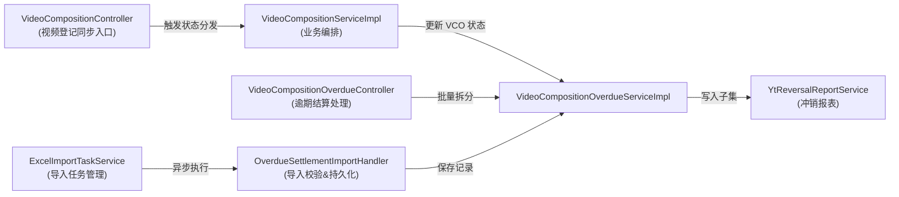
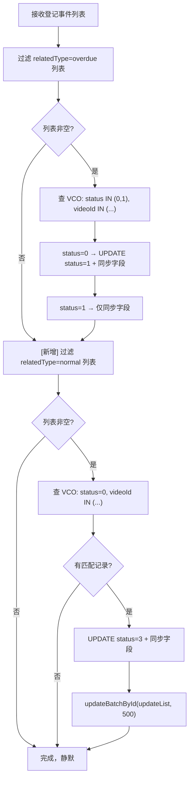
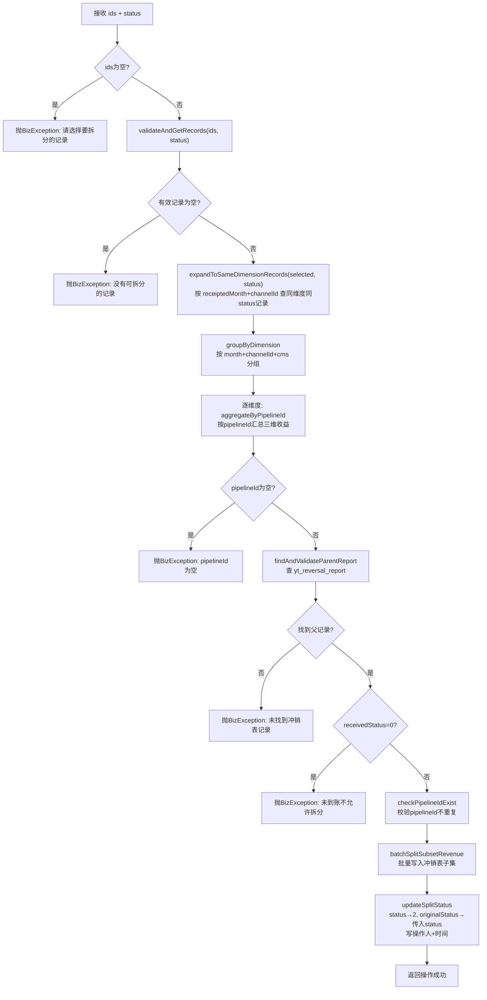
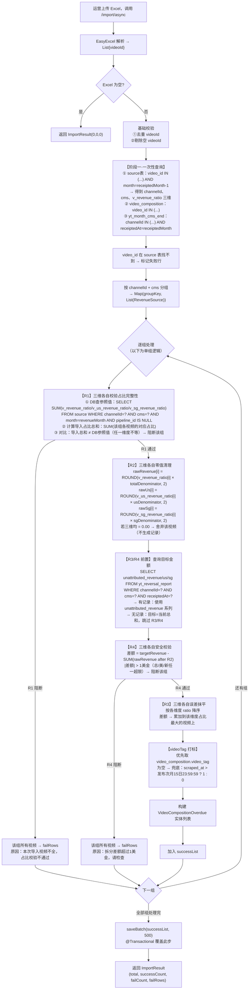
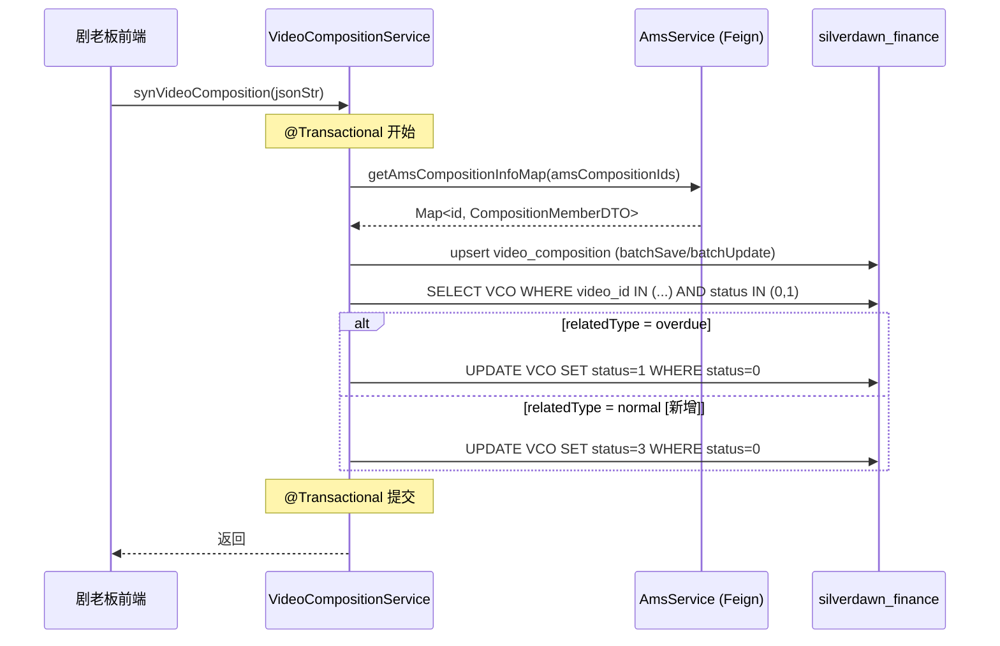
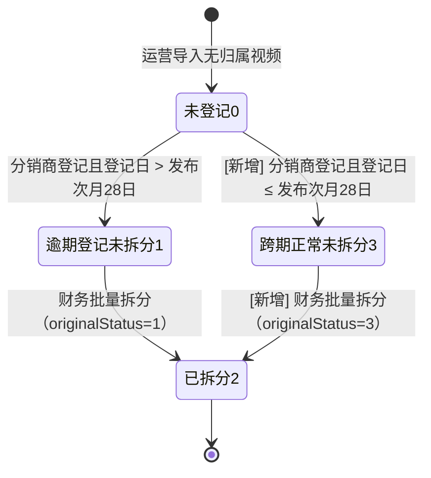
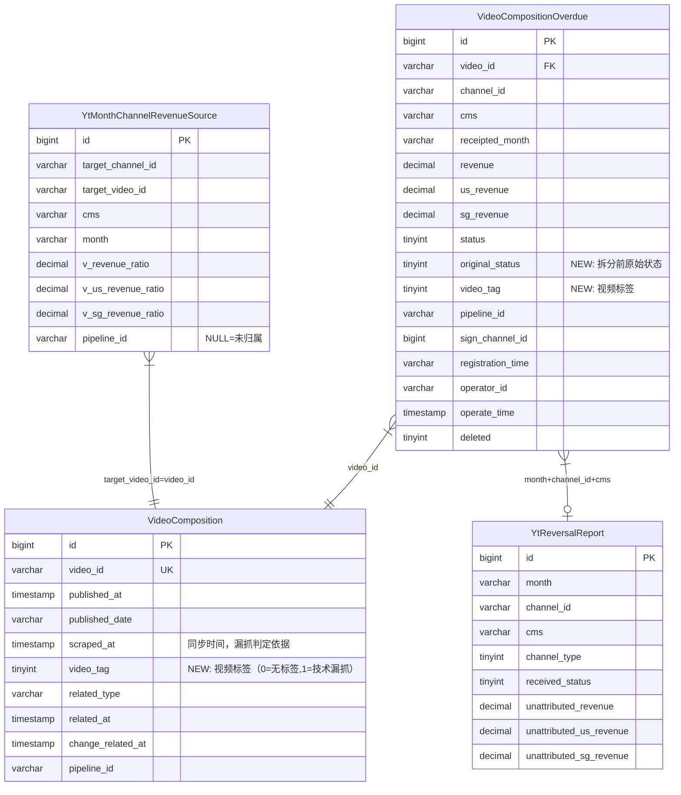

# 逾期结算处理--详细设计

## 文档信息

| 项目 | 内容 |
| --- | --- |
| **所属业务域** | 逾期结算处理 |
| **域编号** | D01 |
| **域类型** | 核心域 |
| **域负责人** | 后端开发 |
| **关联迭代总纲** | [V4.5-内容结算系统迭代-迭代变更总纲.md](./V4.5-内容结算系统迭代-迭代变更总纲.md) |

---

## 一、域概述

### 1.1 业务职责

逾期结算处理域负责管理 YouTube 内容分销商与 CP（内容伙伴）之间的收益结算全流程：从运营导入无归属视频收益数据开始，经由分销商在剧老板前端完成视频登记后触发状态分发，财务人员对登记记录执行批量拆分，最终写入冲销报表子集完成收益归属。本域同时负责维护技术漏抓标识，为财务免责判定提供系统侧证据。

### 1.2 模块 - 控制器 - 服务映射

| 模块名称 | Controller | Service | Mapper | 核心职责 |
| --- | --- | --- | --- | --- |
| 逾期结算列表 | `VideoCompositionOverdueController` | `VideoCompositionOverdueService` / `VideoCompositionOverdueServiceImpl` | `VideoCompositionOverdueMapper` | 逾期结算记录的分页查询、批量拆分、导出 |
| 视频登记同步 | 无（内部调用入口） | `VideoCompositionService` / `VideoCompositionServiceImpl` | `VideoCompositionMapper` | 接收剧老板推送的登记事件，执行状态分发 |
| 导入处理 | `VideoCompositionOverdueController` | `ExcelImportTaskService` | `ExcelImportTaskMapper` | 异步 Excel 导入任务管理 |
| 导入业务处理器 | 无（异步线程执行） | `OverdueSettlementImportHandler` | 多个 Mapper | 导入数据的 R1-R6 校验、抹平、持久化 |

### 1.3 域内交互关系



### 1.4 迭代背景

[《PRD-内容结算系统迭代-V4.5》](../../PRD-内容结算系统迭代-V4.5%20(1).md)

| 序号 | 需求项 | 优先级 | 简述 |
| --- | --- | --- | --- |
| 1 | SET-01 登记状态分发 | P0 | 新增 status=0→3（跨期正常未拆分）分支，修复历史死锁 |
| 2 | SET-02 财务结算处理 | P0 | batchSplit 支持 status=3；已拆分 Tab 新增原状态列 |
| 3 | SET-03 导入误差处理 | P0 | 新增 R1-R6 六条校验规则，消除导入精度误差 |
| 4 | SET-04 漏抓责任界定 | P1 | 新增 `video_tag` 视频标签字段（写入 video_composition 与 video_composition_overdue），入库时打标技术漏抓 |

### 1.5 迭代变更概览

| 变更类型 | 影响模块 | 影响文件 | 简述 |
| --- | --- | --- | --- |
| `[新增]` | 逾期结算列表 | `OverdueSettlementStatusEnum`、`VideoCompositionOverdue`、`VideoCompositionOverdueVO` | 新增 status=3 枚举值、`originalStatus`、`videoTag` 字段 |
| `[新增]` | 公共枚举 | `VideoTagEnum` | 新增视频标签枚举（0=无标签, 1=技术漏抓） |
| `[新增]` | 视频登记同步 | `VideoComposition` | 新增 `videoTag` 视频标签字段 |
| `[修改]` | 视频登记同步 | `VideoCompositionServiceImpl` | 新增 normal 分支：relatedType=normal → status=0→3 |
| `[修改]` | 逾期结算列表 | `VideoCompositionOverdueServiceImpl` | batchSplit 全面支持 status=3；resolveIsSplit 纳入 status=3 |
| `[修改]` | 导入业务处理器 | `OverdueSettlementImportHandler` | 新增 R1-R6 校验 + videoTag 打标 |
| `[修改]` | 数据库 | `video_composition_overdue` | 新增 `original_status`、`video_tag` 两列 |

---

## 二、功能模块详细设计

---

### 2.1 登记状态分发模块

> 接收剧老板前端推送的视频登记事件，根据登记日与发布次月28日的关系，将 VCO 表中对应的 status=0 记录分发为 status=1（逾期）或 status=3（跨期正常）。

#### 2.1.1 新增跨期正常状态分发 `[修改]`

| **名称描述** | 登记状态分发（新增 normal 分支） | **估分** | 0.5人/天 |
| --- | --- | --- | --- |
| **触发方式** | 剧老板前端调用 `POST /videoComposition/synVideoComposition`（内部接口） |  |  |
| **Service 方法** | `VideoCompositionServiceImpl.synVideoComposition(String jsonStr)` |  |  |
| **核心子方法** | `syncOverdueSettlementStatus(List<VideoComposition>)` |  |  |

**入参**（`synVideoComposition` 接收的 JSON 负载，`videoCompositions` 数组中每个元素）：

```json
{
  "videoId": "String // YouTube 视频ID",
  "channelId": "String // 频道ID",
  "relatedType": "String // normal=正常登记 | overdue=逾期登记",
  "relatedAt": "Date // 首次登记时间",
  "changeRelatedAt": "Date // 变更登记时间（有值时优先使用）",
  "publishedAt": "Date // 视频发布时间",
  "amsCompositionId": "Long // AMS 子集ID",
  "pipelineId": "String // 发布通道ID"
}
```

**业务逻辑**（`syncOverdueSettlementStatus` 子方法，在 `synVideoComposition` 事务内执行）：

1. 过滤出 `relatedType = overdue` 的视频列表（现有逻辑，保持不变）
   1. 查询对应 VCO 记录：`status IN (0, 1)` 且 `video_id IN (...)` 且 `deleted=0`
   2. 对 status=0 的记录：更新 status=1，同步 pipelineId、signChannelId 等登记字段
   3. 对 status=1 的记录：仅同步字段，status 保持不变
2. **[新增]** 过滤出 `relatedType = normal` 的视频列表
   1. 查询对应 VCO 记录：`status = 0` 且 `video_id IN (...)` 且 `deleted=0`
   2. 判断是否有匹配记录：
      1. 无匹配记录：跳过，静默处理（PRD 已明确）
      2. 有匹配记录：更新 status=3，同步 pipelineId、signChannelId、registrationTime 等登记字段
3. 批量执行 `updateBatchById(updateList, 500)`

**返回**：无（void），失败时静默处理，依赖异常日志监控。

**业务流程图**：



**实现检查清单**：

- [ ] Controller: 无（通过现有 `/videoComposition/synVideoComposition` 触发）
- [ ] Service: `VideoCompositionServiceImpl.syncOverdueSettlementStatus()` → 新增 normal 分支处理逻辑
- [ ] Service: 新增私有方法 `filterNormalRecords(List<VideoComposition>)` 过滤 relatedType=normal 的列表
- [ ] Service: 新增私有方法 `syncNormalSettlementStatus(List<VideoComposition>)` 处理 normal 状态分发
- [ ] Mapper: `VideoCompositionOverdueMapper`（MyBatis Plus `updateBatchById`，无需新增 XML）
- [ ] DTO: 无新增
- [ ] VO: 无新增
- [ ] Entity: `VideoCompositionOverdue` → 无结构变更（status=3 通过枚举扩展支持）
- [ ] SQL: 无（`UPDATE status=3` 通过现有表结构支持）
- [ ] 事务: `@Transactional` 已标注在 `synVideoComposition()` 上，normal 分支在同一事务内
- [ ] MQ: 无
- [ ] 缓存: 无

---

#### 2.1.2 checkSplitStatus 纳入 status=3 `[修改]`

| **名称描述** | 查询视频拆分状态（外部系统调用） | **估分** | 0.1人/天 |
| --- | --- | --- | --- |
| **接口路径** | `GET /videoCompositionOverdue/checkSplitStatus` | | |
| **Controller 方法** | `VideoCompositionOverdueController.checkSplitStatus()` | | |
| **Service 方法** | `VideoCompositionOverdueServiceImpl.checkSplitStatus()` → `resolveIsSplit()` | | |

**入参**：

```json
{
  "videoId": "String // 视频ID（Query 参数）"
}
```

**业务逻辑**（`resolveIsSplit()` 私有方法）：

1. 根据 `videoId` 查询 VCO 表各状态的记录数：`SELECT status, COUNT(*) FROM video_composition_overdue WHERE video_id=? AND deleted=0 GROUP BY status`
2. 判断结果：
   1. 无记录 → `isSplit=false`
   2. 存在 status=0（未登记）→ `isSplit=false`
   3. 存在 status=1（逾期未拆分）→ `isSplit=false`
   4. **[修改]** 存在 status=3（跨期正常未拆分）→ `isSplit=false`
   5. 全部为 status=2（已拆分）→ `isSplit=true`
3. 返回 `VideoSplitStatusVO(videoId, isSplit)`

**返回**：

```json
{
  "videoId": "String // 视频ID",
  "isSplit": "Boolean // true=已全部拆分, false=存在未拆分记录"
}
```

**业务流程图**：无（简单查询逻辑，无分支写入）

**实现检查清单**：

- [ ] Controller: `GET /videoCompositionOverdue/checkSplitStatus` → `VideoCompositionOverdueController.checkSplitStatus()`（无变更）
- [ ] Service: `VideoCompositionOverdueServiceImpl.resolveIsSplit()` → 在 `hasNonSplit` 判断中增加 `statusCountMap.containsKey(CROSS_PERIOD_NORMAL.getCode())`
- [ ] Mapper: `VideoCompositionOverdueMapper.selectStatusCountByVideoId()` → 无变更（查所有 status，已覆盖）
- [ ] DTO: 无
- [ ] VO: `VideoSplitStatusVO` → 无变更
- [ ] Entity: 无变更
- [ ] SQL: 无
- [ ] 事务: 无事务（只读查询）
- [ ] MQ: 无
- [ ] 缓存: 无

---

### 2.2 财务结算处理模块

> 提供逾期结算记录的分页查询（支持4个Tab）、批量拆分（支持 status=1 和 status=3）、异步导出能力。本次新增【跨期正常未拆分】Tab（status=3），并在已拆分 Tab 新增原状态列。

#### 2.2.1 分页查询（新增 status=3 Tab 支持）`[修改]`

| **名称描述** | 分页查询逾期结算列表 | **估分** | 0.2人/天 |
| --- | --- | --- | --- |
| **接口路径** | `POST /videoCompositionOverdue/page` | | |
| **Controller 方法** | `VideoCompositionOverdueController.page()` | | |
| **Service 方法** | `VideoCompositionOverdueServiceImpl.pageList()` | | |

**入参**（`VideoCompositionOverdueQuery`）：

```json
{
  "page": "Integer // 页码，默认1",
  "pageSize": "Integer // 每页大小，默认20",
  "status": "Integer // Tab状态: 0=未登记, 1=逾期登记未拆分, 2=已拆分, 3=跨期正常未拆分[新增]",
  "receiptedMonthStart": "String // 到账月份起，格式 yyyy-MM",
  "receiptedMonthEnd": "String // 到账月份止，格式 yyyy-MM",
  "channelId": "String // 频道ID（可选）",
  "channelName": "String // 频道名称，模糊匹配（可选）",
  "videoId": "String // 视频ID（可选）",
  "cpName": "String // CP名称，模糊匹配（可选）",
  "signChannelName": "String // 子集名称，模糊匹配（可选）",
  "teamName": "String // 分销商名称，模糊匹配（可选）",
  "cms": "String // 收款系统（可选）"
}
```

**业务逻辑**：

1. `VideoCompositionOverdueQuery` 入参中 `status` 传入对应 Tab 值（0/1/2/3）
2. 调用 `baseMapper.selectPageList(page, query)` 执行分页查询
   1. `VideoCompositionOverdueMapper.xml` 中 `Common_Where_Clause` 已按 `status` 过滤，status=3 天然支持（无需改 XML）
   2. **[修改]** `Default_Order_By` 中需新增 status=3 的排序规则：按 `registration_time DESC`（与 status=1 一致）
3. 调用 `enrichVoFields(list)` 填充字段：statusName、videoLink、servicePackageName、langName
   1. **[修改]** `OverdueSettlementStatusEnum.toLabel()` 需覆盖 status=3 的中文名"跨期正常未拆分"
4. **[修改]** VO 结果中新增 `originalStatus`、`videoTag` 字段（从 DB 字段自动映射）
5. 返回分页结果

**返回**（`VideoCompositionOverdueVO` 列表，新增字段）：

```json
{
  "id": "Long // 记录ID",
  "receiptedMonth": "String // 到账月份",
  "channelId": "String // 频道ID",
  "channelName": "String // 频道名称",
  "videoId": "String // 视频ID",
  "cms": "String // 收款系统",
  "revenue": "BigDecimal // 总收益",
  "usRevenue": "BigDecimal // 美国收益",
  "sgRevenue": "BigDecimal // 新加坡收益",
  "status": "Integer // 状态值",
  "statusName": "String // 状态中文名",
  "originalStatus": "Integer // [新增] 拆分前原始状态，未拆分时为null",
  "videoTag": "Integer // [新增] 视频标签：0=无标签, 1=技术漏抓",
  "registrationTime": "Date // 登记时间（status>=1时有值）",
  "signChannelName": "String // 子集名称",
  "cpName": "String // CP名称",
  "operatorName": "String // 操作人（status=2时有值）",
  "operateTime": "Date // 操作时间（status=2时有值）"
}
```

**业务流程图**：无（简单分页查询）

**实现检查清单**：

- [ ] Controller: `POST /videoCompositionOverdue/page` → 无变更
- [ ] Service: `VideoCompositionOverdueServiceImpl.pageList()` → 无变更（VO 字段自动映射）
- [ ] Mapper XML: `Default_Order_By` → 新增 `when status=3 ORDER BY registration_time DESC`
- [ ] Enum: `OverdueSettlementStatusEnum.toLabel()` → 新增 status=3 映射"跨期正常未拆分"
- [ ] DTO: 无
- [ ] VO: `VideoCompositionOverdueVO` → 新增 `originalStatus`（Integer）、`videoTag`（Integer）字段
- [ ] Entity: `VideoCompositionOverdue` → 新增 `originalStatus`（Integer）、`videoTag`（Integer）字段
- [ ] Entity: `VideoComposition` → 新增 `videoTag`（Integer）字段
- [ ] SQL: 无（SELECT 通过 MyBatis Plus 自动映射）
- [ ] 事务: 无事务（只读）
- [ ] MQ: 无
- [ ] 缓存: 无

---

#### 2.2.2 批量拆分（新增 status=3 支持 + 写入 originalStatus）`[修改]`

| **名称描述** | 批量拆分结算 | **估分** | 0.8人/天 |
| --- | --- | --- | --- |
| **接口路径** | `POST /videoCompositionOverdue/batchSplit` | | |
| **Controller 方法** | `VideoCompositionOverdueController.batchSplit()` | | |
| **Service 方法** | `VideoCompositionOverdueServiceImpl.batchSplit()` | | |

**入参**（`BatchSplitRequest`，新增 DTO）：

```json
{
  "ids": "List<Long> // 用户勾选的记录ID列表",
  "status": "Integer // 当前操作的Tab状态：1=逾期登记未拆分, 3=跨期正常未拆分"
}
```

> 注意：当前接口入参为 `List<Long> ids`（RequestBody 直接传 JSON 数组），本次需改造为包含 `status` 的对象入参。

**业务逻辑**（`@Transactional` 事务覆盖全部步骤）：

1. 校验入参：
   1. `ids` 为空 → 抛出 `BizException`："请选择要拆分的记录"
   2. `status` 不在 `{1, 3}` 中 → 抛出 `BizException`："不合法的操作Tab状态"
2. 调用 `validateAndGetRecords(ids, status)` 校验并获取有效记录：
   1. 批量查询 `listByIds(ids)`
   2. 过滤 `status` 等于传入 status 值的记录（**[修改]** 原来硬编码过滤 status=1）
   3. 有效记录为空 → 抛出 `BizException`："没有可拆分的记录"
3. 调用 `expandToSameDimensionRecords(selectedRecords, status)` 扩展同维度记录：
   1. 提取所有 `receiptedMonth + channelId` 维度组合
   2. 对每个维度：查询 `status=传入status` 且 `deleted=0` 的全部记录（**[修改]** 原来硬编码 REGISTERED_UNSPLIT，现在按传入 status 查）
   3. 去重合并
4. 按 `month + channelId + cms` 分组
5. 获取操作人信息：`StpUtil.getLoginIdAsString()`
6. 逐维度构建拆分参数 `SplitSubsetQuery`：
   1. 按 `pipelineId` 汇总三维收益（revenue/usRevenue/sgRevenue）
   2. 判断 `pipelineId` 是否为空：
      1. 为空 → 抛出 `BizException`："视频ID={videoId} 的pipelineId为空，无法拆分"
   3. 查找对应 `yt_reversal_report` 父记录（channelType=2合集 或 channelType=0转型）：
      1. 未找到 → 抛出 `BizException`："未找到对应冲销表记录: {month}-{channelId}-{cms}"
      2. `receivedStatus=0`（未到账）→ 抛出 `BizException`："冲销表记录未到账，不允许拆分子集"
   4. 校验 pipelineId 在冲销表中不重复
7. 调用 `ytReversalReportService.batchSplitSubsetRevenue(splitQueryList)` 批量写入冲销表子集
8. 调用 `updateSplitStatus(processedIds, operatorId, operatorName, now, status)` 更新状态：
   1. 将所有处理记录的 `status → 2`
   2. **[新增]** `originalStatus → 传入的 status 值（1 或 3）`
   3. `operatorId`、`operatorName`、`operateTime` → 当前操作人和时间
9. 返回成功（`DomiResponse.getSuccess()`，不返回处理数量，符合 V4.5 PRD 规定）

**返回**：

```json
{}
```

**业务流程图**：



**实现检查清单**：

- [ ] Controller: `POST /videoCompositionOverdue/batchSplit` → 入参从 `List<Long>` 改为 `BatchSplitRequest`（含 ids + status）
- [ ] Service: `VideoCompositionOverdueServiceImpl.batchSplit(BatchSplitRequest)` → 接收 status 参数
- [ ] Service: `validateAndGetRecords(List<Long>, Integer status)` → 按 status 过滤（原硬编码 status=1 改为参数化）
- [ ] Service: `expandToSameDimensionRecords(List, Integer status)` → 按 status 查同维度（原硬编码 REGISTERED_UNSPLIT 改为参数化）
- [ ] Service: `updateSplitStatus(List<Long>, String, String, Date, Integer originalStatus)` → 新增写入 `originalStatus` 字段
- [ ] DTO: `BatchSplitRequest`（新增）→ 含 `ids: List<Long>`、`status: Integer` 两个字段
- [ ] VO: 无
- [ ] Entity: `VideoCompositionOverdue` → 字段 `originalStatus` 已在 2.2.1 新增
- [ ] SQL: `UPDATE video_composition_overdue SET status=2, original_status=?, ...`
- [ ] 事务: `@Transactional(rollbackFor=Exception.class)` 标注在 `batchSplit()` 上（已有，保持不变）
- [ ] MQ: 无
- [ ] 缓存: 无

---

#### 2.2.3 异步导出（新增 originalStatus、videoTag 字段）`[修改]`

| **名称描述** | 异步导出（供外部系统分页调用） | **估分** | 0.2人/天 |
| --- | --- | --- | --- |
| **接口路径** | `POST /videoCompositionOverdue/export/async` | | |
| **Controller 方法** | `VideoCompositionOverdueController.exportAsync()` | | |
| **Service 方法** | `VideoCompositionOverdueServiceImpl.exportAsync()` | | |

**入参**（`VideoCompositionOverdueAsyncQuery`）：

```json
{
  "page": "Integer // 页码",
  "pageSize": "Integer // 每页大小",
  "offset": "Long // 游标偏移（上一页最后一条记录ID）",
  "status": "Integer // Tab状态: 0/1/2/3",
  "receiptedMonthStart": "String // 到账月份起",
  "receiptedMonthEnd": "String // 到账月份止"
}
```

**业务逻辑**：

1. 调用 `baseMapper.selectPageListForAsyncExport(page, query)` 分页查询
2. 将 VO 列表转换为导出格式：`convertToExport(vo, status)`
   1. 通用字段（所有Tab）：receiptedMonth、channelId、channelName、videoId、revenue 等
   2. **[修改]** 所有 Tab 均新增 `videoTag` 字段
   3. status >= 1（登记后）特有字段：signChannelName、cpName、registrationTime 等（status=3 满足 3>=1，自动包含）
   4. status = 2（已拆分）特有字段：operatorName、operateTime
   5. **[修改]** status = 2 新增 `originalStatus` 字段
3. 返回分页导出结果

**返回**（`VideoCompositionOverdueExport` 对象新增字段）：

```json
{
  "receiptedMonth": "String // 到账月份",
  "channelId": "String // 频道ID",
  "videoId": "String // 视频ID",
  "revenue": "BigDecimal // 总收益",
  "usRevenue": "BigDecimal // 美国收益",
  "sgRevenue": "BigDecimal // 新加坡收益",
  "videoTag": "Integer // [新增] 视频标签：0=无标签, 1=技术漏抓（所有Tab）",
  "originalStatus": "Integer // [新增] 拆分前原始状态，仅已拆分Tab有值",
  "operatorName": "String // 操作人，仅已拆分Tab有值",
  "operateTime": "Date // 操作时间，仅已拆分Tab有值"
}
```

**业务流程图**：无（分页导出查询，无写入）

**实现检查清单**：

- [ ] Controller: `POST /videoCompositionOverdue/export/async` → `convertToExport()` 填充新字段
- [ ] Service: `VideoCompositionOverdueServiceImpl.exportAsync()` → 无变更
- [ ] Mapper: 无变更（字段通过 MyBatis Plus 自动映射）
- [ ] Export: `VideoCompositionOverdueExport` → 新增 `videoTag`（Integer）、`originalStatus`（Integer）字段，添加 `@ExcelProperty` 注解
- [ ] Entity: `VideoComposition` → 已在 2.2.1 说明，`videoTag` 字段由此读取
- [ ] VO: 无变更（VO 已在 2.2.1 新增字段）
- [ ] Entity: 无变更（已在 2.2.1 新增字段）
- [ ] SQL: 无
- [ ] 事务: 无
- [ ] MQ: 无
- [ ] 缓存: 无

---

### 2.3 漏抓标签模块

> 在视频数据入库时（导入阶段），从 `video_composition.video_tag`（视频标签）读取已打标的标签值，写入 `video_composition_overdue.video_tag`。若 `video_composition.video_tag` 为空，则根据 `video_composition.scraped_at` 与视频发布次月15日的比较结果兜底计算。列表和导出接口通过返回该字段支持前端展示橙色【技术漏抓】标签。

#### 2.3.1 入库时打标漏抓标识 `[新增]`

> 此功能无独立接口，在导入处理器 `OverdueSettlementImportHandler` 中执行（见 § 3.1）。本节仅描述打标判定规则。

**判定规则**：

| 条件 | `video_tag` 值 | 枚举常量 |
| --- | --- | --- |
| `video_composition.video_tag` 已有值 | 直接取原值 | — |
| `video_composition.video_tag` 为空 且 `scrapedAt` 为空 | `0` | `NO_TAG` |
| `video_composition.video_tag` 为空 且 `scrapedAt` ≤ 发布次月15日 23:59:59 | `0` | `NO_TAG` |
| `video_composition.video_tag` 为空 且 `scrapedAt` > 发布次月15日 23:59:59 | `1` | `TECHNICAL_MISSED` |

**打标逻辑**（在 `buildOverdueEntity()` 中执行）：

1. 读取 `VideoComposition.videoTag`（视频标签字段）
2. 若已有值（不为 null）→ 直接使用 `videoTag` 值，跳过计算
3. 若为空 → 兜底计算：
   1. 从 `VideoComposition.scrapedAt` 获取视频抓取时间
   2. 从 `VideoComposition.publishedAt` 获取视频发布时间
   3. 计算判定截止时间：`publishedAt 所在月份的次月15日 23:59:59`
   4. `scrapedAt` 为空 OR `scrapedAt <= 截止时间` → `videoTag = 0（NO_TAG）`
   5. `scrapedAt > 截止时间` → `videoTag = 1（TECHNICAL_MISSED）`
4. 将最终 `videoTag` 写入 `VideoCompositionOverdue.videoTag`

**实现检查清单**：

- [ ] Service（导入处理器）: `OverdueSettlementImportHandler.buildOverdueEntity()` → 从 `VideoComposition.videoTag` 读取标签值，为空则兜底计算（scraped_at vs 次月15日）
- [ ] Enum: `VideoTagEnum`（新增） → `NO_TAG(0, "无标签")` / `TECHNICAL_MISSED(1, "技术漏抓")`
- [ ] Entity: `VideoCompositionOverdue.videoTag`（已在 2.2.1 新增）
- [ ] Entity: `VideoComposition.videoTag`（新增，作为标签来源字段）
- [ ] SQL: `INSERT INTO video_composition_overdue (..., video_tag) VALUES (..., ?)`（MyBatis Plus 自动处理）
- [ ] 事务: 在 `OverdueSettlementImportHandler.handle()` 的事务中（已有）
- [ ] MQ: 无
- [ ] 缓存: 无

---

## 三、批量处理设计

### 3.1 导入误差处理（新增 R1-R6 校验）`[修改]`

| 项目 | 内容 |
| --- | --- |
| **操作类型** | 导入 |
| **触发方式** | 运营上传 Excel 文件到 OSS，调用 `POST /videoCompositionOverdue/import/async` |
| **处理框架** | EasyExcel（现有）|
| **单批大小** | 500条（`saveBatch(list, 500)`，现有）|
| **预计最大数据量** | 每次最多 20000 行（`finance.import-max-rows.overdue` 配置）|

**导入字段映射**（`OverdueSettlementImportDTO`）：

| Excel 列名 | 对应字段 | 类型 | 必填 | 校验规则 |
| --- | --- | --- | --- | --- |
| 视频ID | `videoId` | String | Y | 不为空 |
| 行号（内部） | `rowNum` | Integer | N | EasyExcel 注入 |

---

#### 3.1.1 六条规则定义

> 规则以【频道ID + 收款系统】为处理组（以下简称"组"），组内三维收益（总/美/新）各自独立执行 R1-R4，R6 即"三维独立"的声明。

| 规则 | 名称 | 执行阶段 | 触发条件 | 动作 |
| --- | --- | --- | --- | --- |
| **R1** | 占比完整性校验 | 组内前置 | `SUM(导入视频 v_revenue_ratio)` ≠ DB参照值（≠ SUM(v_revenue_ratio WHERE pipeline_id IS NULL)）| **阻断该组**，组内所有视频失败 |
| **R2** | 零值清理 | 逐视频 | `ROUND(v_revenue_ratio × CMS分母, 2) = 0.00` | 舍弃该视频在该维度的记录（不生成该行） |
| **R3** | 误差抹平 | 组内汇总后 | 计算后的总和与目标金额存在差额 | 差额加到同组**占比最大**的视频上 |
| **R4** | 安全阈值校验 | R3 计算前 | `|差额| > 1 美金`（总/美/新任一超限）| **阻断该组** |
| **R5** | 全零阻断 | R2 后 | 组内所有视频三维收益全部 = 0.00 | 触发 R4 逻辑阻断（差额 = 目标金额 > 1） |
| **R6** | 三维独立 | 全程 | 适用于所有规则 | 总收益、美国收益、新加坡收益**各自独立**执行 R1-R5 |

**三维 CMS 分母来源**（基于 `yt_month_cms_end`）：

| 维度 | 分母公式 | 字段来源 |
| --- | --- | --- |
| 总收益 | `revenue + adjustedAmount1` | `yt_month_cms_end.revenue + adjusted_amount1` |
| 美国收益 | `usRevenue + adjustedAmount2` | `yt_month_cms_end.us_revenue + adjusted_amount2` |
| 新加坡收益 | `adjustedAmount3` | `yt_month_cms_end.adjusted_amount3`（无基础字段，直接取调差3）|

**R3 目标金额来源**：

| 优先级 | 来源 | 查询条件 |
| --- | --- | --- |
| 优先 | `yt_reversal_report.unattributed_revenue` / `unattributed_us_revenue` / `unattributed_sg_revenue` | `channel_id=? AND cms=? AND receipted_at BETWEEN ? AND ? AND received_status=RECEIVED` |
| 兜底 | `SUM(ROUND(v_revenue_ratio × 分母, 2))` 自身（无 reversal_report 记录时差额恒为0，R3 无需执行）| — |

> **兜底说明**：当 `yt_reversal_report` 中无匹配记录时，说明冲销表尚未生成，目标金额 = 已计算的取整总和，误差 = 0，R3/R4 均跳过（无需抹平也无需阻断）。

---

#### 3.1.2 处理总流程

处理分三个阶段：**预处理（全量一次性查询）→ 逐组执行 R1-R6 → 持久化**



---

#### 3.1.3 R1 参照值查询

> 每组执行一次，三维合并为一条 SQL，新增 Mapper 方法支持。

```sql
-- YtMonthChannelRevenueSourceMapper.sumUnattributedRatio
SELECT
    SUM(v_revenue_ratio)    AS totalRatio,
    SUM(v_us_revenue_ratio) AS usRatio,
    SUM(v_sg_revenue_ratio) AS sgRatio
FROM yt_month_channel_revenue_source
WHERE target_channel_id = #{channelId}
  AND cms              = #{cms}
  AND month            = #{revenueMonth}   -- receiptedMonth 往前推一个月
  AND pipeline_id IS NULL                  -- 未归属视频（即本次应导入的视频范围）
```

返回对象：`UnattributedRatioDTO { BigDecimal totalRatio, usRatio, sgRatio }`

**R1 校验逻辑**（三维任一不通过则阻断）：

```
importedTotalRatio = SUM(source.vRevenueRatio   for videos in this group)
importedUsRatio    = SUM(source.vUsRevenueRatio  for videos in this group)
importedSgRatio    = SUM(source.vSgRevenueRatio  for videos in this group)

if importedTotalRatio != dbRef.totalRatio
    OR importedUsRatio  != dbRef.usRatio
    OR importedSgRatio  != dbRef.sgRatio:
    → BLOCK group, reason = "本次导入视频不全，占比校验不通过"
```

> **精度说明**：占比为 10 位小数（`DECIMAL(14,10)`），比较时使用 `compareTo()`，不使用 `==`。

---

#### 3.1.4 R2 零值清理

对组内每条视频，三维独立计算并判断：

```
rawRevenue = ROUND(vRevenueRatio   × (cmsEnd.revenue + cmsEnd.adjustedAmount1), 2)
rawUs      = ROUND(vUsRevenueRatio × (cmsEnd.usRevenue + cmsEnd.adjustedAmount2), 2)
rawSg      = ROUND(vSgRevenueRatio × cmsEnd.adjustedAmount3, 2)

if rawRevenue == 0 AND rawUs == 0 AND rawSg == 0:
    → 舍弃该视频（不加入 successList）
```

> 三维中某维度为 0、其他维度 > 0 时：该维度存 0，不舍弃整条记录。

---

#### 3.1.5 R4 + R3 误差校验与抹平

**查询目标金额**（来自冲销表无归属收益字段）：

```sql
SELECT unattributed_revenue, unattributed_us_revenue, unattributed_sg_revenue
FROM yt_reversal_report
WHERE channel_id    = #{channelId}
  AND cms           = #{cms}
  AND receipted_at  BETWEEN #{receiptedAtStart} AND #{receiptedAtEnd}
  AND received_status = 0  -- RECEIVED
LIMIT 1
```

> `receipted_at` 的范围取 `receiptedMonth` 对应月份首日至末日。

**R4 安全校验（先于 R3）**：

```
errorRevenue = targetRevenue - SUM(rawRevenue after R2)
errorUs      = targetUs      - SUM(rawUs      after R2)
errorSg      = targetSg      - SUM(rawSg      after R2)

if |errorRevenue| > 1.00 OR |errorUs| > 1.00 OR |errorSg| > 1.00:
    → BLOCK group, reason = "拆分差额超过1美金，请检查CMS数据"
```

**R3 误差抹平（R4 通过后执行，三维独立）**：

```
// 总收益维度
sortedByRevRatio = group.sortedByDescending(vRevenueRatio)
sortedByRevRatio[0].rawRevenue += errorRevenue

// 美国收益维度
sortedByUsRatio  = group.sortedByDescending(vUsRevenueRatio)
sortedByUsRatio[0].rawUs  += errorUs

// 新加坡收益维度
sortedBySgRatio  = group.sortedByDescending(vSgRevenueRatio)
sortedBySgRatio[0].rawSg  += errorSg
```

> 若 reversal_report 无记录（无目标金额），差额恒为 0，R3/R4 跳过。

---

#### 3.1.6 事务边界说明

| 边界 | 设计 | 理由 |
| --- | --- | --- |
| `handle()` 整体 | `@Transactional(rollbackFor=Exception.class)`（保持现有）| 所有成功记录在最后统一 `saveBatch`，业务层失败（R1/R4）不抛异常只收集 failRows，基础设施异常（DB 故障）才触发回滚 |
| 单组失败 | 不抛出异常，加入 failRows | 实现"部分成功"：失败组不写库，成功组统一入库，互不影响 |
| 全部失败 | `successList` 为空，`saveBatch` 不执行 | 任务状态标记为"导入失败"，failRows 生成失败文件 |

> **与现有代码的差异**：现有 `handle()` 已有 `@Transactional`，逐行处理无分组；本次改造仅需在现有循环外增加**按 channelId+cms 分组**的循环，以及在组内串联 R1→R2→R4→R3 逻辑，不需要修改事务边界。

---

#### 3.1.7 错误处理策略

| 场景 | 处理方式 |
| --- | --- |
| Excel 内 videoId 为空 | 标记该行失败，跳过 |
| Excel 内 videoId 重复 | 标记重复行失败，跳过 |
| videoId 在 source 表无记录 | 标记该行失败（原因：收益数据不存在），跳过 |
| video_composition 存在且 relatedType=normal | 标记失败（正常视频不应导入逾期），跳过 |
| receiptedMonth+cms+videoId 已存在于 VCO 表 | 标记失败（幂等键冲突），跳过 |
| R1 占比不等 | 标记该组全部失败，继续处理下一组 |
| R4 差额 > 1 | 标记该组全部失败，继续处理下一组 |
| yt_month_cms_end 无记录（分母缺失）| 标记该组全部失败（原因：CMS 收益数据未导入），跳过 |

---

#### 3.1.8 实现检查清单

- [ ] Controller: `POST /videoCompositionOverdue/import/async` → 无变更（触发方式不变）
- [ ] Service（导入处理器）: `OverdueSettlementImportHandler.handle()` → 在现有逐行循环基础上增加按 channelId+cms 分组逻辑，串联 R1-R6 规则
- [ ] Service（导入处理器）: 新增私有方法 `validateR1(groupKey, importedRatios, revenueMonth)` → 调 Mapper 获取 DB 参照值，三维各自对比
- [ ] Service（导入处理器）: 新增私有方法 `applyR2(list, cmsEnd)` → 计算三维原始金额，舍弃三维全零记录，返回有效列表
- [ ] Service（导入处理器）: 新增私有方法 `applyR4R3(list, channelId, cms, receiptedMonth)` → 查目标金额，校验 R4，通过后执行 R3 抹平
- [ ] Service（导入处理器）: `buildOverdueEntity()` → 收益字段改为传入已计算好的 rawRevenue/rawUs/rawSg（R3 抹平后的值），不再在此方法内计算；保留 videoTag 打标逻辑
- [ ] Mapper: `YtMonthChannelRevenueSourceMapper` → 新增 `sumUnattributedRatio(channelId, cms, revenueMonth)` 方法，返回 `UnattributedRatioDTO`
- [ ] Mapper XML: `YtMonthChannelRevenueSourceMapper.xml` → 新增对应 SELECT SQL
- [ ] Mapper: `YtReversalReportMapper` → 新增 `fetchUnattributedRevenue(channelId, cms, receiptedAtStart, receiptedAtEnd)` 方法（R3 目标金额查询）
- [ ] Mapper XML: `YtReversalReportMapper.xml` → 新增对应 SELECT SQL
- [ ] DTO: 新增 `UnattributedRatioDTO { totalRatio, usRatio, sgRatio }` → R1 查询返回对象
- [ ] VO: 无
- [ ] Entity: `VideoCompositionOverdue.videoTag`（已在 2.2.1 新增）
- [ ] 事务: `@Transactional(rollbackFor=Exception.class)` 在 `handle()` 上（已有，保持不变；单组 R1/R4 失败不抛异常，只收集 failRows）
- [ ] MQ: 无
- [ ] 缓存: 无

---

## 四、跨服务编排设计

### 4.1 视频登记事件处理（剧老板 → finance-service）

| 项目 | 内容 |
| --- | --- |
| **触发方式** | 剧老板前端调用 finance-service 内部接口（具体方式待剧老板确认：MQ / HTTP）|
| **涉及 Service** | `VideoCompositionServiceImpl`、`VideoCompositionOverdueServiceImpl` |
| **涉及外部调用** | `AmsService`（Feign，获取子集/成员信息）|
| **事务策略** | 本地事务（`@Transactional` 在 `synVideoComposition()` 上）|

**编排流程图**：



**失败处理**：

| 失败节点 | 影响范围 | 补偿策略 |
| --- | --- | --- |
| AMS Feign 调用失败 | memberId/cpName 无法填充，但登记事件本身不受影响 | 捕获异常，memberId/cpName 置空，继续执行（现有行为） |
| VCO 状态更新失败 | video_composition upsert 已完成 | 整体事务回滚；依赖日志监控，无主动重试（PRD 已明确静默失败） |

---

## 五、状态设计

### 5.1 逾期结算记录状态（video_composition_overdue.status）

| 项目 | 内容 |
| --- | --- |
| **所属实体/表** | `video_composition_overdue`.`status` |
| **枚举类** | `OverdueSettlementStatusEnum` |
| **字段类型** | `tinyint` |
| **说明** | 记录从导入到最终拆分的全流程状态 |

**状态值定义**：

| 状态值 | 枚举常量 | 状态名称 | 描述 |
| --- | --- | --- | --- |
| `0` | `UNREGISTERED` | 未登记 | 运营导入，分销商尚未登记 |
| `1` | `REGISTERED_UNSPLIT` | 逾期登记未拆分 | 登记日 > 发布次月28日，等待财务拆分 |
| `2` | `SPLIT` | 已拆分 | 财务已完成批量拆分，收益已归属 |
| `3` | `CROSS_PERIOD_NORMAL` | 跨期正常未拆分 | **[新增]** 登记日 ≤ 发布次月28日，等待财务拆分 |

**状态流转图**：



**流转规则说明**：

| 当前状态 | 目标状态 | 触发动作 | 前置条件 | 操作人/系统 | 说明 |
| --- | --- | --- | --- | --- | --- |
| 0（未登记） | 1（逾期登记未拆分） | 分销商登记事件 | `relatedType=overdue`（登记日 > 次月28日）| 系统（登记事件驱动）| 现有逻辑 |
| 0（未登记） | 3（跨期正常未拆分） | 分销商登记事件 | `relatedType=normal`（登记日 ≤ 次月28日）| 系统（登记事件驱动）| **[新增]** |
| 1（逾期登记未拆分） | 2（已拆分） | 财务批量拆分 | 对应 `yt_reversal_report` 已到账 | 财务人员 | originalStatus=1 |
| 3（跨期正常未拆分） | 2（已拆分） | 财务批量拆分 | 对应 `yt_reversal_report` 已到账 | 财务人员 | **[新增]** originalStatus=3 |

---

## 六、数据字典

### 6.1 OverdueSettlementStatusEnum（逾期结算状态）

| 表/字段 | 字段含义 | 枚举类 | 值 | 描述 |
| --- | --- | --- | --- | --- |
| `video_composition_overdue.status` | 结算状态 | `OverdueSettlementStatusEnum` | `0` | 未登记 |
| `video_composition_overdue.status` | 结算状态 | `OverdueSettlementStatusEnum` | `1` | 逾期登记未拆分 |
| `video_composition_overdue.status` | 结算状态 | `OverdueSettlementStatusEnum` | `2` | 已拆分 |
| `video_composition_overdue.status` | 结算状态 | `OverdueSettlementStatusEnum` | `3` | **[新增]** 跨期正常未拆分 |

### 6.2 VideoTagEnum（视频标签）`[新增]`

| 表/字段 | 字段含义 | 枚举类 | 值 | 描述 |
| --- | --- | --- | --- | --- |
| `video_composition.video_tag` | 视频标签 | `VideoTagEnum` | `0` | 无标签（默认）|
| `video_composition.video_tag` | 视频标签 | `VideoTagEnum` | `1` | 技术漏抓（scraped_at > 发布次月15日）|
| `video_composition_overdue.video_tag` | 视频标签 | `VideoTagEnum` | `0` | 无标签（从 video_composition 继承或兜底计算）|
| `video_composition_overdue.video_tag` | 视频标签 | `VideoTagEnum` | `1` | 技术漏抓（scraped_at > 发布次月15日）|

---

## 七、域内数据库设计

### 7.1 域 ER 图



### 7.2 表结构设计

#### 7.2.1 video_composition_overdue（逾期结算记录表）

| 项目 | 内容 |
| --- | --- |
| **所属数据源** | `master` |
| **所属数据库** | `silverdawn_finance` |
| **对应 Entity** | `VideoCompositionOverdue` |
| **对应 Mapper** | `VideoCompositionOverdueMapper` |
| **表用途** | 存储视频收益的逾期结算全流程记录，从未登记到已拆分 |

> 本次迭代仅新增两列，建表语句略。仅列变更部分：

```sql
-- [新增] original_status 字段
ALTER TABLE video_composition_overdue
ADD COLUMN original_status TINYINT DEFAULT NULL
COMMENT '拆分前原始状态：1=逾期登记未拆分, 3=跨期正常未拆分，历史记录为NULL'
AFTER status;

-- [新增] video_tag 字段
ALTER TABLE video_composition_overdue
ADD COLUMN video_tag TINYINT NOT NULL DEFAULT 0
COMMENT '视频标签: 0=无标签, 1=技术漏抓，可扩展'
AFTER original_status;
```

**索引设计**：无新增索引（现有 `status` 列索引覆盖 status=3 查询）

#### 7.2.2 video_composition（视频作品关联表）

| 项目 | 内容 |
| --- | --- |
| **所属数据源** | `master` |
| **所属数据库** | `silverdawn_finance` |
| **对应 Entity** | `VideoComposition` |
| **对应 Mapper** | `VideoCompositionMapper` |
| **表用途** | 存储视频作品与发布通道的关联关系及登记状态 |

> 本次迭代新增一列：

```sql
-- [新增] video_tag 字段
ALTER TABLE video_composition
ADD COLUMN video_tag TINYINT NOT NULL DEFAULT 0
COMMENT '视频标签: 0=无标签, 1=技术漏抓，可扩展'
AFTER scraped_at;
```

**索引设计**：无新增索引

### 7.3 变更 SQL

| 实例 & 库 | 变更类型 | 变更语句 |
| --- | --- | --- |
| `silverdawn_finance` | 加字段 | `ALTER TABLE video_composition_overdue ADD COLUMN original_status TINYINT DEFAULT NULL COMMENT '拆分前原始状态：1=逾期登记未拆分, 3=跨期正常未拆分，历史记录为NULL' AFTER status;` |
| `silverdawn_finance` | 加字段 | `ALTER TABLE video_composition_overdue ADD COLUMN video_tag TINYINT NOT NULL DEFAULT 0 COMMENT '视频标签: 0=无标签, 1=技术漏抓，可扩展' AFTER original_status;` |
| `silverdawn_finance` | 加字段 | `ALTER TABLE video_composition ADD COLUMN video_tag TINYINT NOT NULL DEFAULT 0 COMMENT '视频标签: 0=无标签, 1=技术漏抓，可扩展' AFTER scraped_at;` |
| `silverdawn_finance` | 历史数据修复 | 见下方数据修复脚本 |

**历史数据修复脚本**（status=0 → status=3，上线后低峰期执行）：

```sql
-- 执行前确认：预估影响行数
SELECT COUNT(*)
FROM video_composition_overdue vco
JOIN video_composition vc ON vco.video_id = vc.video_id
WHERE vco.status = 0
  AND vco.deleted = 0
  AND vco.registration_time IS NOT NULL
  AND vco.registration_time <= DATE_ADD(
        LAST_DAY(DATE_FORMAT(vc.published_at, '%Y-%m-01')),
        INTERVAL 28 DAY
      );

-- 执行修复：将已登记且未逾期的 status=0 记录刷为 status=3
UPDATE video_composition_overdue vco
JOIN video_composition vc ON vco.video_id = vc.video_id
SET vco.status = 3
WHERE vco.status = 0
  AND vco.deleted = 0
  AND vco.registration_time IS NOT NULL
  AND vco.registration_time <= DATE_ADD(
        LAST_DAY(DATE_FORMAT(vc.published_at, '%Y-%m-01')),
        INTERVAL 28 DAY
      );
```

**回滚脚本**（仅限上线后立即回滚，如已产生业务操作则不可用）：

```sql
UPDATE video_composition_overdue SET status = 0 WHERE status = 3 AND deleted = 0;
ALTER TABLE video_composition_overdue DROP COLUMN original_status;
ALTER TABLE video_composition_overdue DROP COLUMN video_tag;
ALTER TABLE video_composition DROP COLUMN video_tag;
```

---

## 八、数据模型定义

### 8.1 BatchSplitRequest `[新增]`

| 项目 | 内容 |
| --- | --- |
| **类名** | `BatchSplitRequest` |
| **包路径** | `application.domain.dto` |
| **模型类型** | DTO |
| **用途** | 批量拆分请求体，替换原来直接传 `List<Long>` 的方式 |
| **引用接口** | § 2.2.2 |

| 字段名 | Java 类型 | 必填 | 校验注解 | 说明 |
| --- | --- | --- | --- | --- |
| `ids` | `List<Long>` | Y | `@NotEmpty` | 用户勾选的记录ID列表 |
| `status` | `Integer` | Y | `@NotNull` | 当前操作的Tab状态：1=逾期登记未拆分, 3=跨期正常未拆分 |

### 8.2 VideoCompositionOverdue（Entity 新增字段）`[修改]`

| 项目 | 内容 |
| --- | --- |
| **类名** | `VideoCompositionOverdue` |
| **包路径** | `application.domain.entity` |
| **模型类型** | Entity |
| **用途** | 逾期结算记录实体，对应 `video_composition_overdue` 表 |
| **引用接口** | § 2.2.1、§ 2.2.2、§ 2.2.3、§ 2.3.1、§ 3.1 |

新增字段（追加到现有类）：

| 字段名 | Java 类型 | 必填 | 校验注解 | 说明 |
| --- | --- | --- | --- | --- |
| `originalStatus` | `Integer` | N | - | 拆分前原始状态，1=逾期登记，3=跨期正常；历史数据为 null |
| `videoTag` | `Integer` | N | - | 视频标签：0=无标签（默认），1=技术漏抓；从 video_composition.video_tag 继承或兜底计算 |

### 8.2.1 VideoComposition（Entity 新增字段）`[修改]`

| 项目 | 内容 |
| --- | --- |
| **类名** | `VideoComposition` |
| **包路径** | `application.domain.entity` |
| **模型类型** | Entity |
| **用途** | 视频作品关联实体，对应 `video_composition` 表 |
| **引用接口** | § 2.3.1、§ 3.1 |

新增字段（追加到现有类）：

| 字段名 | Java 类型 | 必填 | 校验注解 | 说明 |
| --- | --- | --- | --- | --- |
| `videoTag` | `Integer` | N | - | 视频标签：0=无标签（默认），1=技术漏抓；由外部同步系统写入，导入时被读取到 VCO |

### 8.3 VideoCompositionOverdueVO（新增字段）`[修改]`

| 项目 | 内容 |
| --- | --- |
| **类名** | `VideoCompositionOverdueVO` |
| **包路径** | `application.domain.vo` |
| **模型类型** | VO |
| **用途** | 逾期结算列表查询视图对象 |
| **引用接口** | § 2.2.1 |

新增字段（追加到现有类）：

| 字段名 | Java 类型 | 必填 | 校验注解 | 说明 |
| --- | --- | --- | --- | --- |
| `originalStatus` | `Integer` | N | - | 拆分前原始状态，1=逾期登记，3=跨期正常；历史数据为 null |
| `videoTag` | `Integer` | N | - | 视频标签：0=无标签，1=技术漏抓 |

### 8.4 VideoCompositionOverdueExport（新增字段）`[修改]`

| 项目 | 内容 |
| --- | --- |
| **类名** | `VideoCompositionOverdueExport` |
| **包路径** | `application.domain.export` |
| **模型类型** | Export |
| **用途** | 逾期结算异步导出对象，EasyExcel 注解映射 |
| **引用接口** | § 2.2.3 |

新增字段（追加到现有类）：

| 字段名 | Java 类型 | 必填 | 校验注解 | 说明 |
| --- | --- | --- | --- | --- |
| `originalStatus` | `Integer` | N | `@ExcelProperty("原状态")` | 拆分前原始状态，仅已拆分Tab展示 |
| `videoTag` | `Integer` | N | `@ExcelProperty("视频标签")` | 视频标签，所有Tab均展示 |

### 8.5 VideoTagEnum `[新增]`

| 项目 | 内容 |
| --- | --- |
| **类名** | `VideoTagEnum` |
| **包路径** | `common.constent.enums` |
| **模型类型** | Enum |
| **用途** | 视频标签枚举，`video_tag` 字段的类型定义，设计为可扩展（后续可新增更多标签类型） |
| **引用接口** | § 2.3.1、§ 3.1 |

| 枚举常量 | `code` | `desc` | 说明 |
| --- | --- | --- | --- |
| `NO_TAG` | `0` | `"无标签"` | 无特殊标签，默认值 |
| `TECHNICAL_MISSED` | `1` | `"技术漏抓"` | scraped_at > 发布次月15日，视频归属判定为系统漏抓 |

---

## 九、防腐层设计

### 9.1 AMS 子集信息查询（现有 Manager，无需修改）

| **Manager 接口** | `AmsService` | **外部依赖类型** | Feign |
| --- | --- | --- | --- |
| **依赖客户端** | `AmsServiceFeignClient` | | |
| **方法名** | `getAmsCompositionInfoMap(List<Long> amsCompositionIds)` | | |

> 此方法为现有链路，在 `synVideoComposition()` 中调用，本次迭代无需改动。

---

## 十、持久化 & 中间件

本域本次迭代不涉及 Redis、MQ、定时任务等中间件变更。
