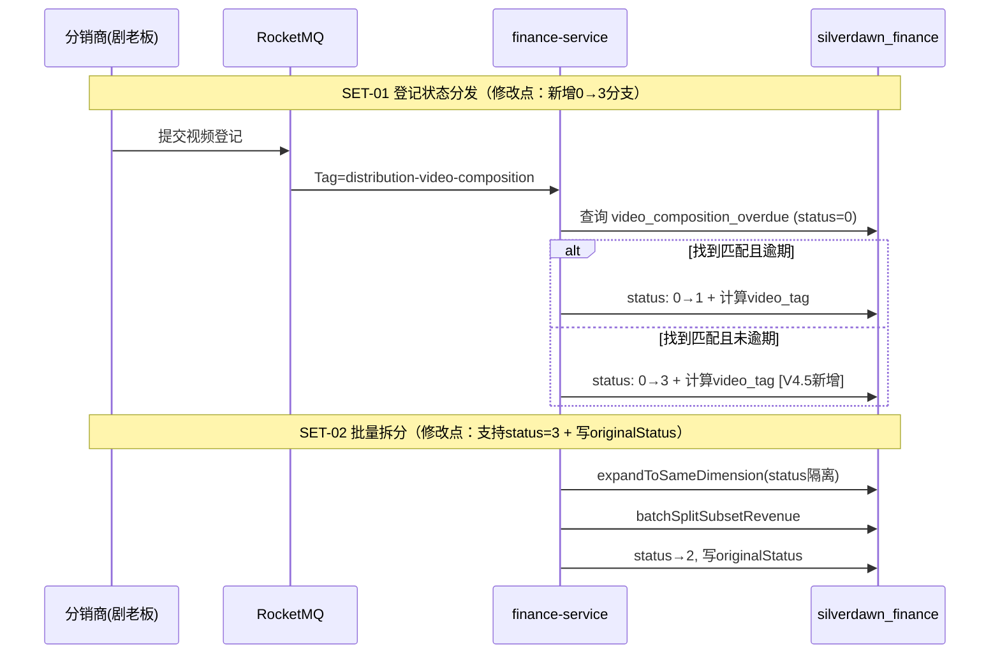

# V4.5 内容结算系统迭代--迭代变更总纲

> 本文档是 V4.5 迭代的入口文档，提供变更全景视图。
> 详细的接口设计、业务逻辑在 `02-逾期结算处理-详细设计.md` 中以增量方式追加。

---

## 一、迭代信息

### 1.1 迭代背景

内容结算系统的逾期结算处理模块存在三个核心问题：

1. **状态机死锁**：「未公开先获利」视频在分销商正常登记后，因缺少「未逾期」分支导致记录从未登记列表消失又无法进入逾期列表，财务无法完成拆分出账。
2. **漏抓误判**：系统抓取视频遗漏后人工补抓，分销商因推送延迟导致登记超时被误判逾期，财务线下核算违约金缺乏系统数据支撑。
3. **导入精度误差**：导入无归属视频时因四舍五入精度问题导致导入金额总和与冲销表无归属金额不一致，缺乏自动抹平与安全阻断机制。

### 1.2 需求来源

[《PRD-内容结算系统迭代-V4.5》](../feature/PRD-内容结算系统迭代-V4.5.md)

### 1.3 文档信息

| 项目 | 内容 |
| --- | --- |
| **负责人** | @Qoder |
| **版本号** | V4.5 |
| **创建日期** | 2026-04-15 |
| **最后更新** | 2026-04-15 |

### 1.4 名词定义

| 名词 | 定义 |
| --- | --- |
| 跨期正常未拆分 | status=3，视频在发布次月28日前登记（未逾期），但跨越了报表生成周期，收益记录需要补充拆分 |
| 技术漏抓 | 视频同步到系统的时间（scrapedAt）晚于发布次月15号，表明系统抓取延迟，分销商逾期责任不在其自身 |
| 原状态 | originalStatus 字段，记录拆分前的登记状态（1=逾期登记 / 3=跨期正常），仅用于已拆分Tab展示 |
| 冲销报表 | yt_reversal_report，按频道+收款系统+到账月份维度汇总的月度收益报表 |
| 无归属金额 | 冲销报表中 sign_channel_id=-1 的记录，未被任何分销商认领的收益 |
| 视频标签 | video_tag 字段，标识视频的特殊属性（本次迭代新增 MISSED_CRAWL=1 技术漏抓，后续可扩展新值） |

---

## 二、需求-设计映射表

| 序号 | PRD 需求项 | 优先级 | 变更类型 | 对应业务域 | 对应文档章节 | 状态 |
| --- | --- | --- | --- | --- | --- | --- |
| 1 | SET-01 登记状态分发：新增跨期正常(0→3)分支 | P0 | `[修改]` | 逾期结算处理 | `02-逾期结算处理-详细设计.md` § 2.1.1 | 已设计 |
| 2 | SET-01 登记状态分发：移除 relatedType 过滤，所有已登记视频均触发状态分发查询 | P0 | `[修改]` | 逾期结算处理 | `02-逾期结算处理-详细设计.md` § 2.1.1 | 已设计 |
| 3 | SET-02 跨期正常未拆分Tab列表查询 | P0 | `[修改]` | 逾期结算处理 | `02-逾期结算处理-详细设计.md` § 2.2.1 | 已设计 |
| 4 | SET-02 跨期正常未拆分Tab批量拆分（含状态隔离） | P0 | `[修改]` | 逾期结算处理 | `02-逾期结算处理-详细设计.md` § 2.2.2 | 已设计 |
| 5 | SET-02 已拆分Tab新增原状态列 | P0 | `[修改]` | 逾期结算处理 | `02-逾期结算处理-详细设计.md` § 2.2.1, § 2.2.3 | 已设计 |
| 6 | SET-02 导出适配（原状态+技术漏抓） | P0 | `[修改]` | 逾期结算处理 | `02-逾期结算处理-详细设计.md` § 2.2.3 | 已设计 |
| 7 | SET-03 导入误差处理 R1~R6 校验逻辑 | P1 | `[修改]` | 逾期结算处理 | `02-逾期结算处理-详细设计.md` § 3.1 | 已设计 |
| 8 | SET-04 技术漏抓标签展示（逾期结算管理全Tab） | P1 | `[修改]` | 逾期结算处理 | `02-逾期结算处理-详细设计.md` § 2.2.1, § 2.2.3 | 已设计 |
| 9 | SET-04 技术漏抓标签展示（发布视频登记管理） | P1 | `[修改]` | 逾期结算处理 | `02-逾期结算处理-详细设计.md` § 2.3.1 | 已设计 |
| 10 | SET-04 技术漏抓入库时计算存储 | P1 | `[修改]` | 逾期结算处理 | `02-逾期结算处理-详细设计.md` § 2.1.1, § 3.1 | 已设计 |
| 11 | 历史数据修复脚本 | P0 | `[新增]` | 逾期结算处理 | `02-逾期结算处理-详细设计.md` § 7.3 | 已设计 |

**覆盖率**：11/11 = 100%

---

## 三、变更影响范围

### 3.1 影响的业务域

| 业务域 | 域文档 | 变更模块数 | 变更接口数 | 影响程度 |
| --- | --- | --- | --- | --- |
| 逾期结算处理 | [02-逾期结算处理-详细设计.md](./02-逾期结算处理-详细设计.md) | 3 | 5 | 重大 |

### 3.2 影响的基础设施

| 基础设施 | 文档位置 | 变更内容 |
| --- | --- | --- |
| 无 | - | 本次迭代不涉及基础设施变更（MQ Topic/Tag 不变，Redis 不变） |

### 3.3 影响的数据库

| 数据源 | 表名 | 变更类型 | 变更内容 | 文档位置 |
| --- | --- | --- | --- | --- |
| `master` | `video_composition_overdue` | 加字段 | 新增 `original_status`、`video_tag` 两个字段 | `02-逾期结算处理-详细设计.md` § 7.3 |
| `master` | `video_composition` | 加字段 | 新增 `video_tag` 字段 | `02-逾期结算处理-详细设计.md` § 7.3 |

### 3.4 影响的非功能性

| 维度 | 影响内容 | 文档位置 |
| --- | --- | --- |
| 历史数据迁移 | 需将历史死锁数据（已登记未逾期且status=0，即 registration_time 不为空但 status 仍为未登记的记录）修复为status=3；历史已拆分记录补写originalStatus=1 | `02-逾期结算处理-详细设计.md` § 7.3 |

---

## 四、跨域影响分析

本次迭代不涉及跨域变更，所有变更集中在逾期结算处理域内。

发布视频登记管理的技术漏抓展示属于同域内的 `VideoCompositionController` 接口修改，不涉及跨域协作。

---

## 五、变更 SQL 汇总

| 序号 | 实例 & 库 | 表名 | 变更类型 | 变更 SQL | 回滚 SQL | 来源文档 |
| --- | --- | --- | --- | --- | --- | --- |
| 1 | `silverdawn_finance` | `video_composition_overdue` | 加字段 | `ALTER TABLE video_composition_overdue ADD COLUMN original_status tinyint DEFAULT NULL COMMENT '原状态: 1-逾期登记, 3-跨期正常' AFTER status;` | `ALTER TABLE video_composition_overdue DROP COLUMN original_status;` | `02-逾期结算处理-详细设计.md` § 7.3 |
| 2 | `silverdawn_finance` | `video_composition_overdue` | 加字段 | `ALTER TABLE video_composition_overdue ADD COLUMN video_tag int DEFAULT NULL COMMENT '视频标签: 1-技术漏抓' AFTER original_status;` | `ALTER TABLE video_composition_overdue DROP COLUMN video_tag;` | `02-逾期结算处理-详细设计.md` § 7.3 |
| 3 | `silverdawn_finance` | `video_composition` | 加字段 | `ALTER TABLE video_composition ADD COLUMN video_tag int DEFAULT NULL COMMENT '视频标签: 1-技术漏抓' AFTER scraped_at;` | `ALTER TABLE video_composition DROP COLUMN video_tag;` | `02-逾期结算处理-详细设计.md` § 7.3 |
| 4 | `silverdawn_finance` | `video_composition_overdue` | 数据修复 | 见域文档 § 7.3 历史数据修复脚本 | - | `02-逾期结算处理-详细设计.md` § 7.3 |

---

## 六、系统交互图

本次迭代不涉及外部交互变更。MQ 消费（distribution-video-composition）、AMS 调用逻辑均保持不变，仅内部业务逻辑有修改。

---

## 七、服务依赖变更

本次迭代不涉及新的外部服务依赖变更。现有的 AMS 调用（通过 pipelineId 获取 signChannelId）保持不变。

---

## 八、非功能性设计

### 8.1 历史数据处理

- **数据影响面**：`video_composition_overdue` 表，预计影响数千至数万条历史记录
- **处理详细逻辑**：
  1. 修复死锁数据：将历史已登记但未逾期且 status 异常的记录修复为 status=3
  2. 补写原状态：历史已拆分记录（status=2）的 originalStatus 补写为 1（历史均来自逾期Tab）
  3. 补写视频标签：根据 video_composition.scraped_at 与 published_at 关系计算 video_tag
- **稳定性保障**：脚本在上线前统一执行，执行前备份受影响数据，执行后验证记录数

### 8.2 大存储量处理

本次迭代新增 2 个 int 字段，对存储量无显著影响。

### 8.3 高访问量处理

不涉及新的高访问量场景。列表查询接口新增 status=3 过滤条件，走现有索引。

### 8.4 异常失败补偿

| 失败场景 | 补偿方案 |
| --- | --- |
| SET-01 状态分发失败 | 依赖 MQ 重试机制（AM-1确认：同步执行，MQ 自带重试） |
| SET-02 批量拆分失败 | 全部回滚（BL-3确认），用户可重新操作 |
| SET-03 导入校验失败 | 按频道维度标记失败原因，生成失败文件供下载 |

---

## 九、代码变更总览

### 9.1 新增文件

| 序号 | 文件路径 | 文件类型 | 所属模块 | 说明 |
| --- | --- | --- | --- | --- |
| 1 | `common/constent/enums/VideoTagEnum.java` | Enum | 公共枚举 | 视频标签枚举（MISSED_CRAWL=1 技术漏抓） |

### 9.2 修改文件

| 序号 | 文件路径 | 修改方法/字段 | 修改类型 | 说明 |
| --- | --- | --- | --- | --- |
| 1 | `domain/entity/VideoCompositionOverdue.java` | `originalStatus`, `videoTag` | 新增字段 | 原状态 + 视频标签字段 |
| 2 | `domain/entity/VideoComposition.java` | `videoTag` | 新增字段 | 视频标签字段 |
| 3 | `domain/vo/VideoCompositionOverdueVO.java` | `originalStatus`, `originalStatusName`, `videoTag`, `videoTagName` | 新增字段 | 列表返回新增字段 |
| 4 | `domain/export/VideoCompositionOverdueExport.java` | `originalStatusName`, `videoTagName` | 新增字段 | 导出新增列 |
| 5 | `common/constent/enums/OverdueSettlementStatusEnum.java` | `CROSS_PERIOD_UNSPLIT(3)` | 新增枚举值 | 跨期正常未拆分状态 |
| 6 | `service/impl/VideoCompositionServiceImpl.java` | `syncOverdueSettlementStatus()` | 逻辑变更 | 移除relatedType='overdue'过滤；新增0→3分支；计算videoTag |
| 7 | `service/impl/VideoCompositionOverdueServiceImpl.java` | `batchSplit()` | 逻辑变更 | 支持status=3扩展（状态隔离）；写入originalStatus |
| 8 | `service/impl/VideoCompositionOverdueServiceImpl.java` | `pageList()` | 逻辑变更 | VO 填充 originalStatusName、videoTagName |
| 9 | `service/impl/OverdueSettlementImportHandler.java` | `handle()` | 逻辑变更 | 新增R1~R6校验逻辑；R1数据源改为yt_reversal_report；计算videoTag |
| 10 | `mapper/VideoCompositionOverdueMapper.xml` | 查询SQL | SQL变更 | status=3排序规则；新增字段查询映射 |
| 11 | `domain/vo/VideoCompositionVO.java`（或对应VO） | `videoTag`, `videoTagName` | 新增字段 | 发布视频登记管理列表返回漏抓标签 |

### 9.3 删除文件/方法

无。

---

## 十、估分汇总

| 序号 | 模块 | 功能点 | 估分(人/天) | 备注 |
| --- | --- | --- | --- | --- |
| 1 | SET-01 登记状态分发 | 修改 syncOverdueSettlementStatus + 计算 videoTag | 1 | 修改现有方法，复杂度低 |
| 2 | SET-02 列表/拆分/导出 | status=3 适配 + originalStatus + videoTag 展示 | 2 | 多个接口改造，涉及VO/Export |
| 3 | SET-03 导入误差处理 | R1~R6 校验逻辑 + 数据源切换 | 3 | 核心逻辑改造，复杂度高 |
| 4 | SET-04 漏抓展示 | 发布视频登记管理接口新增字段 | 0.5 | 简单字段追加 |
| 5 | 数据库 | DDL + 历史数据修复脚本 | 0.5 | |
| | | **合计** | **7** | |
