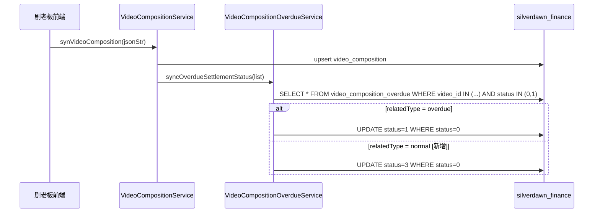

# V4.5-内容结算系统迭代--迭代变更总纲

> 本文档是本次迭代的入口文档，提供变更全景视图。
> 详细的接口设计、业务逻辑见 [`02-逾期结算处理-详细设计.md`](./02-逾期结算处理-详细设计.md)。

---

## 一、迭代信息

### 1.1 迭代背景

本次迭代（V4.5）针对内容结算系统的三类存量缺陷进行修复：

1. **状态机死锁**：「未公开先获利」视频（收益月早于公开月）被分销商正常登记（未逾期）时，系统缺少 `status=0→3` 的「跨期正常」分支，导致记录在未登记状态永久卡死。
2. **技术漏抓标识缺失**：视频数据抓取时间超过发布次月15日时，分销商被动逾期，系统无标识字段支撑财务免责判定。
3. **导入精度误差无修正**：按收益占比分摊金额时存在四舍五入累积误差，且无校验拦截，导致导入金额与冲销报表无归属金额不一致。

### 1.2 需求来源

[《PRD-内容结算系统迭代-V4.5》](../../PRD-内容结算系统迭代-V4.5%20(1).md)  
[《后端PRD审阅报告》](../../docs/backend-prd-review-report.md)

### 1.3 文档信息

| 项目 | 内容 |
| --- | --- |
| **负责人** | 后端开发 |
| **版本号** | V4.5 |
| **创建日期** | 2026-04-14 |
| **最后更新** | 2026-04-14 |

### 1.4 名词定义

| 名词 | 定义 |
| --- | --- |
| VCO | `video_composition_overdue`，逾期结算记录表，本次迭代的核心表 |
| 跨期正常 | 分销商登记日 ≤ 视频发布次月28日，属于正常跨期认领，对应 `status=3` |
| 逾期登记 | 分销商登记日 > 视频发布次月28日，对应 `status=1` |
| 技术漏抓 | 视频抓取时间（`scraped_at`）> 发布次月15日23:59:59，系统判定为技术原因导致的漏抓，`video_tag=1` |
| originalStatus | 拆分前的原始状态（1或3），批量拆分时写入，供财务核对违约金 |
| videoTag | 视频标签枚举字段（0=无标签, 1=技术漏抓），入库时从 video_composition 继承或兜底计算打标 |
| pipelineId | 发布通道ID，由子集+CP+套餐唯一标识，是批量拆分的汇总维度 |
| R1~R6 | 导入误差处理六条规则，详见 `02-逾期结算处理-详细设计.md` § 3.1 |

---

## 二、需求-设计映射表

| 序号 | PRD 需求项 | 优先级 | 变更类型 | 对应业务域 | 对应文档章节 | 状态 |
| --- | --- | --- | --- | --- | --- | --- |
| 1 | SET-01：新增 status=0→3（跨期正常）状态分发分支 | P0 | `[新增]` | 逾期结算处理 | `02-逾期结算处理-详细设计.md` § 2.1.1 | 已设计 |
| 2 | SET-01：`checkSplitStatus` 将 status=3 纳入"未拆分"判断 | P0 | `[修改]` | 逾期结算处理 | `02-逾期结算处理-详细设计.md` § 2.1.2 | 已设计 |
| 3 | SET-02：新增【跨期正常未拆分】Tab 列表查询 | P0 | `[修改]` | 逾期结算处理 | `02-逾期结算处理-详细设计.md` § 2.2.1 | 已设计 |
| 4 | SET-02：batchSplit 支持 status=3 记录拆分，写入 originalStatus | P0 | `[修改]` | 逾期结算处理 | `02-逾期结算处理-详细设计.md` § 2.2.2 | 已设计 |
| 5 | SET-02：已拆分 Tab 导出新增"原状态"列 | P1 | `[修改]` | 逾期结算处理 | `02-逾期结算处理-详细设计.md` § 2.2.3 | 已设计 |
| 6 | SET-03：导入新增 R1 占比完整性校验 | P0 | `[新增]` | 逾期结算处理 | `02-逾期结算处理-详细设计.md` § 3.1 | 已设计 |
| 7 | SET-03：导入新增 R2 零值清理 + R3 差额抹平 + R4 安全阻断 | P0 | `[新增]` | 逾期结算处理 | `02-逾期结算处理-详细设计.md` § 3.1 | 已设计 |
| 8 | SET-03：R6 三维收益（总/美/新）独立处理 | P0 | `[新增]` | 逾期结算处理 | `02-逾期结算处理-详细设计.md` § 3.1 | 已设计 |
| 9 | SET-04：新增 `video_tag` 视频标签字段（写入 video_composition 与 video_composition_overdue），入库时打标技术漏抓 | P1 | `[新增]` | 逾期结算处理 | `02-逾期结算处理-详细设计.md` § 2.3.1 | 已设计 |
| 10 | SET-04：全部4个 Tab 列表和导出返回 `videoTag` 字段 | P1 | `[修改]` | 逾期结算处理 | `02-逾期结算处理-详细设计.md` § 2.2.1、§ 2.2.3 | 已设计 |
| 11 | 历史数据修复：历史 status=0 且已登记且未逾期的记录刷为 status=3 | P1 | `[新增]` | 逾期结算处理 | `02-逾期结算处理-详细设计.md` § 7.3 | 已设计 |

**覆盖率**：11/11 = 100%

---

## 三、变更影响范围

### 3.1 影响的业务域

| 业务域 | 域文档 | 变更模块数 | 变更接口数 | 影响程度 |
| --- | --- | --- | --- | --- |
| 逾期结算处理 | [02-逾期结算处理-详细设计.md](./02-逾期结算处理-详细设计.md) | 4（SET-01~04） | 6 | 重大 |

### 3.2 影响的基础设施

| 基础设施 | 变更内容 |
| --- | --- |
| 无 | 本次迭代不涉及 MQ、Redis、定时任务等基础设施变更 |

### 3.3 影响的数据库

| 数据源 | 表名 | 变更类型 | 变更内容 | 文档位置 |
| --- | --- | --- | --- | --- |
| `master`（silverdawn_finance） | `video_composition_overdue` | 加字段 | 新增 `original_status`、`video_tag` 两列 | `02-逾期结算处理-详细设计.md` § 7.3 |
| `master`（silverdawn_finance） | `video_composition` | 加字段 | 新增 `video_tag` 一列 | `02-逾期结算处理-详细设计.md` § 7.2.2 |

### 3.4 影响的非功能性

| 维度 | 影响内容 | 文档位置 |
| --- | --- | --- |
| 历史数据迁移 | 存量 status=0 且已登记且登记日≤发布次月28日的记录须刷为 status=3，预计影响数量视业务量而定，建议低峰期执行 | `02-逾期结算处理-详细设计.md` § 7.3（数据修复脚本） |

---

## 四、跨域影响分析

本次迭代不涉及跨域变更，所有变更集中在「逾期结算处理」单一业务域内。

---

## 五、变更 SQL 汇总

> 执行顺序：先加字段，再写历史修复数据，最后新增枚举配置（如有）。

| 序号 | 实例 & 库 | 表名 | 变更类型 | 变更 SQL | 回滚 SQL | 来源文档 |
| --- | --- | --- | --- | --- | --- | --- |
| 1 | `silverdawn_finance` | `video_composition_overdue` | 加字段 | `ALTER TABLE video_composition_overdue ADD COLUMN original_status TINYINT DEFAULT NULL COMMENT '拆分前原始状态：1=逾期登记未拆分, 3=跨期正常未拆分，历史记录为NULL' AFTER status;` | `ALTER TABLE video_composition_overdue DROP COLUMN original_status;` | `02-逾期结算处理-详细设计.md` § 7.3 |
| 2 | `silverdawn_finance` | `video_composition_overdue` | 加字段 | `ALTER TABLE video_composition_overdue ADD COLUMN video_tag TINYINT NOT NULL DEFAULT 0 COMMENT '视频标签: 0=无标签, 1=技术漏抓，可扩展' AFTER original_status;` | `ALTER TABLE video_composition_overdue DROP COLUMN video_tag;` | `02-逾期结算处理-详细设计.md` § 7.3 |
| 3 | `silverdawn_finance` | `video_composition` | 加字段 | `ALTER TABLE video_composition ADD COLUMN video_tag TINYINT NOT NULL DEFAULT 0 COMMENT '视频标签: 0=无标签, 1=技术漏抓，可扩展' AFTER scraped_at;` | `ALTER TABLE video_composition DROP COLUMN video_tag;` | `02-逾期结算处理-详细设计.md` § 7.2.2 |
| 4 | `silverdawn_finance` | `video_composition_overdue` | 历史数据修复 | 见 `02-逾期结算处理-详细设计.md` § 7.3 数据修复脚本 | 见 § 7.3 回滚脚本 | `02-逾期结算处理-详细设计.md` § 7.3 |

---

## 六、系统交互图

---

## 七、服务依赖变更

本次迭代无新增外部服务依赖。现有 AMS Feign 调用（批量拆分时获取子集信息）保持不变。

---

## 八、非功能性设计

### 8.1 历史数据处理

- **数据影响面**：`video_composition_overdue` 表，status=0 且已有登记时间（`registration_time IS NOT NULL`）且登记日≤发布次月28日的记录。
- **处理详细逻辑**：执行 UPDATE 脚本（见 § 7.3），以 `registration_time` 与 `published_date + 28天的次月` 比较，满足条件则刷为 status=3，无登记时间则跳过。
- **稳定性保障**：建议在低峰期（凌晨）执行；执行前备份受影响记录；执行后验证刷新条数与预估量一致。

### 8.2 大存储量处理

- 新增 2 个字段（`TINYINT` 类型），单行存储增量极小，对存储无影响。

### 8.3 高访问量处理

- 本次迭代新增的查询条件（status=3）与现有 status 索引复用，无新增索引需求，查询性能无影响。

### 8.4 异常失败补偿

- **导入 R1 阻断**：按频道维度独立阻断，已通过频道不受影响，运营下载失败文件后修正重新导入即可。
- **导入 R4 阻断**：差额 > 1美金属异常数据，阻断后由运营人工核查 CMS 导出数据后重新上传。
- **批量拆分失败**：整体事务回滚，用户重试即可；若冲销表记录不存在则提示具体错误信息。

---

## 九、代码变更总览

### 9.1 新增文件

| 序号 | 文件路径 | 文件类型 | 所属模块 | 说明 |
| --- | --- | --- | --- | --- |
| 1 | `common/constent/enums/VideoTagEnum.java` | Enum | 公共枚举 | `[新增]` 视频标签枚举：NO_TAG(0) / TECHNICAL_MISSED(1) |
| 2 | `application/domain/dto/UnattributedRatioDTO.java` | DTO | 导入处理器 | `[新增]` R1 参照值查询返回对象：totalRatio / usRatio / sgRatio |

### 9.2 修改文件

| 序号 | 文件路径 | 修改方法/字段 | 修改类型 | 说明 |
| --- | --- | --- | --- | --- |
| 1 | `common/constent/enums/OverdueSettlementStatusEnum.java` | 枚举值 | 新增枚举值 | `[修改]` 新增 `CROSS_PERIOD_NORMAL(3, "跨期正常未拆分")` |
| 2 | `application/domain/entity/VideoCompositionOverdue.java` | `originalStatus`、`videoTag` | 新增字段 | `[修改]` 新增 2 个字段 |
| 3 | `application/domain/entity/VideoComposition.java` | `videoTag` | 新增字段 | `[修改]` 新增视频标签字段，作为 VCO 打标的来源 |
| 4 | `application/domain/vo/VideoCompositionOverdueVO.java` | `originalStatus`、`videoTag` | 新增字段 | `[修改]` VO 新增 2 个字段 |
| 5 | `application/domain/export/VideoCompositionOverdueExport.java` | `originalStatus`、`videoTag` | 新增字段 | `[修改]` 导出对象新增 2 个字段 |
| 6 | `application/controller/VideoCompositionOverdueController.java` | `batchSplit()`、`convertToExport()` | 逻辑变更 | `[修改]` batchSplit 接收 status 参数；convertToExport 填充新字段 |
| 7 | `application/service/impl/VideoCompositionOverdueServiceImpl.java` | `batchSplit()`、`validateAndGetRecords()`、`expandToSameDimensionRecords()`、`updateSplitStatus()`、`resolveIsSplit()` | 逻辑变更 | `[修改]` 全面支持 status=3 |
| 8 | `application/service/impl/VideoCompositionServiceImpl.java` | `syncOverdueSettlementStatus()`、`queryUnregisteredOverdueRecords()`、`syncOverdueFields()` | 逻辑变更 | `[修改]` 新增 normal 分支（status=0→3） |
| 9 | `application/service/impl/OverdueSettlementImportHandler.java` | `handle()`、`buildOverdueEntity()`、新增 `validateR1()`、`applyR2()`、`applyR4R3()` | 逻辑变更 | `[修改]` 新增按 channelId+cms 分组处理；串联 R1-R6 规则；videoTag 打标 |
| 10 | `resources/mapper/VideoCompositionOverdueMapper.xml` | `Base_Column_List`、`Select_Column_List` | 字段扩展 | `[修改]` 新增 `original_status`、`video_tag` 字段映射 |
| 11 | `application/mapper/YtMonthChannelRevenueSourceMapper.java` | 新增 `sumUnattributedRatio()` | 新增方法 | `[新增]` R1 参照值查询（SUM 三维占比 WHERE pipeline_id IS NULL）|
| 12 | `resources/mapper/YtMonthChannelRevenueSourceMapper.xml` | 新增 `sumUnattributedRatio` SQL | 新增 SQL | `[新增]` R1 查询对应 XML |
| 13 | `application/mapper/YtReversalReportMapper.java` | 新增 `fetchUnattributedRevenue()` | 新增方法 | `[新增]` R3 目标金额查询（unattributed_revenue 三维）|
| 14 | `resources/mapper/YtReversalReportMapper.xml` | 新增 `fetchUnattributedRevenue` SQL | 新增 SQL | `[新增]` R3 查询对应 XML |

### 9.3 删除文件/方法

无。

---

## 十、估分汇总

| 序号 | 模块 | 功能点 | 估分（人/天） | 备注 |
| --- | --- | --- | --- | --- |
| 1 | SET-01 | 状态分发新增 normal 分支 + checkSplitStatus 修改 | 0.5 | 改动量小，逻辑清晰 |
| 2 | SET-02 | batchSplit 支持 status=3 + originalStatus 写入 + 导出字段扩展 | 1.0 | 需注意隔离逻辑 |
| 3 | SET-03 | 导入新增按 channelId+cms 分组；R1 参照值查询；R2 零值清理；R4+R3 误差校验与抹平；三维独立；两个新 Mapper 方法 | 3.0 | 复杂度最高，涉及多表联动和精度计算 |
| 4 | SET-04 | video_tag 字段新增（video_composition + vco 两表）+ 入库打标 + 接口返回适配 | 0.8 | 改动面广，需同步两张表及对应 Entity/VO/Export |
| 5 | 数据库 | DDL 脚本 + 历史数据修复脚本 | 0.5 | 需低峰期执行 |
| | | **合计** | **5.8** | |
