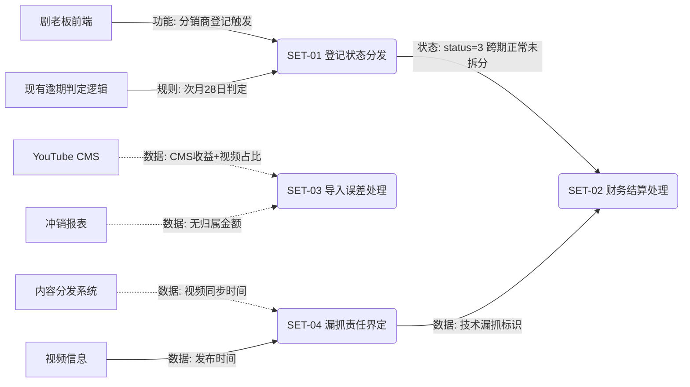

# PRD 需求理解总结（测试视角）

**总结日期**：2026-04-09（V4.5 增量更新：2026-04-10）
**涉及 PRD**：PRD-内容结算系统迭代（文件版本 V4.5，2026-04-10）
**涉及原型**：http://172.16.25.36:8030/distributor/overdue-settlement/List（内网地址，暂无法直连；D-系列校验已基于产品提供的 7 张截图完成）

---

## 系统全景

内容结算系统（小五出海通）负责管理分销商视频收益的登记、拆分和核算。

本次迭代围绕三个现存业务问题进行修复：

①"未公开先获利"视频登记后陷入状态机死锁，财务无法找到该笔款项；

②系统漏抓视频后分销商登记被误判为逾期，缺乏系统标识辅助财务决策；

③导入无归属视频时金额精度误差缺乏自动抹平和阻断机制。

---

## 用户角色与权限

| 角色 | 可访问模块 | 核心权限 | 数据可见范围 |
|------|----------|---------|------------|
| 财务人员 | 逾期结算处理（全部 Tab）| 查看列表、批量拆分、导出 | 全部数据 |
| 运营人员 | 逾期结算处理（【未登记】Tab）| 导入 | 全部数据 |
| 分销商 | 剧老板前端 | 登记视频 | 本人名下视频 |

> 非财务角色无法访问【跨期正常未拆分】【逾期登记未拆分】【已拆分】Tab（权限在菜单级控制）。  
> 财务人员在【未登记】Tab 的按钮级权限（【导入】按钮是否可见/置灰）PRD 未明确（待确认，见 S-10）。

---

## 功能模块总览

| 模块编号 | 模块名称 | 核心功能 | 涉及角色 | 关键业务规则 | PRD 来源 |
|---------|---------|---------|---------|------------|---------|
| SET-01 | 登记状态分发 | 分销商登记时，按逾期判定结果将未登记记录流转至对应状态 | 分销商、结算系统后端 | 登记日 > 发布次月28日→逾期；≤28日→跨期正常 | §SET-01-01 |
| SET-02 | 财务结算处理 | 新增【跨期正常未拆分】Tab；【已拆分】列表新增原状态列；导出字段适配 | 财务人员 | 批量拆分复用现有逻辑；记录原状态；确认弹窗前置 | §SET-02-01 |
| SET-03 | 导入误差处理 | 导入无归属视频时执行金额校验、零值清理、误差抹平和安全阻断 | 运营人员 | 差额 ≤ $1 自动抹平；> $1 阻断导入 | §SET-03-01 |
| SET-04 | 漏抓责任界定 | 根据同步时间自动判定并展示【技术漏抓】标签 | 财务人员（只读） | 同步时间 > 发布次月**15号** 23:59:59→打标（V4.5 更新） | §SET-04-01 |

---

## 各模块详细理解

### SET-01 登记状态分发

**业务目的**：修复"未公开先获利"场景下的状态机死锁。当视频在未公开期间产生收益后，收益记录以状态=【未登记】进入逾期结算管理列表。分销商后续登记时，原系统缺少【未逾期】的目标状态，导致记录既不进【未登记】也不进【逾期登记未拆分】，财务彻底找不到该款项。本次新增【跨期正常未拆分】状态作为接收容器。

**核心流程**：
1. 分销商在剧老板登记视频 → 触发后端异步逻辑
2. 查询逾期结算管理列表，按视频ID检索状态为【未登记】的收益记录（**查询时间范围待明确，见 B-1**）
3. 找到：按 `登记日 vs 发布次月28日` 分支
   - 登记日 > 发布次月28日 → 状态更新为【逾期登记未拆分】（复用现有逻辑）
   - 登记日 ≤ 发布次月28日 → 状态更新为【跨期正常未拆分】（**本次新增**）
4. 未找到：不做额外操作，正常完成登记

**业务规则**：
- 同一视频可能存在多个到账月份的未登记记录，全部逐条更新（AC4）
- 状态分发为异步执行，不影响分销商端登记响应
- 并发登记同一视频时提示"该视频已被登记"（防重机制待技术确认）
- "登记日"的精确定义（剧老板提交时间 vs 结算系统处理时间）待确认，见 A-1

**数据流转**：

| 数据实体 | 产生场景 | 存储位置 | 变更场景 | 销毁规则 | 关联影响 |
|---------|---------|---------|---------|---------|---------|
| 收益记录（登记状态） | 报表生成后导入，初始状态=未登记 | 结算系统 | 分销商登记触发状态分发；财务批量拆分后变为已拆分 | 不销毁（终态=已拆分） | 状态决定记录所在 Tab |
| 收益记录（原状态） | 财务批量拆分时写入 | 结算系统 | 仅写一次，不再变更 | 不销毁 | 用于财务线下核算违约金参考 |

**状态机**：

```
[报表导入] → 未登记(0)
    未登记(0) → [登记且逾期] → 逾期登记未拆分(1)
    未登记(0) → [登记且未逾期] → 跨期正常未拆分(3)  ← 本次新增
    逾期登记未拆分(1) → [财务拆分] → 已拆分(2)，原状态=1
    跨期正常未拆分(3) → [财务拆分] → 已拆分(2)，原状态=3
```

---

### SET-02 财务结算处理

**业务目的**：为 SET-01 新增的【跨期正常未拆分】状态提供财务操作界面（UI 平级扩展），同时在【已拆分】列表增加原状态列，为后续线下违约金核算提供数据依据。

**核心流程**：
1. 财务进入逾期结算处理页面
2. Tab 栏顺序：未登记 → 逾期登记未拆分 → **跨期正常未拆分（新增）** → 已拆分
3. 在跨期正常Tab：筛选（到账月份/频道名称/频道ID/视频ID）→ 勾选 → 批量拆分
4. **点击批量拆分后弹出确认弹窗**（§3.2 安全要求，功能描述中操作路径未体现，见 B-2/D-2）
5. 拆分逻辑与逾期登记Tab完全相同（按通道ID汇总，拆分到对应月份冲销表），**含"自动扩展到同维度记录"逻辑（未定义，见 S-6/Q-2）**
6. 拆分成功 → 记录流转至【已拆分】，同时保存原状态

**关键展示规则**：
- 金额：保留两位小数，无千分位，美元符号在列表表头标注
- 日期：YYYY-MM-DD HH:mm:ss
- 原状态列：逾期登记=默认文字色；跨期正常=绿色文字
- 空值：数值型展示0，文本型展示空

**导出字段变更**：

| Tab | 必须新增的字段 | 备注 |
|-----|-------------|------|
| 已拆分 | 原状态、技术漏抓 | |
| 逾期登记未拆分 | 技术漏抓 | |
| 跨期正常未拆分 | 技术漏抓 | |
| 未登记 | 未提及（待确认，见 S-2） | 是否也需要技术漏抓字段存疑 |

**数据流转**：

| 数据实体 | 产生场景 | 存储位置 | 变更场景 | 销毁规则 | 关联影响 |
|---------|---------|---------|---------|---------|---------|
| 原状态字段 | 财务批量拆分时系统自动写入 | 结算系统 | 不可变更 | 不销毁 | 【已拆分】Tab展示；导出文件包含 |
| 技术漏抓标识（展示层） | 列表查询时动态判定或入库打标（TBD-7） | 结算系统 | 同步时间变更时可能重判 | 不销毁 | 三个Tab的列表展示及导出 |

---

### SET-03 导入误差处理

**业务目的**：解决导入无归属视频时，因收益占比×CMS收益的四舍五入精度损失，导致求和金额与冲销报表无归属金额存在分差，账目无法平衡的问题。

**核心流程**（按【频道ID + 收款系统 + 到账月份】维度处理）：

```
Step 1 前置完整性校验（R1）【V4.5 更新】：
    按【频道ID+收款系统+到账月份】维度，将导入视频的收益占比直接求和（不取整）
    结果 ≠ 冲销报表上该维度下无归属视频的占比总和 → 阻断该频道，提示"本次导入视频不全，金额校验不通过"
    结果 = 占比总和 → 继续 Step 2

    ✅ V4.5 已解决 B-3/B-4：R1 改为纯占比完整性校验，不再乘以CMS收益，原R1与R2/R3计算顺序矛盾消除
    ⚠️ S-8（新）：R1 比对基准"冲销报表上该维度下无归属视频的占比总和"在 ER 模型中无对应字段，数据来源未定义

Step 2 零值清理（R2）：逐笔计算 ROUND(占比_i × CMS收益, 2)
    → 结果 = 0.00 → 舍弃该笔

    ✅ V4.5 已解决 B-4（全零场景）：新增 R5 规则——全维度取整后均为0.00时，触发 R4 阻断，
    提示"异常：单笔金额过小导致精度丢失，请检查"

Step 3 误差抹平（R3/R4）：
    Σ(各笔 ROUND 后金额) 与无归属金额的差额
    → |差额| > $1 → 阻断，失败文件标记"拆分差额超过1美金"（R4）
    → |差额| ≤ $1 → 将差额累加到收益占比最大的视频上，完成导入（R3）

    ⚠️ 边界：若最大收益占比有多笔并列，差额累加规则未定义（见 S-6 后续）
```

**业务规则**：
- 占比数据保留原始精度，不截断
- 单频道阻断不影响其他频道的导入（PRD 描述隐性，未明确，见 S-4）
- 失败文件按频道维度标记失败原因

**数据流转**：

| 数据实体 | 产生场景 | 存储位置 | 变更场景 | 销毁规则 | 关联影响 |
|---------|---------|---------|---------|---------|---------|
| 收益记录（抹平后金额） | 导入成功时创建，已经过零值清理和抹平 | 结算系统 | 不变更 | 不销毁 | 参与月度结算拆分计算 |
| 导入失败文件 | 存在阻断的频道时生成 | 临时存储 | 不变更 | 用户下载后可删除 | 运营人员下载查看原因 |

---

### SET-04 漏抓责任界定

**业务目的**：当系统抓取视频存在延迟（同步时间晚于发布次月20号），分销商可能因此被误判逾期。系统通过展示【技术漏抓】标签，为财务提供数据支持，辅助线下决策是否免除违约金。该功能本身不产生任何自动化决策，仅为展示辅助。

**判定规则**（V4.5 更新：阈值从次月20号改为次月15号 23:59:59）：
- 同步时间 > 发布次月**15号** 23:59:59 → 展示【技术漏抓】标签
- 同步时间 ≤ 发布次月**15号** 23:59:59 → 不展示标签
- 同步时间为空 或 发布时间为空 → 不展示标签（按非漏抓处理）

**标签样式**：橙色背景，白色文字，圆角矩形（PRD 注明为"建议"，非最终确认，见 S-5）

**展示位置**：
- 【发布视频登记管理】列表（原型确认为"视频登记→已登记 Tab"，见 B-8）
- 【逾期结算管理】列表（具体 Tab 范围待明确，见 B-6）
- 在视频 ID 所在单元格内，视频 ID 文本正下方展示（原型截图确认，见 D-5）

**数据流转**：

| 数据实体 | 产生场景 | 存储位置 | 变更场景 | 销毁规则 | 关联影响 |
|---------|---------|---------|---------|---------|---------|
| 技术漏抓标识 | 视频同步时间写入时判定，或查询时动态计算（TBD-7 待确认） | 结算系统 | 同步时间后续更新时可能触发重判（若为动态计算） | 不销毁 | 列表展示（两处）；导出文件包含（三个 Tab） |

---

## 模块间依赖关系

### 依赖关系清单

| 上游模块 | 下游模块 | 依赖类型 | 依赖内容 | PRD 来源 |
|---------|---------|---------|---------|---------|
| 剧老板前端（分销商登记） | SET-01 登记状态分发 | 功能依赖 | 分销商的登记动作触发后端状态分发后置逻辑 | 隐性依赖-推断自业务流程 |
| 现有逾期判定逻辑 | SET-01 登记状态分发 | 规则依赖 | "登记日 > 发布次月28日"判定规则，R1/R2 复用现有实现 | §SET-01-01 R1 备注"复用现有逾期判定逻辑" |
| SET-01 登记状态分发 | SET-02 财务结算处理 | 状态依赖 | 记录须流转为【跨期正常未拆分】(status=3) 才能在新 Tab 展示 | §SET-02-01 R1 |
| YouTube CMS 数据 | SET-03 导入误差处理 | 数据依赖 | 频道 CMS 导出收益(25号)、视频收益占比数据 | 隐性依赖-推断自 §SET-03-01 R1~R3 |
| 冲销报表 | SET-03 导入误差处理 | 数据依赖 | 无归属总金额（R1 校验基准） | §SET-03-01 R1 |
| 内容分发系统（视频同步） | SET-04 漏抓责任界定 | 数据依赖 | 视频同步时间（漏抓判定的输入数据） | §SET-04-01 R1 |
| 视频信息（发布时间） | SET-04 漏抓责任界定 | 数据依赖 | 视频发布日期（用于计算次月20号阈值） | §SET-04-01 R1 |
| SET-04 漏抓责任界定 | SET-02 财务结算处理 | 数据依赖 | 技术漏抓标识字段被列表和导出消费 | §SET-02-01 导出功能适配 |

### 依赖关系图



### 变更影响分析

| 变更模块 | 变更内容 | 受影响的下游模块 | 影响说明 | PRD 是否覆盖 |
|---------|---------|---------------|---------|------------|
| 收益记录状态机 | 新增 status=3（跨期正常未拆分） | 财务结算处理页面 | 新增 Tab 承接 status=3 数据 | ✅ SET-02-01 |
| 批量拆分逻辑 | 拆分时记录原状态 | 【已拆分】列表 | 新增原状态列展示 | ✅ SET-02-01 |
| 导入逻辑 | 新增校验、零值清理、抹平、阻断 | 导入失败文件 | 失败文件需标记频道级失败原因 | ✅ SET-03-01 |
| 列表查询 | 新增技术漏抓标识字段 | 发布视频登记管理、逾期结算管理列表 | 展示技术漏抓标签 | ✅ SET-04-01 |
| 已拆分列表查询 | 返回新增原状态+技术漏抓字段 | 导出文件 | 导出文件需含新字段 | ✅ SET-02-01 |
| status=3 新增 | 现有接口状态参数扩展 | 所有按状态查询的接口 | status=3 不影响 status=0/1/2 查询 | ✅ §3.3 接口兼容 |

---

## 操作路径清单

### SET-01 登记状态分发（纯后端逻辑，无前端路径）

| 路径编号 | 路径类型 | 入口 | 导航步骤 | 核心操作 | 预期结果 | 跳转/终止 | PRD 覆盖状态 |
|---------|---------|------|---------|---------|---------|----------|------------|
| P-S01-001 | 主路径 | 剧老板-视频登记页 | 填写登记信息 | 点击【提交登记】 | 后端异步：找到未登记记录 → 按逾期判定分发状态 | 剧老板提示登记成功 | ✅ |
| P-S01-002 | 分支路径 | 同上 | 同上 | 同上 | 未找到未登记记录 → 无额外操作，正常完成 | 同上 | ✅ |
| P-S01-003 | 分支路径 | 同上 | 同上 | 同上 | 同一视频多月份未登记记录，逐条执行状态分发 | 同上 | ✅（AC4） |
| P-S01-004 | 异常路径 | 同上 | 同上 | 同上 | 数据库更新失败 → 登记本身成功，后台记录异常日志 | 剧老板提示登记成功（用户无感知） | ✅（⑤异常降级） |
| P-S01-005 | 异常路径 | 同上 | 同上 | 并发登记同一视频 | 提示"该视频已被登记" | 登记失败 | ✅（⑤异常降级） |
| P-S01-006 | 异常路径 | 同上 | 同上 | 视频已登记（状态非未登记），再次触发登记 | **未定义** | — | ❌（见 S-8） |

### SET-02 财务结算处理

| 路径编号 | 路径类型 | 入口 | 导航步骤 | 核心操作 | 预期结果 | 跳转/终止 | PRD 覆盖状态 |
|---------|---------|------|---------|---------|---------|----------|------------|
| P-S02-001 | 主路径 | 逾期结算处理页面 | 点击【跨期正常未拆分】Tab | 筛选+勾选记录+点击【批量拆分】→确认弹窗→确认 | 拆分成功，记录流转至已拆分，提示"拆分成功，共处理X条" | 停留当前Tab，列表刷新 | ⚠️（弹窗步骤在操作路径中缺失，见 B-2） |
| P-S02-002 | 分支路径 | 同上 | 同上 | 未勾选直接点击【批量拆分】 | 点击后 toast 提示（原型：文案"请至少勾选1条数据"）| 停留当前Tab | ⚠️（PRD 文案与原型不一致，见 D-1） |
| P-S02-003 | 分支路径 | 同上 | 点击确认弹窗中的【取消】 | — | 不执行拆分，停留当前Tab | 停留 | ❌（取消行为未定义，见 B-2） |
| P-S02-004 | 主路径 | 逾期结算处理页面 | 点击【已拆分】Tab | 查看列表 | 原状态列展示"逾期登记"（默认色）或"跨期正常"（绿色） | 停留 | ✅ |
| P-S02-005 | 分支路径 | 同上 | 点击【导出】 | 导出文件 | 文件包含原状态和技术漏抓字段 | 下载文件 | ✅（描述有，无 AC，见 B-7） |
| P-S02-006 | 异常路径 | 同上 | 点击【跨期正常未拆分】Tab | 批量拆分部分失败 | 提示"X条成功，Y条失败，请重试失败记录" | 停留当前Tab | ✅ |
| P-S02-007 | 异常路径 | 同上 | 同上 | 列表为空 | 展示空状态页"暂无跨期正常未拆分的记录"，不展示【批量拆分】按钮 | 停留 | ✅ |
| P-S02-008 | 分支路径 | 同上 | 应用筛选条件后执行批量拆分 | 拆分成功，列表刷新 | 刷新后筛选条件是否保留 | — | ❌（见 S-11） |

### SET-03 导入误差处理

| 路径编号 | 路径类型 | 入口 | 导航步骤 | 核心操作 | 预期结果 | 跳转/终止 | PRD 覆盖状态 |
|---------|---------|------|---------|---------|---------|----------|------------|
| P-S03-001 | 主路径 | 逾期结算处理-【未登记】Tab | 点击【导入】→选择文件 | 点击【确认导入】 | 全部导入成功（含零值清理和抹平），提示"共导入X条记录"，刷新列表 | 停留【未登记】Tab | ✅ |
| P-S03-002 | 分支路径 | 同上 | 同上 | 导入→R1校验不通过 | 阻断该频道，提示"本次导入视频不全，金额校验不通过" | 停留 | ✅ |
| P-S03-003 | 分支路径 | 同上 | 同上 | 导入→R4安全阻断（差额>$1） | 阻断该频道，失败文件标记"拆分差额超过1美金，请检查" | 提供失败文件下载 | ✅ |
| P-S03-004 | 分支路径 | 同上 | 同上 | 部分频道阻断、其余频道成功 | 提示"部分频道导入失败，请下载失败文件查看原因"，成功频道正常导入 | 提供失败文件下载 | ⚠️（"其余继续"为隐性推断，见 S-4） |
| P-S03-005 | 异常路径 | 同上 | 同上 | 文件格式错误 | 提示"文件格式错误，请使用标准模板" | 停留 | ✅ |
| P-S03-006 | 异常路径 | 同上 | 同上 | 冲销报表数据不存在 | 提示"未找到对应的冲销报表数据，请确认到账月份是否正确" | 停留 | ✅ |
| P-S03-007 | 分支路径 | 同上 | 同上 | 所有视频四舍五入后均为 0.00（全被舍弃） | **未定义**（求和为0，必与无归属金额产生差额） | — | ❌（见 B-5） |

### SET-04 漏抓责任界定

| 路径编号 | 路径类型 | 入口 | 导航步骤 | 核心操作 | 预期结果 | 跳转/终止 | PRD 覆盖状态 |
|---------|---------|------|---------|---------|---------|----------|------------|
| P-S04-001 | 主路径 | 发布视频登记管理（视频登记→已登记Tab）| 浏览列表 | 查看记录 | 符合漏抓条件的视频在视频ID下方展示橙色【技术漏抓】标签 | 停留 | ⚠️（入口路径 PRD 未说明，原型截图已确认；见 B-8） |
| P-S04-002 | 主路径 | 逾期结算管理各 Tab | 浏览列表 | 查看记录 | 同上 | 停留 | ⚠️（具体哪些 Tab 展示未明确，见 B-6） |
| P-S04-003 | 分支路径 | 同上 | 同上 | 查看不符合漏抓条件或同步时间为空的记录 | 不展示【技术漏抓】标签 | 停留 | ✅ |
| P-S04-004 | 异常路径 | 同上 | 同上 | 点击【技术漏抓】标签 | 标签不可点击（无任何交互响应） | — | ⚠️（功能描述说明但无 AC 验证，见 S-9） |

### 跨模块端到端路径

| 端到端路径 | 涉及模块 | 完整路径描述 | PRD 覆盖状态 |
|-----------|---------|------------|------------|
| 跨期正常视频完整结算流程 | 剧老板 → SET-01 → SET-02 | 分销商登记→后端判定跨期正常(status=3)→财务在跨期正常Tab筛选并拆分→记录流转至已拆分（原状态=跨期正常） | ✅ |
| 技术漏抓视频减免决策链路 | SET-04 → SET-02（导出） | 财务查看逾期Tab中的漏抓标签→导出含漏抓字段的文件→线下核算是否免除违约金（线下决策，无系统路径） | ⚠️（线下核算属预期设计，但标签展示范围待确认） |
| 无归属视频完整导入流程 | SET-03 → 未登记Tab | 运营导入→系统执行四步逻辑（校验/零值清理/抹平/阻断）→成功导入进入未登记列表 | ✅ |

---

## 已识别风险点汇总

> 以下为审阅阶段预扫描发现的风险点概览，详细分析见 `test-prd-review-report.md`。

### 阻塞性问题（B系列）— 必须修改才能进入测试

| 编号 | 所属模块 | 风险描述 |
|------|---------|---------|
| B-1 | SET-01 | 状态分发查询时间范围未定义，无法确定检索哪个周期的未登记记录 |
| B-2 | SET-02 | 批量拆分确认弹窗在操作路径描述中缺失，取消行为未定义 |
| ~~B-3~~ | ~~SET-03~~ | ~~R1使用"先求和再ROUND"，R2/R3使用"先ROUND再求和"，两种计算顺序产生不同结果，存在逻辑矛盾~~ ✅ V4.5 已解决：R1 改为占比完整性校验 |
| ~~B-4~~ | ~~SET-03~~ | ~~全零场景（所有视频ROUND后均为0.00，全部舍弃）处理路径未定义~~ ✅ V4.5 已解决：新增 R5 规则明确处理路径 |
| B-5 | SET-04 | 同步时间数据来源TBD-8未确认，漏抓判定核心输入不明 |
| B-6 | SET-04 | 技术漏抓标签需在哪些Tab展示未明确定义（仅知在发布视频登记管理中展示，逾期结算管理具体Tab不明） |

### 验收标准不足（S系列）— 不影响测试启动，但影响用例覆盖度

| 编号 | 所属模块 | 风险描述 |
|------|---------|---------|
| S-1 | SET-01 | 并发登记同一视频的防重机制无明确验收标准 |
| S-2 | SET-02 | 【未登记】Tab导出字段是否包含技术漏抓字段未说明 |
| S-3 | SET-02 | 批量拆分成功后筛选条件是否保留未定义 |
| S-4 | SET-03 | 部分频道阻断后其余频道继续导入为隐性推断，无明确说明 |
| S-5 | SET-04 | 标签样式（颜色/圆角/文字）注明为"建议"，非最终确认 |
| S-6 | SET-02 | 批量拆分"自动扩展到同维度记录"逻辑在AC中引用但功能描述中未定义 |
| S-7 | SET-03 | 最大收益占比有多笔并列时，差额抹平到哪笔的规则未定义 |
| S-8（新，V4.5） | SET-03 | R1 比对基准"冲销报表上该维度下无归属视频的占比总和"在 ER 模型中无对应字段，数据来源未定义 |

### 描述不精确（A系列）

| 编号 | 所属模块 | 风险描述 |
|------|---------|---------|
| A-1 | SET-01 | "登记日"定义不明——剧老板提交时间 vs 结算系统处理时间，跨日深夜登记可能导致判定差异 |
| A-2 | SET-02 | 功能描述中未提确认弹窗，AC §3.2安全性要求中有，两处不一致 |
| A-3 | SET-04 | "同步时间"指内容分发系统哪个具体字段未明确（与TBD-8相关） |

### PRD 与原型不一致（D系列）

| 编号 | 风险描述 | 风险等级 |
|------|---------|---------|
| D-1 | 未勾选直接点击批量拆分的提示文案：原型显示"请至少勾选1条数据"，PRD未定义 | 中 |
| D-2 | 跨期正常未拆分Tab注释文本与逾期登记未拆分Tab注释相同，但两Tab业务含义相反（高风险） | 高 |
| D-3 | 未登记Tab和已拆分Tab原型中有"处理人""处理时间"列，PRD未描述 | 中 |
| D-4 | 逾期登记未拆分Tab原型注释文本（"注：登记时间在发布次月28日之后，不参与当月结算"）PRD未定义 | 低 |

### 文档质量（Q系列）

| 编号 | 风险描述 |
|------|---------|
| Q-1 | PRD发布时存在10个未回收的TBD项（TBD-1~TBD-10），影响相关功能测试完整性 |
| Q-2 | 批量拆分AC（"自动扩展到同维度记录"）与功能描述中的拆分逻辑描述不对应，前后矛盾 |
| Q-3（新，V4.5） | ER 模型中 CMSRevenue 仍为单一字段"频道CMS导出收益(含调差)"，但 V4.5 业务规则引用了调差1/2/3（总收益/美国/新加坡三个独立调差），ER 模型未同步更新 |

### 关键TBD未确认项（影响测试设计）

| TBD编号 | 内容 | 影响功能 |
|--------|------|---------|
| TBD-7 | 技术漏抓标识是动态计算还是入库打标 | SET-04 漏抓判定时机 |
| TBD-8 | 同步时间来源（内容分发系统哪个时间字段） | SET-04 漏抓判定输入 |
| 其余TBD | TBD-1~TBD-6、TBD-9~TBD-10（PRD发布时已标注，但未回收结论） | 涉及多处细节 |

---

## 审阅前提确认

| 项目 | 状态 | 说明 |
|------|------|------|
| PRD版本明确 | ✅ | V4.5（2026-04-10）；原始审阅基于 V4.2（2026-04-02），V4.5 为增量更新 |
| 原型已提供 | ✅ | 7张内网原型截图，覆盖4个Tab及漏抓标签展示 |
| 关联系统范围明确 | ✅ | 分销商端（剧老板）+ 结算系统后端 + 财务操作前端 |
| 测试环境部署情况 | ⏳ | 待开发完成后确认 |
| TBD项回收计划 | ❌ | 10个TBD截至审阅日未回收，进入测试前需全部回收 |
| 前序迭代兼容性声明 | ✅ | PRD §3.3明确status=3枚举不影响现有接口 |
| 高风险问题（D-2）确认 | ❌ | 跨期正常Tab注释文本与逾期Tab文本相同，需产品在PRD中明确正确文案后再测试 |
