# YT暂估报表逻辑

> 菜单路径：结算单管理 → YT暂估表
> 完整梳理暂估报表数据生成链路、核心业务逻辑及页面操作规则。
> 暂估表基于**月初数据**（`yt_month_channel_revenue` 的 `dataType=2`）生成，对应表：`yt_estimate_report`

---

## 目录

- [1. 整体数据链路](#1-整体数据链路)
- [2. 与冲销报表的核心差异](#2-与冲销报表的核心差异)
- [3. YT暂估报表生成逻辑](#3-yt暂估报表生成逻辑)（[3.1触发方式](#31-触发方式) / [3.2前置校验](#32-前置校验) / [3.3原始数据获取](#33-原始数据来源) / [3.4频道类型分类](#34-按频道类型分类处理handlebyChanneltypeestimate) / [3.5子集收益拆分](#35-子集收益拆分计算handlesubsetandgencollectionchannelestimate) / [3.6合约信息匹配](#36-合约信息匹配handleinfofromcrmestimate) / [3.7不结算名单匹配](#37-不结算名单匹配handlesettlementnoem) / [3.8数据存储](#38-数据存储savebymonthreportlist) / [3.9拆分子集](#39-拆分子集页面操作) / [3.10批量拆分子集](#310-批量拆分子集excel-导入) / [3.11批量删除子集](#311-批量删除子集) / [3.12按合约重新生成](#312-按合约重新生成reversalregeneratebycontractnum) / [3.13字段汇总](#313-暂估报表关键字段汇总)）

---

## 1. 整体数据链路

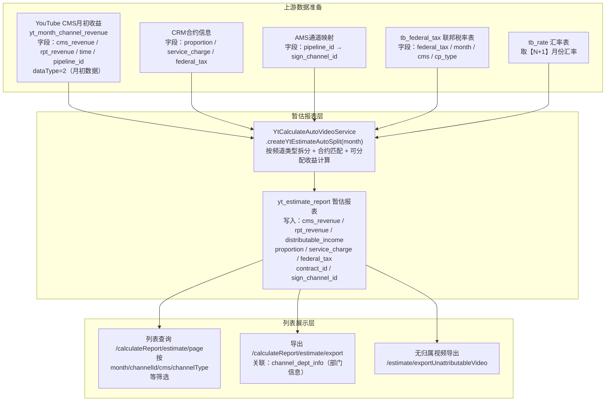

---

## 2. 与冲销报表的核心差异

| 维度 | 暂估报表（yt_estimate_report） | 冲销报表（yt_reversal_report） |
|------|-------------------------------|-------------------------------|
| **数据时机** | 月初（15号之后，dataType=2） | 月末（15号及之前，dataType=1） |
| **数据来源字段** | `yt_month_channel_revenue` 中 `data_type=2` 的月初数据 | `yt_month_channel_revenue` 中按 `receipted_at` 到账日期查询 |
| **查询方式** | `selectByMonth(month, dataQueryDtoList)` → `YtMonthCmsStart` | `selectByReceiptedAt(start, end, dataQueryDtoList)` → `YtMonthCmsEnd` |
| **汇率月份** | 取**N+1月**汇率（即暂估月份的下一个月） | 取**当月**汇率 |
| **CID行** | **不生成** CID行 | 全量生成时生成 CID 行（到账月前一月） |
| **财报收益** | 有 `rpt_revenue / rpt_revenue_us / rpt_revenue_sg`（月初视频级收益） | 有 `report_revenue / report_revenue_us / report_revenue_sg`（财报收益） |
| **结算单生成** | 暂估表**不产生结算单** | 冲销表生成结算单（`tb_settlement`） |
| **`received_status`字段** | 无此字段 | 有，控制是否已到账 |
| **`settlement_created_status`字段** | 无此字段（无需控制） | 有，0=未生成/1=已生成/2=无需生成 |
| **任务类型** | `YT-estimate-new` | `YT-reversal-new` |
| **重新生成限制** | 无结算单生成状态校验 | 已生成结算单的行禁止重新拆分 |
| **批量删除校验** | 只校验 `channel_type=SUBSET` | 额外校验 `settlement_created_status≠1` |
| **`toSplitReportList`** 非空时删除范围 | 精确删除指定行及其子集行，无到账区间限制 | 精确删除指定行及其子集行，有到账区间 |

---

## 3. YT暂估报表生成逻辑

> 核心服务：`YtCalculateAutoVideoService.createYtEstimateAutoSplit(month, toSplitReportList)`
> 对应表：`yt_estimate_report`

### 3.1 触发方式

| 方式 | 任务名 / 接口 | 说明 |
|------|------------|------|
| 手动触发（全量生成） | `POST /reportCreateRecord/create`，参数 `name=YT-estimate-new` | 传入 `month`，对该月份全量生成暂估表 |
| 重新生成（批量） | `POST /reportCreateRecord/reSplitEstimateBatch` | 传入勾选的行 `ids`，对指定合集/单开行重新汇总拆分 |
| 子集重新生成（按发布通道） | `reGenerateSubSetEstimate(subsetList)` | 重新从 AMS 获取通道信息并重走合约匹配 |

**任务存在性校验**（`exist`接口）：`YtEstimateReportMapper.existByMonth(month)` 查询 `yt_estimate_report` 中是否已有该月数据。

### 3.2 前置校验

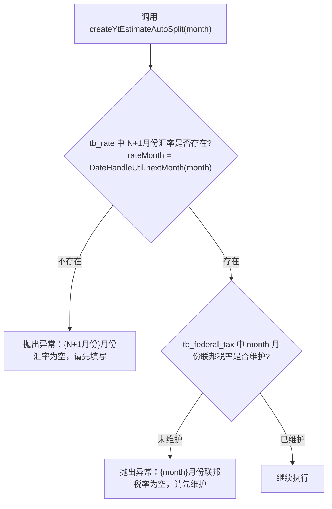

> **与冲销表差异**：暂估表校验的是 **N+1月** 汇率（因暂估数据早于到账，使用下月汇率预估）；冲销表校验当月汇率。

### 3.3 原始数据来源

```
数据表：yt_month_channel_revenue（data_type=2 的月初数据）
查询方法：YtMonthChannelRevenueMapper.selectByMonth(month, dataQueryDtoList)
查询结果：YtMonthCmsStart 对象列表
```

**核心字段说明**：

| 字段 | 说明 |
|------|------|
| `channel_id` | YouTube外部频道ID |
| `cms` | 收款系统（XW=小五 / AC=亚创 等） |
| `pipeline_id` | AMS发布通道ID，匹配国内频道的桥梁 |
| `cms_revenue` | CMS月初导出收益（$） |
| `cms_revenue_us` | 美国区月初收益（$） |
| `cms_revenue_sg` | 新加坡区月初收益（$） |
| `rpt_revenue` | 月初视频级收益（$），来自 `yt_finance_month_api` |
| `rpt_revenue_us` | 月初视频级美国区收益（$） |
| `rpt_revenue_sg` | 月初视频级新加坡区收益（$） |
| `time`（payout_period） | 收益所属月份（YYYY-MM） |
| `source_channel_revenue_ratio` | 通道占比（用于子集收益拆分计算） |

> **与冲销表差异**：暂估表没有 `receipted_at`（到账日期）字段，直接按 `month` 维度查询；冲销表需指定 `receiptedAt` 区间。

### 3.4 按频道类型分类处理（handleByChannelTypeEstimate）

#### 3.4.1 运营类型填充

每条 `YtMonthCmsStart` 记录先填充运营类型（`operation_type`）：

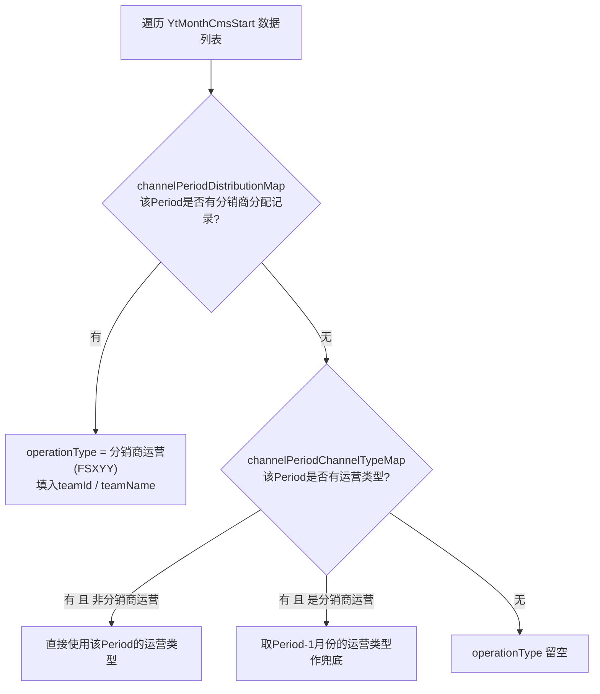

#### 3.4.2 频道路径分类

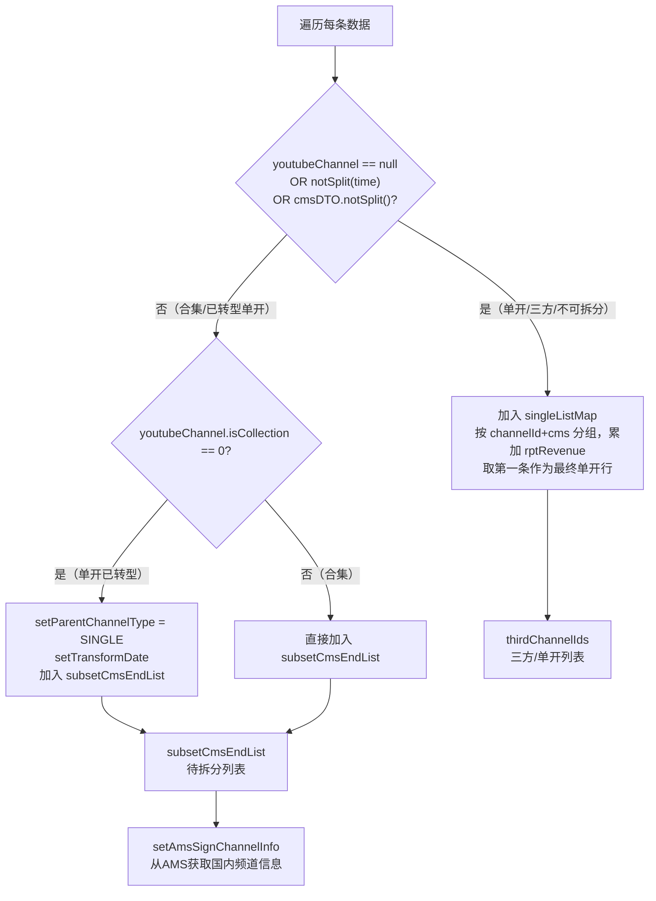

**单开频道累加逻辑**：同一 `channelId+cms` 下可能有多条月初数据（多个 pipeline），单开频道将所有条目的 `rptRevenue / rptRevenueUs / rptRevenueSg` 累加后，取第一条记录写入 `thirdChannelIds`（即财报收益为累加值，CMS收益直接取第一条）。

> **与冲销表差异**：冲销表的单开频道同样累加，但额外处理财报收益（`setCmsReportRevenue`）；暂估表中 `rptRevenue` 来自 `YtMonthCmsStart`，不需要单独查 `yt_finance_month_report`。

#### 3.4.3 转型单开的判断规则（notSplit 方法）

> **适用范围**：仅对 `isCollection=0`（非合集）的单开频道生效。合集频道（`isCollection=1`）没有转型概念，天然进入子集拆分路径。

`YoutubeChannel.notSplit(String periodMonth)` 是路径分叉的核心入口，**返回 `true` 表示不做子集拆分（走单开路径），返回 `false` 表示需要子集拆分**。

**转型日期判断规则**（`DateHandleUtil.checkIsTransform`，以 YearMonth 为粒度）：
- `transformDate == null` → 视为未转型
- 转型月 ≥ Period月 → `TRANSFORMED`（`checkIsTransform` 返回）→ `notSplit()` 内层条件**不满足** → return **false** → **走子集拆分路径**
- 转型月 < Period月 → `NOT_TRANSFORMED`（`checkIsTransform` 返回）→ `notSplit()` 内层条件**满足** → return **true** → **仍走单开路径，不拆分**

> ⚠️ **易误警示**：`checkIsTransform` 返回的 `TRANSFORMED`/`NOT_TRANSFORMED` **不直接对应** `notSplit()` 的最终路径。转型月 ≥ Period月 时，`checkIsTransform` 返回 `TRANSFORMED`，不满足 `notSplit()` 内层条件，因此 return false，**走子集路径**。

**三条路径对照**：

| `isCollection` | `isTransform` / `checkIsTransform` 结果 | `notSplit()` | 最终路径 |
|:-:|---|:-:|---|
| 1（合集） | 无转型概念 | false（固定） | 子集拆分，父行 `channel_type=COLLECTION` |
| 0（单开）未转型（`isTransform=0`） | — | true | 走单开路径，不拆分 |
| 0（单开）已转型，转型月 **≥** Period月 | `checkIsTransform`→`TRANSFORMED`，内层条件不满足 | **false** | **子集拆分**，父行 `channel_type=SINGLE`，`transformDate` 写入DTO |
| 0（单开）已转型，转型月 **<** Period月 | `checkIsTransform`→`NOT_TRANSFORMED`，内层条件满足 | **true** | **走单开路径，不拆分** |

> 详细代码实现见《YT核算表逻辑》§3.4.2 补充说明。

#### 3.4.4 AMS通道信息填充（setAmsSignChannelInfo）

`subsetCmsEndList` 中每条数据按 `pipelineId` 查 AMS，获取对应国内频道：

```java
Map<String, AmsPipeLineSignChannelDTO> pipelineSignChannelMap = 
    amsService.getPipelineSignChannelMap(pipelineIds);
// 找到对应国内频道
cmsDto.setSourceChannelId(amsPipeLineSignChannelDTO.getSignChannelId());
cmsDto.setSourceChannelName(amsPipeLineSignChannelDTO.getSignChannelName());
cmsDto.setServicePageName(amsPipeLineSignChannelDTO.getServicePageName());
cmsDto.setContractNum(amsPipeLineSignChannelDTO.getContractNum());
// 未找到时（无归属）
cmsDto.setSourceChannelId(FinanceConstant.UNATTRIBUTED_SIGN_CHANNEL_ID);  // -1
cmsDto.setSourceChannelName("无归属频道" 或 "原创/无需结算(运营选择)");
// pipeline_id非unattributed时：发送MQ消息触发后续处理
```

### 3.5 子集收益拆分计算（handleSubsetAndGenCollectionChannelEstimate）

> 按 `channelId + cms` 分组，每组生成一条**合集父行** + 若干**子集行**。

#### 3.5.1 合集父行生成

| 字段 | 值 | 说明 |
|------|-----|------|
| `channel_type` | `COLLECTION`（合集）或 `SINGLE`（单开转型父行） | 取决于 `parentChannelType` |
| `channel_split_status` | `1`（已拆） | 父行标识 |
| `pipeline_id` | `null` | 父行不关联通道 |
| `distributable_income` | `0` | 父行不累计收益 |
| `rpt_revenue` | 累加所有子集 rptRevenue 的合计 | 父行保留财报收益合计 |

> **与冲销表差异**：暂估父行**不设置** `settlement_created_status=2`（暂估无此字段）；冲销父行需设置 `settlement_created_status=NONEEDCREATE(2)`。

**特殊情形**：若一个合集下只有1条子集数据且该子集 `sourceChannelRevenueRatio` 为空（无法拆分），则父行 `channel_split_status` 改为 `0`（未拆）。

#### 3.5.2 子集行收益计算

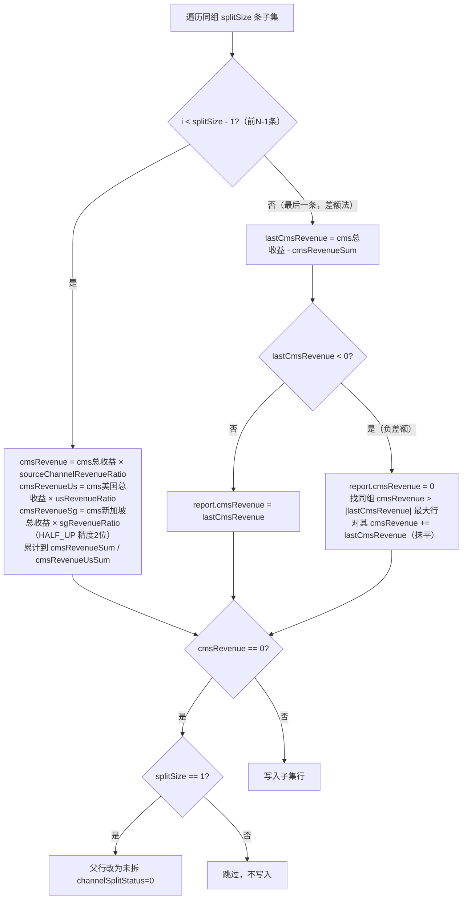

**子集行关键字段**：
- `channel_type = SUBSET`
- `parent_id = 父行id`
- `parent_channel_id = 父行channel_id`
- `subset_channel_id = channelId + sourceChannelName`
- `subset_name = sourceChannelName`（AMS中的国内频道名称）
- `distributable_income = cmsRevenue`（初始值，合约匹配后重新计算）
- `rpt_revenue`：单独累加到父行，**子集行的 rptRevenue 直接来自 source**

> **与冲销表差异**：  
> - 暂估子集不处理调差（无 `cmsRevenueAdjust`）；冲销子集计算时加入调差（`cmsRevenueWithAdjust`）  
> - 暂估子集不清零财报收益（rptRevenue直接使用）；冲销子集将 `reportRevenue/Us/Sg` 强制置0（v1.5.6+）  
> - 暂估子集若 `sourceChannelId` 为空，设 `noContractReason=NO_REVENUE_DATA`

### 3.6 合约信息匹配（handleInfoFromCrmEstimate）

> 与冲销表的 `handleInfoFromCrm` 逻辑**完全一致**，差异仅在参数类型（`YtEstimateReport` vs `YtReversalReport`）。

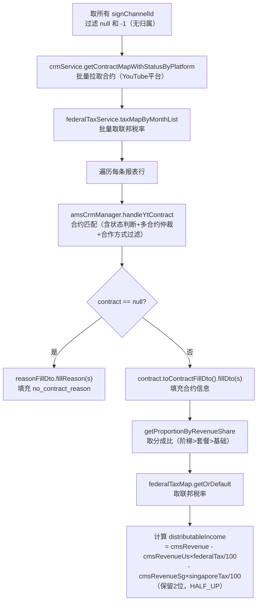

**合约匹配规则**（`amsCrmManager.handleYtContract`，与冲销表相同）：
- 合约状态 8（生效中）：有效，加入 matchContractList
- 合约状态 11/9（已解约/已过期）：加入 terminatedContractList
- **多合约仲裁（15日规则）**：解约日期在 Period 15日及之前 → 取生效中合约；15日之后 → 取已解约合约
- **合作方式过滤**：纯分成/版权采买 → 通过；其他 → `noContractReason=NOT_SUPPORTED`

**distributableIncome 计算公式**（暂估/冲销一致）：

```java
distributableIncome = cmsRevenue
    - cmsRevenueUs × federalTax / 100    // 扣联邦税（精度2位）
    - cmsRevenueSg × singaporeTax / 100  // 扣新加坡税（精度2位）
```

> **与冲销表细微差异**：冲销表的 distributableIncome 计算中包含调差字段：`cmsRevenue + cmsRevenueAdjust - 税额`；暂估表无调差，直接用 `cmsRevenue`。

### 3.7 不结算名单匹配（handleSettlementNoEm）

时机：在 `handleInfoFromCrmEstimate` 之后、数据存储之前，遍历 `tb_settlement_no` 全量不结算名单。

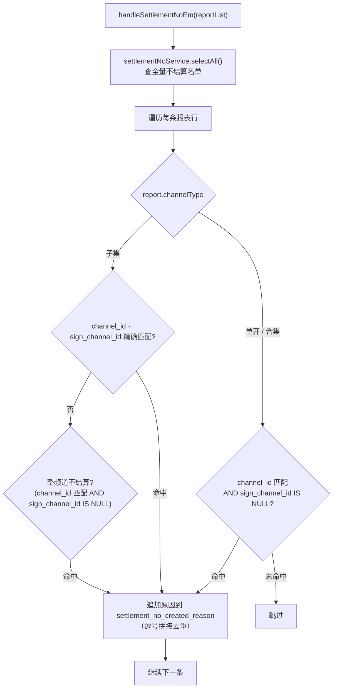

> **与冲销表差异**：  
> - 冲销表命中后同时设置 `settlement_created_status = 2`（无需生成结算单）  
> - 暂估表**不设置** `settlement_created_status`（无此字段），仅写入 `settlement_no_created_reason`

### 3.8 数据存储（saveByMonthReportList）

加 `@Transactional(rollbackFor = Exception.class)` 事务：

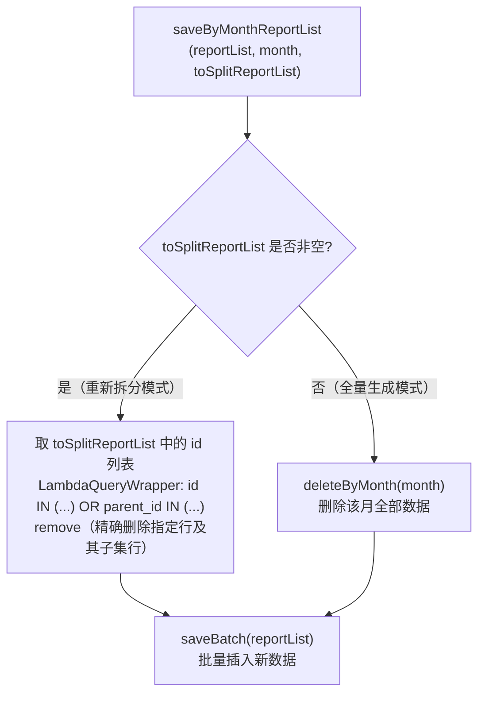

| 模式 | 删除范围 | 适用场景 |
|------|---------|---------|
| 全量生成 | 删除 `month` 下所有行 | 首次生成或整月重新生成 |
| 重新拆分 | 仅删除 `toSplitReportList` 中指定 id 的行及其 `parent_id` 关联的子集行 | 按频道/合约单独重新拆分 |

> **与冲销表差异**：冲销表按 `receiptedAt` 区间删除（含 CID 行）；暂估表按 `month` 删除，无 CID 行，无到账区间概念。

### 3.9 拆分子集（页面操作）

> 接口：`POST /calculateReport/split/subset/estimate/{id}`
> 入口：暂估报表列表 → `channel_type=合集` 的行 → 操作列「拆分子集」按钮
> 核心方法：`YtEstimateReportServiceImpl.splitSubsetRevenue` → `batchSplitSubsetRevenue`
> 事务：`@Transactional(rollbackFor = Exception.class)`

#### 3.9.1 前置校验

| 校验项 | 规则 | 异常提示 |
|-------|------|--------|
| 父行存在性 | 按 `id` 查询 `yt_estimate_report`，不存在则拒绝 | 被拆分合集数据不存在 |
| 子集唯一性 | 同一 `month + channelId + cms` 下，`sign_channel_id IN (subsetIdList)` 且（有 `servicePageName` 时一并校验）不得已存在 | 子集已存在，请勿重复添加 |
| 汇率存在性 | 取 **N+1月** 汇率，不存在则抛出 | 当月汇率为空 |

> **与冲销表差异**：  
> - 暂估无 Redis 并发锁（冲销有 `REPORT:SPLIT:{id}` 锁）  
> - 汇率取**N+1月**（冲销取 `receiptedAt` 所在月份）  

#### 3.9.2 请求参数结构（SplitSubsetQuery）

| 字段 | 类型 | 说明 |
|------|------|------|
| `subsetData[].subsetId` | String（必填） | 国内频道 ID（`sign_channel_id`） |
| `subsetData[].subsetName` | String（必填） | 子集名称 |
| `subsetData[].revenue` | BigDecimal（必填） | CMS 月初收益（$） |
| `subsetData[].usRevenue` | BigDecimal（必填） | 美国收益（$） |
| `subsetData[].sgRevenue` | BigDecimal（必填） | 新加坡收益（$） |
| `subsetData[].servicePageName` | String（可选） | 套餐名称 |
| `subsetData[].pipelineId` | String（可选） | 发布通道 ID |
| `subsetData[].contractNum` | String（可选） | 指定合约编号 |

#### 3.9.3 子集行构建（need2AddList）

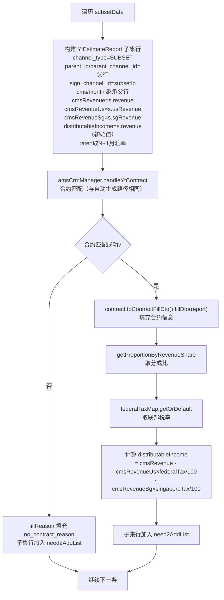

#### 3.9.4 不结算名单匹配

子集行构建完成后，遍历 `tb_settlement_no` 进行匹配（逻辑同 3.7 节 `handleSettlementNoEm`）：
- 子集精确匹配：`channel_id + sign_channel_id` 均匹配
- 整频道不结算：`channel_id` 匹配 + `sign_channel_id IS NULL`
- 命中后：原因逗号拼接去重写入 `settlement_no_created_reason`

#### 3.9.5 写库与父行状态更新

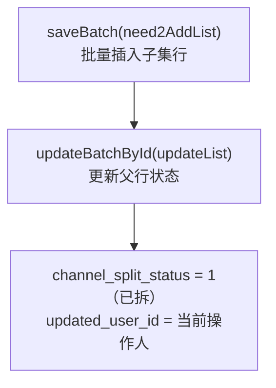

> **与冲销表差异**：冲销表父行还需设置 `settlement_created_status = 2`；暂估表父行**只更新** `channel_split_status`。

#### 3.9.6 删除子集（deleteSubsetById）

| 步骤 | 逻辑 |
|------|------|
| 1. 校验行存在 | 按 `id` 查询，不存在报错 |
| 2. 校验行类型 | `channel_type` 必须为 `SUBSET`，否则报错 |
| 3. 删除子集行 | `baseMapper.deleteById(id)` |
| 4. 回退父行状态 | 若同 `parent_channel_id + month` 下已无子集行，将父行 `channel_split_status` 回退为 `0`（未拆） |

> **与冲销表差异**：冲销表删除前有第3步校验 `settlement_created_status = 1`（已生成结算单）时禁止删除；**暂估表无此校验**，直接删除。

### 3.10 批量拆分子集（Excel 导入）

> 接口：`POST /calculateReport/split/subset/import`，参数 `type=estimate`
> 入口：暂估报表列表 → 顶部「批量拆分子集」→ 下载模板 → 填写 → 上传
> 核心方法：`YtReportImportService.splitSubsetByImport` → `batchHandleData` → `ytEstimateReportService.batchSplitSubsetRevenue`

#### 3.10.1 请求参数（YtReportImportSplitQuery）

| 字段 | 类型 | 说明 |
|------|------|------|
| `key` | String（必填） | OSS 上传后的文件路径 key |
| `type` | String（必填） | 报表类型：`estimate`=暂估（此处固定） |
| `dateTime` | String（必填） | 导入月份（YYYY-MM），用于定位报表行 |

#### 3.10.2 Excel 模板字段（YtReportImportVo）

| 列序号 | 列名 | 是否必填 | 说明 |
|-------|------|---------|------|
| 0 | `*频道ID` | 必填 | YouTube 外部频道 ID |
| 1 | `*收款系统` | 必填 | 名称形式：小五 / 亚创 / Adsense-HK / Adsense-US |
| 2 | `*子集名称` | 必填 | 精确匹配 AMS 中的 `signChannelName` 或别名 |
| 3 | `*CP名称` | 必填 | AMS 合约中的 CP 名称 |
| 4 | `*套餐名称` | 必填 | AMS 合约中的套餐名称（servicePageName） |
| 5 | `*频道收益` | 必填 | CMS 月初收益（$） |
| 6 | `美国收益` | 可选 | 默认 0 |
| 7 | `新加坡收益` | 可选 | 默认 0 |

#### 3.10.3 导入处理全流程（batchHandleData）

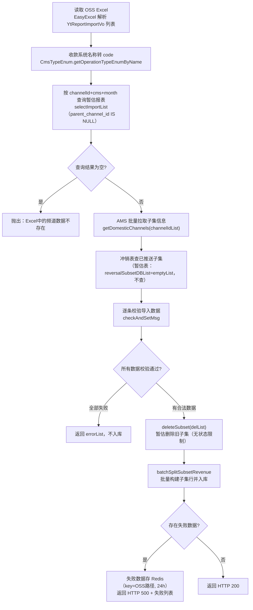

> **与冲销表差异**：  
> - 冲销导入前清理用 `deleteSubsetByNeSettle`（过滤 `settlement_created_status≠1`）；暂估用 `deleteSubset`（无状态过滤，直接删除）  
> - 冲销表查已推送子集（`subsetDBset`），暂估表 `reversalSubsetDBList = emptyList`，不查已推送子集  

#### 3.10.4 逐条数据校验规则（checkAndSetMsg）

| 校验项 | 校验条件 | 错误提示 |
|-------|---------|--------|
| Excel 内重复 | 同 `channelId+cms+subsetName+cpName+servicePageName` 在导入文件内出现 ≥2 次 | 相同频道收款系统子集名称套餐名称CP名称重复 |
| 频道不存在 | `channelId` 在当月报表中无记录 | 频道不存在 |
| 无对应收款系统 | `channelId+cms` 组合在当月报表中无记录 | 无对应收款系统记录 |
| 行类型为子集 | 报表中该行 `channel_type=SUBSET`（非合集父行） | 子集行不允许再次拆分 |
| 子集已拆分且已推送 | **冲销有此校验；暂估不校验**（subsetDBset 为空集） | — |
| AMS 无通道 | `getDomesticChannels` 返回为空 | AMS 中无对应发布通道 |
| 子集匹配失败 | AMS 中无 `cpName+servicePageName+subsetName`（精确或别名）组合 | AMS 中无对应发布通道 |
| 子集匹配多个 | 匹配结果 ≥2 条 | 子集左侧频道匹配到多个 |
| 同一子集多行 | 同 `channelId+cms+subsetId` 在导入文件内出现 ≥2 条 | 多行子集名称映射到同一子集 |

**匹配优先级**：精确匹配 `signChannelName` 优先；不匹配则尝试 `aliasList`（别名列表）。

#### 3.10.5 失败结果导出（importFailExport）

> 接口：`GET /calculateReport/split/subset/importFailExport?key={key}`

- 失败数据由导入接口写入 Redis（key = OSS路径，TTL 24小时）
- 导出时从 Redis 读取，将 cms code 反转为名称后，输出 Excel 文件

### 3.11 批量删除子集

> 接口：`POST /calculateReport/deleteSubsetBatchCheck`（预检） + `POST /calculateReport/deleteSubsetBatch`（执行）
> 报表类型参数：`reportType = YT-estimate`（暂估）

#### 3.11.1 预检接口（deleteSubsetBatchCheck）

| 字段 | 说明 |
|------|------|
| `totalCount` | 勾选总数（`ids.size()`） |
| `delCount` | 实际可删数（`channel_type=SUBSET`，**暂估无结算状态过滤**） |

> **与冲销表差异**：冲销表过滤 `settlement_created_status ≠ 1`；暂估表**只过滤** `channel_type=SUBSET`，不过滤结算状态。

#### 3.11.2 执行删除（deleteSubsetBatchById）

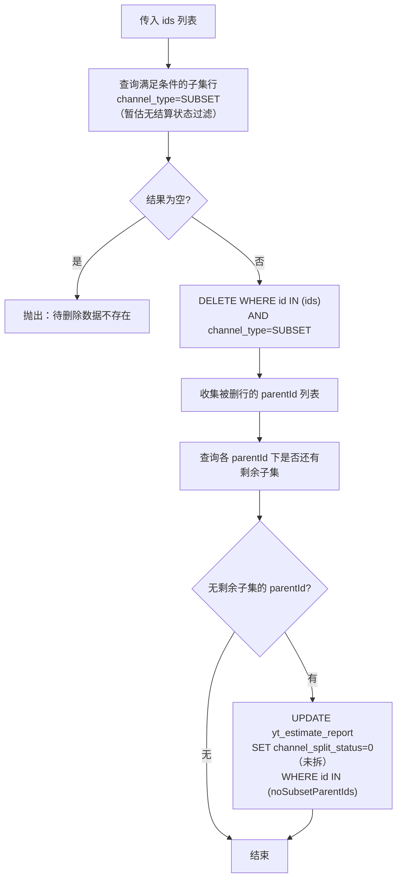

操作有日志记录：`log.info("暂估报表删除ids:{},数据:{},实际数量:{},操作人:{}"...)`

### 3.12 按合约重新生成（reversalRegenerateByContractNum）

> 接口：`POST /calculateReport/estimate/regenerateByContractNum`
> 说明：暂估表特有操作，按指定合约编号（`contractNum`）和套餐名称（`servicePageName`）对选中行重新匹配合约并更新数据。

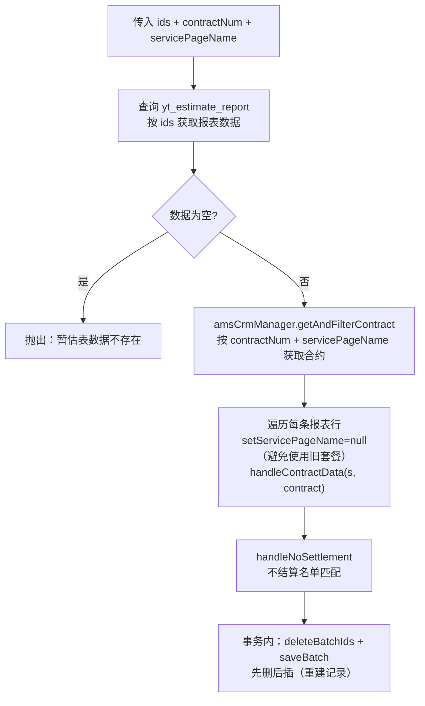

**`handleContractData` 填充逻辑**：
- 合作方式 = 纯分成 → 正常填充合约信息（`contractId / proportion / federalTax / distributableIncome` 等）
- 合作方式 = 版权采买 → `settlementNoCreatedReason = "采买分成，无需结算"`
- 其他合作方式 → `noContractReason = "分成模式尚不支持结算"`，返回不填充

> 冲销表无此接口；该功能是暂估表专有的**按合约批量更新**能力。

### 3.13 暂估报表关键字段汇总

| 字段 | 写入时机 | 说明 |
|------|---------|------|
| `channel_type` | 生成时 | 0=单开 / 1=子集 / 2=合集 |
| `channel_split_status` | 生成时/拆分操作后 | 0=未拆 / 1=已拆（合集父行） |
| `cms_revenue` | 生成时 | CMS月初导出收益（$） |
| `cms_revenue_us` | 生成时 | 美国区月初收益（$） |
| `cms_revenue_sg` | 生成时 | 新加坡区月初收益（$） |
| `rpt_revenue` | 生成时 | 月初视频级收益（$，父行为合计） |
| `rpt_revenue_us` | 生成时 | 月初视频级美国区收益（$） |
| `rpt_revenue_sg` | 生成时 | 月初视频级新加坡区收益（$） |
| `distributable_income` | 合约匹配后 | 可分配收益 = cms_revenue - 联邦税额 - 新加坡税额 |
| `proportion` | 合约匹配后 | CP分成比例（%） |
| `federal_tax` | 合约匹配后 | 联邦税率（%） |
| `singapore_tax` | 合约匹配后 | 新加坡税率（%） |
| `service_charge` | 合约匹配后 | 手续费率（%） |
| `rate` | 生成时 | 汇率（取 N+1 月份） |
| `no_contract_reason` | 合约匹配失败时 | 无合约原因 |
| `settlement_no_created_reason` | 不结算名单命中时 | 无需生成原因（多条逗号拼接） |
| `sign_channel_id` | 生成时 | 国内频道 ID（-1 = 无归属） |
| `contract_id` | 合约匹配后 | 关联合约 ID |
| `subset_name` | 生成时/拆分时 | 子集名称（AMS中的国内频道名） |
| `source_channel_revenue_ratio` | 生成时 | 通道占比（用于子集收益拆分） |
| `pipeline_id` | 生成时 | 发布通道 ID（父行为 null） |
| `team_id / team_name` | 生成时 | 分销商团队信息（分销商运营类型时填充） |

---
