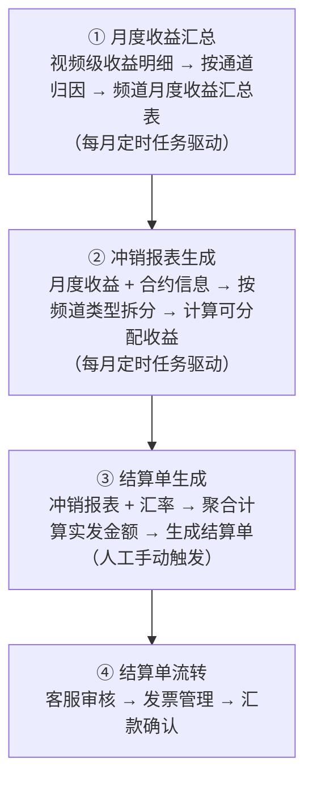
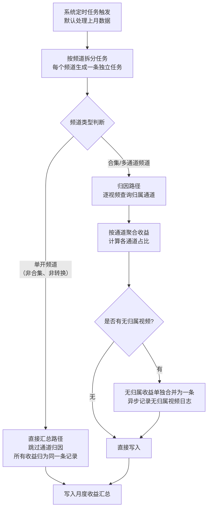
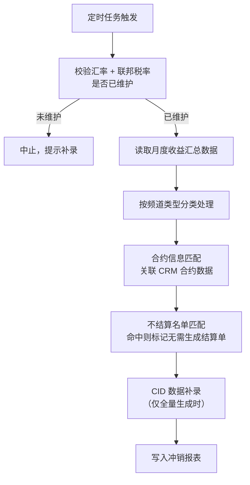
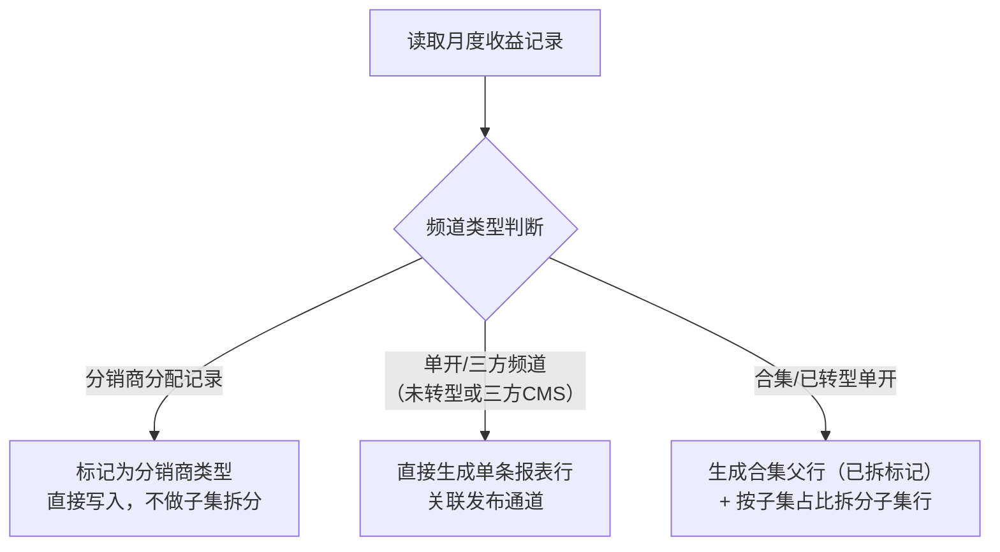
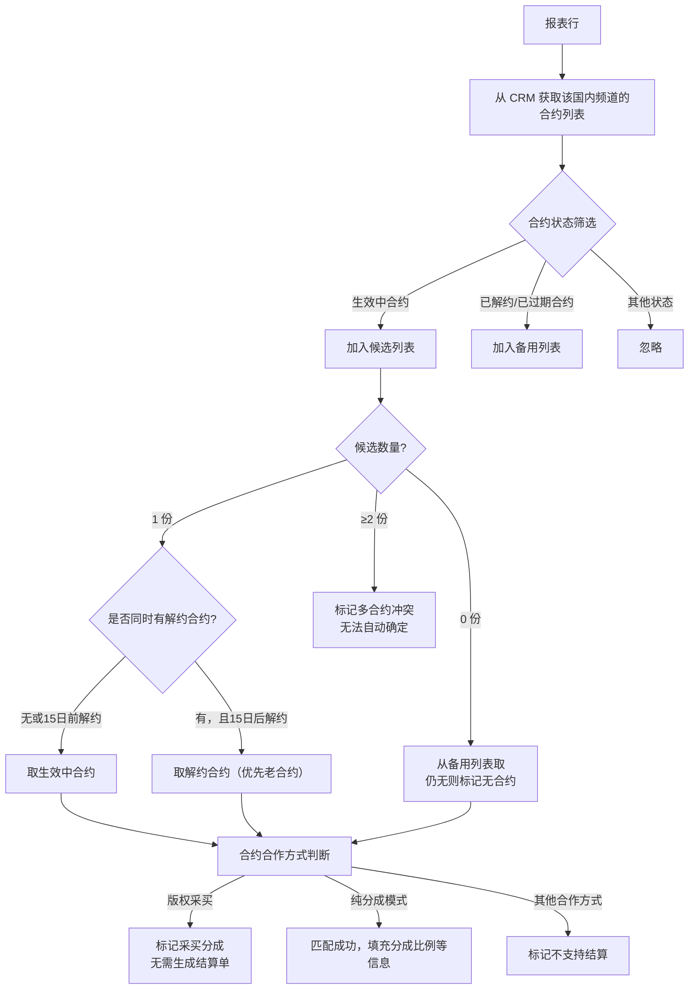
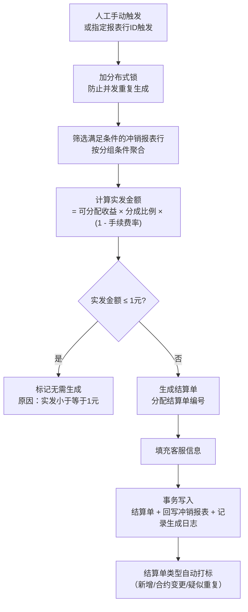
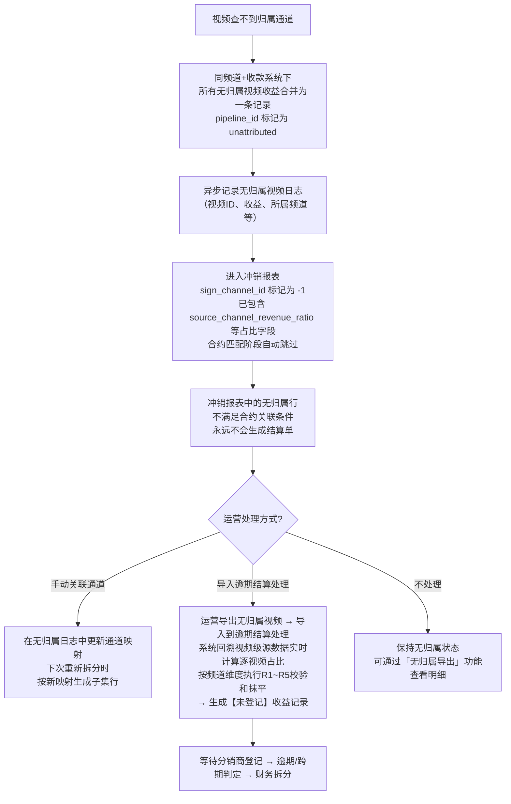
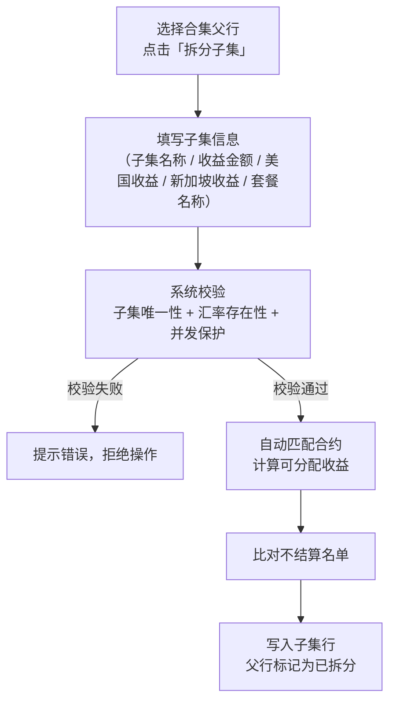
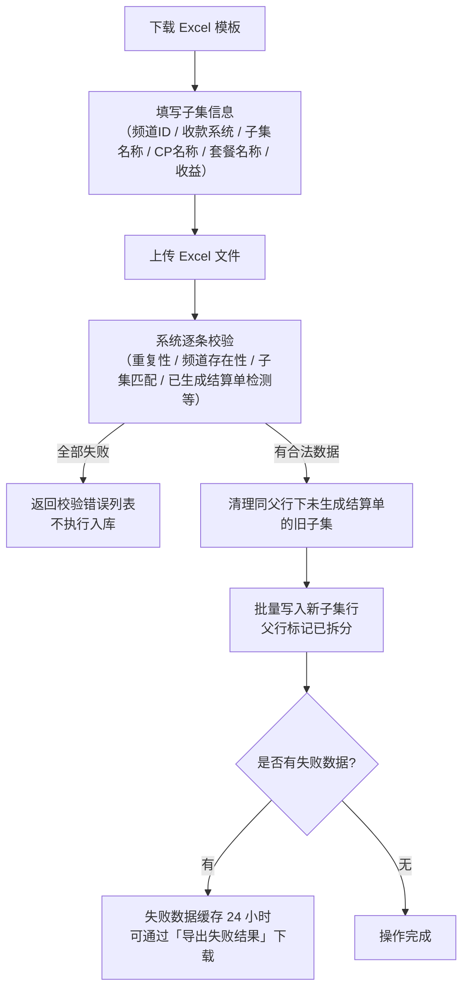

# YT核算业务流程概览

> 本文档聚焦业务流转逻辑，描述 YT 核算从收益数据到结算单全链路的核心流程，不包含表结构、字段定义等技术细节。

---

## 目录

- 1. 整体业务链路
- 2. 月度收益数据汇总
- 3. 冲销报表生成
- 4. 结算单生成
- 5. 无归属收益处理
- 6. 页面操作

---

## 1. 整体业务链路

YT 核算的完整业务链路分为四个阶段，数据依次向下流转：

**各阶段触发方式**：

| 阶段 | 触发方式 | 说明 |
|------|---------|------|
| 月度收益汇总 | 系统定时任务（每月自动） | 支持手动重新汇总 |
| 冲销报表生成 | 人工手动触发             | 支持按频道重新拆分 |
| 结算单生成 | 人工手动触发 | 支持全量或按指定记录生成 |

---

## 2. 月度收益数据汇总

### 2.1 业务目标

将 YouTube 平台上传回的**视频级收益明细**，通过通道归因，汇总为**每个频道在各收款系统下的月度收益**，并计算各通道的收益占比，供后续冲销报表生成使用。

### 2.2 整体流程

### 2.3 通道归因规则

- 每条视频收益记录通过**视频通道快照表**查询该视频归属的发布通道
- 快照来源：出海通自运营上传时写入 / 分销通道同步时写入 / 手动更新
- 无法在快照表中找到对应通道的视频，归类为**无归属收益**

### 2.4 通道占比计算

同一频道+收款系统下，各通道的收益占比 = 该通道累计收益 ÷ 该频道下所有视频总收益。单开频道无需拆分，占比固定为 1。

### 2.5 支持手动重新汇总

当数据异常或需要修正时，可手动触发指定频道的重新汇总：先删除已有记录，再重新执行汇总逻辑。

---

## 3. 冲销报表生成

### 3.1 业务目标

基于月度收益汇总数据，结合合约信息，按**频道类型**拆分生成冲销报表行，计算每条记录的**可分配收益**（扣除联邦税、新加坡税后），为后续生成结算单提供依据。

### 3.2 前置条件

生成前需完成两项配置，否则拒绝执行：
- **当月汇率**已维护
- **当月联邦税率**已维护

### 3.3 整体流程

### 3.4 频道类型分类处理

冲销报表按频道类型走不同路径：

**单开频道转型说明**：

单开频道（非合集）在某期 Period 后展开子集运营，称为“转型单开”。判断规则：

| 频道类型 | 转型状态 | 处理方式 |
|------|------|------|
| 合集（isCollection=1） | **没有转型概念** | 天然进入子集拆分路径，`channel_type=COLLECTION` |
| 单开 + 未转型 | — | 单开路径，不拆分 |
| 单开 + 已转型，转型月 ≥ Period月 | 本期转型尚未生效 | 单开路径，不拆分 |
| 单开 + 已转型，转型月 < Period月 | 转型已在本期之前完成 | 子集拆分路径，父行标记 `channel_type=SINGLE` |

> 转型日期以 **YearMonth** 为粒度进行比较，同月转型算本期尚未生效。

**合集子集拆分逻辑**：
- 从子集占比配置中取各子集的收益分配比例
- 按比例计算每条子集行的收益（最后一条用差额法，避免精度误差）
- 若某子集拆分后收益为 0，跳过不写入

### 3.5 合约信息匹配

每条报表行需关联一份有效合约，才能最终生成结算单：

**15日规则**：同月若有合约更替（旧合约解约 + 新合约生效），以当月 15 日为分界：15 日及之前发生的取新合约，15 日之后发生的取旧合约。

### 3.6 不结算名单匹配

合约匹配完成后，对所有报表行再次比对不结算名单：
- 支持**整频道**不结算（名单只指定频道，不指定子集）
- 支持**精确子集**不结算（名单同时指定频道和子集）
- 命中后标记无需生成结算单，原因字段记录不结算理由

### 3.7 可分配收益计算

`可分配收益 = CMS收益 - 美国区收益 × 联邦税率 - 新加坡区收益 × 新加坡税率`

此值将直接传递给结算单生成阶段作为计算基础。

### 3.8 两种生成模式

| 模式 | 触发方式 | 处理范围 |
|------|---------|---------|
| 全量生成 | 定时任务首次执行 | 删除该到账月份所有旧数据，重新生成 |
| 重新拆分 | 页面操作 / 手动触发 | 仅删除指定频道的行，其余数据不变 |

---

## 4. 结算单生成

### 4.1 业务目标

从冲销报表中筛选满足条件的记录，按**频道+国内频道+分成比例**分组聚合，计算实际结算金额，生成结算单。

### 4.2 生成条件

冲销报表行需同时满足以下条件，才会纳入结算单生成范围：
- 已关联合约
- 已到账（收款状态非0）
- 未生成结算单
- 非合集父行（已被拆分的父行不参与）

### 4.3 整体流程

### 4.4 多月合并

同一频道+国内频道+分成比例的组合下，若存在**多个月份**的到账数据，会合并为**一条结算单**，账期为逗号拼接的多个月份。

### 4.5 结算单编号规则

编号格式：`到账日期（去横线） + YT + 6位序号`

示例：`20240501YT000001`

序号按月份递增，从 1 开始。

### 4.6 结算单类型自动判断

生成后与上月数据对比，自动打标：

| 类型 | 判断依据 |
|------|---------|
| 新增 | 上月无该国内频道的结算单 |
| 合约变更 | 分成比例/手续费/银行账号与上月不同 |
| 疑似重复 | 金额与上月完全相同 |

---

## 5. 无归属收益处理

### 5.1 什么是无归属

当一条视频收益记录无法在**视频通道快照表**中找到对应的发布通道时，该视频的收益即为**无归属收益**。

常见原因：视频发布时未同步快照、通道信息变更后快照未更新等。

### 5.2 无归属收益的流转路径

> **逾期结算处理分支说明**：运营将无归属视频ID导入到逾期结算处理模块（SET-03），系统按视频ID**回溯 `yt_month_channel_revenue_source`（视频级收益明细）实时计算每个视频的收益占比**（= 视频收益 / 频道总收益），然后以冲销报表无归属合并行的总金额为基准执行 R1~R5 校验和误差抹平，校验通过后生成【未登记】收益记录。无归属行在冲销报表中被合并为一条且 `source_channel_revenue_ratio = null`，不含逐视频占比，因此必须回溯源数据计算。详见 `逾期结算处理业务逻辑.md` §5.3。

### 5.3 无归属视频的查看与导出

运营人员可在页面上导出指定月份的无归属视频明细（包含视频 ID、收益、频道信息等），用于人工核查和后续关联处理。导出有 60 秒防重复限制。

两个导出接口在查询月份上存在差异：冲销报表接口（`/reversal/exportUnattributableVideo`）实际查询的是**上月**数据；暂估报表接口（`/estimate/exportUnattributableVideo`）查询的是**当月**数据。

### 5.4 重新生成时的跳过规则

重新拆分冲销报表时，以下记录会自动跳过，不参与重新生成：
- `pipeline_id = "unattributed"`：无归属收益，无通道映射，重新生成无意义

`pipeline_id = "-1"`（运营选择无需结算）**不再跳过**，会走子集拆分路径，生成对应的子集行。

---

## 6. 页面操作

### 6.1 拆分子集（单条）

**使用场景**：合集类型的冲销报表行，系统自动生成的子集拆分不满足需求时，由运营人员手动指定子集及对应收益进行拆分。

**操作流程**：

**删除子集**：已生成结算单的子集行不可删除；删除后若父行下无任何子集，父行状态自动回退为未拆分。

### 6.2 批量拆分子集（Excel 导入）

**使用场景**：需要批量为多个频道的合集行添加子集时，通过下载模板 → 填写 → 上传 Excel 的方式批量处理。

**操作流程**：

**子集匹配规则**：系统优先精确匹配 AMS 中的子集名称，匹配失败时尝试别名列表。

### 6.3 批量删除子集

**使用场景**：批量删除多条不需要的子集行。

**操作流程**：
1. 勾选要删除的子集行，点击「批量删除」
2. 系统预检：显示「可删数量 / 勾选总数」（已生成结算单的子集自动排除）
3. 确认后执行删除，父行无剩余子集时自动回退为未拆分状态

---

## 附：无需生成结算单的情形汇总

以下情形会在冲销报表或结算单生成阶段被标记为**无需生成**：

| 情形 | 标记阶段 |
|------|---------|
| 合约合作方式为版权采买 | 冲销报表生成时 |
| 命中不结算名单 | 冲销报表生成时 |
| 无发布通道（无归属收益） | 冲销报表生成时 |
| 无合约或合约状态异常 | 冲销报表生成时 |
| 合作方式不支持结算 | 冲销报表生成时 |
| 实发金额 ≤ 1元（人民币） | 结算单生成时 |
| 频道下 CMS 收益聚合后 < 1 美元 | 结算单生成时（**注：当前代码中此条件不可达，为死代码**） |
