# YT核算表逻辑

> 菜单路径：数据报表 → YT核算表 → 暂估表/冲销表
> 完整梳理数据生成链路、核心业务逻辑及页面操作规则。

---

## 目录

- [1. 整体数据链路](#1-整体数据链路)
- [2. yt_month_channel_revenue 数据汇总逻辑](#2-yt_month_channel_revenue-数据汇总逻辑)（2.1概述 / 2.2触发方式 / 2.3数据来源表 / 2.4目标表结构 / 2.5任务生成 / 2.6任务执行总流程 / 2.7单开频道路径 / 2.8归因路径 / 2.9占比计算 / 2.10入库）
- [3. YT暂估报表生成逻辑](#3-yt暂估报表生成逻辑)（3.1触发方式 / 3.2前置校验 / 3.3原始数据获取 / 3.4频道类型分类 / 3.5子集收益拆分 / 3.6合约信息匹配 / 3.7不结算名单匹配 / 3.8数据存储 / 3.9拆分子集 / 3.10批量拆分子集 / 3.11批量删除子集 / 3.12按合约重新生成 / 3.13字段汇总）
- [4. YT冲销报表生成逻辑](#4-yt冲销报表生成逻辑)（4.1触发方式 / 4.2前置校验 / 4.3原始数据获取 / 4.4频道类型分类 / 4.5子集收益拆分 / 4.6合约信息匹配 / 4.7不结算名单匹配 / 4.8CID处理 / 4.9数据存储 / 4.10拆分子集 / 4.11批量拆分子集 / 4.12批量删除子集 / 4.13字段汇总）
- [5. YT结算单生成逻辑](#5-yt结算单生成逻辑)（5.1触发方式 / 5.2前置校验 / 5.3聚合SQL / 5.4子集父行预取 / 5.5收益计算 / 5.6编号规则 / 5.7客服填充 / 5.8事务存储 / 5.9结算单类型 / 5.10异常处理 / 5.11字段汇总）
- [6. 无归属视频的逻辑](#6-无归属视频的逻辑)（6.1概念 / 6.2快照维护 / 6.3归因全流程 / 6.4字段表现 / 6.5冲销报表处理 / 6.6重新生成跳过 / 6.7无归属导出 / 6.8无需生成汇总）

---

## 1. 整体数据链路


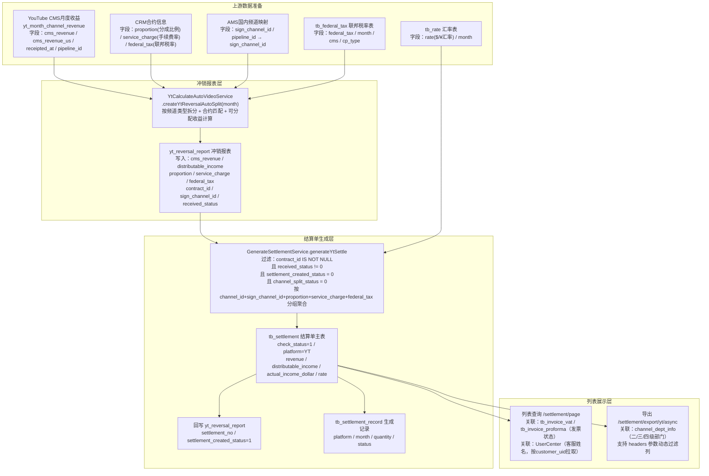
```mermaid
graph TB
    subgraph 上游数据准备
        A["YouTube CMS月度收益\nyt_month_channel_revenue\n字段：cms_revenue / cms_revenue_us / receipted_at / pipeline_id"]
        B["CRM合约信息\n字段：proportion(分成比例) / service_charge(手续费率) / federal_tax(联邦税率)"]
        C["AMS国内频道映射\n字段：sign_channel_id / pipeline_id → sign_channel_id"]
        D["tb_rate 汇率表\n字段：rate($/¥汇率) / month"]
        K["tb_federal_tax 联邦税率表\n字段：federal_tax / month / cms / cp_type"]
    end

    subgraph 冲销报表层
        E["YtCalculateAutoVideoService\n.createYtReversalAutoSplit(month)\n按频道类型拆分 + 合约匹配 + 可分配收益计算"]
        F["yt_reversal_report 冲销报表\n写入：cms_revenue / distributable_income\nproportion / service_charge / federal_tax\ncontract_id / sign_channel_id / received_status"]
    end

    subgraph 结算单生成层
        G["GenerateSettlementService.generateYtSettle\n过滤：contract_id IS NOT NULL\n且 received_status != 0\n且 settlement_created_status = 0\n且 channel_split_status = 0\n按 channel_id+sign_channel_id+proportion+service_charge+federal_tax 分组聚合"]
        H["tb_settlement 结算单主表\ncheck_status=1 / platform=YT\nrevenue / distributable_income / actual_income_dollar / rate"]
        I["回写 yt_reversal_report\nsettlement_no / settlement_created_status=1"]
        J["tb_settlement_record 生成记录\nplatform / month / quantity / status"]
    end

    subgraph 列表展示层
        L["列表查询 /settlement/page\n关联：tb_invoice_vat / tb_invoice_proforma（发票状态）\n关联：UserCenter（客服姓名，按customer_uid拉取）"]
        M["导出 /settlement/export/yt/async\n关联：channel_dept_info（二/三/四级部门）\n支持 headers 参数动态过滤列"]
    end

    A --> E
    B --> E
    C --> E
    K --> E
    E --> F
    F --> G
    D --> G
    G --> H
    H --> I
    H --> J
    H --> L
    H --> M
```


---

## 2. yt_month_channel_revenue 数据汇总逻辑

> 核心服务：`YTMonthChannelRevenueTaskServiceImpl`
> 对应表：`yt_month_channel_revenue`

### 2.1 概述

`yt_month_channel_revenue` 是 YT 暂估报表/冲销报表生成的**直接上游**，存储每个外频道（target_channel_id）在指定月份、按收款系统（cms）和发布通道（pipeline_id）维度汇总后的收益及占比数据。

整体链路：

```
yt_month_channel_revenue_source（视频级明细）
    ↓ 按 videoId 查快照 youtube_video_pipeline 得到 pipelineId
    ↓ 按 pipelineId + cms 聚合（分子）
    ↓ 按 channelId + cms 汇总全部视频收益（分母）
    ↓ 计算三个占比（精度10位）
    ↓ INSERT … ON DUPLICATE KEY UPDATE
yt_month_channel_revenue（频道月度收益汇总）
```

---

### 2.2 触发方式

| 方式 | 任务名 / 接口 | 说明 |
|------|------------|------|
| PowerJob 定时任务（任务生成） | `YTMonthChannelRevenue` → `generateYTMonthChannelRevenueTask` | 默认取**上月**；支持 jobParams 指定 `dataMonth`（yyyy-MM）和 `dataType`（1/2） |
| PowerJob 定时任务（任务执行） | `YTMonthChannelRevenueSync` → `generateYTMonthChannelRevenue` | 轮询 `data_task` 表中状态为 0（待执行）的任务逐批处理 |
| 手动重新汇总 | `reGenerateYTMonthChannelRevenue(taskQueryList)` | 将指定任务状态重置为 0 → 先删除已有记录 → 再执行 `generateYTMonthChannelRevenue` |

**dataType 含义**：

| 值 | 含义 |
|----|------|
| `1` | 月末数据（15 号及之前） |
| `2` | 月初数据（15 号之后） |

---

### 2.3 数据来源表（yt_month_channel_revenue_source）

| 字段 | 说明 |
|------|------|
| `target_channel_id` | 外频道 ID |
| `target_video_id` | 视频 ID（用于查通道快照） |
| `cms` | 收款系统（如 AdSense、Content ID 等；为空时补填 `"NoCMS"`） |
| `month` | 月份（yyyy-MM） |
| `revenue` | 总收益（$）；为 0 跳过；负数（盗版）**不跳过** |
| `us_revenue` | 美国区收益（$） |
| `sg_revenue` | 新加坡区收益（$） |

---

### 2.4 目标表结构（yt_month_channel_revenue）

| 字段 | 说明 |
|------|------|
| `target_channel_id` | 外频道 ID |
| `pipeline_id` | 发布通道 ID；无法归因时为 `"unattributed"` |
| `cms` | 收款系统 |
| `revenue` | **分母**：该频道+cms 下所有视频的总收益（$） |
| `source_channel_revenue` | **分子**：该通道下累计收益（$） |
| `source_channel_revenue_ratio` | 通道占比 = 分子 / 分母（精度 10 位 HALF_UP） |
| `us_revenue` | 该通道下美国区收益（$） |
| `sg_revenue` | 该通道下新加坡区收益（$） |
| `target_cl_us_cms_revenue` | 分母（美国）：频道+cms 下所有视频美国区总收益 |
| `target_cl_sg_cms_revenue` | 分母（新加坡）：频道+cms 下所有视频新加坡区总收益 |
| `us_revenue_ratio` | 美国区占比 = us_revenue / target_cl_us_cms_revenue（精度 10 位） |
| `sg_revenue_ratio` | 新加坡区占比 = sg_revenue / target_cl_sg_cms_revenue（精度 10 位） |
| `data_type` | 数据类型：1=月末 / 2=月初 |
| `time` | 月份（yyyy-MM） |

**业务唯一键**：`target_channel_id + pipeline_id + cms + time`（`ON DUPLICATE KEY UPDATE` 去重）

---

### 2.5 任务生成（generateYTMonthChannelRevenueTask）

```java
// 1. 取上月；支持 jobParams 覆盖 dataMonth / dataType
Date lastMonth = DateUtil.lastMonth();
String dataMonth = DateUtil.format(lastMonth, "yyyy-MM");
// 2. 从 source 表查出本月所有有数据的 targetChannelId
List<String> targetChannelIdList = ytMonthChannelRevenueSourceService.cmsTargetChannelIdList(dataMonth);
// 3. 为每个 channelId 生成一条 DataTask（taskType=YTMonthChannelRevenueTask, dataRange=[channelId]）
dataTaskService.generateTaskByChannelId(TaskTypeEnum.YTMonthChannelRevenueTask, dataMonth, targetChannelIdList, dataType);
```

**DataTask 状态枚举**：

| `executeStatus` | 含义 |
|----------------|------|
| `0` | 待执行 |
| `1` | 执行中 |
| `2` | 执行失败 |
| `3` | 执行成功 |

---

### 2.6 任务执行总流程（generateYTMonthChannelRevenue）


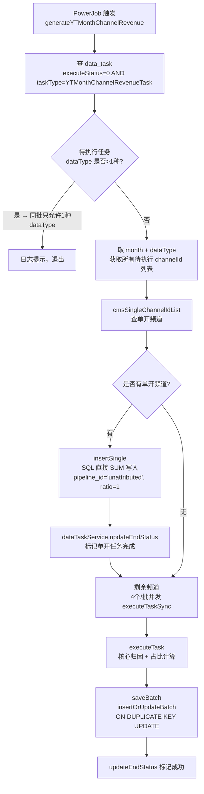
```mermaid
graph TB
    A["PowerJob 触发\ngenerateYTMonthChannelRevenue"] --> B["查 data_task\nexecuteStatus=0 AND taskType=YTMonthChannelRevenueTask"]
    B --> C{"待执行任务\ndataType 是否>1种?"}
    C -->|"是 → 同批只允许1种dataType"| Z["日志提示，退出"]
    C -->|"否"| D["取 month + dataType\n获取所有待执行 channelId 列表"]
    D --> E["cmsSingleChannelIdList\n查单开频道"]
    E --> F{"是否有单开频道?"}
    F -->|"有"| G["insertSingle\nSQL 直接 SUM 写入\npipeline_id='unattributed', ratio=1"]
    G --> G2["dataTaskService.updateEndStatus\n标记单开任务完成"]
    G2 --> H["剩余频道\n4个/批并发 executeTaskSync"]
    F -->|"无"| H
    H --> I["executeTask\n核心归因 + 占比计算"]
    I --> J["saveBatch\ninsertOrUpdateBatch\nON DUPLICATE KEY UPDATE"]
    J --> K["updateEndStatus 标记成功"]
```


---

### 2.7 单开频道路径（insertSingle）

**单开频道判定条件**：`is_collection = 0 AND is_transform = 0`（非合集、非转换频道）

```sql
-- cmsSingleChannelIdList：找出本月待汇总频道中的单开频道
SELECT DISTINCT en.channel_id
FROM yt_month_cms_start en
         LEFT JOIN youtube_channel_extends ex ON en.channel_id = ex.channel_id
WHERE ex.is_collection = 0
  AND ex.is_transform = 0
  AND en.time = #{month}
  AND en.channel_id IN (...)
```

单开频道跳过通道归因，**直接从 source 表 SUM 写入**，所有占比均为 1：

```sql
-- insertSingle：单开频道直接汇总
INSERT INTO yt_month_channel_revenue
  (target_channel_id, pipeline_id, cms,
   revenue, source_channel_revenue,
   us_revenue, sg_revenue, us_revenue_ratio, sg_revenue_ratio,
   source_channel_revenue_ratio, time, data_type)
SELECT
  target_channel_id,
  'unattributed',         -- 无通道归因
  cms,
  SUM(revenue),           -- 分母 = 分子（单开频道无拆分）
  SUM(revenue),
  SUM(us_revenue),
  SUM(sg_revenue),
  1, 1, 1,                -- 三个占比均为 1
  `month`,
  #{dataType}
FROM yt_month_channel_revenue_source
WHERE `month` = #{month}
  AND target_channel_id IN (...)
GROUP BY target_channel_id, cms
```

---

### 2.8 归因路径 — executeTask

> 适用于合集/多通道频道；单任务对应 1 个 channelId


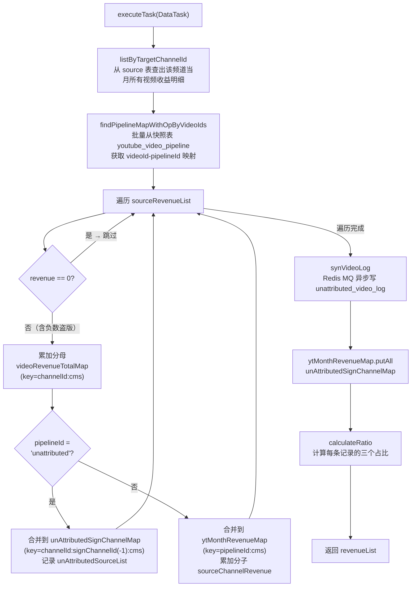
```mermaid
graph TB
    A["executeTask(DataTask)"] --> B["listByTargetChannelId\n从 source 表查出该频道当月所有视频收益明细"]
    B --> C["findPipelineMapWithOpByVideoIds\n批量从快照表 youtube_video_pipeline\n获取 videoId-pipelineId 映射"]
    C --> D["遍历 sourceRevenueList"]
    D --> E{"revenue == 0?"}
    E -->|"是 → 跳过"| D
    E -->|"否（含负数盗版）"| F["累加分母\nvideoRevenueTotalMap\n(key=channelId:cms)"]
    F --> G{"pipelineId =\n'unattributed'?"}
    G -->|"是"| H["合并到 unAttributedSignChannelMap\n(key=channelId:signChannelId(-1):cms)\n记录 unAttributedSourceList"]
    G -->|"否"| I["合并到 ytMonthRevenueMap\n(key=pipelineId:cms)\n累加分子 sourceChannelRevenue"]
    H --> D
    I --> D
    D -->|"遍历完成"| J["synVideoLog\nRedis MQ 异步写 unattributed_video_log"]
    J --> K["ytMonthRevenueMap.putAll\nunAttributedSignChannelMap"]
    K --> L["calculateRatio\n计算每条记录的三个占比"]
    L --> M["返回 revenueList"]
```


**key 格式说明**：

| Map | key 格式 | 说明 |
|-----|---------|------|
| `videoRevenueTotalMap`（分母） | `channelId:cms` | 该频道+cms 下所有视频总收益 |
| `ytMonthRevenueMap`（有归属） | `pipelineId:cms` | 同通道+收款系统下累计分子 |
| `unAttributedSignChannelMap`（无归属） | `channelId:signChannelId(-1):cms` | 同频道+cms 下无归属收益合并为 1 条 |

**cms 为空处理**：`source.getCms()` 为空时补填固定值 `"NoCMS"`

---

### 2.9 占比计算（calculateRatio）

```java
// 设置分母（频道+cms 下所有视频的总收益）
y.setRevenue(videoRevenueTotalMap.get("channelId:cms"));
y.setTargetClUsCmsRevenue(videoUsRevenueTotalMap.getOrDefault("channelId:cms", ZERO));
y.setTargetClSgCmsRevenue(videoSgRevenueTotalMap.getOrDefault("channelId:cms", ZERO));

// 通道占比（精度 10 位 HALF_UP）
y.setSourceChannelRevenueRatio(
    sourceChannelRevenue.divide(revenue, 10, HALF_UP));

// 美国区占比（分母 > 0 才计算，否则不写入）
if (usTotal > 0)
    y.setUsRevenueRatio(usRevenue.divide(usTotal, 10, HALF_UP));

// 新加坡区占比
if (sgTotal > 0)
    y.setSgRevenueRatio(sgRevenue.divide(sgTotal, 10, HALF_UP));
```

**金额累加精度**：每次 `mergeChannelRevenue` 调用 `NumberUtil.add(...).setScale(6, HALF_UP)` 保留 6 位精度。

---

### 2.10 入库（insertOrUpdateBatch）

合集/多通道频道通过 `saveBatch` → `insertOrUpdateBatch` 写库，冲突时执行累加更新：

```sql
INSERT INTO yt_month_channel_revenue
  (target_channel_id, pipeline_id, cms, revenue, source_channel_revenue,
   us_revenue, sg_revenue, target_cl_us_cms_revenue, target_cl_sg_cms_revenue,
   source_channel_revenue_ratio, us_revenue_ratio, sg_revenue_ratio, time, data_type)
VALUES (...)
ON DUPLICATE KEY UPDATE
  revenue                  = revenue + VALUES(revenue),
  source_channel_revenue   = source_channel_revenue + VALUES(source_channel_revenue),
  us_revenue               = us_revenue + VALUES(us_revenue),
  sg_revenue               = sg_revenue + VALUES(sg_revenue),
  target_cl_us_cms_revenue = target_cl_us_cms_revenue + VALUES(target_cl_us_cms_revenue),
  target_cl_sg_cms_revenue = target_cl_sg_cms_revenue + VALUES(target_cl_sg_cms_revenue),
  -- 占比在数据库层重新计算（避免 Java 端并发写入误差）
  source_channel_revenue_ratio = IF(revenue=0 OR revenue IS NULL, 0,
                                    ROUND(source_channel_revenue / revenue, 10)),
  us_revenue_ratio             = IF(target_cl_us_cms_revenue=0 OR target_cl_us_cms_revenue IS NULL, 0,
                                    ROUND(us_revenue / target_cl_us_cms_revenue, 10)),
  sg_revenue_ratio             = IF(target_cl_sg_cms_revenue=0 OR target_cl_sg_cms_revenue IS NULL, 0,
                                    ROUND(sg_revenue / target_cl_sg_cms_revenue, 10))
```

> 注意：占比字段在 `ON DUPLICATE KEY UPDATE` 阶段由数据库重新计算，保证多批次并发写入时结果正确。

**事务管理**：`executeTaskSync` 手动管理事务（`PlatformTransactionManager`），`saveBatch` + `updateEndStatus` 在同一事务内；失败时 rollback 并将任务状态标记为 2（执行失败），保存截断至 500 字符的错误信息。

---


## 3. YT暂估报表生成逻辑

> 核心服务：`YtCalculateAutoVideoService.createYtEstimateAutoSplit(month, toSplitReportList)`
> 对应表：`yt_estimate_report`
> 暂估表基于**月初数据**（`yt_month_channel_revenue` 的 `dataType=2`）生成，**不产生结算单**。

### 3.1 触发方式

| 方式 | 任务名 / 接口 | 说明 |
|------|------------|------|
| 手动触发（全量生成） | `POST /reportCreateRecord/create`，参数 `name=YT-estimate-new` | 传入 `month`，对该月份全量生成暂估表 |
| 重新生成（批量） | `POST /reportCreateRecord/reSplitEstimateBatch` | 传入勾选的行 `ids`，对指定合集/单开行重新汇总拆分 |
| 子集重新生成（按发布通道） | `reGenerateSubSetEstimate(subsetList)` | 重新从 AMS 获取通道信息并重走合约匹配 |

**任务存在性校验**（`exist`接口）：`YtEstimateReportMapper.existByMonth(month)` 查询 `yt_estimate_report` 中是否已有该月数据。

### 3.2 前置校验

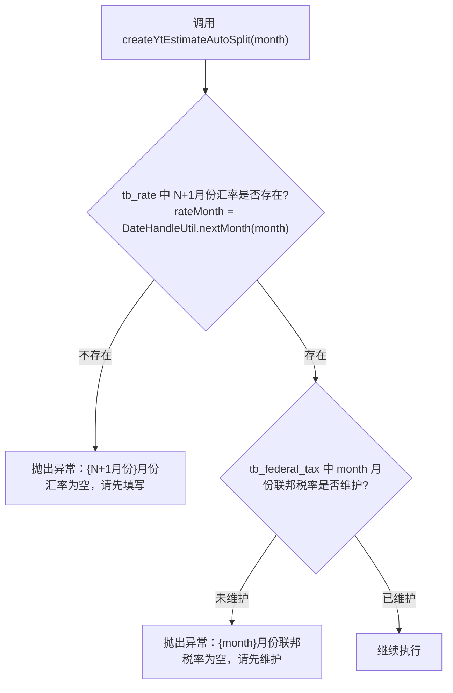
```mermaid
graph TB
    A["调用 createYtEstimateAutoSplit(month)"] --> B{"tb_rate 中 N+1月份汇率是否存在?\nrateMonth = DateHandleUtil.nextMonth(month)"}
    B -->|"不存在"| C["抛出异常：{N+1月份}月份汇率为空，请先填写"]
    B -->|"存在"| D{"tb_federal_tax 中 month 月份联邦税率是否维护?"}
    D -->|"未维护"| E["抛出异常：{month}月份联邦税率为空，请先维护"]
    D -->|"已维护"| F["继续执行"]
```

> **与冲销表差异**：暂估表校验的是 **N+1月** 汇率（因暂估数据早于到账，使用下月汇率预估）；冲销表校验当月汇率。

### 3.3 原始数据来源

```
数据表：yt_month_channel_revenue（data_type=2 的月初数据）
查询方法：YtMonthChannelRevenueMapper.selectByMonth(month, dataQueryDtoList)
查询结果：YtMonthCmsStart 对象列表
```

**核心字段说明**：

| 字段 | 说明 |
|------|------|
| `channel_id` | YouTube外部频道ID |
| `cms` | 收款系统（XW=小五 / AC=亚创 等） |
| `pipeline_id` | AMS发布通道ID，匹配国内频道的桥梁 |
| `cms_revenue` | CMS月初导出收益（$） |
| `cms_revenue_us` | 美国区月初收益（$） |
| `cms_revenue_sg` | 新加坡区月初收益（$） |
| `rpt_revenue` | 月初视频级收益（$），来自 `yt_finance_month_api` |
| `rpt_revenue_us` | 月初视频级美国区收益（$） |
| `rpt_revenue_sg` | 月初视频级新加坡区收益（$） |
| `time`（payout_period） | 收益所属月份（YYYY-MM） |
| `source_channel_revenue_ratio` | 通道占比（用于子集收益拆分计算） |

> **与冲销表差异**：暂估表没有 `receipted_at`（到账日期）字段，直接按 `month` 维度查询；冲销表需指定 `receiptedAt` 区间。

### 3.4 按频道类型分类处理（handleByChannelTypeEstimate）

#### 3.4.1 运营类型填充

每条 `YtMonthCmsStart` 记录先填充运营类型（`operation_type`）：

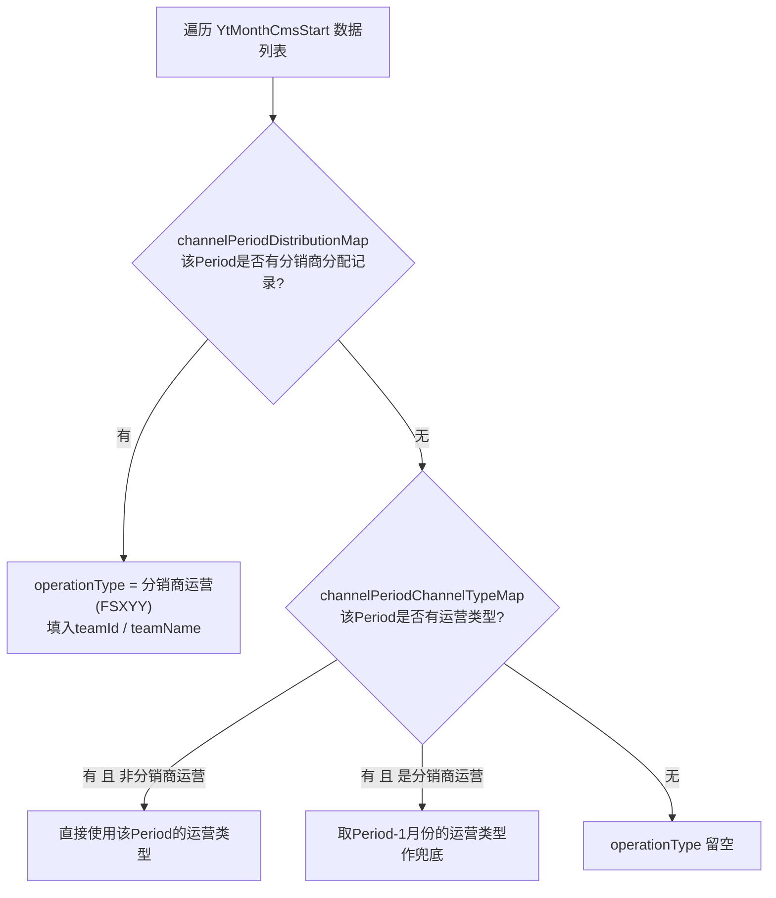
```mermaid
graph TB
    A["遍历 YtMonthCmsStart 数据列表"] --> B{"channelPeriodDistributionMap\n该Period是否有分销商分配记录?"}
    B -->|"有"| C["operationType = 分销商运营(FSXYY)\n填入teamId / teamName"]
    B -->|"无"| D{"channelPeriodChannelTypeMap\n该Period是否有运营类型?"}
    D -->|"有 且 非分销商运营"| E["直接使用该Period的运营类型"]
    D -->|"有 且 是分销商运营"| F["取Period-1月份的运营类型作兜底"]
    D -->|"无"| G["operationType 留空"]
```

#### 3.4.2 频道路径分类

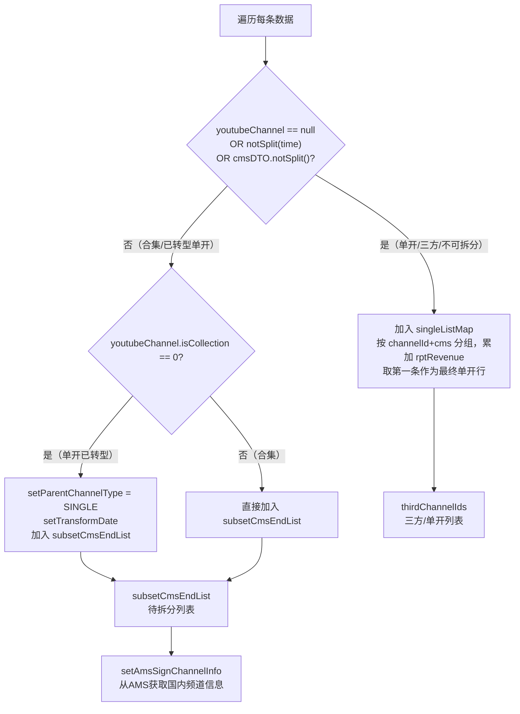
```mermaid
graph TB
    A["遍历每条数据"] --> B{"youtubeChannel == null\nOR notSplit(time)\nOR cmsDTO.notSplit()?"}
    B -->|"是（单开/三方/不可拆分）"| C["加入 singleListMap\n按 channelId+cms 分组，累加 rptRevenue\n取第一条作为最终单开行"]
    B -->|"否（合集/已转型单开）"| D{"youtubeChannel.isCollection == 0?"}
    D -->|"是（单开已转型）"| E["setParentChannelType = SINGLE\nsetTransformDate\n加入 subsetCmsEndList"]
    D -->|"否（合集）"| F["直接加入 subsetCmsEndList"]
    C --> G["thirdChannelIds\n三方/单开列表"]
    E --> H["subsetCmsEndList\n待拆分列表"]
    F --> H
    H --> I["setAmsSignChannelInfo\n从AMS获取国内频道信息"]
```


**单开频道累加逻辑**：同一 `channelId+cms` 下可能有多条月初数据（多个 pipeline），单开频道将所有条目的 `rptRevenue / rptRevenueUs / rptRevenueSg` 累加后，取第一条记录写入 `thirdChannelIds`（即财报收益为累加值，CMS收益直接取第一条）。

#### 3.4.2 补充：转型单开的判断逻辑（notSplit 方法）

> **适用范围**：仅对 `isCollection=0`（非合集）的单开频道生效；合集频道（`isCollection=1`）**没有转型概念**，天然进入子集拆分路径。

`YoutubeChannel.notSplit(String periodMonth)` 是路径分叉的核心方法，**返回 `true` 表示不做子集拆分（走单开路径），返回 `false` 表示需要子集拆分**：

```java
public boolean notSplit(String periodMonth) {
    if (this.getIsCollection() == 0   // 必须是非合集频道
        && (
            Objects.equals(ChannelTransformEnum.NOT_TRANSFORMED.getCode(), this.getIsTransform())  // 未转型
            || (
                Objects.equals(ChannelTransformEnum.TRANSFORMED.getCode(), this.getIsTransform())  // 已转型
                && Objects.equals(ChannelTransformEnum.NOT_TRANSFORMED.getCode(),
                    DateHandleUtil.checkIsTransform(this.getTransformDate(), periodMonth))  // checkIsTransform返回NOT_TRANSFORMED，即转型月<Period月
            )
        )
    ) {
        return true;  // 走单开路径，不拆分
    }
    return false;  // 走子集拆分路径
}
```

**`DateHandleUtil.checkIsTransform` 转型日期比较规则**（以 YearMonth 为粒度）：

```java
public static Integer checkIsTransform(LocalDate transformDate, String payoutPeriodMonth) {
    if (transformDate == null || StringUtils.isBlank(payoutPeriodMonth)) {
        return ChannelTransformEnum.NOT_TRANSFORMED.getCode();  // null → 视为未转型
    }
    YearMonth payoutMonth = YearMonth.parse(payoutPeriodMonth, formatter);  // "yyyy-MM"
    YearMonth transformMonth = YearMonth.from(transformDate);
    // 转型月 <  Period月 → checkIsTransform 返回 NOT_TRANSFORMED(0) → notSplit() 内层条件满足 → return true → 走单开路径，不拆
    // 转型月 >= Period月 → checkIsTransform 返回 TRANSFORMED(1)   → notSplit() 内层条件不满足 → return false → 走子集拆分路径
    return transformMonth.compareTo(payoutMonth) >= 0
        ? ChannelTransformEnum.TRANSFORMED.getCode()
        : ChannelTransformEnum.NOT_TRANSFORMED.getCode();
}
```

**三条路径对照表**：

| `isCollection` | 转型状态 | `notSplit()` 返回 | 最终路径 | 父行 `channel_type` |
|:-:|:-:|:-:|---|:-:|
| 1（合集） | 无转型概念 | false（固定） | 直接进子集拆分路径 | `COLLECTION`(2) |
| 0（单开）+ `isTransform=0`（未转型） | — | true | 走单开路径，不拆 | — |
| 0（单开）+ `isTransform=1`（已转型）+ 转型月 ≥ Period月 | `checkIsTransform`→`TRANSFORMED`，`notSplit()` 条件不满足 | false | **走子集拆分路径**，父行标记 `parentChannelType=SINGLE`，`transformDate` 写入DTO | `SINGLE`(0) |
| 0（单开）+ `isTransform=1`（已转型）+ 转型月 < Period月 | `checkIsTransform`→`NOT_TRANSFORMED`，`notSplit()` 条件满足 | true | **走单开路径，不拆** | — |

> **注意**：合集（`isCollection=1`）的 `transformDate` 字段在数据库中可能有值，但报表生成逻辑中从不读取，对业务无任何影响。

### 3.5 子集收益拆分计算（handleSubsetAndGenCollectionChannelEstimate）

> 按 `channelId + cms` 分组，每组生成一条**合集父行** + 若干**子集行**。

#### 3.5.1 合集父行生成

| 字段 | 值 | 说明 |
|------|-----|------|
| `channel_type` | `COLLECTION`（合集）或 `SINGLE`（单开转型父行） | 取决于 `parentChannelType` |
| `channel_split_status` | `1`（已拆） | 父行标识 |
| `pipeline_id` | `null` | 父行不关联通道 |
| `distributable_income` | `0` | 父行不累计收益 |

| `rpt_revenue` | 累加所有子集 rptRevenue 的合计 | 父行保留财报收益合计 |

> **与冲销表差异**：暂估父行**不设置** `settlement_created_status=2`（暂估无此字段）；冲销父行需设置 `settlement_created_status=NONEEDCREATE(2)`。

**特殊情形**：若一个合集下只有1条子集数据且该子集 `sourceChannelRevenueRatio` 为空（无法拆分），则父行 `channel_split_status` 改为 `0`（未拆）。

#### 3.5.2 子集行收益计算

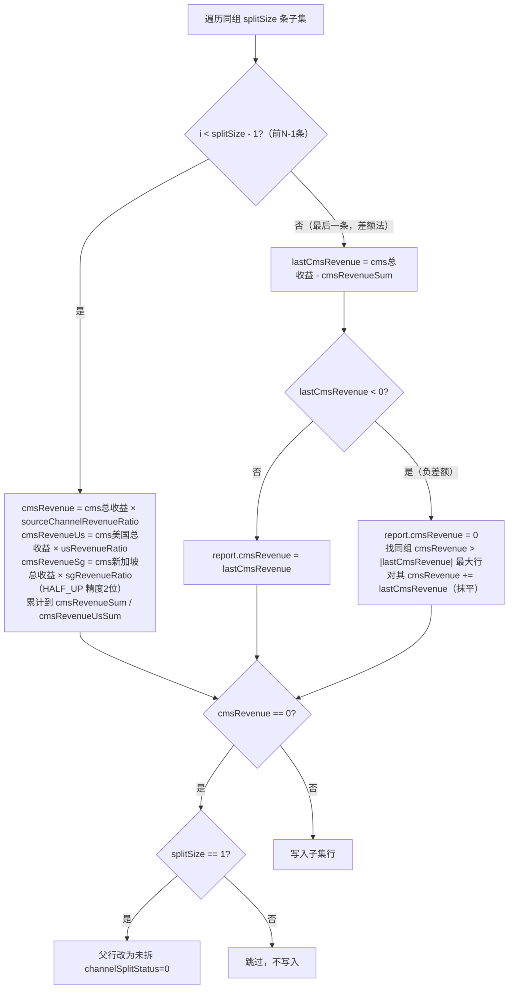
```mermaid
graph TB
    A["遍历同组 splitSize 条子集"] --> B{"i < splitSize - 1?（前N-1条）"}
    B -->|"是"| C["cmsRevenue = cms总收益 × sourceChannelRevenueRatio\ncmsRevenueUs = cms美国总收益 × usRevenueRatio\ncmsRevenueSg = cms新加坡总收益 × sgRevenueRatio\n（HALF_UP 精度2位）\n累计到 cmsRevenueSum / cmsRevenueUsSum"]
    B -->|"否（最后一条，差额法）"| D["lastCmsRevenue = cms总收益 - cmsRevenueSum"]
    D --> E{"lastCmsRevenue < 0?"}
    E -->|"是（负差额）"| F["report.cmsRevenue = 0\n找同组 cmsRevenue > |lastCmsRevenue| 最大行\n对其 cmsRevenue += lastCmsRevenue（抹平）"]
    E -->|"否"| G["report.cmsRevenue = lastCmsRevenue"]
    C --> H{"cmsRevenue == 0?"}
    G --> H
    F --> H
    H -->|"是"| I{"splitSize == 1?"}
    I -->|"是"| J["父行改为未拆 channelSplitStatus=0"]
    I -->|"否"| K["跳过，不写入"]
    H -->|"否"| L["写入子集行"]
```

**子集行关键字段**：
- `channel_type = SUBSET`
- `parent_id = 父行id`
- `parent_channel_id = 父行channel_id`
- `distributable_income = cmsRevenue`（初始值，合约匹配后重新计算）
- `rpt_revenue`：子集行直接来自 source，父行累加所有子集

> **与冲销表差异**：暂估子集不处理调差（无 `cmsRevenueAdjust`）；暂估子集不清零财报收益（rptRevenue直接使用）

### 3.6 合约信息匹配（handleInfoFromCrmEstimate）

> 与冲销表的 `handleInfoFromCrm` 逻辑**完全一致**，差异仅在参数类型。

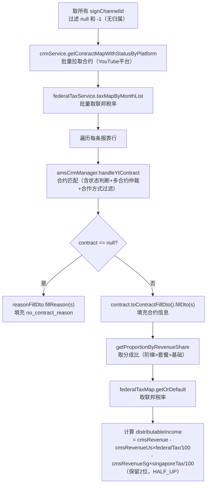
```mermaid
graph TB
    A["取所有 signChannelId\n过滤 null 和 -1（无归属）"] --> B["crmService.getContractMapWithStatusByPlatform\n批量拉取合约（YouTube平台）"]
    B --> C["federalTaxService.taxMapByMonthList\n批量取联邦税率"]
    C --> D["遍历每条报表行"]
    D --> E["amsCrmManager.handleYtContract\n合约匹配（含状态判断+多合约仲裁+合作方式过滤）"]
    E --> F{"contract == null?"}
    F -->|"是"| G["reasonFillDto.fillReason(s)\n填充 no_contract_reason"]
    F -->|"否"| H["contract.toContractFillDto().fillDto(s)\n填充合约信息"]
    H --> I["getProportionByRevenueShare\n取分成比（阶梯>套餐>基础）"]
    I --> J["federalTaxMap.getOrDefault\n取联邦税率"]
    J --> K["计算 distributableIncome\n= cmsRevenue - cmsRevenueUs×federalTax/100\n- cmsRevenueSg×singaporeTax/100\n（保留2位，HALF_UP）"]
```

**合约匹配规则**（与冲销表相同）：
- 合约状态 8（生效中）：有效，加入 matchContractList
- 合约状态 11/9（已解约/已过期）：加入 terminatedContractList
- **多合约仲裁（15日规则）**：解约日期在 Period 15日及之前 → 取生效中合约；15日之后 → 取已解约合约
- **合作方式过滤**：纯分成/版权采买 → 通过；其他 → `noContractReason=NOT_SUPPORTED`

**distributableIncome 计算公式**：

```java
distributableIncome = cmsRevenue
    - cmsRevenueUs × federalTax / 100    // 扣联邦税（精度2位）
    - cmsRevenueSg × singaporeTax / 100  // 扣新加坡税（精度2位）
```

> **与冲销表细微差异**：冲销表的 distributableIncome 计算包含调差字段；暂估表无调差，直接用 `cmsRevenue`。

### 3.7 不结算名单匹配（handleSettlementNoEm）

时机：在 `handleInfoFromCrmEstimate` 之后、数据存储之前，遍历 `tb_settlement_no` 全量不结算名单。

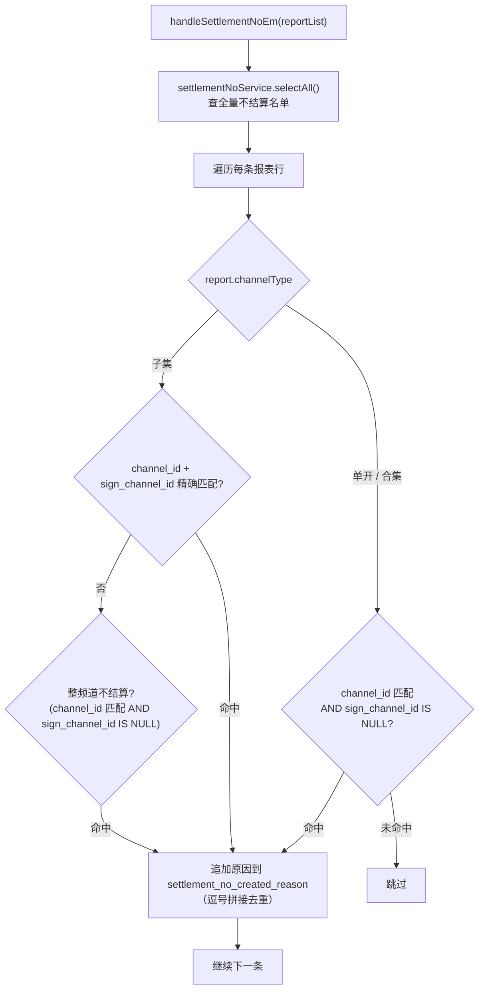
```mermaid
graph TB
    A["handleSettlementNoEm(reportList)"] --> B["settlementNoService.selectAll()\n查全量不结算名单"]
    B --> C["遍历每条报表行"]
    C --> D{"report.channelType"}
    D -->|"单开 / 合集"| E{"channel_id 匹配\nAND sign_channel_id IS NULL?"}
    D -->|"子集"| F{"channel_id + sign_channel_id 精确匹配?"}
    F -->|"否"| G{"整频道不结算?\n(channel_id 匹配 AND sign_channel_id IS NULL)"}
    E -->|"命中"| H["追加原因到 settlement_no_created_reason\n（逗号拼接去重）"]
    F -->|"命中"| H
    G -->|"命中"| H
    E -->|"未命中"| I["跳过"]
    H --> J["继续下一条"]
```

> **与冲销表差异**：冲销表命中后同时设置 `settlement_created_status = 2`；暂估表**不设置**此字段（无此字段），仅写入 `settlement_no_created_reason`。

### 3.8 数据存储（saveByMonthReportList）

加 `@Transactional(rollbackFor = Exception.class)` 事务：

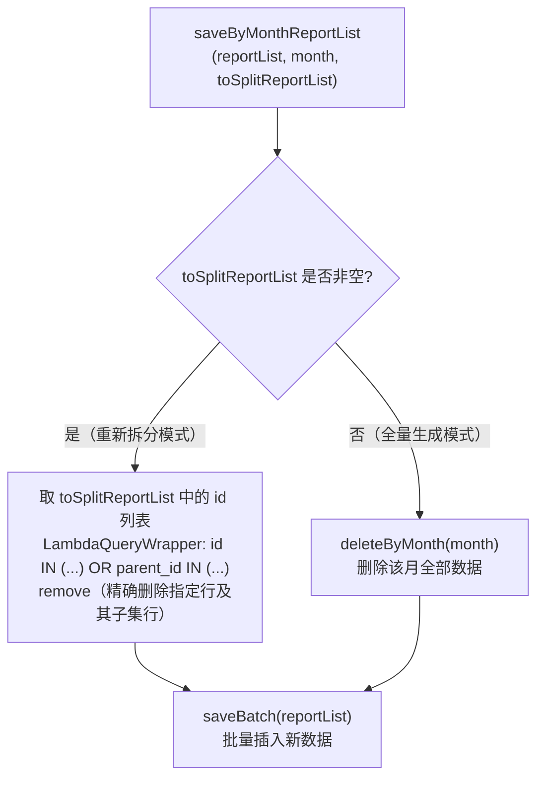
```mermaid
graph TB
    A["saveByMonthReportList\n(reportList, month, toSplitReportList)"] --> B{"toSplitReportList 是否非空?"}
    B -->|"是（重新拆分模式）"| C["取 toSplitReportList 中的 id 列表\nLambdaQueryWrapper: id IN (...) OR parent_id IN (...)\nremove（精确删除指定行及其子集行）"]
    B -->|"否（全量生成模式）"| D["deleteByMonth(month)\n删除该月全部数据"]
    C --> E["saveBatch(reportList)\n批量插入新数据"]
    D --> E
```

| 模式 | 删除范围 | 适用场景 |
|------|---------|----------|
| 全量生成 | 删除 `month` 下所有行 | 首次生成或整月重新生成 |
| 重新拆分 | 仅删除 `toSplitReportList` 中指定 id 的行及其 `parent_id` 关联的子集行 | 按频道/合约单独重新拆分 |

> **与冲销表差异**：冲销表按 `receiptedAt` 区间删除（含 CID 行）；暂估表按 `month` 删除，无 CID 行，无到账区间概念。

### 3.9 拆分子集（页面操作）

> 接口：`POST /calculateReport/split/subset/estimate/{id}`
> 入口：暂估报表列表 → `channel_type=合集` 的行 → 操作列「拆分子集」按钮
> 核心方法：`YtEstimateReportServiceImpl.splitSubsetRevenue` → `batchSplitSubsetRevenue`
> 事务：`@Transactional(rollbackFor = Exception.class)`

#### 3.9.1 前置校验

| 校验项 | 规则 | 异常提示 |
|-------|------|----------|
| 父行存在性 | 按 `id` 查询 `yt_estimate_report`，不存在则拒绝 | 被拆分合集数据不存在 |
| 子集唯一性 | 同一 `month + channelId + cms` 下，`sign_channel_id IN (subsetIdList)` 且（有 `servicePageName` 时一并校验）不得已存在 | 子集已存在，请勿重复添加 |
| 汇率存在性 | 取 **N+1月** 汇率，不存在则抛出 | 当月汇率为空 |

> **与冲销表差异**：暂估无 Redis 并发锁；汇率取**N+1月**（冲销取 `receiptedAt` 所在月份）。

#### 3.9.2 请求参数结构（SplitSubsetQuery）

| 字段 | 类型 | 说明 |
|------|------|------|
| `subsetData[].subsetId` | String（必填） | 国内频道 ID（`sign_channel_id`） |
| `subsetData[].subsetName` | String（必填） | 子集名称 |
| `subsetData[].revenue` | BigDecimal（必填） | CMS 月初收益（$） |
| `subsetData[].usRevenue` | BigDecimal（必填） | 美国收益（$） |
| `subsetData[].sgRevenue` | BigDecimal（必填） | 新加坡收益（$） |
| `subsetData[].servicePageName` | String（可选） | 套餐名称 |
| `subsetData[].pipelineId` | String（可选） | 发布通道 ID |
| `subsetData[].contractNum` | String（可选） | 指定合约编号 |

#### 3.9.3 子集行构建与写库

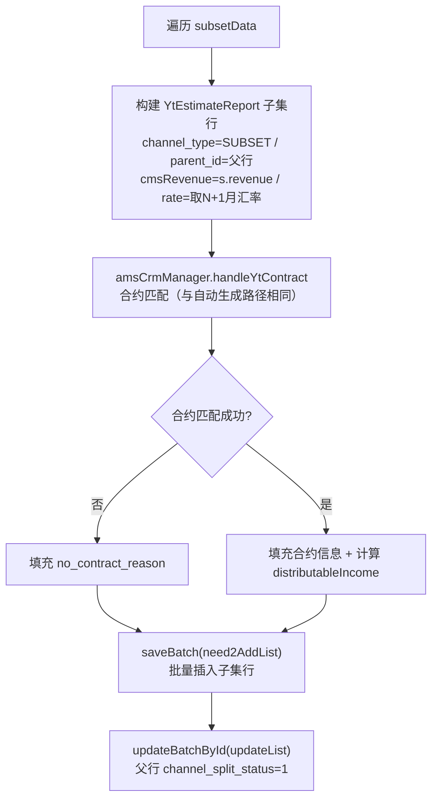
```mermaid
graph TB
    A["遍历 subsetData"] --> B["构建 YtEstimateReport 子集行\nchannel_type=SUBSET / parent_id=父行\ncmsRevenue=s.revenue / rate=取N+1月汇率"]
    B --> C["amsCrmManager.handleYtContract\n合约匹配（与自动生成路径相同）"]
    C --> D{"合约匹配成功?"}
    D -->|"否"| E["填充 no_contract_reason"]
    D -->|"是"| F["填充合约信息 + 计算 distributableIncome"]
    E --> G["saveBatch(need2AddList)\n批量插入子集行"]
    F --> G
    G --> H["updateBatchById(updateList)\n父行 channel_split_status=1"]
```

> **与冲销表差异**：冲销表父行还需设置 `settlement_created_status = 2`；暂估表父行**只更新** `channel_split_status`。

#### 3.9.4 删除子集（deleteSubsetById）

| 步骤 | 逻辑 |
|------|------|
| 1. 校验行存在 | 按 `id` 查询，不存在报错 |
| 2. 校验行类型 | `channel_type` 必须为 `SUBSET`，否则报错 |
| 3. 删除子集行 | `baseMapper.deleteById(id)` |
| 4. 回退父行状态 | 若同 `parent_channel_id + month` 下已无子集行，将父行 `channel_split_status` 回退为 `0`（未拆） |

> **与冲销表差异**：冲销表删除前有额外校验 `settlement_created_status = 1` 时禁止删除；**暂估表无此校验**，直接删除。

### 3.10 批量拆分子集（Excel 导入）

> 接口：`POST /calculateReport/split/subset/import`，参数 `type=estimate`
> 入口：暂估报表列表 → 顶部「批量拆分子集」→ 下载模板 → 填写 → 上传
> 核心方法：`YtReportImportService.splitSubsetByImport` → `batchHandleData` → `ytEstimateReportService.batchSplitSubsetRevenue`

#### 3.10.1 Excel 模板字段（YtReportImportVo）

| 列序号 | 列名 | 是否必填 | 说明 |
|-------|------|---------|------|
| 0 | `*频道ID` | 必填 | YouTube 外部频道 ID |
| 1 | `*收款系统` | 必填 | 名称形式：小五 / 亚创 / Adsense-HK / Adsense-US |
| 2 | `*子集名称` | 必填 | 精确匹配 AMS 中的 `signChannelName` 或别名 |
| 3 | `*CP名称` | 必填 | AMS 合约中的 CP 名称 |
| 4 | `*套餐名称` | 必填 | AMS 合约中的套餐名称（servicePageName） |
| 5 | `*频道收益` | 必填 | CMS 月初收益（$） |
| 6 | `美国收益` | 可选 | 默认 0 |
| 7 | `新加坡收益` | 可选 | 默认 0 |

#### 3.10.2 导入处理全流程（batchHandleData）

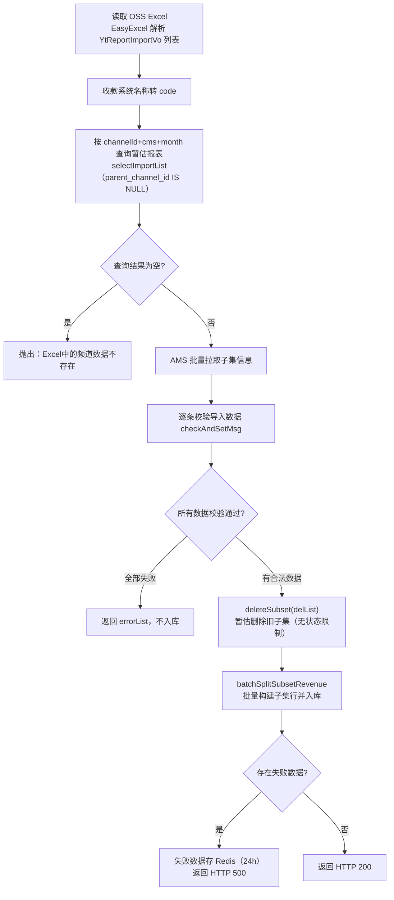
```mermaid
graph TB
    A["读取 OSS Excel\nEasyExcel 解析 YtReportImportVo 列表"] --> B["收款系统名称转 code"]
    B --> C["按 channelId+cms+month 查询暂估报表\nselectImportList（parent_channel_id IS NULL）"]
    C --> D{"查询结果为空?"}
    D -->|"是"| E["抛出：Excel中的频道数据不存在"]
    D -->|"否"| F["AMS 批量拉取子集信息"]
    F --> G["逐条校验导入数据 checkAndSetMsg"]
    G --> H{"所有数据校验通过?"}
    H -->|"全部失败"| I["返回 errorList，不入库"]
    H -->|"有合法数据"| J["deleteSubset(delList)\n暂估删除旧子集（无状态限制）"]
    J --> K["batchSplitSubsetRevenue\n批量构建子集行并入库"]
    K --> L{"存在失败数据?"}
    L -->|"是"| M["失败数据存 Redis（24h）\n返回 HTTP 500"]
    L -->|"否"| N["返回 HTTP 200"]
```

> **与冲销表差异**：冲销导入前清理用 `deleteSubsetByNeSettle`（过滤 `settlement_created_status≠1`）；暂估用 `deleteSubset`（无状态过滤，直接删除）。

### 3.11 批量删除子集

> 接口：`POST /calculateReport/deleteSubsetBatchCheck`（预检） + `POST /calculateReport/deleteSubsetBatch`（执行）
> 报表类型参数：`reportType = YT-estimate`

| 字段 | 说明 |
|------|------|
| `totalCount` | 勾选总数（`ids.size()`） |
| `delCount` | 实际可删数（`channel_type=SUBSET`，**暂估无结算状态过滤**） |

> **与冲销表差异**：冲销表过滤 `settlement_created_status ≠ 1`；暂估表**只过滤** `channel_type=SUBSET`，不过滤结算状态。

### 3.12 按合约重新生成（reversalRegenerateByContractNum）

> 接口：`POST /calculateReport/estimate/regenerateByContractNum`
> 说明：暂估表特有操作，按指定合约编号（`contractNum`）和套餐名称（`servicePageName`）对选中行重新匹配合约并更新数据。

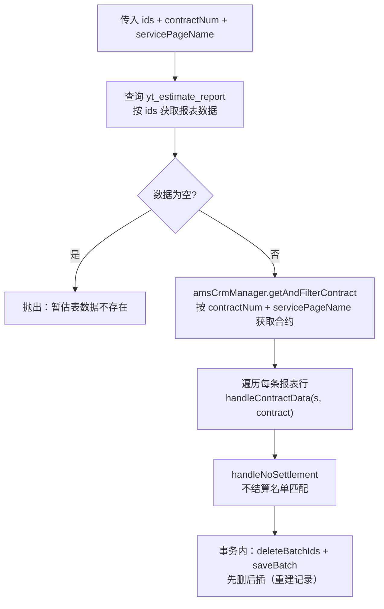
```mermaid
graph TB
    A["传入 ids + contractNum + servicePageName"] --> B["查询 yt_estimate_report\n按 ids 获取报表数据"]
    B --> C{"数据为空?"}
    C -->|"是"| D["抛出：暂估表数据不存在"]
    C -->|"否"| E["amsCrmManager.getAndFilterContract\n按 contractNum + servicePageName 获取合约"]
    E --> F["遍历每条报表行\nhandleContractData(s, contract)"]
    F --> G["handleNoSettlement\n不结算名单匹配"]
    G --> H["事务内：deleteBatchIds + saveBatch\n先删后插（重建记录）"]
```

> 冲销表无此接口；该功能是暂估表专有的**按合约批量更新**能力。

### 3.13 暂估报表关键字段汇总

| 字段 | 写入时机 | 说明 |
|------|---------|------|
| `channel_type` | 生成时 | 0=单开 / 1=子集 / 2=合集 |
| `channel_split_status` | 生成时/拆分操作后 | 0=未拆 / 1=已拆（合集父行） |
| `cms_revenue` | 生成时 | CMS月初导出收益（$） |
| `cms_revenue_us` | 生成时 | 美国区月初收益（$） |
| `cms_revenue_sg` | 生成时 | 新加坡区月初收益（$） |
| `rpt_revenue` | 生成时 | 月初视频级收益（$，父行为合计） |
| `rpt_revenue_us` | 生成时 | 月初视频级美国区收益（$） |
| `rpt_revenue_sg` | 生成时 | 月初视频级新加坡区收益（$） |
| `distributable_income` | 合约匹配后 | 可分配收益 = cms_revenue - 联邦税额 - 新加坡税额 |
| `proportion` | 合约匹配后 | CP分成比例（%） |
| `federal_tax` | 合约匹配后 | 联邦税率（%） |
| `singapore_tax` | 合约匹配后 | 新加坡税率（%） |
| `service_charge` | 合约匹配后 | 手续费率（%） |
| `rate` | 生成时 | 汇率（取 N+1 月份） |
| `no_contract_reason` | 合约匹配失败时 | 无合约原因 |
| `settlement_no_created_reason` | 不结算名单命中时 | 无需生成原因（多条逗号拼接） |
| `sign_channel_id` | 生成时 | 国内频道 ID（-1 = 无归属） |
| `contract_id` | 合约匹配后 | 关联合约 ID |
| `pipeline_id` | 生成时 | 发布通道 ID（父行为 null） |

---

## 4. YT冲销报表生成逻辑

> 核心服务：`YtCalculateAutoVideoService.createYtReversalAutoSplit(month)`
> 对应表：`yt_reversal_report`

### 4.1 触发方式

| 方式 | 说明 |
|------|------|
| 系统任务调度 | 任务名 `YT-reversal-new`，由 `ReportCreateRecordServiceImpl` 调度触发 |
| 重新拆分（批量） | `reSplitReversalBatch`，对指定到账月份重新生成月度收益数据并重新拆分 |

### 4.2 前置校验


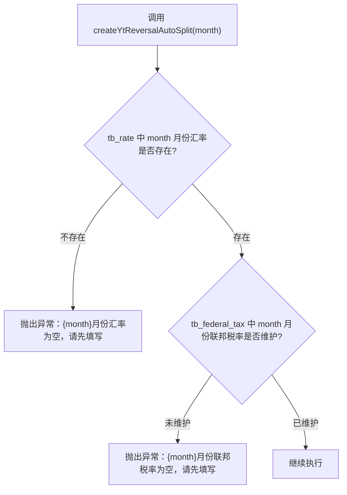
```mermaid
graph TB
    A["调用 createYtReversalAutoSplit(month)"] --> B{"tb_rate 中 month 月份汇率是否存在?"}
    B -->|"不存在"| C["抛出异常：{month}月份汇率为空，请先填写"]
    B -->|"存在"| D{"tb_federal_tax 中 month 月份联邦税率是否维护?"}
    D -->|"未维护"| E["抛出异常：{month}月份联邦税率为空，请先填写"]
    D -->|"已维护"| F["继续执行"]
```


### 4.3 原始数据来源

```
数据表：yt_month_channel_revenue
查询方式：YtMonthChannelRevenueMapper.selectByReceiptedAt(receiptedAtStart, receiptedAtEnd, dataQueryDtoList)
查询结果：YtMonthCmsEnd 对象列表（包含 channel_id / cms / pipeline_id / cms_revenue / receipted_at 等）
```

**核心字段说明**：

| 字段 | 说明 |
|------|------|
| `channel_id` | YouTube国外频道ID |
| `cms` | 收款系统（XW=小五 / AC=亚创），决定数据归属 |
| `pipeline_id` | AMS发布通道ID，是匹配国内频道的桥梁 |
| `cms_revenue` | CMS导出收益（25号），单位$ |
| `receipted_at` | 到账日期（YYYY-MM-DD） |
| `time`（payout_period） | 收益所属月份（YYYY-MM） |

### 4.4 按频道类型分类处理（handleByChannelType）

#### 4.4.1 运营类型填充

每条 `YtMonthCmsEnd` 记录在进入频道分类前，先填充运营类型（`operation_type`）：


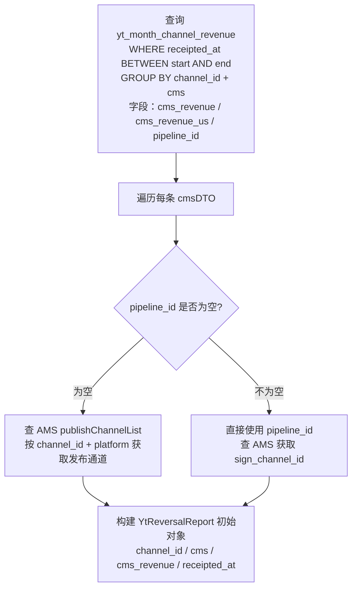
```mermaid
graph TB
    A["查询 yt_month_channel_revenue\nWHERE receipted_at BETWEEN start AND end\nGROUP BY channel_id + cms\n字段：cms_revenue / cms_revenue_us / pipeline_id"] --> B["遍历每条 cmsDTO"]
    B --> C{"pipeline_id 是否为空?"}
    C -->|"为空"| D["查 AMS publishChannelList\n按 channel_id + platform 获取发布通道"]
    C -->|"不为空"| E["直接使用 pipeline_id\n查 AMS 获取 sign_channel_id"]
    D --> F["构建 YtReversalReport 初始对象\nchannel_id / cms / cms_revenue / receipted_at"]
    E --> F
```


#### 4.4.2 频道路径分类


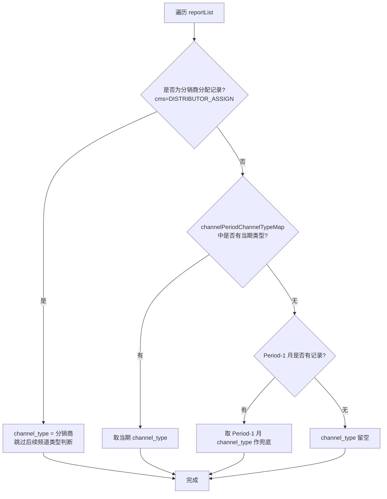
```mermaid
graph TB
    A["遍历 reportList"] --> B{"是否为分销商分配记录?\ncms=DISTRIBUTOR_ASSIGN"}
    B -->|"是"| C["channel_type = 分销商\n跳过后续频道类型判断"]
    B -->|"否"| D{"channelPeriodChannelTypeMap\n中是否有当期类型?"}
    D -->|"有"| E["取当期 channel_type"]
    D -->|"无"| F{"Period-1 月是否有记录?"}
    F -->|"有"| G["取 Period-1 月 channel_type 作兜底"]
    F -->|"无"| H["channel_type 留空"]
    C --> Z["完成"]
    E --> Z
    G --> Z
    H --> Z
```


> **notSplit() 方法规则**：`isCollection=0`（单开）且满足以下任一条件时返回 `true`（走单开路径）：① `isTransform=0`（未转型）；② `isTransform=1`（已转型）且转型月 **<** Period月（`checkIsTransform` 返回 `NOT_TRANSFORMED`）。
> 已转型且转型月 **≥** Period月时，`checkIsTransform` 返回 `TRANSFORMED`，内层条件不满足，`notSplit()` 返回 `false` → **走子集拆分路径**。

#### 4.4.2 补充：转型单开的判断逻辑（notSplit 方法）

> 冲销报表与暂估报表共用同一套转型判断逻辑，核心方法均为 `YoutubeChannel.notSplit(String periodMonth)`。详细规则见 §3.4.2 补充说明。

**三条路径快速对照**（冲销报表适用）：

| `isCollection` | `isTransform` / `checkIsTransform` 结果 | `notSplit()` 返回 | 最终路径 |
|:-:|:-:|:-:|---|
| 1（合集） | 无转型概念 | false（固定） | 直接进子集拆分路径，父行 `channel_type=COLLECTION` |
| 0（单开）+ `isTransform=0`（未转型） | — | true | 走单开/三方路径，不拆分 |
| 0（单开）+ `isTransform=1`（已转型）+ 转型月 **≥** Period月 | `checkIsTransform`→`TRANSFORMED`，条件不满足 | false | **子集拆分路径**，父行 `channel_type=SINGLE`，`transformDate` 写入DTO |
| 0（单开）+ `isTransform=1`（已转型）+ 转型月 **<** Period月 | `checkIsTransform`→`NOT_TRANSFORMED`，条件满足 | true | **走单开路径，不拆分** |

> **合集无转型概念**：`isCollection=1` 的频道在 `notSplit()` 第一个条件（`isCollection==0`）即被排除，`transformDate` 字段对合集无任何业务影响。

#### 4.4.3 单开/三方频道 AMS 通道匹配（handleThirdAndSingleChannels）

进入 `thirdChannelIds` 后，调用 AMS 逐条获取发布通道：


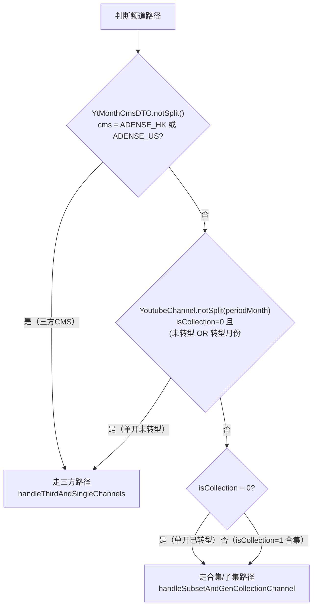
```mermaid
graph TB
    A["判断频道路径"] --> B{"YtMonthCmsDTO.notSplit()\ncms = ADENSE_HK 或 ADENSE_US?"}
    B -->|"是（三方CMS）"| C["走三方路径\nhandleThirdAndSingleChannels"]
    B -->|"否"| D{"YoutubeChannel.notSplit(periodMonth)\nisCollection=0 且\n(未转型 OR 转型月份<Period)?"}
    D -->|"是（单开未转型）"| C
    D -->|"否"| E{"isCollection = 0?"}
    E -->|"是（单开已转型）"| F["走合集/子集路径\nhandleSubsetAndGenCollectionChannel"]
    E -->|"否（isCollection=1 合集）"| F
```


> **注**：单开频道 publishChannelList.size()==1 时无论是否在回收站均直接取用；只有数量≥2时才按 `status='绑定'` 过滤。

### 4.5 子集收益拆分计算（handleSubsetAndGenCollectionChannel）

#### 4.5.1 合集父行生成

`subsetCmsEndList` 按 `channel_id + cms` 分组，每组首先生成一条**合集（已拆）父行**：

| 字段 | 值 | 说明 |
|------|-----|------|
| `channel_type` | `COLLECTION`（合集）或 `SINGLE`（单开转型父行） | 取决于 `parentChannelType` |
| `channel_split_status` | `1`（已拆） | 父行标识 |
| `settlement_created_status` | `2`（无需生成） | 父行不参与结算 |
| `distributable_income` | `0` | 父行不累计收益，收益在子集行 |
| `pipeline_id` | `null` | 父行不关联通道 |
| `report_revenue` | 来自 `yt_finance_month_report` 的财报收益 | 仅父行保留财报数据 |

#### 4.5.2 子集行拆分逻辑


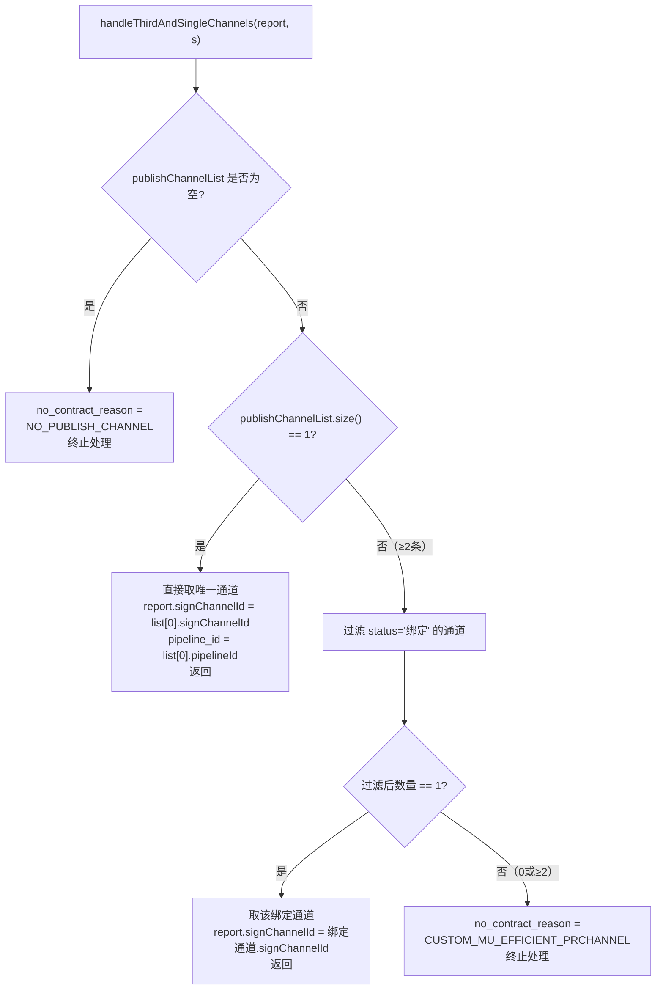
```mermaid
graph TB
    A["handleThirdAndSingleChannels(report, s)"] --> B{"publishChannelList 是否为空?"}
    B -->|"是"| C["no_contract_reason =\nNO_PUBLISH_CHANNEL\n终止处理"]
    B -->|"否"| D{"publishChannelList.size() == 1?"}
    D -->|"是"| E["直接取唯一通道\nreport.signChannelId = list[0].signChannelId\npipeline_id = list[0].pipelineId\n返回"]
    D -->|"否（≥2条）"| F["过滤 status='绑定' 的通道"]
    F --> G{"过滤后数量 == 1?"}
    G -->|"是"| H["取该绑定通道\nreport.signChannelId = 绑定通道.signChannelId\n返回"]
    G -->|"否（0或≥2）"| I["no_contract_reason =\nCUSTOM_MU_EFFICIENT_PRCHANNEL\n终止处理"]
```


> **子集调差处理**：子集行的 `cms_revenue_adjust` 强制清零（调差金额已并入 `cms_revenue` 参与拆分计算，避免双重计算）。  
> **子集财报收益**：`report_revenue / report_revenue_us / report_revenue_sg` 一律置 0（v1.5.6+），财报收益仅保留在父行。

### 4.6 合约信息匹配（handleInfoFromCrm）

入口：`AmsCrmManager.handleYtContract` → `handleContract` → `contractSplitMode`

#### 4.6.1 前置过滤（进入合约状态判断前）


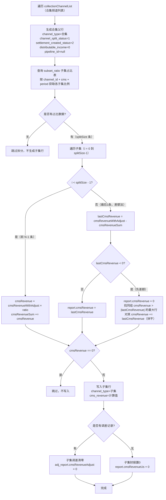
```mermaid
graph TB
    A["遍历 collectionChannelList（合集频道列表）"] --> B["生成合集父行\nchannel_type=合集\nchannel_split_status=1\nsettlement_created_status=2\ndistributable_income=0\npipeline_id=null"]
    B --> C["查询 subset_ratio 子集占比表\n按 channel_id + cms + period 获取各子集比例"]
    C --> D{"是否有占比数据?"}
    D -->|"无"| E["跳过拆分，不生成子集行"]
    D -->|"有（splitSize 条）"| F["遍历子集（i = 0 到 splitSize-1）"]
    F --> G{"i < splitSize - 1?"}
    G -->|"是（前 N-1 条）"| H["cmsRevenue = cmsRevenueWithAdjust × ratio\ncmsRevenueSum += cmsRevenue"]
    G -->|"否（最后1条，差额法）"| I["lastCmsRevenue = cmsRevenueWithAdjust - cmsRevenueSum"]
    I --> J{"lastCmsRevenue < 0?"}
    J -->|"是（负差额）"| K["report.cmsRevenue = 0\n找同组 cmsRevenue > |lastCmsRevenue| 的最大行\n对其 cmsRevenue += lastCmsRevenue（抹平）"]
    J -->|"否"| L["report.cmsRevenue = lastCmsRevenue"]
    H --> M{"cmsRevenue == 0?"}
    L --> M
    K --> M
    M -->|"是"| N["跳过，不写入"]
    M -->|"否"| O["写入子集行\nchannel_type=子集\ncms_revenue=计算值"]
    O --> P{"是否有调差记录?"}
    P -->|"有"| Q["子集调差清零\nadj_report.cmsRevenueAdjust = 0"]
    P -->|"无"| R["子集财报置0\nreport.cmsRevenueUs = 0"]
    Q --> S["完成"]
    R --> S
```


#### 4.6.2 合约状态逐条判断

对每份候选合约（`contractDTOList`），按合约状态分支处理：


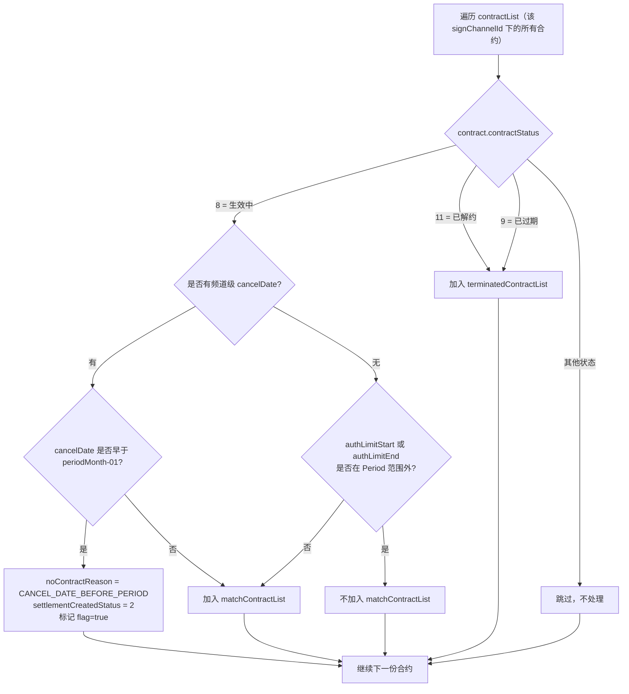
```mermaid
graph TB
    A["遍历 contractList（该 signChannelId 下的所有合约）"] --> B{"contract.contractStatus"}
    B -->|"8 = 生效中"| C{"是否有频道级 cancelDate?"}
    C -->|"有"| D{"cancelDate 是否早于 periodMonth-01?"}
    D -->|"是"| E["noContractReason = CANCEL_DATE_BEFORE_PERIOD\nsettlementCreatedStatus = 2\n标记 flag=true"]
    D -->|"否"| F["加入 matchContractList"]
    C -->|"无"| G{"authLimitStart 或 authLimitEnd\n是否在 Period 范围外?"}
    G -->|"是"| H["不加入 matchContractList"]
    G -->|"否"| F
    B -->|"11 = 已解约"| I["加入 terminatedContractList"]
    B -->|"9 = 已过期"| I
    B -->|"其他状态"| J["跳过，不处理"]
    E --> K["继续下一份合约"]
    F --> K
    H --> K
    I --> K
    J --> K
```


> **注**：合约状态 12（到期已续约）在代码中未单独处理，不会加入 matchContractList，效果等同于「其他状态」分支。

#### 4.6.3 多合约仲裁

候选合约经状态过滤后，进入 matchContractList 汇总阶段：


```mermaid
graph TB
    A["matchContractList（生效中合约数）"] --> B{"数量?"}
    B -->|"0 份"| C{"terminatedContractList（解约/过期合约数）?"}
    C -->|"0 份"| D["noContractReason = NO_CONTRACT\n无合约，终止"]
    C -->|"1 份"| E["直接取该解约/过期合约\n继续后续处理"]
    C -->|"≥2 份"| F["noContractReason = MULTI_CONTRACT\n多合约冲突，终止"]
    B -->|"1 份"| G{"terminatedContractList 是否非空?"}
    G -->|"是"| H{"terminatedContract.cancelDate\n是否 ≤ periodMonth-15?"}
    H -->|"是（15日及之前解约）"| I["取生效中合约（effectContractList[0]）"]
    H -->|"否（15日之后解约）"| J["取已解约合约（terminatedContract）"]
    G -->|"否"| K["直接取生效中合约"]
    B -->|"≥2 份"| L["noContractReason = MULTI_CONTRACT\n多合约冲突，终止"]
    D --> Z["结束"]
    E --> Z
    F --> Z
    I --> Z
    J --> Z
    K --> Z
    L --> Z
```


> **15日规则**：同月若有合约交替（旧合约解约/到期 + 新合约生效），以 Period 月 15 日为分界线：15日及之前发生的，取新生效合约；15日之后发生的，取旧合约。

#### 4.6.4 合作方式过滤（contractSplitMode）

合约匹配成功后，还需通过合作方式二次过滤（`contractSplitMode`）：

| 合作方式 | 分成模式 | 处理结果 |
|---------|---------|---------|
| `分成模式` + `纯分成模式` | — | 通过，返回合约，继续填充 |
| `版权采买模式` | — | 通过，返回合约（后续在结算单生成时判断不结算） |
| 其他（如联合运营等） | — | `no_contract_reason='分成模式尚不支持结算'`，`settlement_created_status=2`，返回 null |

#### 4.6.5 合约匹配成功后的字段填充


```mermaid
graph TB
    A["获得单份合约 contract"] --> B{"contract.cooperationWay"}
    B -->|"SPLIT_MODE（分成模式）"| C{"contract.sharePattern"}
    C -->|"PURE_DIVISION（纯分成）"| D["通过，继续字段填充"]
    C -->|"其他（如保底分成）"| E["noContractReason = NOT_SUPPORTED\nsettlementCreatedStatus = 2\n终止"]
    B -->|"COPYRIGHT_ACQUISITION（版权采买）"| D
    B -->|"其他合作方式"| E
```


**分成比优先级（由高到低，`getProportionByRevenueShare`）**：

| 优先级 | 来源 | 条件 |
|-------|------|------|
| 1（最高） | 阶梯分成 `revenueShareList` | `authPlatform = "YouTube"`，存在时覆盖套餐/基础分成比 |
| 2 | 套餐级分成 `contractServicePackageList` | 按 `servicePackageName == servicePageName` 匹配 |
| 3（最低） | 合约基础分成 `contract.proportion` | 无套餐时的历史数据兜底 |

#### 4.6.6 无合约原因枚举汇总

| 原因常量 | 写入 `no_contract_reason` 内容 | 触发场景 |
|---------|-------------------------------|---------|
| `NO_AFFILIATION` | 视频ID未匹配到发布通道ID（无归属收益） | sign_channel_id = -1 |
| `NO_CONTRACT_AMS_NUM` | 未找到绑定的合约或频道未生效，合约编号：{contractNum} | CRM 未返回该签约频道的合约 |
| `SIGN_CHANNEL_TERMINATED` | 频道在合约内已解约，合约编号：{contractNum}，解约日期：{date} | 生效中合约的频道级 cancelDate < Period |
| `CONTRACT_NO_AUTH_LIMIT_START` | 【subsetName】在对应Period授权未生效（{contractNum}），开始日期：{date} | authLimitStart 月份 > Period |
| `CONTRACT_NO_AUTH_LIMIT_END` | 【subsetName】在对应Period授权已到期（{contractNum}），授权截止日期：{date} | authLimitEnd 月份 < Period |
| `CONTRACT_TERMINATION` | 合约已解约（{contractNum}），解约日期：{date} | 已解约合约且 cancelDate < Period |
| `CONTRACT_OVERDUE` | 合约已到期（{contractNum}），到期日期：{date} | 已过期合约且 endAt < Period |
| `NO_CP_CONTRACTS` | 国内频道【subsetName】未找到符合状态的合约 | matchContractList 为空，或其他状态合约 |
| `MULTIPLE_CP_CONTRACTS` | 国内频道【subsetName】匹配到多个符合条件的合约（{contractNums}） | 多合约且不满足15日仲裁条件 |
| `NOT_SUPPORTED` | 分成模式尚不支持结算 | 合作方式非「纯分成模式」也非「版权采买」 |

### 4.7 不结算名单匹配（handleSettlementNo）

时机：在 `handleInfoFromCrm` 之后、数据存储之前执行，遍历 `tb_settlement_no` 全量不结算名单，逐条报表行进行匹配。


```mermaid
graph TB
    A["handleSettlementNo(reportList, receiptedAt)"] --> B["查询 tb_settlement_no\n获取当期所有不结算记录"]
    B --> C["遍历每条不结算记录 settlementNo"]
    C --> D{"report.channelType"}
    D -->|"单开 / 合集"| E{"channel_id 匹配\nAND sign_channel_id IS NULL?"}
    D -->|"子集"| F{"channel_id + sign_channel_id\n精确匹配?"}
    F -->|"否"| G{"整频道不结算?\n(sign_channel_id IS NULL 且 channel_id 匹配)"}
    E -->|"命中"| H["追加原因到 settlement_no_created_reason\n（逗号拼接去重）\nsettlement_created_status = 2"]
    F -->|"命中"| H
    G -->|"命中"| H
    E -->|"未命中"| I["跳过"]
    F -->|"未命中"| I
    G -->|"未命中"| I
    H --> J["继续下一条不结算记录"]
    I --> J
```


**关键说明**：
- 不结算名单中 `sign_channel_id IS NULL` 表示**整个外部频道**（含所有子集）均不结算
- 同一报表行可命中多条名单，原因字符串**逗号拼接并去重**（`distinct().joining(",")`）
- 不结算名单命中后 `settlement_created_status` 强制置 `2`，且**不覆盖**合约匹配阶段已写入的 `no_contract_reason`（两字段独立）

### 4.8 CID 数据处理（handleCid）

**触发时机**：仅在**全量生成**（`toSplitReportList` 为空）时执行，重新拆分时不写入 CID 行。


```mermaid
graph TB
    A["handleCid(reportList, receiptedAt, generateType)"] --> B{"generateType == 全量生成?"}
    B -->|"否（重新拆分）"| C["直接返回，不处理 CID"]
    B -->|"是"| D["month = receiptedAt 前一个月"]
    D --> E["查询 yt_month_channel_revenue\nSUM(cms_revenue_us) GROUP BY channel_id\nWHERE receipted_at = month"]
    E --> F{"sumUgc 是否为 null?"}
    F -->|"是"| G["返回，不生成 CID 行"]
    F -->|"否"| H["构建 CID 行\nchannel_id = 'CID'\ncms_revenue = sumUgc × rate\nsettlement_created_status = 2\nchannel_type = 单开"]
    H --> I["加入 reportList"]
```


**CID 行特殊规则**：
- `channel_id` 固定为 `"CID"`，不对应任何真实 YouTube 频道
- `month` 取的是**到账月份前一个月**（例如：到账月份为 `2024-05`，则 CID month = `2024-04`）
- 数据来源为财务报表 UGC 汇总（`yt_finance_month_report`），与 CMS 导出数据无关
- `settlement_created_status = 2`，永远不会生成结算单

### 4.9 数据存储（saveByReceiptedAtReportList）

加 `@Transactional(rollbackFor = Exception.class)` 事务，两种存储模式：


```mermaid
graph TB
    A["saveByReceiptedAtReportList\n(reportList, receiptedAtStart, receiptedAtEnd, toSplitReportList)"] --> B{"toSplitReportList 是否非空?"}

    B -->|"是（重新拆分模式）"| C["取 toSplitReportList 中的 id 列表\nDELETE WHERE id IN (...) OR parent_id IN (...)\n仅删除指定行及其子集行，其余数据保留"]
    B -->|"否（全量生成模式）"| D["deleteByReceiptedAtCid(receiptedAtStart, receiptedAtEnd)\n删除该 receiptedAt 区间内全部数据（含 CID 行）"]

    C --> E["saveBatch(reportList)\n批量插入新数据"]
    D --> E
```


| 模式 | 删除范围 | 适用场景 |
|------|---------|---------|
| 全量生成 | 删除 `receiptedAt` 区间内所有行（含 CID） | 首次生成或整月重新生成 |
| 重新拆分 | 仅删除 `toSplitReportList` 中指定 id 的行及其 `parent_id` 关联的子集行 | 按频道/合约单独重新拆分 |

### 4.10 拆分子集（页面操作）

> 接口：`POST /calculateReport/split/subset/reversal/{id}`  
> 入口：冲销报表列表 → `channel_type=合集` 的行 → 操作列「拆分子集」按钮（权限 `ytAccountForm-subset`）  
> 核心方法：`YtReversalReportServiceImpl.splitSubsetRevenue` → `batchSplitSubsetRevenue`  
> 事务：`@Transactional(rollbackFor = Exception.class)`

#### 4.10.1 前置校验

| 校验项 | 规则 | 异常提示 |
|-------|------|--------|
| 父行存在性 | 按 `id` 查询 `yt_reversal_report`，不存在则拒绝 | 被拆分合集数据不存在 |
| 子集唯一性 | 同一 `month + channel_id + cms` 下，`sign_channel_id IN (subsetIdList)` 且（`servicePageName` 非空时校验套餐名）不得已存在 | 子集已存在，请勿重复添加 |
| 并发保护 | Redis 锁 `REPORT:SPLIT:{id}`，锁占用直接拒绝 | 操作过于频繁 |
| 汇率存在性 | 取 `receiptedAt` 所在月份汇率，不存在则抛出 | 当月汇率为空 |

#### 4.10.2 请求参数结构（SplitSubsetQuery）

| 字段 | 类型 | 说明 |
|------|------|------|
| `subsetData[].subsetId` | String（必填） | 国内频道 ID（`sign_channel_id`） |
| `subsetData[].subsetName` | String（必填） | 子集名称 |
| `subsetData[].revenue` | BigDecimal（必填） | CMS 导出收益（¥） |
| `subsetData[].usRevenue` | BigDecimal（必填） | 美国收益 |
| `subsetData[].sgRevenue` | BigDecimal（必填） | 新加坡收益 |
| `subsetData[].servicePageName` | String（可选） | 套餐名称 |
| `subsetData[].pipelineId` | String（可选） | 发布通道 ID |
| `subsetData[].contractNum` | String（可选） | 指定合约编号（AMS 中的合约编号） |

#### 4.10.3 子集行构建（need2AddList）

```mermaid
graph TB
    A["前端提交 SplitSubsetQuery\n父行 id + subsetData 列表"] --> B["批量取汇率\nreceiptedAt月份 → Rate"]
    B --> C["批量取联邦税率\nperiod月份 → federalTaxMap"]
    C --> D["CRM 批量拉取合约\ngetContractMapWithStatusByPlatform\n(subsetIdList, YouTube)"]
    D --> E["遍历每条 subsetData"]
    E --> F["构建 YtReversalReport 子集行\nchannel_type=SUBSET\nparentId=父行id\nparentChannelId=父行channel_id\nsignChannelId=subsetId\ncms/month/receiptedAt 继承父行\ncmsRevenue=s.revenue\ncmsRevenueUs=s.usRevenue\ncmsRevenueSg=s.sgRevenue"]
    F --> G["调用 amsCrmManager.handleYtContract\n合约匹配（与自动生成路径相同）"]
    G --> H{"合约匹配成功?"}
    H -->|"否"| I["fillReason 填充 no_contract_reason\n子集行加入 need2AddList"]
    H -->|"是"| J["填充合约信息\ncontract.toContractFillDto().fillDto(report)"]
    J --> K["计算分成比\ngetProportionByRevenueShare(contract, YT, servicePageName)"]
    K --> L["查联邦税率\nfederalTaxMap.getOrDefault(month+cms+cpType+company)"]
    L --> M["计算可分配收益\ndistributableIncome = cmsRevenue\n  - cmsRevenueUs × federalTax/100\n  - cmsRevenueSg × singaporeTax/100\n（保留2位小数，HALF_UP）"]
    M --> N["子集行加入 need2AddList"]
    I --> O["继续下一条"]
    N --> O
```

> **合约匹配**：与自动生成路径完全一致，走 `AmsCrmManager.handleYtContract`，含状态判断（生效中/已解约/已过期）、多合约仲裁（15日规则）、合作方式过滤（见 2.6 节）。

#### 4.10.4 不结算名单匹配（handleNoSettlement）

子集行构建完成后、写库前，遍历 `tb_settlement_no` 全量不结算名单进行匹配（逻辑与 2.7 节 `handleSettlementNo` 相同）：
- 子集精确匹配：`channel_id + sign_channel_id` 均匹配
- 整频道不结算：`channel_id` 匹配 + `sign_channel_id IS NULL`
- 命中后：`settlement_created_status = 2`，原因逗号拼接去重写入 `settlement_no_created_reason`

#### 4.10.5 写库与父行状态更新

```mermaid
graph TB
    A["saveBatch(need2AddList)\n批量插入子集行"] --> B["updateBatchById(updateList)\n更新父行状态"]
    B --> C["channel_split_status = 1（已拆）\nsettlement_created_status = 2（无需生成）\nupdated_user_id = 当前操作人"]
```

**关键约束**：
- 父行 `channel_split_status` 从 `0`（未拆）→ `1`（已拆），且 `settlement_created_status` 置为 `2`，父行本身不再生成结算单
- 子集行的 `distributable_income` 由页面填写的 `revenue` 重新计算（扣减税额后），**不沿用父行值**
- 汇率取 `receiptedAt` 月份（到账月份），与自动生成路径一致

#### 4.10.6 删除子集（deleteSubsetById）

| 步骤 | 逻辑 |
|------|------|
| 1. 校验行存在 | 按 `id` 查询，不存在报错 |
| 2. 校验行类型 | `channel_type` 必须为 `SUBSET`，否则报错 |
| 3. 校验结算状态 | `settlement_created_status = 1`（已生成结算单）时禁止删除 |
| 4. 删除子集行 | `DELETE FROM yt_reversal_report WHERE id = ?` |
| 5. 回退父行状态 | 若同 `parent_channel_id + month` 下已无子集行，将父行 `channel_split_status` 回退为 `0`（未拆） |

---

### 4.11 批量拆分子集（Excel 导入）

> 接口：`POST /calculateReport/split/subset/import`  
> 入口：冲销报表列表 → 顶部「批量拆分子集」按钮 → 下载模板 → 填写 → 上传 Excel  
> 核心方法：`YtReportImportService.splitSubsetByImport` → `batchHandleData` → `YtReversalReportService.batchSplitSubsetRevenue`  
> 事务：`@Transactional`（`batchHandleData` 整体事务）

#### 4.11.1 请求参数（YtReportImportSplitQuery）

| 字段 | 类型 | 说明 |
|------|------|------|
| `key` | String（必填） | OSS 上传后的文件路径 key |
| `type` | String（必填） | 报表类型：`reversal`=冲销 / `estimate`=暂估 |
| `dateTime` | String（必填） | 导入月份（YYYY-MM），用于定位对应报表行 |

#### 4.11.2 Excel 模板字段（YtReportImportVo）

| 列序号 | 列名 | 是否必填 | 说明 |
|-------|------|---------|------|
| 0 | `*频道ID` | 必填 | YouTube 外部频道 ID |
| 1 | `*收款系统` | 必填 | 名称形式：小五 / 亚创 / Adsense-HK / Adsense-US |
| 2 | `*子集名称` | 必填 | 精确匹配 AMS 中的 `signChannelName` 或别名 |
| 3 | `*CP名称` | 必填 | AMS 合约中的 CP 名称，用于子集唯一定位 |
| 4 | `*套餐名称` | 必填 | AMS 合约中的套餐名称（servicePageName） |
| 5 | `*频道收益` | 必填 | CMS 导出收益（$） |
| 6 | `美国收益` | 可选 | 默认 0 |
| 7 | `新加坡收益` | 可选 | 默认 0 |

#### 4.11.3 导入处理全流程（batchHandleData）

```mermaid
graph TB
    A["读取 OSS Excel 文件\nEasyExcel 解析为 YtReportImportVo 列表"] --> B["收款系统名称转 code\nCmsTypeEnum.getOperationTypeEnumByName"]
    B --> C["按 channelId+cms+month 查询冲销报表\nselectImportList\n过滤：channel_split_status=0（合集父行）"]
    C --> D{"查询结果为空?"}
    D -->|"是"| E["抛出：Excel中的频道数据不存在"]
    D -->|"否"| F["AMS 批量拉取子集信息\ngetDomesticChannels(channelIdList)"]
    F --> G["查询已存在子集\nselectSubSetByParentAndSettleStatus\n(parentIdList, settlement_created_status=1)"]
    G --> H["逐条校验导入数据\ncheckAndSetMsg"]
    H --> I{"所有数据校验通过?"}
    I -->|"全部失败"| J["返回 errorList，不入库"]
    I -->|"有合法数据"| K["deleteSubsetByNeSettle\n先删同 parent_id+sign_channel_id+channel_id\n且 settlement_created_status≠1 的旧子集"]
    K --> L["batchSplitSubsetRevenue\n批量构建子集行并入库"]
    L --> M{"存在失败数据?"}
    M -->|"是"| N["失败数据存 Redis（key=OSS路径, 24h）\n返回 HTTP 500 + 失败列表"]
    M -->|"否"| O["返回 HTTP 200"]
```

#### 4.11.4 逐条数据校验规则（checkAndSetMsg）

| 校验项 | 校验条件 | 错误提示 |
|-------|---------|--------|
| Excel 内重复 | 同 `channelId+cms+subsetName+cpName+servicePageName` 在导入文件内出现 ≥2 次 | 相同频道收款系统子集名称套餐名称CP名称重复 |
| 频道不存在 | `channelId` 在当月报表中无记录 | 频道不存在 |
| 无对应收款系统 | `channelId+cms` 组合在当月报表中无记录 | 无对应收款系统记录 |
| 行类型为子集 | 报表中该行 `channel_type=SUBSET`（非合集父行） | 子集行不允许再次拆分 |
| 子集已拆分且已推送 | `channel_id+cms+subsetName+cpName+servicePageName` 在 DB 已存在且 `settlement_created_status=1` | 子集已存在结算单，不允许重复导入 |
| AMS 无通道 | `getDomesticChannels` 返回为空 | AMS 中无对应发布通道 |
| 子集匹配失败 | AMS 中无 `cpName+servicePageName+subsetName`（精确或别名）组合 | AMS 中无对应发布通道 |
| 子集匹配多个 | 匹配结果 ≥2 条 | 子集左侧频道匹配到多个 |
| 同一子集多行 | 同 `channelId+cms+subsetId` 在导入文件内出现 ≥2 条 | 多行子集名称映射到同一子集 |

> **匹配优先级**：精确匹配 `signChannelName` 优先；若不匹配则尝试 `aliasList`（别名列表）。匹配后用 AMS 返回的 `signChannelName`、`pipelineId`、`contractNum` 覆盖导入值。

#### 4.11.5 deleteSubsetByNeSettle（导入前预清理）

导入合法数据入库前，先删除同一父行下已存在但**未生成结算单**的旧子集，避免重复：

```sql
DELETE FROM yt_reversal_report
WHERE (parent_id, sign_channel_id, channel_id) IN (
    (#{dto.id}, #{dto.subsetId}, #{dto.channelId}), ...
)
AND settlement_created_status != 1
```

> 已生成结算单（`settlement_created_status=1`）的子集**不会被删除**，对应导入行在校验阶段已被标记错误。

#### 4.11.6 batchSplitSubsetRevenue（批量入库）

`deleteSubsetByNeSettle` 完成后调用，内部逻辑与 2.10 节单行「拆分子集」的 `batchSplitSubsetRevenue` 完全相同：
- `need2AddList`：批量构建子集行（取汇率 → 联邦税率 → CRM合约 → 合约匹配 → 计算 distributableIncome）
- `handleNoSettlement`：不结算名单匹配
- `saveBatch`：批量插入子集行
- `updateBatchById`：父行 `channel_split_status=1`、`settlement_created_status=2`

#### 4.11.7 失败结果导出（importFailExport）

> 接口：`GET /calculateReport/split/subset/importFailExport?key={key}`  

- 失败数据由导入接口写入 Redis（key = OSS路径，TTL 24小时）
- 导出时从 Redis 读取，将 cms code 反转为名称后，输出 Excel 文件：`excel批量拆分子集失败结果.xlsx`

---

### 4.12 批量删除子集

> 接口：`POST /calculateReport/deleteSubsetBatchCheck`（预检） + `POST /calculateReport/deleteSubsetBatch`（执行）  
> 入口：冲销报表列表 → 勾选子集行 → 「批量删除」  
> 报表类型参数：`reportType = YT-reversal`（冲销）/ `YT-estimate`（暂估）

#### 4.12.1 预检接口（deleteSubsetBatchCheck）

删除前调用，返回可删数量供前端二次确认：

| 字段 | 说明 |
|------|------|
| `totalCount` | 勾选总数（`ids.size()`） |
| `delCount` | 实际可删数（`channel_type=SUBSET` 且 `settlement_created_status≠1`） |

> 冲销表过滤条件：`channel_type=SUBSET AND settlement_created_status ≠ 1`  
> 已生成结算单（`=1`）的子集不可删除，会从可删集合中自动排除。

#### 4.12.2 执行删除（deleteSubsetBatchById）

```mermaid
graph TB
    A["传入 ids 列表"] --> B["查询满足条件的子集行\nchannel_type=SUBSET\nsettlement_created_status≠1"]
    B --> C{"结果为空?"}
    C -->|"是"| D["抛出：待删除数据不存在"]
    C -->|"否"| E["DELETE WHERE id IN (ids)\nAND channel_type=SUBSET\nAND settlement_created_status≠1"]
    E --> F["收集被删行的 parentId 列表"]
    F --> G["查询各 parentId 下是否还有剩余子集"]
    G --> H{"无剩余子集的 parentId?"}
    H -->|"有"| I["UPDATE yt_reversal_report\nSET channel_split_status=0（未拆）\nWHERE id IN (noSubsetParentIds)"]
    H -->|"无"| J["结束"]
    I --> J
```

**关键约束**：
- 批量删除与单条删除（2.10.6节）的核心差异：批量删除通过一次 SQL 统一删除，父行回退逻辑为**批量判断**（多个 parentId 一次处理）
- 冲销表额外校验 `settlement_created_status≠1`；暂估表**不校验**结算状态（暂估无结算单概念）
- 操作有日志记录：`log.info("冲销报表删除ids:{},数据:{},实际数量:{},操作人:{}"...)`

---

### 4.13 冲销报表关键字段汇总

| 字段 | 写入时机 | 说明 |
|------|---------|------|
| `channel_type` | 生成时 | 0=单开 / 1=子集 / 2=合集 |
| `channel_split_status` | 生成时 | 0=未拆 / 1=已拆（合集父行） |
| `settlement_created_status` | 生成时/结算单生成后 | 0=未生成 / 1=已生成 / 2=无需生成 |
| `settlement_no_created_reason` | 生成时 | 无需生成原因（多条逗号拼接） |
| `no_contract_reason` | 生成时 | 无合约原因 |
| `distributable_income` | 生成时 | 可分配收益 = cms_revenue - 联邦税 - 新加坡税 |
| `received_status` | 到账确认时 | 0=未到账 / 非0=已到账（手动标记） |
| `settlement_no` | 结算单生成后回写 | 关联的结算单编号 |
| `cms_revenue_adjust` | 手动调差 | CMS收益调差，参与 distributable_income 计算 |

---

## 5. YT结算单生成逻辑

> 核心服务：`GenerateSettlementService.generateYtSettle`
> 对应表：`tb_settlement`

### 5.1 触发方式

| 方式 | 说明 |
|------|------|
| 手动触发 | `POST /settlement/generate/YT`，加 Redis 分布式锁 `SETTLE:GENERATE:YT`，超时 20 分钟 |
| 指定 ID 生成 | 同接口传入 `ids` 参数，仅对指定冲销报表行生成结算单 |

### 5.2 前置校验


```mermaid
graph TB
    A["调用 generateYtSettle"] --> B{"是否传入指定 ids?"}
    B -->|"否（全量）"| C["查询 yt_reversal_report\nWHERE contract_id IS NOT NULL\nAND received_status != 0\nAND settlement_created_status = 0\nAND channel_split_status = 0"]
    B -->|"是（指定ID）"| D["按 ids 查询指定记录\n同样过滤上述条件"]
    C --> E{"结果集是否为空?"}
    D --> E
    E -->|"是"| F["直接返回，不生成"]
    E -->|"否"| G["继续聚合计算"]
```


### 5.3 聚合查询：待生成数据

核心 SQL（`fetch2GenerateSettleRecord`）：

```sql
-- 全量生成（不传 ids）
SELECT
    GROUP_CONCAT(id)                    AS idListStr,        -- 同组所有冲销报表行 ID
    GROUP_CONCAT(DISTINCT month)        AS monthListStr,     -- 合并的 Payout Period
    GROUP_CONCAT(DISTINCT service_page_name) AS servicePageNameListStr,
    IFNULL(SUM(cms_revenue), 0)         AS cms_revenue,
    IFNULL(SUM(cms_revenue_us), 0)      AS cms_revenue_us,
    IFNULL(SUM(cms_revenue_adjust), 0)  AS cms_revenue_adjust,
    IFNULL(SUM(cms_revenue_us_adjust), 0) AS cms_revenue_us_adjust,
    IFNULL(SUM(distributable_income), 0) AS distributable_income,
    -- 联邦税金额 = (cms_revenue_us + adjust) × federal_tax / 100，保留2位小数
    IFNULL(SUM(ROUND((IFNULL(cms_revenue_us,0) + IFNULL(cms_revenue_us_adjust,0)) * federal_tax/100, 2)), 0) AS federal_tax_dollar,
    channel_id, sign_channel_id, service_charge, proportion, federal_tax
FROM yt_reversal_report
WHERE contract_id IS NOT NULL          -- 必须已关联合约
  AND channel_split_status = 0         -- 排除合集(已拆)父行
  AND received_status != 0             -- 必须已到账
  AND settlement_created_status = 0    -- 未生成结算单
  AND receipted_at BETWEEN #{receiptedAtStart} AND #{receiptedAtEnd}
GROUP BY channel_id, sign_channel_id, service_charge, proportion, federal_tax
```

> **按 ID 生成**（`fetch2GenerateSettlementRecordsWithId`）：先用传入的 `ids` 确定 `(channel_id, sign_channel_id, service_charge, proportion, federal_tax)` 分组条件，再 JOIN 回全表拉取该分组下所有满足条件的行，实现"同组跨月合并"。

**多月合并说明**：同一 `channel_id + sign_channel_id + 分成比 + 手续费 + 联邦税` 组合下，若存在多个月份的到账数据，会合并为一条结算单（`payoutPeriod` 为逗号拼接的月份列表）。

### 5.4 子集父行收益预取

```java
// 若本批次含子集类型行，提前查出父行的合计收益（用于后续计算 proportion_subset）
// 查询条件：channel_id IN (子集的 parent_channel_id)，且非子集类型，按 channel_id 分组 SUM
List<YtReversalReport> parentList = reversalReportService.fetchParentChannelInfo(subsetParentChannelId, month);
// SQL核心：
// SELECT channel_id, SUM(cms_revenue) AS cms_revenue, SUM(cms_revenue_adjust) AS cms_revenue_adjust
// FROM yt_reversal_report
// WHERE channel_id IN (...) AND parent_channel_id IS NULL AND channel_type != SUBSET
// GROUP BY channel_id
```

### 5.5 逐条收益计算


```mermaid
graph TB
    A["按 channel_id+sign_channel_id+proportion\n+service_charge+federal_tax 分组"] --> B["SUM(cms_revenue) → revenue（美元）"]
    B --> C["SUM(distributable_income) → distributableIncome（美元）"]
    C --> D["actualIncomeDollar = distributableIncome × (1 - service_charge)"]
    D --> E["actualIncomeRmb = actualIncomeDollar × rate（汇率）"]
    E --> F{"actualIncomeRmb ≤ 1元?"}
    F -->|"是"| G["settlement_created_status = 2\nsettlement_no_created_reason = '结算单实发小于等于1元，无需生成'\n回写 yt_reversal_report"]
    F -->|"否"| H["生成 tb_settlement 记录\nactual_income_dollar / rate / revenue\ndistributable_income / proportion 等"]
```


**精度规则**：所有中间计算保留 8 位精度（`divide(..., 8, HALF_UP)`），最终写入 `actual_income_dollar` 时精度收缩为 2 位。

### 5.6 结算单编号规则

格式：`{receiptedAt 去横线}{YT}{6位序号左补零}`

示例：`20240501YT000001`

```java
// createSettlementNo 方法
settlementNo = settlement.getReceiptedAt().replace("-", "") + settlement.getPlatform();
settlementNo += StringUtils.leftPad(String.valueOf(index.getAndIncrement()), 6, "0");
```

- 序号游标从 Redis key `SettlementNo:YT:{month}` 读取，初始值为上次生成后存入的值（空则从 1 开始）
- 每次 `getAndIncrement()` 后局部递增，事务提交后统一写回 Redis

### 5.7 客服信息填充

```java
// 批量从 CRM 拉取客服 dingtalkUserId → customer_uid 映射
Map<Long, String> customerByMemberIds = crmService.getCustomerByMemberIds(memberIds);
settlement.setCustomerUid(customerByMemberIds.get(memberId));
```

### 5.8 事务内数据存储

事务范围：**批量写入 tb_settlement + 回写 yt_reversal_report + 更新 settlement_record + 更新结算单类型** 四步在同一事务内执行，任一失败全部回滚。


```mermaid
graph TB
    A["CMS 月度收益数据到达\nyt_month_channel_revenue"] --> B{"该 cms + channel_id 组合\n是否在 AMS 中有映射?"}
    B -->|"有映射"| C["正常处理，关联 sign_channel_id"]
    B -->|"无映射（无归属）"| D["pipeline_id = 'unattributed'\nsign_channel_id = -1\nchannel_type = 合集"]
    D --> E["写入 yt_reversal_report\nno_contract_reason 标记无归属原因"]
    E --> F{"后续运营是否手动关联?"}
    F -->|"否"| G["保持无归属状态\n不生成结算单"]
    F -->|"是"| H["在 unattributed_video_log 中\n更新 sign_channel_id 映射"]
    H --> I["重新拆分时\n按新映射生成子集行"]
```


### 5.9 结算单类型判断（updateSettlemnetType）

生成后调用 `updateSettlemnetType` 根据上月数据自动打标：

| 结算单类型 | SQL 判断条件 |
|-----------|------------|
| `newPayment`（新增） | 当月 `subset_channel_id + member_id` 在上月 `tb_settlement` 中无对应记录 |
| `contractChange`（合约变更） | 当月与上月相比，`proportion / service_charge / bank_account` 等字段发生变化 |
| `doubtfulPayment`（疑似重复） | 当月与上月相比，金额完全相同（疑似重复汇款） |

> 初始 `check_status=1`（待客服审核）在 `updateBillNewPayment` 中也会被再次确认写入，确保状态一致。

### 5.10 异常处理


```mermaid
graph TB
    A["冲销报表记录\nyt_reversal_report"] --> B{"合约关联检查"}
    B -->|"contract_id 为空\n（含无归属、无发布通道等情况）"| C["写入 no_contract_reason\n保持 settlement_created_status=0\n（不是2，不是无需结算，是尚未处理）"]
    B -->|"contract_id 不为空"| D{"合约合作方式\ncooperation_way"}
    D -->|"采买分成 COPYRIGHT_ACQUISITION"| E["settlement_no_created_reason='采买分成，无需结算'\nsettlement_created_status=2"]
    D -->|"普通分成"| F{"命中不结算名单\ntb_settlement_no?"}
    F -->|"命中"| G["settlement_no_created_reason=不结算原因\nsettlement_created_status=2"]
    F -->|"未命中"| H{"结算单实发(¥)\n= actualIncomeDollar × rate <= 1元?"}
    H -->|"是"| I["settlement_no_created_reason='结算单实发小于等于1元，无需生成'\nsettlement_created_status=2"]
    H -->|"否"| J["正常生成结算单\nsettlement_created_status=1"]
```


### 5.11 关键字段写入汇总

| 字段 | 来源 | 说明 |
|------|------|------|
| `settlement_no` | 生成时 | `{receiptedAt}{YT}{6位序号}` |
| `platform` | 固定值 | `"YT"` |
| `check_status` | 初始值 | `1`（待客服审核） |
| `revenue` | 聚合计算 | `SUM(cms_revenue + cms_revenue_adjust)` |
| `revenue_us` | 聚合计算 | `SUM(cms_revenue_us + cms_revenue_us_adjust)` |
| `federal_tax_dollar` | 聚合计算 | `SUM(ROUND(revenueUs × federal_tax/100, 2))` |
| `distributable_income` | 聚合计算 | `SUM(distributable_income)`（已在冲销报表计算好） |
| `proportion` | 冲销报表 | CP分成比例（分组 key） |
| `service_charge` | 冲销报表 | 手续费率（分组 key） |
| `actual_income_dollar` | 实时计算 | `distributableIncome × proportion/100 × (1 - serviceCharge/100)` |
| `rate` | 汇率表 | `tb_rate.exchange_rate`（当月汇率） |
| `proportion_subset` | 实时计算 | `settlement.revenue / parentChannelCmsRevenue`（子集专有） |
| `payout_period` | 聚合 | `GROUP_CONCAT(DISTINCT month)`（多月合并用逗号拼接） |
| `customer_uid` | CRM | 按 `member_id` 批量拉取 |
| `settlement_type` | 事后更新 | `newPayment / contractChange / doubtfulPayment`（对比上月判断） |

---

## 6. 无归属视频的逻辑

> 核心服务：`YTMonthChannelRevenueTaskServiceImpl.executeTask`
> 涉及表：`yt_month_channel_revenue_source`（原始归因）→ `yt_month_channel_revenue`（汇总收益）→ `yt_reversal_report`（冲销报表）→ `unattributed_video_log`（无归属日志）

### 6.1 概念说明

| 概念 | 含义 | 数据库表现 |
|------|------|-----------|
| **无归属视频** | YouTube 视频在快照表（`youtube_video_pipeline`）中无法找到对应发布通道 `pipeline_id` | `pipelineId = "unattributed"`，`sign_channel_id = -1` |
| **无归属收益** | 无归属视频的月度收益，合并写入 `yt_month_channel_revenue` 的特殊行 | `pipeline_id = "unattributed"`，无法关联合约 |
| **无需生成结算单** | 有归属但满足不结算条件（采买合约 / 实发≤1元 / 不结算名单） | `settlement_created_status = 2`，`settlement_no_created_reason` 记录原因 |

### 6.2 视频通道快照表的维护机制

无归属判断的核心数据来源是 `youtube_video_pipeline`（视频-通道快照表），写入时机：

| 触发来源 | 方法 | 写入内容 |
|---------|------|---------|
| 出海通自运营上传视频 | `synVideoPipeline`，监听 MQ `video-status` 消息 | `video_id → pipeline_id`（`sub_pipeline_id`） |
| 分销通道同步 | `synVideoDistributionPipeline`，监听 MQ `videoPipelines` 消息 | `video_id → pipeline_id + sign_channel_id + lang` |
| 手动写入 | `insertOrUpdatePipelineId` | 直接更新单条记录 |

> 快照表通过 `insertOrUpdate`（`ON DUPLICATE KEY UPDATE`）写入，以 `video_id` 为业务主键。

### 6.3 月度收益归因处理全流程

#### 6.3.1 任务生成


```mermaid
graph TB
    A["按分组key聚合\nchannel_id + sign_channel_id\n+ proportion + service_charge + federal_tax"] --> B["SUM cms_revenue → revenue"]
    B --> C["SUM distributable_income"]
    C --> D["查询子集父行\nWHERE channel_split_status=1\nAND channel_id IN (...)"]
    D --> E["合并子集父行信息\n用于结算单关联"]
```


#### 6.3.2 归因汇总执行（executeTask）


```mermaid
graph TB
    A["generateYtSettle 开始"] --> B["加 Redis 分布式锁\nSETTLE:GENERATE:YT\n超时20分钟"]
    B --> C{"获锁成功?"}
    C -->|"否"| D["返回：正在生成中，请勿重复操作"]
    C -->|"是"| E["执行结算单生成逻辑"]
    E --> F["@Transactional 事务保护\n生成 tb_settlement\n回写 yt_reversal_report\n写 tb_settlement_record"]
    F --> G["释放锁"]
```


#### 6.3.3 正常通道收益汇总

```
key 格式：pipelineId + ":" + cms
按 key 聚合到 ytMonthRevenueMap：
  - 首次：createYtMonthChannelRevenue(source, pipelineId, dataType)
  - 重复：mergeChannelRevenue（累加 sourceChannelRevenue / usRevenue / sgRevenue）
```

**占比计算（calculateRatio）**：

| 字段 | 计算公式 | 说明 |
|------|---------|------|
| `revenue` | `videoRevenueTotalMap[channel+cms]`（分母）| 该频道+cms下所有视频总收益 |
| `source_channel_revenue_ratio` | `sourceChannelRevenue / revenue`，精度10位 | 子集在合集中的收益占比 |
| `us_revenue_ratio` | `usRevenue / targetClUsCmsRevenue`，精度10位 | 美国收益占比 |
| `sg_revenue_ratio` | `sgRevenue / targetClSgCmsRevenue`，精度10位 | 新加坡收益占比 |

#### 6.3.4 无归属收益合并

```
key 格式：channel_id + ":" + UNATTRIBUTED_SIGN_CHANNEL_ID(-1) + ":" + cms

- 首次：createYtMonthChannelRevenue(source, "unattributed", dataType)
- 重复：mergeChannelRevenue（直接累加，同频道+cms的所有无归属视频合并为 1 条）
- 无归属行不计算占比（sourceChannelRevenueRatio 保持 null）
- 写入 unattributed_video_log（异步通过 Redis MQ 发送：pubSubProducer.publishMessage(VIDEO_CHANNEL, jsonList)）
```

#### 6.3.5 入库

```
ytMonthRevenueMap.putAll(unAttributedSignChannelMap)  // 正常 + 无归属合并
ytMonthChannelRevenueService.saveBatch(revenueList)   // 批量写入 yt_month_channel_revenue
业务唯一键：target_channel_id + pipeline_id + cms + time（ON DUPLICATE KEY UPDATE）
```

**单开频道特殊处理**（`insertSingle`）：
- 单开频道（cmsSingleChannelIdList）无需走归因拆分逻辑，直接汇总写入（`INSERT INTO ... SELECT SUM(...) FROM source`）

### 6.4 无归属收益在各层的字段表现

| 数据层 | 表 | 关键字段值 |
|-------|-----|-----------|
| 归因日志层 | `unattributed_video_log` | `video_id`（逐条记录），`pipeline_id = "unattributed"`，`source_type = 0` |
| 月度收益层 | `yt_month_channel_revenue` | `pipeline_id = "unattributed"`，`source_channel_revenue_ratio = null`，`data_type` = 1(月末)/2(月初) |
| 冲销报表层 | `yt_reversal_report` | `sign_channel_id = -1`，`pipeline_id = "unattributed"`，`contract_id = NULL`，`settlement_created_status = 0` |

### 6.5 无归属收益在冲销报表生成中的处理

`setAmsSignChannelInfo` 方法处理子集时：

```java
// pipeline_id 在 AMS 中找不到对应国内频道
if (amsPipeLineSignChannelDTO == null) {
    cmsDto.setSourceChannelId(FinanceConstant.UNATTRIBUTED_SIGN_CHANNEL_ID);  // -1
    // pipeline_id = "-1" → 子集名称为"原创/无需结算(运营选择)" →【新需求】此类数据仍需生成子集
    // pipeline_id = "unattributed" → 子集名称为"无归属频道" → 不生成子集
    cmsDto.setSourceChannelName(...);
    // 非 unattributed 的未知 pipeline 额外发送 MQ 消息触发后续处理
    if (!UNATTRIBUTED_PIPELINE_ID.equals(cmsDto.getPipelineId())) {
        pubSubProducer.publishMessage(VIDEO_PIPELINE, jsonObj); // 触发 receiveRedisPipelineMsg
    }
}
```

**子集生成判定规则（含新需求调整）**：

| pipelineId | sourceChannelId | 是否生成子集 | 是否累计到无归属收益 | 说明 |
|---|---|---|---|---|
| `"unattributed"` | -1 | 否 | 是 | 无通道归因；合集行 `channel_split_status=0`；重新生成跳过 |
| `"-1"`（运营选择无需结算） | -1 | **是** | 否 | 走子集生成路径；不累计到无归属收益；重新生成不跳过 |
| 其他 | -1（AMS查询不到） | 否 | 是 | AMS 返回 null → `sign_channel_id=-1`；额外发 MQ 补录通道映射 |
| 其他 | 正常值 | 是 | 否 | 正常子集生成路径；参与合约匹配和收益计算 |

**合约匹配阶段**：`sign_channel_id = -1` 会被过滤，不参与 `crmService.getContractMapWithStatusByPlatform`：
```java
List<Integer> signChannelIds = reportList.stream()
    .filter(s -> !FinanceConstant.UNATTRIBUTED_SIGN_CHANNEL_ID.equals(s.getSignChannelId()))
    .distinct().toList();
```

**结算单生成过滤**：SQL WHERE 条件 `contract_id IS NOT NULL` 天然排除无归属行，`settlement_created_status` 保持 `0`（不更新为 `2`）。

### 6.6 重新生成时的跳过逻辑

> ⚠️ **新需求变更**：`pipelineId="-1"`（运营选择无需结算）的数据**改为需要生成子集**，不再跳过。
> 原逻辑中 `SELF_FROM_OPERATION_PIPELINE_ID` 的 `continue` 需移除；仅保留 `"unattributed"` 的跳过。

**变更前（旧逻辑）**：
```java
// 旧：两类 pipeline 均跳过
if (FinanceConstant.SELF_FROM_OPERATION_PIPELINE_ID.equals(report.getPipelineId())  // "-1"：运营选择无需结算
    || FinanceConstant.UNATTRIBUTED_PIPELINE_ID.equals(report.getPipelineId())) {   // "unattributed"：无归属
    continue;
}
```

**变更后（新逻辑）**：
```java
// 新：仅跳过 "unattributed"，"-1" 不再跳过
if (FinanceConstant.UNATTRIBUTED_PIPELINE_ID.equals(report.getPipelineId())) {   // "unattributed"：无归属
    continue;
}
```

| `pipeline_id` 值 | 含义 | 是否跳过重新生成 | 变更说明 |
|-----------------|------|------------|----------|
| `"unattributed"` | 无归属收益 | **是**（跳过） | 无变化：无通道映射，重新生成无意义 |
| `"-1"` | 运营选择无需结算 | **否**（不再跳过） | **新需求**：改为生成子集，需走子集拆分路径 |

### 6.7 无归属视频导出

| 接口 | 查询月份 | 导出来源 | 导出内容 |
|------|---------|---------|---------|
| `GET /reversal/exportUnattributableVideo` | **上月**（`DateHandleUtil.lastMonth(query.getMonthStart())`） | 先查冲销报表中 `channel_type=合集` 的记录，取 `channel_id + cms` 集合 | 从 `unattributed_video_log` 查对应月份数据，导出 Excel（频道ID / 频道名称 / 视频ID / 视频链接 / 标题 / 发布时间 / 收款系统 / 收益 / 发布通道ID） |
| `GET /estimate/exportUnattributableVideo` | **当月**（`query.getMonthStart()`） | 同上，数据源改为暂估报表 | 同上 |

导出文件名格式：`YT冲销表无归属视频-{yyyy-MM-dd HH_mm_ss}.xlsx`

导出有 60 秒防重复锁（Redis `setIfAbsent`），同一用户 60 秒内只能触发一次。

### 6.8 无需生成结算单的触发条件汇总


```mermaid
graph TB
    A["重新拆分触发\nreSplitReversalBatch(month, channelIds)"] --> B["查询指定 channelId\n对应的 yt_reversal_report 记录\n（toSplitReportList）"]
    B --> C["重新执行 createYtReversalAutoSplit\ngenerateType = RE_SPLIT"]
    C --> D["saveByReceiptedAtReportList\ntoSplitReportList 非空\n→ 精确删除 + 重新插入"]
```


**无需生成原因枚举（`ConstantAutoPool.NoNeedCreatedReason`）**：

| 原因常量 | 值 | 触发阶段 | 触发场景 |
|---------|-----|---------|---------|
| `COPYRIGHT_ACQUISITION_REASON` | 采买分成，无需结算 | 冲销报表生成时 | 合约合作方式为采买 |
| `SETTLE_LESS_THAN_1_RMB` | 结算单实发小于等于1元，无需生成 | 结算单生成时 | `actualIncomeDollar × rate ≤ 1` 元 |
| `CP_CMS_REVENUE_LESS_THAN_1` | 频道下CP的CMS导出收益求和后小于1美元 | 结算单生成时 | `cms_revenue` 聚合后 < 1$（**注：当前代码中 `noSettleCompanyReportIds` 集合始终为空，此条件实际不可达，为死代码**） |

---


