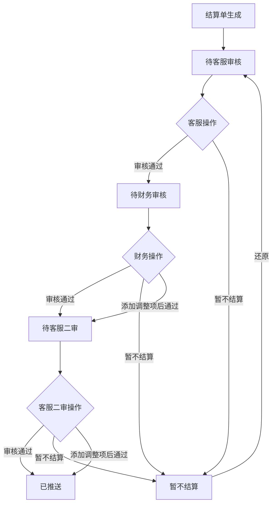
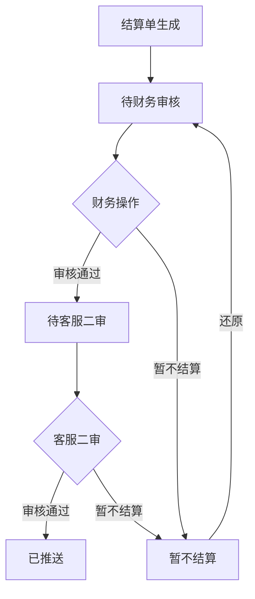
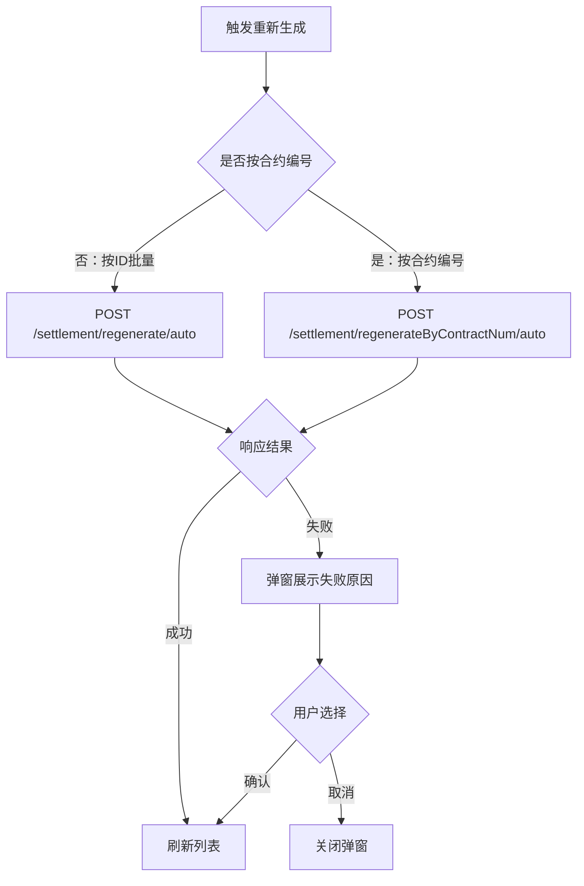

# 财务结算系统功能梳理

## 一、产品基本信息

| 项目 | 说明 |
|------|------|
| **系统名称** | 财务结算系统（SilverDawn Finance） |
| **系统组成** | 管理后台 Web（silverdawn-finance-web）+ 服务端（silverdawn-finance-server）+ CP方小程序（silverdawn-PassagetoSea-applet） |
| **适用对象** | 内容合作方（CP方，含个人/公司）、财务运营人员 |
| **支持平台** | YouTube（YT）、Facebook（FB）双平台 |
| **核心功能** | 结算单管理、发票管理、数据中心、基础配置、数据统计、CP方自助操作 |

---

## 二、功能树

### 2.1 管理后台（Web）

#### 2.1.1 首页（Dashboard）
- 数据概览展示

---

#### 2.1.2 结算单管理
##### 2.1.2.1 YT结算单
- **结算单列表**
  - 分Tab查看（各状态Tab总数统计）
  - 条件筛选（月份、频道、合约编号、CP类型、状态等）
  - 收益总计统计（各Tab顶部金额汇总）
  - 查看结算单详情
  - PDF下载
  - 审核（单条/批量审核通过）
  - 审核详情（本月 vs 上月结算单比对）
  - 暂不结算（单条/批量）
  - 暂不结算还原（单条/批量）
  - 重新生成（单条/批量，含按合约编号批量重新生成）
  - 添加调整项
  - 查看调整项记录
  - 形式发票作废
  - 增值税发票回退
  - 批量删除结算单
  - 列表导出（异步，支持动态字段选择导出）
- **生成结算单**
  - 手动触发生成YT结算单（月份范围选择）

##### 2.1.2.2 FB结算单
- **结算单列表**（功能与YT基本一致，增加以下特有功能）
  - FB结算单导出（含Product版 / 不含Product版，异步）
- **生成结算单**
  - 手动触发生成FB结算单

##### 2.1.2.3 生成记录
- 查看结算单生成历史记录（操作人、生成时间、状态）

---

#### 2.1.3 发票管理
##### 2.1.3.1 增值税发票（VAT）
- 分Tab查看（待上传、待审核、已审核、已汇款等）
- Tab总数统计 / 金额统计
- 查看发票详情（含附件预览）
- 审核操作（通过/拒绝，含审核意见）
- 批量变更汇款状态
- 批量发送短信通知
- 批量发送群聊通知
- 异步导出

##### 2.1.3.2 形式发票（境内个人）
- 分Tab查看
- Tab总数统计 / 金额统计
- 查看形式发票详情
- 重新发起
- 批量变更汇款状态
- PingPong报表导出（订单额度报表 / 汇款明细报表）
- Excel批量变更汇款状态（导入文件）
- Excel批量变更结果导出
- 批量发送短信通知
- 批量发送群聊通知
- 异步导出（境内个人INVOICE）

##### 2.1.3.3 形式发票（境外企业）
- 分Tab查看
- Tab总数统计 / 金额统计
- 查看境外形式发票（PDF预览）
- 确认操作
- 作废
- 批量变更汇款状态
- 异步导出

##### 2.1.3.4 海外企业形式发票
- 与境外企业功能基本一致（独立模块）

---

#### 2.1.4 数据中心
##### 2.1.4.1 YT核算报表
- **暂估报表**
  - 列表查看（含频道组别、是否有合约、是否转化等信息）
  - 拆分子集收益
  - 已拆分收益查看
  - 重新导入/导入
  - 异步导出
  - 实发(¥)差值明细导出
- **冲销报表**
  - 列表查看（未到账列表 + CID统计）
  - 拆分子集收益
  - 异步导出
  - CID统计查看
  - 实发差值明细导出

##### 2.1.4.2 YT到账校验
- **月初视频级**（API数据）
  - 列表查看 / 导出
- **财务报告频道级**
  - 列表查看 / 导出
- **月初API频道级**
  - 列表查看 / 导出
- **月末API频道级**
  - 列表查看 / 导出
- YT到账校验统计汇总

##### 2.1.4.3 FB业财数据
- **暂估报表**
  - 列表查看
  - 导出（含无归属视频导出）
  - 按合约编号重新生成
- **Invoice报表**（含3种类型：total / hundred / ltHundred）
  - 列表查看 / 导出
  - 无归属视频导出
  - 按合约编号重新生成
- **Remittance报表**
  - 列表查看 / 导出
  - 统计汇总（顶部金额统计）
  - 无归属视频导出
  - 按合约编号重新生成
  - 实发差值明细导出

##### 2.1.4.4 FB到账校验
- 列表查看（按月份范围）
- 导出

##### 2.1.4.5 报告生成记录
- 查看报告生成历史记录

---

#### 2.1.5 基础配置
##### 2.1.5.1 汇率管理
- 查看汇率列表
- 新增/编辑汇率
- 删除汇率

##### 2.1.5.2 联邦税配置
- 查看联邦税配置列表
- 新增/编辑联邦税

##### 2.1.5.3 频道组管理
- 查看频道组列表
- 新增/编辑频道组配置

---

#### 2.1.6 数据统计
- CP数据统计列表查看（按平台/月份/CP筛选）
- 统计指标：收益、发票状态、结算状态等

---

### 2.2 CP方小程序（微信小程序）

#### 2.2.1 首页 / 启动页
- 应用初始化（Token校验、用户信息加载）
- 隐私协议展示与授权

#### 2.2.2 结算单（Tab：首页）
- **待处理列表**
  - 查看待处理结算单（YT/FB图标区分）
  - 展示结算月份、频道收益、实发收益
  - 切换收益货币（CNY / USD 切换）
  - 总实发收益统计
  - 查看驳回原因
  - 查看结算单详情
  - **公司类型**：上传发票
    - 收款信息确认弹窗（核对收款人、证件号、银行信息）
    - 跳转上传发票页
  - **个人类型**：前往签字（形式发票电子签）
    - 实名认证状态检测
    - 收款信息确认弹窗
    - 跳转签字页
- **已处理列表**
  - 查看已处理结算单
  - 查看已上传发票文件（单文件/多文件）
  - 查看形式发票PDF（个人）
  - 查看结算单详情

#### 2.2.3 结算单详情页
- 展示结算单完整信息（平台、月份、收益、状态等）
- 数据图表展示

#### 2.2.4 上传发票页
- 上传发票文件（图片/PDF）
- 提交发票

#### 2.2.5 频道（Tab：频道）
- **频道数据列表**
  - 按平台筛选（全部/YouTube/Facebook）
  - 展示订阅者数、视频总量、累计播放量
  - 待签合约提示（数量角标）
  - 点击跳转频道详情

- **频道详情页**
  - 预估收益图表（EstimatedRevenue）
  - 粉丝增长趋势图（FanGrowthTrend）
  - 观看时长数据（ViewingDuration）

- **合约到期提醒弹窗**（提前30天提醒）
- **CP姓名变更提示**（监测到签约信息更新时弹窗提示更新收款信息）

#### 2.2.6 我的（Tab：我的）
- **用户信息展示**（头像、姓名、CP类型）
- **账号切换**（支持多CP账号切换）
- **签约信息**（跳转签约资料页）
  - 状态提示：待认证
- **收款信息**（跳转收款信息页）
  - 状态提示：待完善
  - 收款信息与签约信息不一致时，顶部预警提示
- **我的合约**（查看合约列表）
  - 状态提示：待签署 / 即将到期
- **授权信息**（确权中心）
  - 状态提示：待确权
- **我的团队**（仅公司主账号可见）
- **设置**（通知、账号相关设置）

#### 2.2.7 实名认证（签约信息）
- 个人实名认证（身份证信息上传、人脸识别）
- 企业认证（营业执照等资质上传）

#### 2.2.8 收款信息管理
- 填写/编辑收款银行卡信息
  - 收款人姓名、证件号码、开户行、银行卡号
- 变更收款信息

#### 2.2.9 我的合约
- 合约列表查看
- 合约状态查看（待签署/已签署/即将到期等）
- 发起签约（跳转签字页）

#### 2.2.10 授权信息（确权）
- 待确权内容列表
- 确权操作

#### 2.2.11 电子签字流程
- 签字前收款信息确认
- H5/WebView签字页跳转
- 签字完成回调处理

#### 2.2.12 我的团队（公司主账号）
- 团队成员列表查看

#### 2.2.13 设置页
- 账号相关设置
- 服务条款查看

---

## 三、功能详情

### 3.1 结算单管理业务逻辑

#### 3.1.1 结算单状态流转
```
生成中 → 待客服一审 → 待客服二审 → 暂不结算（可还原）→ 审核通过 → 发票处理中 → 已完结
```

#### 3.1.2 结算单生成规则
- 支持按月份范围手动触发生成（YT/FB分别触发）
- 使用Redis分布式锁防止并发重复触发（锁定时间20分钟）
- 支持按合约编号批量重新生成
- 生成记录可查，记录操作人和生成时间

#### 3.1.3 审核规则
- 审核详情支持本月 vs 上月结算单数据对比
- 批量审核通过时需指定月份和ID列表
- 暂不结算需填写备注原因
- 暂不结算还原后状态回到「待客服二审」

#### 3.1.4 调整项规则
- 审核前可添加调整项（正调整/负调整）
- 调整项记录可查

#### 3.1.5 结算单区分规则
- **CP类型**：公司（上传增值税发票）/ 个人（签署形式发票）
- **平台类型**：YT / FB
- **频道类型**：主频道 / 子集频道（子集频道单独展示子集名称）

---

### 3.2 发票管理业务逻辑

#### 3.2.1 增值税发票（公司CP）
| 状态Tab | 说明 |
|---------|------|
| 待上传 | CP尚未上传发票 |
| 待审核 | CP已上传，等待财务审核 |
| 审核驳回 | 审核不通过，CP需重新上传 |
| 已审核 | 审核通过 |
| 已汇款 | 已完成汇款 |

- 审核操作：通过/拒绝，拒绝需填写驳回原因
- 驳回原因会推送给CP方小程序展示

#### 3.2.2 形式发票（个人CP）
| 状态Tab | 说明 |
|---------|------|
| 待签署 | 等待CP电子签名 |
| 已签署 | CP已完成签名 |
| 已汇款 | 已完成汇款 |
| 已作废 | 形式发票已作废 |

- 个人CP通过小程序签署形式发票（电子签）
- 实发收益为0时，无法发起签字
- 结算单未全部推送时，无法发起签字
- 签字前需确认收款信息（收款人、银行卡等）

#### 3.2.3 境外发票
- 境外企业形式发票：需财务侧确认后完成汇款
- 境外企业可查看PDF格式形式发票

#### 3.2.4 PingPong支付专项
- 支持导出PingPong订单额度报表（含结算金额、开票限额校验）
- 支持导出PingPong汇款明细报表
- 支持Excel批量导入变更汇款状态

---

### 3.3 数据中心业务逻辑

#### 3.3.1 YT核算报表
- **暂估报表**：月初API原始数据，用于预估当月收益
- **冲销报表**：月末最终确认数据，与暂估对比处理差额
- **子集拆分**：支持将主频道收益拆分给多个子集频道
- **到账校验**：通过月初视频级、财务报告频道级、月初/月末API频道级四维度数据校验实收差异

#### 3.3.2 FB业财数据
- **暂估报表**：Facebook API收益数据（月度）
- **Invoice报表**：Facebook Invoice数据（分 total/达百美金/未达百美金）
- **Remittance报表**：Facebook实际汇款数据
- **无归属视频**：可导出未匹配到合约的视频数据

#### 3.3.3 到账校验逻辑
- YT到账校验：比对月初API、月末API、财务报告数据，辅助核查
- FB到账校验：核对Facebook Finance数据与结算数据差异

---

### 3.4 基础配置业务逻辑

| 配置模块 | 说明 |
|---------|------|
| 汇率管理 | 维护USD/CNY等汇率，用于结算收益换算 |
| 联邦税配置 | 维护美国联邦税率，适用FB境外收益扣税计算 |
| 频道组管理 | 配置频道所属运营部门信息，用于报表中展示运营归属 |

---

### 3.5 CP方小程序业务逻辑

#### 3.5.1 登录与认证
- 邀约制，仅支持合作客户扫码/账号登录
- 登录后需完成实名认证（个人/企业）方可使用签约、收款等功能
- 支持同一微信账号关联多个CP账号（账号切换功能）

#### 3.5.2 结算单查看校验规则
- 小程序端最多展示500条结算单
- 超过500条时提示前往Web端查看
- 展示的总实发收益为全部待处理结算单总收益（非分页显示部分）

#### 3.5.3 签字前置校验
1. 检查是否完成实名认证 → 未认证则引导认证
2. 检查结算单是否全部推送 → 有未推送时提示等待
3. 检查实发客户收益是否 > 0 → 收益为0时不可签字
4. 弹出收款信息确认弹窗 → 用户确认后进入签字页

#### 3.5.4 频道数据展示
- 区分YouTube / Facebook平台
- 共享频道不支持查看详情
- 频道详情包含：预估收益趋势、粉丝增长趋势、观看时长图表

#### 3.5.5 合约到期提醒规则
- 合约到期前 ≤ 30 天时显示提醒弹窗
- 弹窗每24小时最多展示一次（基于本地缓存控制）
- 提醒后Tab栏显示红点标记

---

## 四、系统架构与集成

### 4.1 系统架构
```
CP方小程序（UniApp/微信小程序）
        ↓ HTTP API
Finance Service（Spring Boot 服务端）
        ↓ 调用
  ┌─────────────────────────────────────────┐
  │  CRM系统    AMS系统    中台PDF服务        │
  │  用户中心   OSS存储    RocketMQ消息队列   │
  │  Redis缓存  钉钉API    PingPong支付       │
  └─────────────────────────────────────────┘
Finance Web（Vue2 + Vuetify 管理后台）
```

### 4.2 主要外部集成
| 集成系统 | 用途 |
|---------|------|
| CRM系统 | 获取合约、CP信息，触发结算单重新生成 |
| AMS系统 | 获取频道数据、订阅者数等平台数据 |
| 中台PDF服务 | 生成结算单PDF、形式发票PDF |
| OSS（阿里云） | 发票文件存储、PDF文件存储 |
| RocketMQ | 异步消息处理（结算单生成、状态变更通知等） |
| Redis | 分布式锁、缓存、发布订阅 |
| 用户中心 | 获取用户姓名、权限校验 |
| PingPong | 境外汇款支付报表导出 |
| 钉钉 | 通知推送（签字提醒、审核通知等） |

---

## 五、权限控制

### 5.1 Web端权限
- 基于角色的动态路由加载（从服务端获取菜单路由）
- 按钮级权限控制（服务端返回按钮权限列表）
- 数据字段级权限（部分字段按权限显示）

### 5.2 小程序端权限
- CP类型区分：公司/个人，显示不同操作按钮
  - 公司：上传发票
  - 个人：前往签字
- 角色区分：主账号/运营账号
  - 主账号（isOperator=1）：可见「我的团队」菜单
  - 运营账号（isOperator=0）：隐藏「签约信息」「收款信息」等敏感菜单
- 游客模式：可浏览但无操作权限（提示"游客模式无权限"）

---

## 六、校验规则汇总

| 功能 | 校验规则 |
|------|---------|
| 生成结算单 | Redis分布式锁，同一时段只允许触发一次，防止重复执行 |
| 审核通过 | 原防重复提交注解（已注释），批量审核需传月份+ID列表 |
| 批量重新生成 | 5秒内防重复提交 |
| 签字发起 | 必须完成实名认证 + 收益>0 + 结算单全部推送 |
| 上传发票 | 小程序端500条限制提示 |
| 导出 | 部分接口60秒内限制重复导出（Redis控制） |
| 境外发票确认 | 必须填写确认信息 |
| 增值税发票审核 | 拒绝时必填驳回原因 |

---

## 七、YT结算单页面操作规则

> 菜单路径：结算单管理 → YT结算单（页面交互与操作层面）

### 7.1 页面结构

YT结算单页面由以下区域组成：

- **Tab栏**（顶部）：全部 / 待客服审核 / 待财务审核 / 待客服二审 / 已推送 / 暂不结算，每个Tab标题右侧展示数量（超过999显示「999+」）
- **筛选条件区**：到账月份（默认近3个月，最大跨度3年）/ CP名称 / 频道名称 / 频道ID / 子集名称 / 结算单编号 / 结算单类型 / 签约主体 / 发票状态（仅「已推送」Tab可见，多选）/ 汇款状态（仅「全部」和「已推送」Tab可见）
- **操作按钮区**（表格上方）：批量审核通过 / 批量暂不结算 / 批量还原 / 批量重新生成 / 批量删除 / 导出（按Tab差异化显示，详见7.3节）
- **收益统计区**（表格右上角，全部/待财务审核/待客服二审/已推送 Tab显示）：频道收益($) / 联邦税($) / 手续费($) / 实发($)（仅全部Tab）/ 实发(¥)（全部Tab以外）
- **数据表格**：各Tab列定义不同（详见7.2节），行内带操作按钮

### 7.2 Tab分类与列字段说明

| Tab | value | 对应列集 | 特有字段 |
|-----|-------|---------|----------|
| 全部 | 0 | tableColumns5 | 发票状态、汇款状态 |
| 待客服审核 | 1 | tableColumns2 | — |
| 待财务审核 | 2 | tableColumns1 | 美国收益、联邦税金额、可分配收益、应发 |
| 待客服二审 | 3 | tableColumns1 | 同待财务审核 |
| 已推送 | 4 | tableColumns3 | 发票状态、汇款状态、美国收益、联邦税金额、可分配收益、应发 |
| 暂不结算 | 5 | tableColumns4 | 所属月份、原因（暂不结算备注） |

**所有Tab共有字段：** 结算单编号 / 到账日期 / CP名称 / 签约主体 / Payout Period / 结算单生成时间 / 频道名称+ID / 子集名称 / 套餐 / 运营团队 / 状态 / 频道收益($) / 联邦税率 / CP分成比例 / 手续费率 / 实发($) / 结算币种 / 调整币种 / 调整项金额 / 类型 / 收款人 / 证件号码 / 开户行 / 收款账号 / 客服 / 二级/三级/四级部门

**审核状态（check_status）与Tab映射**：

| check_status 值 | Tab名称 | 说明 |
|----------------|--------|------|
| 1 | 待客服审核 | 刚生成或暂不结算还原后的初始状态 |
| 2 | 待财务审核 | 客服一审通过后 |
| 3 | 待客服二审 | 财务审核通过后 |
| 4 | 已推送（终态） | 客服二审通过 |
| 5 | 暂不结算 | 任意节点暂停，可还原 |

> `BillMapper.xml` 中 `cp_page_sql` 通过 `check_status = #{query.settlementTab}` 过滤各Tab数据。`全部` Tab（value=0）不加此条件。

### 7.3 按钮显示规则

| 按钮 | 显示条件（Tab） | 权限标识 |
|------|--------------|----------|
| 批量审核通过 | 待客服审核、待客服二审 | `ytStatement-customer-audit` |
| 批量审核通过（财务） | 待财务审核 | `ytStatement-finance-audit` |
| 批量暂不结算 | 待客服审核、待客服二审 | `ytStatement-no-settlement` |
| 批量暂不结算（财务） | 待财务审核 | `ytStatement-no-settlement-financeCheck` |
| 批量还原 | 暂不结算 | `ytStatement-restore` |
| 批量重新生成 | 全部/已推送以外 | `ytStatement-regenerate` |
| 批量删除 | 待客服审核、待客服二审、暂不结算 | `ytStatement-batch-delete` |
| 批量删除（财务） | 待财务审核 | `ytStatement-batch-delete-finance` |
| 导出 | 所有Tab | `ytStatement-export` |

### 7.4 审核状态流转

#### 7.4.1 标准4节点审核流程（最常见）



#### 7.4.2 5节点审核流程（特殊合约，跳过客服一审）



> **判断依据**：结算单详情中 `checkList.total === 5` 时，步骤条隐藏「客服审核」节点。

### 7.5 审核弹窗逻辑

**触发条件**：点击行内「审核」按钮（待客服审核 Tab 或 待财务审核 Tab）

**弹窗标题**：`{CP名称}-{频道名称}({子集名称})-{月份}`

**对比字段（11项）**：CP名称 / 频道收益 / CP分成比例 / 手续费率 / 实发 / 收款人 / 证件号码 / 开户行 / 支行 / 银行卡号 / 联邦税率

**高亮规则**：本月值与上月值不同时，该行红色高亮（无上月数据时不高亮）

**接口**：`GET /settlement/approved/detail/{id}` → 返回 currentMonth + lastMonth；确认后调用 `GET /settlement/approved/{id}` 执行审核

### 7.6 暂不结算与还原

| 操作方式 | 触发条件 | 接口 |
|---------|---------|------|
| 单条暂不结算 | 行内弹窗（需填备注） | `GET /settlement/noSettled/{id}?remark=...` |
| 批量暂不结算 | 勾选多条→批量按钮 | `POST /settlement/noSettled` |
| 单条还原 | 暂不结算Tab行内「还原」 | `GET /settlement/reduction/{id}` |
| 批量还原 | 暂不结算Tab「批量还原」 | `POST /settlement/reduction` |

**还原规则**：结算单还原后回到**暂不结算之前所在的Tab**（不固定为某一状态）。

### 7.7 批量重新生成



- 5秒内防重复提交（`@RepeatSubmit` 注解）
- 批量操作时显示进度条（`ProgressLoading` 组件，按上传进度百分比显示）
- 支持按合约编号+套餐名称重新生成

### 7.8 调整项逻辑

| 环节 | 说明 |
|------|------|
| 入口 | 待财务审核 / 待客服二审 Tab，行内「添加调整项」按钮 |
| 权限 | Tab2：`ytStatement-finance-add-adjustment`；Tab3：`ytStatement-add-adjustment` |
| 内容 | 调整金额（正/负）+ 调整币种 + 备注 |
| 接口 | `POST /settlement/adjustment/{id}` |
| 查看记录 | `GET /settlement/adjustment/record/{id}` |
| 列表展示 | 「调整项金额」和「调整币种」列；金额为0或空时显示「-」 |

### 7.9 结算单详情

**触发方式**：点击列表中结算单编号（链接样式）

**权限**：`ytStatement-view-detail`

**步骤条节点定义**：

| checkPoint | 节点名称 | 说明 |
|-----------|---------|------|
| 0 | 结算单生成 | 初始节点 |
| 1 | 客服审核 | 4节点流程专有（total=4时显示） |
| 2 | 财务审核 | |
| 3 | 客服二审 | |
| 4 | 已推送 | 终态 |
| 6 | 暂不结算 | 中间状态，可还原 |
| 8 | 特殊回退节点 | 5节点流程回退处理 |

**收益指标展示（12项，按计算顺序）**：
播放量 → 频道收益 → 联邦税费（含联邦税率）→ 可分配收益 → 分成比例 → 客户收益(应发) → 付款手续费（含手续费率）→ 客户收益(实发$) → 美元汇率 → 调整项金额（有值时显示）→ 客户收益(实发¥)

**关键计算公式**：
```
可分配收益 = 频道收益 - 联邦税
应发 = 可分配收益 × CP分成比例
手续费 = 应发 × 手续费率
实发($) = 应发 - 手续费
实发(¥) = 实发($) × 汇率 ± 调整项金额（按调整币种换算）
```

### 7.10 导出逻辑

| 类型 | 接口 | 特点 |
|------|------|------|
| YT导出（异步） | `POST /settlement/export/yt/async` | 异步任务，结果通过下载中心获取 |
| 动态字段导出 | 同上（headers参数控制） | 支持按勾选列过滤导出字段 |

**导出字段中需额外关联的数据**：

| 列名 | 来源表/服务 | 关联方式 |
|------|------------|----------|
| 二/三/四级部门 | `channel_dept_info` | 按 `channel_id + month` 匹配，仅导出时附加 |
| 发票状态 | `tb_invoice_vat`（企业CP）/ `tb_invoice_proforma`（个人CP） | 按 `settlement_id` 关联 |
| 客服姓名 | UserCenter（远程调用） | 按 `customer_uid` 批量拉取 |

**其余字段（结算单编号 / 到账日期 / CP名称 / 频道信息 / 收益计算字段 / 收款信息等）均来自 `tb_settlement`，共34列。**

### 7.11 生成记录页面

**接口**：`GET /settlement/records`

**筛选条件**：月份（单选）/ 平台（YT/FB）

**列字段**：平台 / 所属月份 / 生成类型 / 数量 / 状态（带颜色图标）/ 发起人 / 发起时间

**失败状态**：显示错误原因 Tooltip

### 7.12 完整权限矩阵

| 操作 | 权限标识 | 适用Tab |
|------|---------|--------|
| 查看详情 | `ytStatement-view-detail` | 所有 |
| 客服审核通过 | `ytStatement-customer-audit` | 待客服审核、待客服二审 |
| 财务审核通过 | `ytStatement-finance-audit` | 待财务审核 |
| 添加调整项（财务） | `ytStatement-finance-add-adjustment` | 待财务审核 |
| 添加调整项（客服二审） | `ytStatement-add-adjustment` | 待客服二审 |
| 暂不结算 | `ytStatement-no-settlement` | 待客服审核、待客服二审 |
| 暂不结算（财务） | `ytStatement-no-settlement-financeCheck` | 待财务审核 |
| 还原 | `ytStatement-restore` | 暂不结算 |
| 批量重新生成 | `ytStatement-regenerate` | 全部/已推送以外 |
| 批量删除 | `ytStatement-batch-delete` | 待客服审核、待客服二审、暂不结算 |
| 批量删除（财务） | `ytStatement-batch-delete-finance` | 待财务审核 |
| 导出 | `ytStatement-export` | 所有 |
| 查看频道收益合计 | `ytStatement-total-revenue` | 全部、待财务审核、待客服二审、已推送 |
| 查看联邦税合计 | `ytStatement-total-federalTaxAmount` | 同上 |
| 查看手续费合计 | `ytStatement-total-serviceChargeDollar` | 同上 |
| 查看实发合计 | `ytStatement-total-actualIncomeRmb` | 同上 |

### 7.13 接口汇总

| 接口 | Method | URL | 功能 |
|------|--------|-----|------|
| 列表查询 | GET | `/settlement/page` | 分页查询结算单列表 |
| Tab总数统计 | GET | `/settlement/page/tab/statistics` | 各Tab结算单数量 |
| 收益总计统计 | GET | `/settlement/page/statistics` | 顶部金额汇总 |
| 结算单详情 | GET | `/settlement/detail/{id}` | 详情抽屉数据 |
| 详情（按编号） | GET | `/settlement/detailByNo/{no}` | 按结算单编号查详情 |
| 审核对比详情 | GET | `/settlement/approved/detail/{id}` | 本月vs上月对比 |
| 审核通过 | GET | `/settlement/approved/{id}` | 单条审核通过 |
| 批量审核通过 | POST | `/settlement/approved` | 批量审核通过 |
| 暂不结算 | GET | `/settlement/noSettled/{id}` | 单条暂不结算 |
| 批量暂不结算 | POST | `/settlement/noSettled` | 批量暂不结算 |
| 暂不结算还原 | GET | `/settlement/reduction/{id}` | 单条还原 |
| 批量还原 | POST | `/settlement/reduction` | 批量还原 |
| 批量重新生成（按ID） | POST | `/settlement/regenerate/auto` | 对接CRM/AMS批量重新生成 |
| 批量重新生成（按合约） | POST | `/settlement/regenerateByContractNum/auto` | 按合约编号批量重新生成 |
| 添加调整项 | POST | `/settlement/adjustment/{id}` | 添加正/负调整项 |
| 调整项记录 | GET | `/settlement/adjustment/record/{id}` | 查看调整项记录 |
| 形式发票作废 | POST | `/settlement/cancel` | 形式发票作废 |
| 境外形式发票作废 | POST | `/settlement/invoiceOutsea/cancel` | 境外形式发票作废 |
| 增值税发票回退 | POST | `/settlement/vatCancel` | 增值税发票回退 |
| 批量删除 | POST | `/settlement/batchDel` | 批量删除结算单 |
| YT导出（异步） | POST | `/settlement/export/yt/async` | 异步导出，支持动态字段 |
| 生成YT结算单 | POST | `/settlement/generate/YT` | 手动触发生成YT结算单 |
| 生成记录列表 | GET | `/settlement/records` | 查看结算单生成历史记录 |
| PDF下载 | GET | `/settlement/pdf/download/{id}` | 获取结算单PDF下载地址 |
